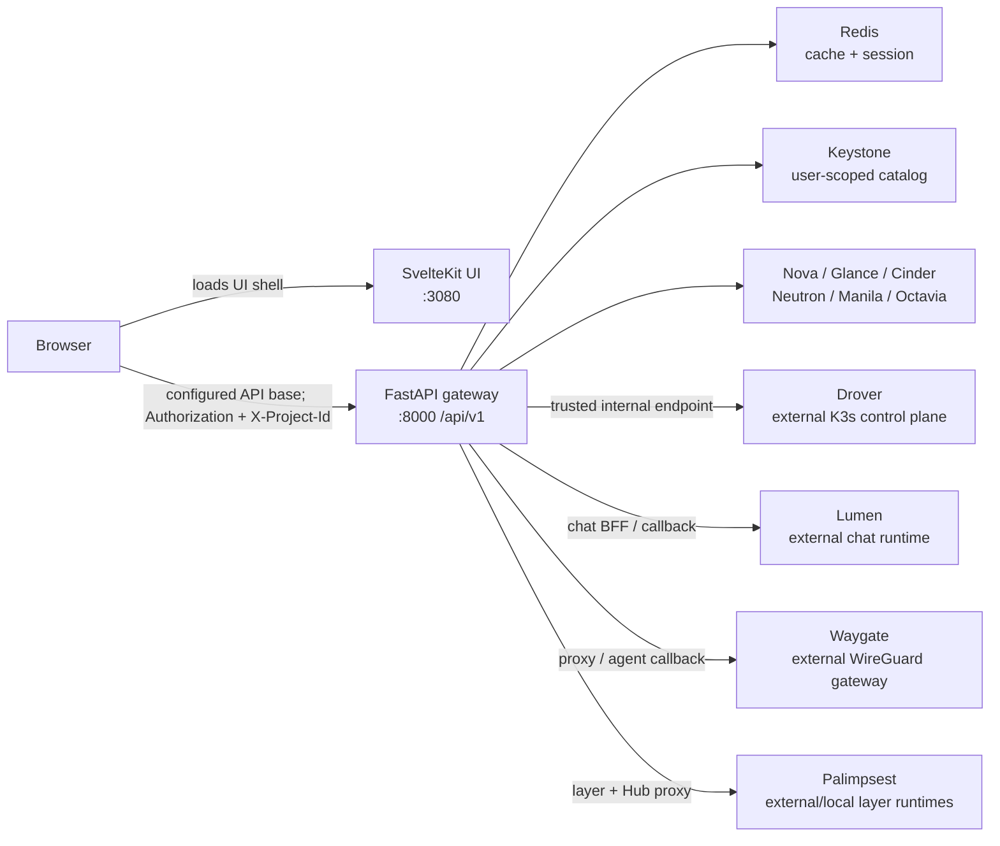

# Afterglow Architecture

## Overview

Afterglow는 OpenStack 프로젝트를 관리하는 대시보드이자, 독립 배포된 Drover·Lumen·Waygate·Palimpsest 서비스로 가는 인증된 BFF(gateway)이다. 브라우저 UI는 SvelteKit이 제공하지만 OpenStack 자원 생성과 권한 검사는 FastAPI 백엔드가 소유한다. 저장소 URL은 <https://github.com/openstack-afterglow/openstack-afterglow>이다.

이 문서는 이 저장소의 `dev` 브랜치와 작업 트리에서 검토한 구현을 설명한다. 애플리케이션 버전은 root/backend/frontend 모두 `1.20.0`이며, backend는 Python `>=3.12`, FastAPI `0.136.3`, `openstacksdk 3.3.0`, frontend는 SvelteKit `2.70.1`·Svelte `5.55.9`·Vite `8.2.0`을 manifest에 고정한다. 테스트 통과나 실제 OpenStack 배포를 이 문서의 근거로 승격하지 않는다.

1분 요약:

- `frontend/`는 화면, 브라우저 토큰 상태, API 호출과 SSE 소비를 담당한다.
- `backend/app/main.py`는 `/api/v1` 라우터, 선택 서비스 mount, legacy VM callback을 조립한다.
- `backend/app/services/`와 `openstacksdk`가 Keystone·Nova·Glance·Cinder·Neutron·Manila·Octavia 및 선택 서비스를 호출한다.
- 브라우저 access/refresh JWT와 Redis의 Keystone 검증 세션은 서로 다른 자격 및 수명이다.
- Drover·Lumen·Waygate·Palimpsest의 내구성 데이터와 worker는 형제 저장소/서비스가 소유하며, Afterglow는 설정된 신뢰 endpoint로만 전달한다.

## Development status

상태는 기능 범위에 한정한 구현 판단이며, 검증 열은 실제로 읽은 근거의 수준이다. `test-defined`는 테스트가 정의되어 있다는 뜻이지 실행 성공이 아니다.

| 기능 범위 | Implementation | Verification evidence | Current limit | Source |
|---|---|---|---|---|
| FastAPI `/api/v1` gateway와 OpenStack core 라우터 | `implemented` | `source-reviewed` | 선택 서비스는 설정에 따라 mount되지 않는다. | [`backend/app/main.py`](backend/app/main.py), [`backend/app/api/`](backend/app/api/) |
| 브라우저 login·refresh·rescope | `implemented` | `test-defined`; local browser login/API refresh verified | 로컬 internal Keystone catalog를 사용한 login·refresh만 실행했다. rescope 및 장애 경로의 live 검증은 수행하지 않았다. | [`backend/app/api/identity/`](backend/app/api/identity/), [`frontend/src/lib/api/client.ts`](frontend/src/lib/api/client.ts), [`frontend/src/lib/stores/auth.ts`](frontend/src/lib/stores/auth.ts) |
| VM 생성과 SSE 진행/rollback | `implemented` | `test-defined` | SSE `completed`는 API 단계의 완료이며 VM health/후속 상태의 완료를 뜻하지 않는다. | [`backend/app/api/compute/instances.py`](backend/app/api/compute/instances.py), [`backend/tests/`](backend/tests/) |
| k3s/Drover 연동 | `partial` | `test-defined` | Afterglow의 compatibility/admin 경로와 독립 Drover control plane을 혼동하지 않는다. | [`backend/app/api/drover/`](backend/app/api/drover/), [`backend/tests/contracts/test_drover_proxy.py`](backend/tests/contracts/test_drover_proxy.py) |
| Lumen chat BFF, settings, quota/usage projection | `partial` | provider billing/admin-key frontend tests passed (2026-09-13) | 실행·provider·secret·durable journal·quota 판정은 Lumen 소유다. Afterglow는 `/api/v1/chat/{path}` BFF, 전용 `/dashboard/chat/settings?section=…` 화면, 시스템 기본/개인 override 쿼터, 사용자별 immutable usage drill-down을 제공한다. Provider 설정은 단일 bulk snapshot을 ID로 결합해 모든 provider의 Lumen 귀속 사용량과 공식 링크를 표시한다. OpenRouter/DeepSeek live 잔액과 direct OpenAI/Anthropic의 별도 관리자 키 기반 조직 report를 구분하고, Gemini console-only와 Perplexity Computer Analytics 제품 범위 제한을 설명한다. 자체 agent runtime·provider router·secret store·accounting은 두지 않는다. | [`backend/app/api/lumen/`](backend/app/api/lumen/), [`frontend/src/lib/components/chat/ChatSettings.svelte`](frontend/src/lib/components/chat/ChatSettings.svelte), [`frontend/src/routes/admin/chat/quotas/+page.svelte`](frontend/src/routes/admin/chat/quotas/+page.svelte), [`frontend/src/lib/components/admin/chat/ChatConfiguration.svelte`](frontend/src/lib/components/admin/chat/ChatConfiguration.svelte) |
| Waygate proxy·agent callback 전달 | `partial` | `test-defined` | WireGuard gateway의 DB/worker는 Waygate 소유이고 standalone `/v1` API는 형제 서비스다. | [`backend/app/api/waygate/`](backend/app/api/waygate/), [`backend/tests/contracts/test_waygate_proxy.py`](backend/tests/contracts/test_waygate_proxy.py) |
| Palimpsest layer/build/Hub BFF | `partial` | `test-defined` | 구 `/api/v1/union` 표면은 제거됐고, retained squashfs 흐름과 독립 Hub를 별도 경계로 유지한다. | [`backend/app/api/palimpsest/`](backend/app/api/palimpsest/), [`backend/tests/test_palimpsest_api.py`](backend/tests/test_palimpsest_api.py) |
| architecture snapshot freshness guard | `implemented` | `test-passed` (`npm run test:target -- backend:tests/test_architecture_guard.py`, 13 passed, 2026-09-08) | guard는 문서가 source를 정직하게 설명했는지 자연어까지 판정하지 않는다. | [`scripts/check_architecture.py`](scripts/check_architecture.py), [`backend/tests/test_architecture_guard.py`](backend/tests/test_architecture_guard.py) |

## System context



텍스트 흐름은 다음과 같다. 브라우저가 SvelteKit 셸에서 access JWT와 선택적 `X-Project-Id`를 붙여 FastAPI로 요청한다. FastAPI는 토큰과 project ownership을 확인하고 caller-scoped `openstacksdk` connection으로 OpenStack을 호출하거나, 설정된 trusted internal endpoint를 해석해 형제 서비스로 필요한 헤더를 전달한다. Redis는 세션·단기 캐시·wakeup 보조이며 authoritative OpenStack/형제 서비스 상태를 대신하지 않는다. 외부 형제 서비스의 내부 DB와 worker를 Afterglow가 직접 import하거나 공유하지 않는다.

## Code map

| 경로/심볼 | 책임 | 의존 방향 |
|---|---|---|
| [`backend/app/main.py`](backend/app/main.py) `app`, `include_router`, `health` | FastAPI lifecycle, middleware, `/api/v1` 및 legacy mount, 선택 서비스 조건, background loop | router/service → FastAPI |
| [`backend/app/services/service_proxy.py`](backend/app/services/service_proxy.py) `proxy`, `proxy_passthrough`, `get_json`, `resolve_service_endpoint` | Keystone catalog 또는 trusted internal URL을 통한 형제 서비스 forwarding, query/header 전달 | API adapter → configured service |
| [`backend/app/api/identity/`](backend/app/api/identity/) | login, refresh, logout, admin/project 권한과 세션 경계 | identity API → Keystone/Redis |
| [`frontend/src/lib/api/client.ts`](frontend/src/lib/api/client.ts) `api`, `fetchWithAuth`, `tryRefresh`, `request` | API base, Authorization, 요청 전 refresh 직렬화와 fetch/XHR 401 복구, 403 처리, prefetch/invalidation | UI → FastAPI |
| [`frontend/src/lib/stores/auth.ts`](frontend/src/lib/stores/auth.ts) `auth`, `setAuth`, `setProject`, `clearAuth` | 브라우저 auth state와 project scope 영속화 | UI state → API client |
| [`frontend/src/hooks.server.ts`](frontend/src/hooks.server.ts) `handle` | public path, backend prefix, SPA fallback, CSP/보안 헤더 | SvelteKit request shell |
| [`backend/app/api/compute/instances.py`](backend/app/api/compute/instances.py) `create_instance`, `create_instance_async`, `delete_instance` | Nova/Cinder/Manila/Neutron 조합, SSE, 역순 rollback과 FIP cleanup | compute API → OpenStack adapters |
| [`backend/app/api/drover/`](backend/app/api/drover/) | Drover callback/admin/proxy compatibility | Afterglow BFF → Drover endpoint |
| [`backend/app/api/lumen/`](backend/app/api/lumen/) | `/api/v1/chat` callback/proxy와 delegated bridge | Afterglow BFF → Lumen |
| [`frontend/src/lib/components/chat/ChatPanel.svelte`](frontend/src/lib/components/chat/ChatPanel.svelte), [`frontend/src/lib/components/chat/ChatInput.svelte`](frontend/src/lib/components/chat/ChatInput.svelte), [`frontend/src/lib/components/chat/ModelPickerOverlay.svelte`](frontend/src/lib/components/chat/ModelPickerOverlay.svelte), [`frontend/src/lib/components/chat/ChatSettings.svelte`](frontend/src/lib/components/chat/ChatSettings.svelte), [`frontend/src/lib/components/chat/ChatApiKeysManager.svelte`](frontend/src/lib/components/chat/ChatApiKeysManager.svelte) | Lumen durable SSE의 bounded 표시, history/title reconciliation, context 압축, 공개 model metadata와 SDK 안내, 별도 route의 반응형 설정 navigation | UI → authenticated `/api/v1/chat` BFF; 설정 route는 modal을 중첩하지 않는다 |
| [`frontend/src/routes/admin/chat/quotas/+page.svelte`](frontend/src/routes/admin/chat/quotas/+page.svelte), [`frontend/src/lib/components/admin/chat/UserUsageDetailModal.svelte`](frontend/src/lib/components/admin/chat/UserUsageDetailModal.svelte), [`frontend/src/lib/api/chatQuotas.ts`](frontend/src/lib/api/chatQuotas.ts) | Keystone 사용자를 20명 marker page로 제한하고 현재 page 안에서만 Lumen quota를 `user_id`로 결합·검색한다. runtime 기본 월 한도, 개인 상속/override/reset, 월 ceiling에 묶인 주간 무제한, credit 환산을 표시하고 기간·model·web/API·timestamp/token/cost ledger를 drill down한다. | 관리자 UI → `/api/v1/admin/users` + Lumen quota/stats proxy |
| [`frontend/src/lib/components/admin/chat/ChatConfiguration.svelte`](frontend/src/lib/components/admin/chat/ChatConfiguration.svelte) | provider/model 구성과 독립적으로 bulk billing snapshot을 조회해 모든 provider의 Lumen 귀속 사용량·공식 콘솔 링크를 표시한다. Direct OpenAI/Anthropic에는 별도 administrator usage key FormModal과 공식 조직 cost/request/token을, OpenRouter/DeepSeek에는 inference-key live limit/balance를 제공한다. Mutation 뒤 cache bypass와 request-generation fence로 오래된 snapshot 게시를 막고 bulk 실패는 CRUD와 격리한다. | 관리자 UI → `/api/v1/chat/admin/providers/{id}`·`/billing` BFF → Lumen-owned secret/ledger/provider API |
| [`frontend/src/routes/admin/volumes/+page.svelte`](frontend/src/routes/admin/volumes/+page.svelte), [`frontend/src/lib/components/admin-volume/AdminVolumeDeleteDiagnosticSection.svelte`](frontend/src/lib/components/admin-volume/AdminVolumeDeleteDiagnosticSection.svelte), [`backend/app/api/identity/admin.py`](backend/app/api/identity/admin.py), [`backend/app/services/volume_delete_recovery.py`](backend/app/services/volume_delete_recovery.py), [`backend/app/services/ceph_rbd.py`](backend/app/services/ceph_rbd.py) | 전체 프로젝트 볼륨의 marker page·일괄 삭제와 system-admin tri-state 삭제 진단, 선택적 Ceph RBD mapping 복원/검증, per-volume recovery lock, residue/unverified UI 유지 | 관리자 UI → `/api/v1/admin/volumes/*` → Cinder/Nova + opt-in Ceph CLI; Redis는 lock/cache 보조 |
| [`frontend/src/routes/admin/database-instances/+page.svelte`](frontend/src/routes/admin/database-instances/+page.svelte), [`backend/app/api/database/instances.py`](backend/app/api/database/instances.py), [`backend/app/services/trove.py`](backend/app/services/trove.py) | 시스템 관리자의 tenant-created Trove DB 전체 목록, owning project 표시와 management 조회 실패 구분 | 관리자 UI → `/api/v1/database-instances?all_projects=true` → Trove `/mgmt/instances` |
| [`backend/app/api/waygate/`](backend/app/api/waygate/) | `/api/v1/waygate` proxy 및 agent callback | Afterglow BFF → Waygate |
| [`backend/app/api/palimpsest/`](backend/app/api/palimpsest/) | layers/builds/Hub/admin routes | Afterglow API → layer runtime/Hub |
| [`backend/app/models/db.py`](backend/app/models/db.py) 및 [`backend/app/services/layer_build.py`](backend/app/services/layer_build.py) | Afterglow-owned resource metadata와 retained squashfs build orchestration | API → MariaDB/OpenStack/Manila |
| [`frontend/src/lib/components/topology/canvas/`](frontend/src/lib/components/topology/canvas/) `buildGraph`, `autoLayout`, `TopologyCanvas.svelte` 및 [`backend/app/services/neutron.py`](backend/app/services/neutron.py) `get_topology`, `build_compute_port_index` | 토폴로지 구조(30초 cache)·트래픽(15초 poll) 응답을 캔버스 뷰(네트워크당 가상 스위치, GW 네트워크 존에 소속되는 라우터, 멀티 NIC 존 교차, 결정론적 배치)와 레인 뷰로 투영; provider 세그먼트는 관리자 응답 모델에만 | UI → `/api/v1/networks/topology`·`/api/v1/admin/topology` → Neutron/Nova/Octavia adapter |

의존 방향은 화면이 OpenStack SDK를 직접 부르지 않고 `frontend → FastAPI → service adapter/OpenStack`로 흐르는 것을 기준으로 한다. Lumen의 model/tool/provider 실행과 공개 ID의 내부 route 해석, Drover의 job/operation worker, Waygate의 gateway state, Palimpsest Hub의 SQL/blob은 이 저장소의 code map에 들어오지 않는다.

## Runtime flows

### 로그인·refresh·rescope

1. `POST /api/v1/auth/login`이 Keystone credential을 검증하고 Afterglow access/refresh JWT 쌍을 반환한다.
2. Keystone token과 refresh-JTI에 묶인 session/검증 정보는 Redis에 둔다. 브라우저 `localStorage`의 JWT는 Redis Keystone session의 복제본이 아니다.
3. `frontend/src/lib/api/client.ts`의 `fetchWithAuth`와 XHR 공통 복구 정책은 만료 120초 이내 인증 요청을 보내기 전에 `/api/v1/auth/refresh`를 coalesce하고 진행 중 회전을 기다린다. JSON·채팅/SSE handshake·첨부·업로드/다운로드는 401 직후 갱신하거나 이미 회전한 live token으로 한 번만 재시도하며, 소비 중인 스트림은 재실행하지 않는다. `sessionRefreshLifecycle.ts`는 mount/focus/visible 복귀 때 즉시 만료를 확인하고 60초 보조 주기를 유지한다. terminal 401이면 auth를 비우고 `/login`으로 이동하지만 refresh 503/429/network는 세션과 기존 cooldown을 보존한다. logout은 revocation fence를 유지하고 caller 취소는 공유 refresh를 취소하지 않는다.
4. `X-Project-Id`가 생략되면 JWT project를 사용한다. 다른 project로 전환할 때 서버가 허용한 rescope만 수행하며, project-scoped connection과 resource ownership을 다시 적용한다.

### 관리자 서비스 목록 필터·정렬

`/admin/services`는 기존 category별 lazy load·hover prefetch·선택 탭 refresh를 유지한다. `ServiceTabPanel`이 9개 탭의 `ServiceListState`를 각각 소유하고, `serviceList.ts`가 응답 배열을 변경하지 않는 AND 필터·자연/숫자/UTC 시각 정렬을 적용한다. `Status`와 `State`, Network의 `Alive`와 `Admin State`는 독립된 조건이며 미확인 값은 실제 down과 구분하고 정렬 방향과 관계없이 마지막에 둔다. API Endpoints는 이름/서비스 유형/리전과 URL 검색을, Storage Pools는 backend/protocol/vendor와 숫자 용량 정렬을 제공한다.

`ServiceListControls`와 `ServiceSortHeader`는 공통 Field/input/Button을 조합하며 표는 `TableShell` 안에서만 가로 스크롤한다. 필터는 응답 원본 전체에서 선택지를 만들고, 새로고침 후 사라진 선택도 유지해 0건 상태에서 초기화할 수 있다. 백그라운드 refresh 중에는 기존 행과 조작을 유지한다. 서버 API·권한·cache·배포 구조 영향은 없다. 실제 Vite tutorial 화면에 합성 응답을 주입하여 9개 탭과 390/767/768/1023/1024/1510px 배치, light/dark, 키보드 정렬·필터 조합·상태 보존을 검증했으며 live OpenStack 검증은 아니다. 상세 계약은 [`docs/api/admin.md`](docs/api/admin.md)의 서비스 상태 모니터링을 따른다.

### 관리자 공지 대상 선택·미읽음 표시

`/admin/announcements`는 사용자와 프로젝트 target ID 계약을 유지하면서 공통 `SearchSelect`로 이름·stable ID를 함께 필터링한다. 사용자 후보는 기존 관리자 사용자 목록의 현재 최대 100개 응답, 프로젝트 후보는 전체 이름 목록을 사용하며 target type 변경 시 이전 선택을 비운다. `SearchSelect`는 trigger와 search combobox/listbox를 분리하고 ArrowUp/ArrowDown/Enter/Escape, outside dismissal, trigger focus 복귀, loading/no-match 상태를 소유한다. Popover는 `document.body` portal의 viewport-fixed layer라 `Card`의 `overflow: hidden`에 잘리지 않고 trigger 위·아래의 더 넓은 공간과 viewport 경계에 맞춰 위치·높이를 정한다. 40개 unfiltered 목록의 마지막 항목을 실제 클릭했고 popover가 열린 전후 작성 Card의 `scrollLeft=0`, `scrollWidth=clientWidth`를 확인했다.

사용자 shell은 인증 token 또는 project scope가 준비·변경되는 즉시 `/api/v1/announcements/unread-count`를 조회하고 60초 polling을 보조로 유지한다. 이전 identity 요청은 serial과 token/project 비교로 폐기한다. 미읽음이 있으면 알림 버튼은 danger tone의 작은 pulse를 표시하고 접근성 이름에 count를 포함하며 reduced-motion에서는 정적인 점으로 남는다. 알림함은 공지 발송자가 관리자 endpoint를 통과했다는 기존 권한 경계에 따라 username 뒤에 `(관리자)`를 표시한다. API, DB schema, 읽음 처리와 권한 경계는 변경하지 않는다. 실제 Vite 화면에 합성 API 응답을 주입해 사용자·프로젝트 이름/ID 검색과 선택, 390/767/768/1023/1024/1216px popover containment, 미읽음 표시와 발송자 수식어를 검증했다.

### 관리자 볼륨 상태 필터·일괄 삭제

`/admin/volumes`는 현재 marker page의 행만 `createResourceSelection`으로 선택하며 filter·page size·marker page·관리자 project scope가 바뀌면 선택을 비운다. `SelectionCheckbox`와 `BulkSelectionOverlay`가 desktop/touch에서 같은 선택·busy 계약을 제공하고, 삭제 전 `ConfirmDialog`를 거친다. Compact 목록에는 attachment 정본이 없으므로 browser가 삭제 가능 여부를 추정하지 않는다.

`POST /api/v1/admin/volumes/bulk-delete`는 중복 없는 `volume_ids` 1~50개를 요청 순서대로 처리한다. 단건 `DELETE /api/v1/admin/volumes/{volume_id}`와 같은 helper를 사용해 error 상태의 reset/normal delete/force-delete fallback을 유지하고, 한 항목 실패가 다음 항목을 중단하지 않는다. 응답은 ID별 `ok/error`를 반환하며 UI는 성공한 ID만 선택에서 제거하고 실패한 ID를 남긴 뒤 현재 page·상태 요약·시계열을 새로 읽는다. 상태 card와 select option은 최신 cluster-wide summary에서 count가 양수인 상태만 보여주고, 활성 상태가 0이 되면 전체 필터와 첫 page로 복귀한다. 관리자 권한·Cinder 정본·database/deployment 경계는 바뀌지 않는다.

Result boundary가 바뀌는 load는 이전 행을 즉시 비워 새 응답 전까지 선택하지 못하게 한다. 같은 boundary의 background refresh는 기존 행을 유지한다. 확인 대기 중 boundary·user/project·선택이 바뀌면 bulk 요청을 취소하고 중복 제출도 차단한다. Shared deletion helper와 bulk 응답·activity는 고정된 공개 실패 메시지를 사용하여 upstream 진단이나 credential을 노출하지 않는다. 이 수정은 route·schema·소유권·배포 구조를 바꾸지 않는다.

#### 오류 볼륨 backend 복구

`GET /api/v1/admin/volumes/{id}/delete-diagnostics`와 `POST .../recover-delete`는 caller의 system-admin connection을 유지한 채 Cinder record·volume/Cinder/Nova attachments·snapshot·backup·clone/group/migration을 독립 `present | absent | unknown` check로 평가한다. Cinder message는 evidence일 뿐 허용 조건이 아니며 401/403, timeout, SDK 오류를 absence로 축소하지 않는다. Fresh `deleting`, attachment/dependency present, unknown check, backend 불일치는 mutation을 막는다. Recovery API는 Redis `NX EX=600` per-volume lock을 요구하며 lock storage 장애는 503, 동시 실행은 409다.

선택적 [`ceph_rbd.py`](backend/app/services/ceph_rbd.py)는 validated argv로 `ceph`/`rbd`/`rados`만 실행하고 exact rc=2 `No such file or directory`만 absence로 인정한다. Configured cluster FSID와 Cinder backend→pool mapping을 먼저 확인한 뒤 directory/name-id mapping, name/id image info, header/object-map, watchers, snapshots, parent/children, trash와 bounded data object sample을 교차 검사한다. Image가 온전하고 `rbd_id.volume-<uuid>`만 누락된 경우 directory id·size/order·parent/dependency가 일치해야 mapping을 복원한다. Stale mapping 제거는 Cinder 부재와 모든 backend artifact 부재, expected image-id payload 일치가 모두 증명된 경우만 허용하며 image/header/data/trash를 직접 삭제하지 않는다.

복구는 진단 재검사 → 필요 시 mapping 복원/검증 → force-delete → exact attached HTTP 400일 때만 attach-status reset 후 단 한 번 재시도 → Cinder·backend·quota 재검증 순서다. `deleted`/`already_deleted`만 `verified_deleted=true` terminal success이며, Cinder 요청만 완료된 `delete_submitted`, RBD가 남은 `backend_residue`, RBD가 비활성/unknown인 `backend_unverified`는 UI 상세 패널과 check/backend evidence를 유지한다. Cache는 mutation 제출 또는 residue/unverified 결과에도 무효화하고 모든 step 및 backend/quota verification을 audit detail에 남긴다.

### 관리자 Trove DB inventory

`/admin/database-instances`는 시스템 관리자의 현재 project-scoped catalog/auth adapter로 `GET /api/v1/database-instances?all_projects=true`를 호출하고, backend는 Trove proxy의 `/mgmt/instances`를 사용해 삭제되지 않은 모든 tenant DB와 `tenant_id` 기반 owning project를 반환한다. Management 응답 실패나 비정상 body는 빈 목록으로 축소하지 않고 API 오류로 전파하며, UI는 기존 행이 있으면 보존한 채 `Alert`로 실패를 표시한다. 이 resource page에는 control-plane MySQL을 관측하는 generic `mysqld_exporter` dashboard를 렌더하지 않는다. 해당 infrastructure dashboard는 `/admin/monitoring/mysql`에만 남는다. Trove·Keystone 권한, tenant mutation ownership, database schema와 deployment 경계는 변경하지 않는다.

### VM 생성·SSE·정리

`POST /api/v1/instances/async`는 SSE 응답을 열고, 필요하면 library/data Manila access rule을 준비한 뒤 Cinder boot/upper volume, cloud-init, Nova server, Neutron FIP를 순서대로 처리한다. 진행 이벤트는 클라이언트에게 API 단계만 알린다. 실패하면 [`instance_orch.rollback_instance`](backend/app/services/instance_orchestration.py)와 `create_instance_async`의 추적 목록으로 생성한 FIP·server·새 volume·access rule·dynamic share를 역순 best-effort 정리한다. 기존 volume이나 caller가 소유하지 않은 자원은 rollback에서 삭제하지 않는다. 단건 delete와 bulk delete도 FIP 및 관련 mount/access cleanup을 거치며, client disconnect는 서버의 이미 시작된 OpenStack 작업을 완료 신호로 바꾸지 않는다.

### 형제 서비스 전달

Afterglow가 catalog service type 또는 `SERVICE_*_INTERNAL_URL`을 통해 endpoint를 얻으면 `service_proxy.py`가 허용된 forwarded header와 caller token을 전달한다. 브라우저가 임의의 internal URL을 정하거나 형제 서비스 DB에 접근하지 않는다. Drover의 K3s inventory/operations, Lumen의 chat execution/journal/provider, Waygate의 WireGuard VM/agent, Palimpsest Hub의 upload/download/export는 각각 서비스 경계 뒤에 있다. Afterglow `internal_k3s.py`의 제한된 provisioning/GPU admission은 Drover 전체 Nova 호출을 대체하지 않는다.

### Chat navigation, Search, and citations

`ChatPanel` exposes 44px history/settings and source-list controls in the workspace header at every width. Mobile separates model/agent selection and metadata actions into two rows. Below 1024px history opens the existing bounded drawer; Escape/outside dismissal restores trigger focus and closed content is inert. Desktop retains inline history. The dedicated settings route and per-project conversation restoration are unchanged.

The composer uses Lumen's native Search capability/pricing gate and sends explicit `features.web_search.mode="native"` only for the selected supported model; managed search retains its separate provider-selected contract. Safe canonical citations precede each answer with title/domain and bounded snippets. `ChatSourcesPanel` uses the shared `SlidePanel` for loaded-conversation source URLs/full snippets or an explicit empty state; `ChatBubble` keeps source/code overflow inside the bubble. Pending title reconciliation respects server status indefinitely, backs off after 30 seconds and avoids concurrent polling of one conversation. Context preview invalidates stale results on scope/input changes or HTTP/network failure; keyboard/touch disclosure distinguishes remaining tokens, tokenizer/estimate provenance and precise unavailable reasons.

Browser verification on 2026-09-13 exercised the actual Vite-served chat/settings routes with synthetic API data at 298, 390, 704, 767, 768, 1023, 1024 and 1440px; compact history/user menu and return navigation, source overflow boundaries, and native Search context/completion request payloads passed. This is UI/contract evidence, not live provider completion or deployment evidence.

The title/source/context repair additionally exercised the actual Vite-served chat components at 298, 390, 767, 768, 1023, 1024 and 1440px: 44px header actions, contained source overflow, mobile modal versus desktop/tablet bounded panels, and Escape focus restoration passed. Keyboard context detail shows remaining input tokens and estimate provenance; failed preview regression coverage proves stale capacity removal, sanitized errors and draft-preserving recovery. Provider events were tested through installed LiteLLM, not a live paid provider request.

`ChatContextPanel` now renders the optional Lumen `ContextState.breakdown` from both preview HTTP responses and durable `context.updated` events. Included messages/instructions/memory/skills/agent/summary/tool schemas are distinct from unloaded material and uncounted attachments/MCP discovery. Names and counts contain no prompt or memory text. Component percentages use the full model window; response reserve, safety buffer and remaining input are separate. Unknown windows retain available composition metadata without numeric capacity claims; incomplete accounting suppresses exact remaining space. Legacy journals without a plan retain aggregate state without fabricated components. Browser proof exercised the actual settings route and mounted composer/panel with synthetic HTTP/context data at 390×844, 820×1180 and 1440×900, including full-screen mobile modality, bounded desktop/tablet width, unknown metadata and Escape focus restoration. This is not a paid provider completion proof.

At ≥768px, the settings route allocates the return action and settings body within its parent height; the settings navigation/content retain their own scroll owners instead of adding a second viewport minimum. Smaller screens use natural main-content scrolling, keeping the final form action reachable without horizontal overflow.

관리자 서비스 행은 user/project identity 변경 시 즉시 비우고 이전 요청의 결과를 차단한다. 같은 identity의 token 갱신은 기존 행을 유지하면서 요청 세대를 교체한다. 사용자 쿼터는 token 갱신 때 현재 marker/history를 유지하며 진행 중인 페이지 이동을 취소하지 않는다. Identity 변경과 unmount는 기존 요청을 무효화한다. API·storage·deployment 구조 변화는 없다.

### Palimpsest와 제거된 Union

현행 routes는 `backend/app/api/palimpsest/{layers,builds,hub}.py`와 admin route, retained library/squashfs services를 사용한다. [`backend/app/main.py`](backend/app/main.py)는 구 `/api/v1/union` router를 mount하지 않는다. `union_layers`·`union_templates`·`union_user_mounts` 같은 이전 metadata는 보존될 수 있으나 공개 API가 아니다. retained [`backend/app/services/layer_build.py`](backend/app/services/layer_build.py), `recipe_blocks.py`, `palimpsest_kvm.py`는 squashfs build/consume 또는 선택 KVM 경계를 설명하며, 독립 Palimpsest Hub의 `/v1` API와 같은 실행 모델로 취급하지 않는다.

### 네트워크 토폴로지

사용자 사이드바의 토폴로지는 독립 메뉴다. `Sidebar.svelte`는 그룹에 선언된 하위 메뉴의 정확한 경로 또는 `/`로 구분한 상세 경로로만 자동 확장·강조를 판정한다. `/dashboard/network/topology` URL과 API는 유지하지만 네트워크 그룹 소속으로 취급하지 않으며, 토폴로지 진입은 사용자가 직접 선택한 그룹 접기/펼치기 상태를 바꾸지 않는다. 구조·인증·백엔드 변경 없는 UI 수정으로, 로컬 튜토리얼 데이터의 실제 브라우저 화면에서 390·767·768·1023·1024·1440px 이동을 검증했다.

`GET /api/v1/networks/topology`(사용자, 30초 `ttl_normal` cache)와 `GET /api/v1/admin/topology`(관리자, `AdminTopologyData`)는 [`neutron.get_topology`](backend/app/services/neutron.py)가 이미 가져온 Neutron 객체에서 네트워크(MTU 포함)·라우터(SNAT, 정적 경로)·서브넷·Floating IP를 수집하고, 핸들러가 Nova 서버와 [`neutron.build_compute_port_index`](backend/app/services/neutron.py)의 compute 포트 인덱스를 조인해 인스턴스별 `ip_addresses[].network_id/port_id/mac_addr`와 flavor/image id를 채운다. provider network type·segmentation id·physical network는 `AdminTopologyNetwork`에만 존재하며 사용자 응답에는 키 자체가 없다. `GET /api/v1/networks/topology/traffic`은 별도 15초 폴링으로 port id 키의 per-NIC rx/tx를 주고 `routers`는 exporter가 없어 항상 비어 있다. 값은 Prometheus `rate(...[2m])` 로 계산한 최근 2분 평균이며(`TOPOLOGY_RATE_WINDOW`), 같은 카운터를 읽는 `instance_metrics.py` 와 같은 값이다. **이 저장소는 운영 Prometheus 의 scrape_interval 을 제어하지 않으므로**(운영은 Kolla 배포본, 설정은 저장소 밖) 윈도우를 좁히는 근거를 저장소 안에서 만들 수 없다 — `deploy/k8s*/monitoring/prometheus/configmap.yaml` 은 다른 배포 경로이고 운영 job 이름과도 다르다. 30초로 좁혔다가 운영(scrape 1분)에서 libvirt 쿼리가 0 시계열을 반환해 트래픽이 사라진 회귀가 있었고, `test_topology_window_is_not_narrower_than_rest_of_repo` 가 재발을 막는다. `GET /api/v1/networks/topology/traffic/history`는 네트워크 1개의 시계열(`query_range_multi`, step 은 `scrape ≤ step ≤ window` 계약을 지키는 `_history_step()` = `max(calc_step(range), window/2)` — scrape 보다 촘촘하면 같은 값이 반복되는 계단이 나온다)과 평균·최대를 주며, 캔버스 네트워크 패널이 열릴 때와 사용자가 구간 토글(15분·30분·1시간)을 바꿀 때만 호출한다 — 폴링에 얹으면 Prometheus 부하가 네트워크 수만큼 곱해진다. `$effect` 는 `networkId|range` 조합으로 중복 조회를 막는다. 귀속 규칙은 instant 경로와 공유한다(`_load_port_context`·`_traffic_exprs`) — libvirt mac→port→network 가 주 경로이고 node_exporter 는 libvirt 미관측 단일 NIC 인스턴스만 보강하므로 두 값이 어긋나지 않는다. `stats` 는 별도 `avg_over_time` 쿼리가 아니라 반환한 series 에서 계산해 그래프 최고점과 라벨이 일치하고, **방향별**(`{avg,max,latest}` 각각 `{rx_bps,tx_bps}`)이라 패널의 방향별 `합산 트래픽` 행과 대조된다. node 쿼리는 `max by (instance_id, device)` 로 중복 scrape 를 dedup 하고(같은 NIC 이 여러 job 에 등록되면 `sum by` 는 트래픽을 2배로 보고한다), 파이썬 폴백은 그 결과를 device 별로 **누산**한다(두 엔드포인트 모두) — 대입하면 device 가 여러 개인 게스트에서 마지막 것만 세어 과소보고되고 두 값이 어긋난다.

두 핸들러의 조회 fan-out은 [`run_parallel`](backend/app/services/parallel.py)로 동시에 수행한다. `neutron.get_topology`는 네트워크·서브넷·라우터·Floating IP·라우터 인터페이스 포트를, 핸들러는 topology·compute 포트 인덱스·Trove IP·Nova 서버를 각각 병렬로 가져온다. 직렬 호출은 각 OpenStack 응답 시간이 그대로 합산돼 실제 클라우드에서 응답이 8초를 넘겼다. 포트 조회는 필요한 속성만 요청하고(`_COMPUTE_PORT_FIELDS`), `list_floating_ips`는 FIP가 붙은 포트만 id로 조회하며 인스턴스 이름은 detail 없는 Nova 목록에서 읽는다.

상세 패널의 닫기 버튼은 [`SlidePanel.svelte`](frontend/src/lib/components/SlidePanel.svelte)가 `[data-slide-panel-close]` 하나로만 그린다. 자식 패널이 자기 × 를 또 그리면 헤더에 닫기가 두 개 보이므로 금지하며, [`panelChrome.test.ts`](frontend/src/lib/design/__tests__/panelChrome.test.ts)가 SlidePanel 아래 컴포넌트 트리를 정적으로 스캔해 이를 고정한다(자체 크롬을 소유하는 `ui/` 프리미티브와 전면 오버레이는 제외). 튜토리얼 투어도 이 정본 셀렉터를 쓴다.

프론트엔드는 두 라우트(`/dashboard/network/topology`, `/admin/topology`)에서 `topology.view` 선택(기본 캔버스)에 따라 [`TopologyCanvas.svelte`](frontend/src/lib/components/topology/canvas/TopologyCanvas.svelte) 또는 기존 레인 뷰 [`GlobalTopology.svelte`](frontend/src/lib/components/GlobalTopology.svelte)를 렌더한다. 캔버스는 `buildGraph`로 네트워크당 가상 L2 스위치·per-NIC 케이블 그래프를 만들고 `autoLayout`으로 결정론적 배치를 계산한다. 합성 L3 코어 노드는 두지 않고 외부(프로바이더) 네트워크의 가상 스위치 자체가 인터넷 경계이며(구름 글리프) Floating IP 점선은 해당 외부망 스위치로 직접 잇는다. 네트워크는 위에서 아래로 **provider 로부터의 라우터 홉 깊이**대로 행을 이룬다: provider(외부·공유)가 깊이 0, 라우터 한 홉마다 +1 이며, 라우터로 provider 에 닿지 않는 독립 망은 절대 깊이가 없으므로 맨 아래 한 행으로 모은다. 각 행은 자기 라우터 레인을 위에 두고, 라우터는 자신이 게이트웨이로서 더 깊게 만든 망의 행에(모든 망이 같은 깊이면 그 깊이 행에) 놓인다. 도달성은 다른 프로젝트의 비가시 망까지 포함해 계산해 경유 사슬이 끊기지 않게 하고, 행 배정과 존 멤버십에만 가시성을 적용한다. 라우터는 자신이 게이트웨이인 네트워크 존에 소속되고, 존 내부는 라우터 → 스위치 → LB → 인스턴스 → 데이터베이스 순으로 위에서 아래로 쌓인다. LB 는 자기 뒤에 물린 멤버 인스턴스 위에 왼쪽 변을 맞추며(멤버가 여럿이면 가장 왼쪽 멤버 기준, 멤버가 없으면 존 가운데), LB 카드가 VM 보다 32px 넓어 생기는 오버행은 콘텐츠 폭에 반영해 이웃 존과의 간격이 줄지 않게 한다. 그리고, 멀티 NIC 인스턴스는 **같은 행에서** 맞닿은 두 존의 교차 컬럼에 놓이며, 행을 가로지르면 가장 얕은 행 하나에만 속하고 나머지는 긴 케이블로 잇는다. 라우터 exporter가 없으므로 트렁크 링크 자체의 트래픽은 계측하지 못한다. 대신 하위 네트워크 스위치 쪽 트렁크는 해당 `traffic.networks[netId]`를 표시하고, external 또는 shared provider-tier 스위치 쪽 트렁크는 **그 라우터가 직접 연결한 tenant 네트워크들의 합**을 표시한다. shared provider는 `external_gateway_network_id` 없이 일반 interface로 연결될 수 있으므로 대상 네트워크의 tier로 경계를 판정한다. provider 네트워크 전체 합을 라우터마다 복제하거나 uplink 합산에 포함하지 않는다. 배지 캡션도 각각 `네트워크 합산`과 `하위망 합산`으로 범위를 구분한다. **uplink 배지는 그 라우터의 하위 tenant 망이 2개 이상일 때, 그리고 라우터당 하나만 그린다**(게이트웨이와 shared provider 인터페이스를 함께 물면 `trunkNetIds` 가 같아 같은 합을 반복한다) — 하나뿐이면 `trunkNetIds` 가 같은 배열이라 tenant 트렁크 배지·스위치 카드와 **같은 숫자를 세 번** 찍고, 배지는 라우터↔스위치 중점에 놓이는데 라우터 x 는 `intNetIds` 로만 정해져(`routerHome`) 그 중점이 남의 존 안에 떨어져 카드를 덮는다. 실측(2026-09-13, Neutron 라우터 30개 전수)에서 tenant 망을 2개 이상 무는 라우터는 0개였다. 휠 제스처는 `wheelIntent` 가 입력 장치를 추정해 나눈다 — 마우스 휠(줄 단위 델타 또는 120 배수 `wheelDeltaY`)은 확대·축소, 트랙패드 두 손가락 스크롤(가로 성분·소수점 델타)은 위치 이동이며, `ctrl`/`⌘`+휠과 핀치는 항상 확대·축소다. 브라우저가 입력 장치를 알려주지 않아 휴리스틱이고, 근거가 없으면 이동으로 본다. 선 굵기와 흐르는 점의 빈도는 사용량을 로그축에서 연속으로 반영하며(`edgeIntensity`·`flowRate`·`flowDotCount`), 점 개수는 경로 길이에 맞춰 정해 통과 빈도가 길이와 무관하게 사용량만 나타내도록 한다. 스케일은 `INTENSITY_FLOOR_BPS`(1 kbps)부터 `INTENSITY_DECADES`(6) decade 뒤 1 Gbps 에서 포화하며 굵기 1.8~4.5 다. **계측이 없을 때만** `NO_TELEMETRY_STYLE`(1.5/0.40)을 쓰고 0 bps 는 "쟀더니 0" 이므로 하한 앵커로 그린다 — 예전에는 `bps < 1e5` 가 전부 `NO_TELEMETRY_STYLE` 과 같은 값으로 붕괴해, 실측(2026-09-13, NIC 43개, 중앙값 8.7 kbps·최대 366 kbps)에서 **살아 있는 케이블 39개가 계측 없음과 구분되지 않았다**. 트렁크 굵기 하한(구 `Math.max(2.5, …)`)은 두지 않는다 — 모든 트렁크를 2.5px 로 같게 만들고 가장 바쁜 케이블(2.28)보다 굵어 위계를 뒤집었다. 강도 스칼라는 케이블과 트렁크가 다르다. 케이블은 `rx+tx` 다(한 NIC 의 두 방향은 진짜 다른 방향이라 이중 계상이 없다). 트렁크 값은 그 망에 붙은 NIC 합이라 `rx = EW + IN`, `tx = EW + OUT` 이고 실제 통과량은 `T = rx + tx − EW` 인데, `0 ≤ EW ≤ min(rx,tx)` 까지만 좁혀져 **`max(rx,tx) ≤ T ≤ rx+tx`** 구간으로만 알 수 있다(미지수 3개·식 2개, `flowStreams` 와 같은 한계). 두 끝값은 각각 최악 2배 틀리므로(순수 east-west 에서 `rx+tx` 가 2배 과대 — 실측 dmslab 3-tier 235k/230k → 465k, 양방향 north-south 에서 `max` 가 2배 과소) `switchThroughput` 이 구간의 **중점**을 쓴다(과대 1.5배·과소 1.33배). uplink 트렁크는 `trunkIntensityBps` 가 **망별로 추정한 뒤 더한다** — 먼저 합산하면 방향이 반대인 두 하위망이 상쇄돼 east-west 로 오인된다. 흐름 점은 `allocateFlowDots` 가 전역 예산(`FLOW_DOT_BUDGET` 60) 안에서 bps 내림차순으로 배정하며 **예산이 모자라는 스트림은 잘라 그리지 않고 건너뛴다**(잘린 개수는 통과 빈도를 거짓으로 낮춘다) — 그래서 점이 붙는 엣지 수는 `FLOW_MIN_BPS` 가 아니라 이 예산이 정하고, 굵기·불투명도에는 이런 절단이 없다. 레인 뷰도 같은 `edgeIntensity` 를 쓰며 계측 없음을 0 으로 뭉개지 않는다. 흐름 방향은 `flowStreams` 가 정한다 — 라우터가 전혀 없는 격리 네트워크만 케이블을 tx·rx 양방향으로 흘려 인스턴스↔스위치↔인스턴스 내부 통신을 보여주고, 라우터가 있는 네트워크는 내부/외부 비중을 계측으로 가를 수 없어 게이트웨이 방향 한 줄만 흘린다. 블럭(노드 카드)은 서로 겹치지 않는다: 자동 배치가 밴드·존·그리드 규칙으로 비겹침을 보장하고, 미연결 주차 스트립은 라우터 배치 뒤에 이미 놓인 모든 노드의 오른쪽 바깥에 둔다(라우터보다 먼저 놓으면 아래 밴드 라우터와 겹친다). 드래그·키보드 nudge로 놓은 위치가 다른 블럭과 겹치면 `resolveManualOverlap`이 그 노드만 가장 가까운 빈 자리로 옮기며, 자동 배치 노드는 움직이지 않는다. 드래그로 옮긴 위치는 브라우저 localStorage에 사용자/관리자 scope와 프로젝트별로 저장되고 구조 갱신 시 id 기준으로 유지·정리되며, 저장되는 값은 겹침 해소 뒤 실제로 보이는 좌표다. 상세는 기존 `SlidePanel` 기반 인스턴스/라우터/LB 패널과 읽기 전용 네트워크 패널을 재사용한다.

캔버스 패킷 흐름 시뮬레이션은 기본 on이며 툴바 체크박스로 끌 수 있다. `prefers-reduced-motion`이면 토글과 무관하게 하드 off이고, 탭이 보이지 않거나 pinch 중이면 rAF 루프를 멈춘다.

## Data and contracts

### 정본과 cache 분리

| 데이터 | authoritative storage | cache/보조 | 불변식 |
|---|---|---|---|
| Keystone 세션·refresh-JTI·단기 token 검증 | Keystone 및 Redis session state | Redis TTL cache (`afterglow:*`) | Redis cache miss는 Keystone 재검증이며 access JWT와 Keystone token을 동일시하지 않는다. |
| Afterglow users/projects/metadata와 layer build records | Afterglow MariaDB via SQLAlchemy models/migrations | Redis invalidation/prefetch | DB ownership과 project scope가 source of truth다. |
| OpenStack VM/network/volume/share와 RBD volume artifacts | Nova, Neutron, Cinder, Manila, Ceph RBD 등 각 서비스 | Afterglow Redis response cache; opt-in Ceph CLI read/repair adapter | cache가 실제 cloud resource state를 만들거나 확정하지 않는다. Volume 삭제 복구의 backend write는 검증된 `rbd_id.volume-<uuid>` mapping 복원/정리로 제한하며 Cinder와 Ceph가 계속 source of truth다. |
| Drover cluster/job/operation/inventory와 project manager credential | Drover MariaDB | Drover Redis token/cache/lock 보조 | Drover API/worker가 lifecycle을 소유한다. Service account는 자신에게 role이 있는 service/admin project scope에서만 Keystone identity를 관리하고, tenant 자원은 암호화 저장된 `afterglow-cluster-mgr-<project>` 자격의 project-scoped connection으로 처리한다. 장기 worker 경로는 사용 후 keystoneauth HTTP pool과 openstacksdk connection을 모두 닫는다. |
| Lumen run/event/checkpointer/provider state와 billing administrator key | Lumen MariaDB와 필요한 PostgreSQL 경계 | Lumen Redis wakeup/cache | Billing key는 Lumen의 별도 암호화 domain 소유이며 Afterglow read response에는 설정 여부만 나타난다. HTTP/SSE connection이 durable run 수명을 소유하지 않는다. |
| Waygate gateway/client/agent state | Waygate MariaDB, VM 내부 WireGuard key | Waygate Redis status/token cache | server private key는 VM 내부이며 Afterglow에 저장하지 않는다. |
| Palimpsest local/HUB artifact | local CAS/lease 또는 Hub SQL + blob filesystem | Hub Redis download token | `.sqsh` byte digest, OCI manifest/DiffID, recipe/cache identity, run/lease identity를 섞지 않는다. |

주요 계약은 `/api/v1` namespace, `Authorization: Bearer <access JWT>`, 선택적 `X-Project-Id`, SSE `text/event-stream`, trusted service URL과 service-specific callback이다. cloud-init에 이미 baked된 다음 세 callback만 `/api`와 `/api/v1`을 dual-mount한다: `POST /api/k3s/callback`, `POST /api/instances/{id}/health/report`, `POST /api/instances/{id}/credentials/rotate-cephx`. 그 외 신규 API는 `/api/v1`만 사용한다. Palimpsest layer identity는 content-addressed `.sqsh` bytes의 SHA-256이며, 기존 artifact/profile을 덮어쓰지 않고 parent/blocker 규칙을 지킨다.

## Deployment and operations

### 프로세스와 포트

- `backend`는 `uvicorn app.main:app`으로 내부 `8000`에서 API와 in-process background snapshot/trash/backup/MCP cleanup loop를 실행한다. `/api/v1/health`는 즉시 `{"status":"ok"}`를 반환하는 process liveness이고, 상세 health는 인증 및 Redis 상태를 추가로 본다.
- `frontend`는 빌드된 SvelteKit Node 서버를 `PORT=3080`에서 제공한다. 로컬 Compose는 `3080:3080`과 `PUBLIC_API_BASE=http://localhost:8000`을 사용한다. frontend는 API gateway가 아니라 UI/auth shell이다. 공개 `/health`는 로그인 cookie 없이 JSON liveness를 반환하며 Compose는 redirect를 거부하고 JSON status를 검증한다.
- Compose는 독립적인 세 manifest를 명시적 `-f`로 선택한다. `docker-compose.yml`은 published frontend/backend 두 서비스만 정의하며 DB/cache는 외부 설정이다. `docker-compose.dev.yml`은 Afterglow와 독립 Drover·Waygate·Lumen·Palimpsest API/worker 및 local datastores/migrations를 source-build한다. `docker-compose.prod.yml`은 GHCR image pull-only이고, HAProxy 3.2 TLS ingress/Docker-DNS round-robin과 private persistent Redis를 기본 제공한다. 앱 host port는 공개하지 않고 sibling 통신은 기본적으로 인증된 Keystone catalog를 사용한다. 운영 인증서는 read-only operator PEM이며 self-signed fallback은 없다. 선택 sibling image/API/worker/migration은 개별 profiles에 남고 callback/control-plane URL은 공개 catalog endpoint를 지정한다.
- 관리자 볼륨 RBD 검사는 opt-in이다. Backend image에는 `ceph-common`이 있고, dev/prod Compose·Kolla·Kubernetes는 operator-provided `ceph.conf`와 dedicated CephX keyring을 `/etc/ceph`에 read-only mount한다. 두 파일 경로·cluster FSID·backend→pool map이 모두 있어야 활성화하며, 기존 Cinder-only 배포는 기능이 비활성인 채 `backend_unverified`를 반환한다. `client.admin`을 사용하지 않고 pool/object-prefix가 제한된 identity를 배포한다.
- `npm run services:up`은 dev manifest 하나를 `afterglow-local-services` project로 source-build하며 conventional loopback ports `3080/8000/8010/8011/8012/8020/6379`를 사용한다. 기존 profile용 local/source overlay와 installed-image 개발 fallback은 제거했다. 이전 `afterglow` 컨테이너가 있으면 시작 전에 거부하며 다른 project를 자동 삭제하지 않는다. API/worker는 sibling Dockerfile, `.local-services/`의 private config/키, 전용 MariaDB schemas·PostgreSQL checkpointer·Redis·named volume/network를 재사용한다. `services:config`/`up`은 literal escaping된 0600 `compose.env`를 준비한다. Datastore URL은 literal이고 ignored override는 읽지 않는다. `services:smoke`는 migration/worker/BFF/context와 Lumen administrator billing 계약 및 실제 dashboard overview summary/quotas를 검사한다. 상류 Nova 503은 전체 smoke 실패이며 container health로 성공을 대신하지 않는다. OpenStack mutation이나 provider completion은 실행하지 않는다.
- 로컬 Drover readiness는 DB/cache/migration뿐 아니라 명시한 dedicated service project의 실제 Keystone authorization을 검사한다. Local snapshot 또는 `.env`에 service project UUID가 없으면 시작 전에 거부하고 admin-project fallback을 하지 않는다. 이 조건은 기존 인증/소유권 경계를 유지하며 새 service나 schema를 추가하지 않는다.
- Local config snapshot은 0700 private directory 안의 0640 파일이며 실제 파일 GID를 snapshot reader에만 supplemental group으로 전달한다. Image UID는 그대로 두고 secrets/compose.env는 0600을 유지한다. Drover API/worker/migration은 Sentinel을 명시적으로 끄고 host 목록을 비우며 runner가 GID·cache 격리를 검사한다. 실제 non-root container의 config read와 Drover cache client의 local Redis PING을 검증했다.
- Waygate/Drover의 BFF discovery root는 canonical upstream `/v1/`로 전달하여 내부 hostname redirect 대신 version JSON을 반환한다. Lumen의 async 인증 dependency는 동일한 Keystone 검증을 thread pool에서 실행해 병행 UI 요청이 이벤트 루프를 직렬로 막지 않도록 한다. Token/project/admin 판정과 fail-closed 응답은 변경하지 않는다.
- 로컬 snapshot의 OpenStack routing은 실제 접근 가능한 catalog interface를 사용한다. 초기 전환에서 public 로그인 timeout과 internal 인증 성공을 대조한 뒤 private snapshot만 internal Keystone/interface로 수정하고 원본·키·변경 전 snapshot을 보존했다. 당시 Nova의 public/internal 503은 별도 상류 장애였다. 이후 실제 재빌드에서는 인증된 dashboard summary/quotas가 200이고 Drover 통계가 `available: true`임을 확인했다. Local deployment가 cloud endpoint를 재설정하거나 상류 실패를 성공으로 숨기지는 않는다.
- Drover SDK 통계는 `X-Auth-Token`만 전달한다. 형제 Drover API는 이 토큰을 무범위 재인증하지 않고 Keystone에서 직접 검증해 원래 project를 보존한다. 그렇지 않으면 기본 project가 없는 사용자는 유효한 토큰으로도 401을 받는다. 로컬 smoke는 dashboard `k3s-stats`의 HTTP 200뿐 아니라 `available: true`와 유효한 total/active 수를 요구하며 Nova summary/quotas 실패도 별도로 보고한다.
- 2026-09-14 실제 DMSLAB K3s create 401은 Drover service account를 tenant project에 직접 password-scope한 worker helper가 원인이었다. Drover `7902506`은 service/admin scope를 manager identity bootstrap으로만 제한하고 create/delete/scale/health/reconcile를 tenant manager connection으로 전환했다. 실제 server 1 + agent 1 클러스터가 `CREATING → PROVISIONING → ACTIVE`, K3s health/node 200을 거쳐 삭제됐고 Nova 2·Cinder 2·security group 1 정리까지 확인했다. 후속 `ab8b8d0`/`ce1d9a6`은 모든 장기 manager/caller connection을 `finally`로 회수하고, openstacksdk `Connection.close()`가 닫지 않는 내부 requests pool까지 명시적으로 닫는다. 운영 worker의 warm-up 후 실제 manager connection 10회 FD 측정은 수정 전 `14 → 34`, 최종 배포 후 `8 → 8`이었다.
- 독립 서비스의 `SERVICE_*_INTERNAL_URL`/`[services] *_internal_url`은 BFF와 공유 OpenStack connection을 사용하는 Drover/Waygate SDK 모두에 적용한다. Core OpenStack endpoint·token/project scope·인증을 바꾸지 않는다. 기본/prod Compose는 unset 값을 주입하지 않아 TOML 또는 catalog를 유지하고, production 명시 URL은 HTTPS를 요구한다. Dev는 shell/`.env`(명시적 빈 값은 catalog) → nonempty `.local-services/afterglow.conf` → local DNS를 선택하고 resolved endpoint/MCP URL을 private `compose.env`에 보존한다. 실패 URL에서 catalog로 자동 fallback하지 않는다.
- `afterglow-worker` 이미지는 Notion integration worker만 실행하며 `python -m app.notion_worker`를 entrypoint로 한다. worker-runtime Docker API overlay는 기본 Compose 경로가 아니다.
- 국소 기능테스트의 유일한 Compose 정본도 `docker-compose.dev.yml`이다. `test` profile은 전용 loopback 3307/5434/6380의 `mariadb/postgres/test-redis`와 tmpfs를 정의한다. `scripts/test-db.js`는 기본 `afterglow-test` project에서 이 세 서비스만 dependency 없이 시작하고 종료한다. Named volume/orphan 정리는 하지 않으며 `--no-start`는 외부 lifecycle을 소유하지 않는다. App 입력의 빈 보간 기본값은 credential-free test-only parsing을 허용할 뿐이며 일반 dev runner의 private 설정·키 검증이나 앱의 insecure 거부를 바꾸지 않는다.

### 빌드·배포

`Dockerfile`은 backend/worker에 Python 3.12 slim, frontend build에 Bun 1, runtime에 Node 20을 사용한다. 현재 [`docker-build.yml`](.github/workflows/docker-build.yml)은 `linux/amd64` matrix만 활성화하며 arm64 항목은 주석 처리되어 있다. GitHub Actions가 이미지를 GHCR로 push하고, 배포 구성은 Kubernetes/Kustomize·Helm/ArgoCD 또는 [`deploy/kolla/site.yml`](deploy/kolla/site.yml)의 custom service role 경계를 사용한다. Kolla는 `afterglow`, `waygate`, `drover`, `lumen`, `palimpsest` inventory group을 별도로 검사한다. `deploy/kolla/install.sh`가 stock site import와 inventory/globals.d 연결을 준비하면 `/etc/kolla`에서 `kolla-ansible deploy -i multinode`가 custom 서비스를 함께 실행한다. 서비스·HAProxy 플레이는 `become: true`로 toolbox와 중첩/위임 task의 권한을 선언하며, operator 계정의 기존 sudo 권한을 전제로 한다. Lumen 역할은 검증된 `lumen-kolla==0.2.0` wheel이 소유한다. operator 의존성 설치는 실제 Kolla 가상환경을 명시하고 `--inexact --no-install-project`를 사용한다. 이 개편의 live 검증 결과는 해당 OpenSpec outcome에 기록하며, 표준 명령의 fixture 검증과 전체 OpenStack 재배포를 구분한다.

### 선행 조건과 관측

Dev Compose API는 private Redis·local DB와 `.local-services/afterglow.conf`를 사용하고 형제 서비스는 자체 migration/bootstrap 완료를 요구한다. 기본 두-service Compose는 별도로 접근 가능한 DB/cache가 필요하다. Prod Compose는 실제 secret, DB, Keystone 설정과 HTTPS origins·인증서가 필요하며 앱·worker 소스를 빌드하지 않는다. Kolla는 inventory group, 설정된 image/config, migration 및 해당 OpenStack endpoint가 필요하다. MariaDB schema 변경은 `backend/migrations` SQL 적용 여부를 운영자가 확인해야 하며, backend 부팅의 deferred table creation이 모든 migration을 대신하지 않는다. 구조화 JSON 로그는 backend의 `logs/` 또는 컨테이너 로그로 수집하며, Prometheus metrics/HTTP SD와 Grafana integration은 설정된 외부 관측 시스템에 선택적으로 연결된다.

Kolla 배포의 Afterglow cache/session client는 `valkey` inventory 전체의 Sentinel과 `valkey_sentinel_monitor_name`으로 현재 master를 발견한다. `redis_url`은 사용자명·비밀번호·DB index의 정본이고 첫 controller 주소는 Sentinel mode에서 seed일 뿐이다. promotion 뒤 replica가 된 고정 주소에 세션 쓰기를 시도하지 않으며, Sentinel/master 장애 시 refresh는 기존 보안 경계대로 503 fail-closed한다.

## Security boundaries

| 주체/자격 | 소유 경계 | 전송·저장 원칙 |
|---|---|---|
| 브라우저 사용자 | JWT가 나타내는 project 및 서버가 허용한 rescope | access/refresh JWT는 browser state에 있고, Keystone token/session은 Redis에 분리한다. raw secret은 문서에 쓰지 않는다. |
| Afterglow backend | caller-scoped Keystone connection과 project ownership | `service_proxy`는 검증된 caller token 또는 명시적 service credential만 사용하며 browser의 internal endpoint를 신뢰하지 않는다. |
| system administrator | 명시된 `require_admin` 및 owner-check 우회 범위 | admin은 일반 사용자 권한과 다르며, backend audit/ownership 검사를 생략하는 근거로 문서화하지 않는다. |
| VM callback/health agent | callback token 또는 baked health bearer의 제한된 resource | callback token은 Redis TTL 및 server/cluster binding 검사를 거치며 legacy path는 이미 배포된 cloud-init 호환에 한정한다. |
| 형제 서비스 | 각각의 service endpoint·DB·worker·secret domain | Afterglow는 관리자 입력을 인증된 BFF로 Lumen에 전달할 뿐 provider billing key를 저장·복호화하지 않으며 Drover/Lumen/Waygate/Palimpsest DB, private key를 공유하거나 import하지 않는다. |
| OpenStack 서비스 | Keystone project/RBAC와 resource owner | Nova/Neutron/Cinder/Manila/Octavia의 외부 API에 대한 2차 owner check와 입력 검증을 유지한다. |

cloud-init 및 shell template 출력은 `shlex_quote`/검증된 입력을 사용하고, production boot는 insecure flag/default secret을 거부한다. 브라우저 localStorage 토큰과 CSP의 현재 한계, background task 종료, callback IP binding이 logging 중심인 점은 [`docs/security.md`](docs/security.md)의 알려진 제한을 따른다. 실제 credential·token·private key는 이 문서에 기록하지 않는다.

## Development and verification

개발 명령은 저장소 root에서 실행한다. 2026-09-14 관리자 볼륨 변경은 focused backend 19건, frontend 11건, `svelte-check` 0 errors/0 warnings와 실제 Vite tutorial 화면의 390/767/768/1023/1024/1440px 선택·상태 필터·확인 dialog를 통과했다. 최종 `npm run test:gate`는 backend 2734건, frontend 1307건과 test runner 9건, contract 124건, functional 24건 및 backend lint를 통과했다. 브라우저 증거는 합성 데이터 UI/contract 검증이며 live OpenStack 삭제 검증은 아니다. 실행하지 않은 계층은 `test-passed`나 `live-verified`로 표기하지 않는다.

2026-09-14 관리자 Trove inventory 수정은 focused backend 36건과 frontend page/mock/design 24건을 통과했다. 실제 Vite tutorial 화면에서 tenant-created sample DB와 owning project를 390/767/768/1023/1024/1508px에서 확인했고 page overflow는 없었으며 `mysqld_exporter` iframe은 렌더되지 않았다. 이는 합성 Trove 응답의 UI/contract 증거이며 live OpenStack Trove management 호출은 아니다.

| 목적 | 정확한 명령 | 외부 전제 |
|---|---|---|
| backend 개발 서버 | `cd backend && uv sync && uv run uvicorn app.main:app --reload` | Python 3.12, uv, 설정된 `afterglow.conf` |
| frontend 개발 서버 | `cd frontend && npm install && npm run dev` | Node/npm, frontend dependency |
| guard working check | `python3 scripts/check_architecture.py` | Python 3와 Git만; source를 읽고 ARCHITECTURE review digest를 비교 |
| guard staged check | `python3 scripts/check_architecture.py --staged` | 검토한 문서와 source를 index에 함께 stage |
| guard stamp | `python3 scripts/check_architecture.py --stamp --summary "<실제 검토 요약>"` | 본문 검토 후 working source와 문서를 갱신 |
| guard regression | `npm run test:target -- backend:tests/test_architecture_guard.py` | backend dev 환경, subprocess가 일회용 Git fixture를 사용 |
| targeted backend | `npm run test:target -- backend:tests/<path>` | 선택한 테스트의 명시적 외부 전제 |
| 전체 기존 gate | `npm run test:gate` | disposable DB/Redis와 backend/frontend dependency; 2026-09-14 최종 gate 통과 |

architecture 회귀 테스트는 API mock으로 문서를 확인하지 않고 실제 CLI subprocess와 작은 Git fixture로 fresh/stale/restamp, staged isolation, add/delete/rename/mode/lock/CI, docs 제외, source Markdown, malformed marker, conflict, NUL 경로, symlink 및 source-content 비출력을 검증한다. 2026-09-08 focused 실행에서 13건이 통과했다.

## Change guide

| 변경 | 먼저 읽을 source | 함께 갱신할 계약·테스트·문서 |
|---|---|---|
| 신규/변경 API route 또는 `/api/v1` mount | `backend/app/main.py`, 해당 `backend/app/api/` | root Code map/Data and contracts, `docs/api-reference.md`, domain docs, 관련 `backend/tests/` |
| 로그인·refresh·project scope | `backend/app/api/identity/`, `backend/app/api/deps.py`, `frontend/src/lib/api/client.ts`, `frontend/src/lib/stores/auth.ts` | root Security/Data/Runtime flows, `docs/security.md`, auth contract tests |
| Nova VM 생성, SSE, rollback, cloud-init | `backend/app/api/compute/instances.py`, `backend/app/services/instance_orchestration.py`, templates | root Runtime flows/limits, `docs/api/instances.md`, compute tests |
| Drover/Lumen/Waygate forwarding | `backend/app/services/service_proxy.py`, 해당 `backend/app/api/{drover,lumen,waygate}/` | root boundaries/contracts, corresponding proxy contract tests, service integration docs |
| layer/build/consume/Hub | `backend/app/api/palimpsest/`, `backend/app/services/{layer_build,recipe_blocks}.py`, models/migrations | root Palimpsest boundary/data, `docs/palimpsest.md`, `docs/squashfs-layer-pipeline.md`, layer tests |
| 관리자 전체 볼륨 목록·상태·삭제 | `frontend/src/routes/admin/volumes/`, `frontend/src/lib/components/admin/volumes/`, `backend/app/api/identity/admin.py` | root Code map/Runtime flows, `DESIGN.md` Resource selection, `docs/api/admin.md`, admin volume backend/frontend tests |
| 관리자 공지 작성·사용자 알림 표시 | `frontend/src/routes/admin/announcements/`, `frontend/src/routes/dashboard/notifications/`, `frontend/src/routes/+layout.svelte`, `frontend/src/lib/stores/adminAnnouncementsController.svelte.ts` | root Runtime flows, `DESIGN.md` Forms, `docs/api/admin.md`, `docs/api/system-services.md`, frontend picker/notification tests |
| config, dependency, Docker/Kolla/Helm/CI | `backend/pyproject.toml`, `package.json`, `Dockerfile`, `docker-compose.yml`, `deploy/`, `.github/workflows/` | root Overview/Deployment/Verification, exact config/deploy docs, guard stamp |
| bugfix/refactor with no structure impact | affected source and tests | root Maintenance summary에 no-structure-impact 이유를 남기고 stale digest를 새로 검토 |

완료 순서는 source를 읽고 영향받는 상세 문서와 root `ARCHITECTURE.md`를 같은 변경에서 갱신한 뒤 guard를 stamp하고, 변경된 문서와 source를 stage하여 `--staged`를 실행하는 것이다. 계획 문서나 과거 roadmap만으로 현재 구현 상태를 바꾸지 않는다.

## Maintenance

Architecture maintenance는 다음 규칙을 따른다.

1. 작업 전에 이 root 문서를 읽는다.
2. code/config/schema/dependency/deploy/test를 바꾸면 영향받는 본문과 상세 문서를 같은 변경에 갱신한다.
3. 구조 영향이 없는 bugfix/refactor도 최신 review summary에 그 이유를 기록한다.
4. 실제 source 검토가 끝난 뒤 `python3 scripts/check_architecture.py --stamp --summary "..."`를 실행한다.
5. 문서와 의도한 source를 함께 stage한 뒤 `python3 scripts/check_architecture.py --staged`를 실행한다. 이 검사는 자동 stage/commit하지 않는다.
6. source와 문서가 충돌하면 source가 정본이다. 현재 구현과 계획/roadmap을 구분해 바로 수정한다.

로컬 hook은 `.pre-commit-config.yaml`의 `architecture` hook이며 `python3 scripts/check_architecture.py --staged`를 실행한다. CI의 `version-check` job도 checkout 직후 tag-only version 처리보다 먼저 같은 working check를 실행한다. hook 설치 여부를 전제로 하지 말고 직접 guard 명령을 항상 사용할 수 있어야 한다.

최신 검토는 누적 changelog 대신 아래 단일 marker block으로 표현한다. placeholder digest는 parent가 모든 의도된 변경 후 guard stamp로 교체한다.

<!-- architecture-review:start -->
```json
{
  "schema_version": 1,
  "source_sha256": "ebc61807fe3d90d267620ed835df7b540af7158d95a2faaf571514b23b0bb846",
  "reviewed_at": "2026-09-15T09:32:42Z",
  "summary": "Reviewed GPU flavor visibility and quota authority fixes: cached flavor rehydration, scope-aware Nova usage inventory, canonical GPU alias normalization with migration 021; no structure, ownership, or deployment impact."
}
```
<!-- architecture-review:end -->

## Glossary

- **BFF (Backend for Frontend)**: Afterglow가 브라우저 인증·project scope를 확인한 뒤 형제 서비스 API를 전달하는 경계.
- **CAS (content-addressable storage)**: content bytes의 digest를 identity로 삼는 저장 방식. Palimpsest `.sqsh` artifact에 적용한다.
- **Keystone session**: 브라우저 JWT와 별개로 Redis에 보관하는 Keystone token 검증/refresh-JTI 상태.
- **SSE**: VM 또는 Drover 생성 요청의 진행 이벤트를 HTTP streaming으로 전달하는 Server-Sent Events.
- **rescope**: `X-Project-Id`에 따라 서버가 허용된 다른 project context를 선택하는 동작.
- **legacy callback**: 이미 cloud-init에 baked된 `/api/...` 경로를 유지하는 세 VM callback 계약.
- **Palimpsest**: retained squashfs/NFS layer domain과 독립 Hub를 가리키는 현행 명칭. 제거된 Union API의 별칭이 아니다.
- **Union**: 제거된 2세대 `/api/v1/union` 공개 표면과 보존된 historical DB/table 이름을 가리키는 과거 용어.
- **authoritative storage**: 상태를 최종적으로 소유하고 cache miss/재시작 뒤에도 복구해야 하는 저장소.
