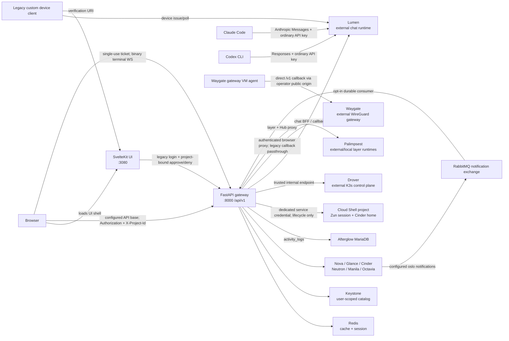

# Afterglow Architecture

## Overview

Afterglow는 OpenStack 프로젝트를 관리하는 대시보드이자, 독립 배포된 Drover·Lumen·Waygate·Palimpsest 서비스로 가는 인증된 BFF(gateway)이다. 브라우저 UI는 SvelteKit이 제공하지만 OpenStack 자원 생성과 권한 검사는 FastAPI 백엔드가 소유한다. 저장소 URL은 <https://github.com/openstack-afterglow/openstack-afterglow>이다.

이 문서는 이 저장소의 `dev` 브랜치와 작업 트리에서 검토한 구현을 설명한다. 애플리케이션 버전은 root/backend/frontend 및 Cloud Shell 모두 `1.30.12`이며, backend는 Python `>=3.12`, FastAPI `0.136.3`, `openstacksdk 3.3.0`, frontend는 SvelteKit `2.70.1`·Svelte `5.55.9`·Vite `8.2.0`을 manifest에 고정한다. 테스트 통과나 실제 OpenStack 배포를 이 문서의 근거로 승격하지 않는다.

**Dev push integration (2026-10-10):** This local `dev` combines checkpoint `20060ce6aab244a419a9582aa74f06517b133c36` and fetched dev `9c55578585c2f8147ef06d57e1892cac80eb6093`, preserving both ancestries from common base `4b28e31cc83770cfa8fdb4e78c5f8221d4ddcb83`. Historical test, browser, native and production receipts below remain scoped to their original source/runtime; they do not qualify the merged source. The final architecture stamp records a new source review, and final local qualification is recorded separately in `docs/testing.md`. The user confirmed MCP now connects; no additional OAuth repair, unspecified MCP feature, version bump, tag or production deployment is included in this push.

1분 요약:

- `frontend/`는 화면, 브라우저 토큰 상태, API 호출과 SSE 소비를 담당한다.
- `backend/app/main.py`는 `/api/v1` 라우터, 선택 서비스 mount, legacy VM callback을 조립한다.
- `backend/app/services/`와 `openstacksdk`가 Keystone·Nova·Glance·Cinder·Neutron·Manila·Octavia 및 선택 서비스를 호출한다.
- 브라우저 access/refresh JWT와 Redis의 Keystone 검증 세션은 서로 다른 자격 및 수명이다.
- Drover·Lumen·Waygate·Palimpsest의 내구성 데이터와 worker는 형제 저장소/서비스가 소유하며, Afterglow는 설정된 신뢰 endpoint로만 전달한다.

프로젝트 역할은 기존 `project_owner → project_admin → project_member → project_reader`와 native `member`/`reader` 연결을 재사용한다. 소유권은 새 프로젝트 생성 또는 검토된 명시적 이전에서만 부여하며 마지막 유효 소유자를 보호한다. 역할·직접 inference edge 프리셋은 시스템 관리자의 명시적 API 실행에서만 적용된다. 일반 조회·로그인에서 자동 seeding하지 않는다. 네 서비스의 admin/editor/user/reader 부모와 세부 leaf 권한은 **현재 Keystone의 실제 역할 ID 그래프**로만 확장되며 tenant `admin`/`manager`로 승격할 수 없다. Native 서비스는 다운로드 소유권·패키지/API key scope·Kubernetes grade·provider I/O를 독립적으로 다시 검증한다.

등급 cutover의 scoped architecture 검토는 현재 role-ID graph/유효 할당, subject/project-bound BFF와 native leaf 교집합, reduced credential issuance 및 응답 공개 fence, media/one-time-secret의 pending-mask와 확정 회수 상태 전이를 포함한다. Backend unit4,112/consumer contract154와 실제 native/browser 증거·한계는 [`docs/testing.md`](docs/testing.md#프로젝트-서비스-등급-검증-기록-2026-10-07-local-only)에 분리했다. 공유 index의 미해결 merge와 별도 UI/i18n/Kolla gate 실패를 이 검증으로 해결했다고 주장하지 않으며, 다른 세션의 working architecture review block은 보존하고 임시 index에 scope source만 올려 guard를 실행한다.

2026-10-08 release integration은 격리 dev에서 source 전체 gate·canonical build와 불변 `v1.30.4` 발행을 완료했다. 이는 위 구현 단계의 과거 slice 기록과 별도다. 동반 발행 버전은 Lumen0.6.6·Drover0.4.4·Waygate0.3.2·Palimpsest0.3.1이며 새 운영 cutover는 하지 않았다. 사용자 승인에 따라 운영 Keystone의 빠진 서비스 역할46개·직접 inference edge67개만 명시 적용했고 기존 사용자 할당·core/project 역할과 running version을 보존했다. 일반 사용자43명의 프로젝트 멤버십106건에는 서비스 등급이 없어 사용자별 할당 검토 전 다섯 서비스 cutover를 보류한다. 현재 운영은 Afterglow1.30.3·Lumen0.6.4·Drover0.4.3·Waygate0.3.1 및 기존 Hub다. 정확한 artifact/로컬 runtime·IAM·보류 증거는 CHANGELOG1.30.4와 release-ecosystem checklist를 따른다. 이 사후 문서 갱신은 source·schema·runtime 구조를 바꾸지 않는다.

Image Studio의 사후 실제 Chromium 점검에서 `lumen-images_user` 확정 거부인데 모델 조회를 기다린다는 문구가 계속 표시됐다. 1.30.5 source는 composer의 모델/옵션 상태를 `imagesAllowed`일 때만 렌더링하고 기존 권한 loading/error/필요 leaf notice를 그대로 사용한다. 로딩 flag나 요청·권한·draft/media fence는 변경하지 않는다. 재빌드한 production frontend의 실제 Chromium 31조건에서 거부/권한 대기/조회 장애, 실제 model loading, allowed readiness, 모델 오류/빈 목록·capability 오류, 독립 assets 거부와 light/dark 390–1440px를 검증했다. 거부 시 model HTTP0·페이지 overflow0·JS 오류0이며 외부 font 요청 차단은 별도 기록한다. Identity/API는 합성이고 paid provider·운영 acceptance가 아니다. 구조 영향이 없는 표시 bugfix이며 1.30.4 tag는 보존한다. 새 patch의 exact CI/발행은 parent release checklist에 따로 기록한다.

1.30.5 exact source3941490d의 dev·tag Docker/Helm은 성공했고4개 이미지 revision·version/latest digest와 Helm version/appVersion을 확인했다. Digest 고정 published frontend의 실제 Chromium31조건도 permission/model/asset 상태·거부modelHTTP0·overflow0·JSerror0·mutation0을 통과했다. API·worker amd64와 Cloud Shell amd64/arm64는1.30.5·uid1000으로 실행됐다. 이 추가 proof는 합성 identity/API와 disposable local process이며 운영 acceptance는 아니다. Palimpsest의 native opt-out 후 final Release skip만 조건 수정·hash-matched formal Release로 보완했고 protected dev PR18/19와 정확한75593f31 hosted CI가 성공했다; native/runtime 구조와 release tag는 변경하지 않았다. 운영 hold와 역할 할당 검토 경계는 그대로다.

## Development status

상태는 기능 범위에 한정한 구현 판단이며, 검증 열은 실제로 읽은 근거의 수준이다. `test-defined`는 테스트가 정의되어 있다는 뜻이지 실행 성공이 아니다.

| 기능 범위 | Implementation | Verification evidence | Current limit | Source |
|---|---|---|---|---|
| FastAPI `/api/v1` gateway와 OpenStack core 라우터 | `implemented` | `source-reviewed` | 선택 서비스는 설정에 따라 mount되지 않는다. | [`backend/app/main.py`](backend/app/main.py), [`backend/app/api/`](backend/app/api/) |
| 브라우저 login·refresh·rescope | `implemented` | `test-defined`; local browser login/API refresh verified | 로컬 internal Keystone catalog를 사용한 login·refresh만 실행했다. rescope 및 장애 경로의 live 검증은 수행하지 않았다. | [`backend/app/api/identity/`](backend/app/api/identity/), [`frontend/src/lib/api/client.ts`](frontend/src/lib/api/client.ts), [`frontend/src/lib/stores/auth.ts`](frontend/src/lib/stores/auth.ts) |
| 시스템 관리자 역할 CRUD·상속 관리와 일반 사용자 role projection | `implemented` in local source | access target backend 234/frontend 14, auth target backend 168/frontend 57, focused role/security 74, Svelte check 0 diagnostics; actual FastAPI/native SDK HTTP 28 cases plus native safe/privileged alias projection and Chromium 390/1440px lifecycle/tree/outage/access-denial (2026-10-06) | Identity·Keystone provider·Redis는 격리 합성 fixture이며 실제 OpenStack 인증·운영 역할 변경·배포는 수행하지 않았다. 실제 그래프만 읽고 기본 계층을 자동 생성하지 않는다. | [`backend/app/services/identity_roles.py`](backend/app/services/identity_roles.py), [`frontend/src/routes/admin/roles/+page.svelte`](frontend/src/routes/admin/roles/+page.svelte), [`docs/api/admin.md`](docs/api/admin.md) |
| 프로젝트·독립 서비스 등급과 세부 권한 | `implemented` in local source | 실제 HTTP BFF + installed Keystone SDK/current synthetic directory 24 경계 통과; Chromium 정규화·명시적 프리셋·owner-only 위임, Waygate 소유 profile/editor/assign-once, Drover 명시 `user/editor`와 late-response 회수 fence, Image/WAV/one-time-secret 동일 값 장애 복구·확정 폐기; UI 회귀 9 files/252 tests | 운영 역할·DB·배포·유료 provider는 변경하지 않았다. UI identity/service/credential은 합성이며 native image/DB/Kubernetes 증거는 sibling 문서의 범위·한계와 구분한다. 이미 발급된 Kubernetes token/certificate를 UI 변경으로 회수하지 않는다. | [`backend/app/services/service_permissions.py`](backend/app/services/service_permissions.py), [`backend/app/services/service_authorization.py`](backend/app/services/service_authorization.py), [`backend/app/services/project_service.py`](backend/app/services/project_service.py), [`frontend/src/lib/stores/servicePermissions.ts`](frontend/src/lib/stores/servicePermissions.ts), [`docs/api/projects.md`](docs/api/projects.md) |
| VM 생성과 SSE 진행/rollback | `implemented` | `test-defined` | SSE `completed`는 API 단계의 완료이며 VM health/후속 상태의 완료를 뜻하지 않는다. | [`backend/app/api/compute/instances.py`](backend/app/api/compute/instances.py), [`backend/tests/`](backend/tests/) |
| 관리자 하이퍼바이저 스케줄링·전체 호스트 이주 | `implemented` in local source | focused Nova 62 tests, admin UI 7 behavior tests and mocked Chromium up/disabled + down/enabled surfaces (2026-09-29); production mutation not exercised | Nova microversion 2.53 하이퍼바이저 UUID를 정확한 `nova-compute` service UUID로 검증하고 별도 관리자 PUT으로 스케줄링만 변경한다. `up/disabled`는 VM별 live/cold migration, `down`은 운영자의 펜싱 확인 후 evacuation을 요청한다. 요청 접수는 완료가 아니며 `forced_down`은 변경하지 않는다. | [`backend/app/api/identity/admin.py`](backend/app/api/identity/admin.py), [`frontend/src/routes/admin/hypervisors/+page.svelte`](frontend/src/routes/admin/hypervisors/+page.svelte), [`docs/api/admin.md`](docs/api/admin.md) |
| 관리자 개별 호스트 검토 후 Nova 등록 제거 | `implemented` in local source | focused backend/UI tests; actual local HTTP API with synthetic Nova/Placement/auth/Redis and Chromium eligible/blocked/unverified/verified paths, 390–1440px layouts (2026-10-05); live cloud deletion not exercised | Fresh Nova/Placement metadata와 현재·보존 workload, root/child allocations를 직접 검토하고 5분·1회용 caller/project/cloud/host-bound 승인을 사용한다. 공유 Redis host lease 아래 재점검·fingerprint 일치 후 정확한 compute service만 삭제한다. 실제 `nova-compute` 중지는 운영자의 승인 진술이며 uptime/heartbeat·불완전한 과거 이력으로 물리 종료나 미사용을 추정하지 않는다. 204만으로 성공하지 않고 service·hypervisor·Placement·aggregate 부재를 검증한다. | [`backend/app/services/nova_hosts.py`](backend/app/services/nova_hosts.py), [`backend/app/services/hypervisor_removal.py`](backend/app/services/hypervisor_removal.py), [`backend/app/services/hypervisor_review.py`](backend/app/services/hypervisor_review.py), [`frontend/src/lib/components/admin/hypervisors/HypervisorRemovalReview.svelte`](frontend/src/lib/components/admin/hypervisors/HypervisorRemovalReview.svelte), [`docs/api/admin.md`](docs/api/admin.md) |
| 볼륨 이름 변경·상세 단일화 | `implemented` in local source | volume backend 24 tests, frontend scoped 15 tests, Svelte check zero diagnostics, mocked Chromium in-use detail/name and PATCH request (2026-09-29); live Cinder rename not exercised | 프로젝트 쓰기 권한·소유권 확인 뒤 Cinder metadata 이름만 변경하고 목록 cache를 무효화한다. 목록 SlidePanel과 직접 상세 경로는 동일한 `VolumeDetailPanel`을 사용하며, 연결 VM 이름은 현재 프로젝트 인스턴스 GET으로 확인하고 실패 시 UUID를 명시한다. 일시적 폴링 오류는 로드된 상세를 숨기지 않는다. | [`backend/app/api/storage/volumes.py`](backend/app/api/storage/volumes.py), [`frontend/src/lib/components/VolumeDetailPanel.svelte`](frontend/src/lib/components/VolumeDetailPanel.svelte), [`frontend/src/routes/dashboard/volumes/[id]/+page.svelte`](frontend/src/routes/dashboard/volumes/[id]/+page.svelte), [`docs/api/volumes.md`](docs/api/volumes.md) |
| 볼륨 목록·상세 작업 메뉴 동기화 | `implemented` in local source | focused list/detail 17 frontend behavior tests and mocked Chromium direct/panel action menu and 375px layout (2026-09-30); live Cinder/Nova mutations not exercised | `VolumeOperationItems`는 목록·공용 상세의 상태별 메뉴와 관리자 강제 삭제 조건을 공유한다. 상세는 기존 `VolumesModalStack`과 VM 생성 마법사를 재사용하고 성공 시 상세와 열린 목록을 갱신한다. 연결된 볼륨 일반 삭제는 재검증하며 직접 경로와 SlidePanel의 작업 조건은 동일하다. | [`frontend/src/lib/components/volume/VolumeOperationItems.svelte`](frontend/src/lib/components/volume/VolumeOperationItems.svelte), [`frontend/src/lib/components/VolumeDetailPanel.svelte`](frontend/src/lib/components/VolumeDetailPanel.svelte), [`docs/api/volumes.md`](docs/api/volumes.md) |
| Cinder volume backup BFF와 브라우저 UI | `implemented` | focused route/legacy-preference tests, Svelte check and mocked local Chromium list/create dialog; read-only production check found cinder-backup enabled/up on all three controllers (2026-09-29) | 볼륨 목록·자동 백업·백업 경로는 더 이상 브라우저 beta opt-out을 사용하지 않는다. 서비스 상태는 실제 백업 생성·복원 성공을 증명하지 않는다. | [`backend/app/api/storage/volume_backups.py`](backend/app/api/storage/volume_backups.py), [`frontend/src/routes/dashboard/volumes/backups/+page.svelte`](frontend/src/routes/dashboard/volumes/backups/+page.svelte), [`frontend/src/lib/config/nav.ts`](frontend/src/lib/config/nav.ts) |
| Trove database backup BFF와 브라우저 UI | `implemented` | focused restore-intent/legacy-preference tests, Svelte check and mocked local Chromium list (2026-09-29) | 인스턴스 백업·자동 백업·백업에서 복원 경로는 더 이상 브라우저 beta opt-out을 사용하지 않는다. 실제 Trove/Swift 백업 생성·복원은 운영에서 미검증이다. | [`backend/app/api/database/`](backend/app/api/database/), [`frontend/src/routes/dashboard/database/backups/+page.svelte`](frontend/src/routes/dashboard/database/backups/+page.svelte) |
| Manila share backups | `not implemented` in Afterglow | live Manila API/config read-only inspection (2026-09-29) | Manila 실험 API 2.80+는 응답하지만 `manila-data`의 독립 NFS backup repository와 `data_node_access_ips`가 설정되지 않아 생성 후 비동기 실패한다. 기본 CEPHFS native share는 현재 NFS backup driver가 mount할 수 없다. 공유 스냅샷은 백업이 아니다. | [`backend/app/services/manila.py`](backend/app/services/manila.py), [`docs/api/file-storage.md`](docs/api/file-storage.md) |
| 전역 Cloud Shell | `implemented`; live terminal readiness blocked | focused backend/frontend/image/Kolla/Kubernetes contracts; synthetic-auth xterm input/minimize smoke; authenticated Chromium header/consent and live Zun/Cinder lifecycle observed | 전용 service project의 Cinder 홈과 ephemeral Zun 컨테이너를 사용한다. 현재 로컬은 `services.cloud_shell=true`이며 전용 project의 network/default SG와 member 권한 create/delete를 확인했다. 실제 사용자 승인으로 생성한 컨테이너는 Zun의 Cinder RBD `mkfs` 실행 환경에 장치 경로가 없어 Error가 됐다. Terminal ready·bootstrap·CLI는 미검증이며 운영은 digest 고정이 필요하다. | [`backend/app/api/cloud_shell.py`](backend/app/api/cloud_shell.py), [`backend/app/services/cloud_shell.py`](backend/app/services/cloud_shell.py), [`cloud-shell/`](cloud-shell/), [`frontend/src/lib/components/cloud-shell/`](frontend/src/lib/components/cloud-shell/) |
| k3s/Drover 연동 | `partial` | `test-defined` | Afterglow의 compatibility/admin 경로와 독립 Drover control plane을 혼동하지 않는다. | [`backend/app/api/drover/`](backend/app/api/drover/), [`backend/tests/contracts/test_drover_proxy.py`](backend/tests/contracts/test_drover_proxy.py) |
| Lumen chat BFF, bounded history, settings, CLI guides, quota/usage projection | `partial` | active-history/full gate plus focused Claude guide 8, Svelte diagnostics, actual Claude Code 2.1.278 CLI and responsive guide surface passed (2026-09-20) | 실행·provider·secret·journal·active-path projection·cursor·API-key/device credential·quota는 Lumen 소유다. Afterglow는 authenticated BFF, bounded 40×3 history window, legacy custom-device approval shell, direct ordinary-key Claude Code/Responses Codex guide와 settings/quota/usage UI를 제공한다. Current Claude Apps Gateway login은 legacy shell과 호환된다고 advertise하지 않는다. | [`backend/app/api/lumen/`](backend/app/api/lumen/), [`frontend/src/lib/components/chat/ChatPanel.svelte`](frontend/src/lib/components/chat/ChatPanel.svelte), [`frontend/src/lib/components/chat/ChatApiKeysManager.svelte`](frontend/src/lib/components/chat/ChatApiKeysManager.svelte), [`frontend/src/routes/oauth/claude/authorize/`](frontend/src/routes/oauth/claude/authorize/), [`docs/api/chat.md`](docs/api/chat.md) |
| Lumen media Studio 및 realtime voice BFF | `implemented` in local source; provider-real/realtime acceptance pending; finite Studio UI evidence below | 기존 suite: Lumen 1,361 service contracts, 43 MariaDB/Redis integrations, 9 container system (text only); Afterglow 3,275 backend unit, 136 contract, 28 isolated MariaDB/PostgreSQL/Redis functional, 1,656 frontend unit + 9 scripts, backend Ruff and frontend check zero diagnostics. 최초 검증은 unauthenticated dev route 302까지였으며, 아래 로컬 복구 행이 유한 Studio의 실제 Chromium 화면 검증을 기록한다 | 이미지/유한 음성은 Lumen durable run·asset이며 UI는 model readiness/intent/owned response만 소비한다. Realtime만 Afterglow가 Keystone session→60초 one-use browser ticket→internal Lumen WS를 연결한다. Browser/provider key never mixes; raw PCM/transcript는 서비스 DB에 저장하지 않는다 | [`backend/app/api/lumen/realtime.py`](backend/app/api/lumen/realtime.py), [`frontend/src/lib/components/chat/RealtimeVoice.svelte`](frontend/src/lib/components/chat/RealtimeVoice.svelte), [`frontend/src/lib/components/chat/ImageStudio.svelte`](frontend/src/lib/components/chat/ImageStudio.svelte), [`frontend/src/lib/components/chat/AudioStudio.svelte`](frontend/src/lib/components/chat/AudioStudio.svelte) |
| 로컬 media migration 이력과 Studio 메뉴 복구 | `implemented`; local stack/UI verified | 정확한 과거 019→canonical 020 이력 adoption·dry-run·fresh/불일치 경계의 실제 MariaDB 회귀 9건, runner/manifest 13건, Sidebar/AdminSidebar 12건, Lumen BFF 41건 및 frontend 142건 통과; Svelte check 0 errors/warnings. API/worker/frontend arm64·amd64 빌드, 기존 Compose DB의 migration 종료 0·재실행/pending 0·ready 통과. 합성 identity의 실제 Chromium 390/767/768/1023/1024/1440px Studio 이동·편집 입력·단일 활성 메뉴와 overflow 없음 확인 | 실제 build context인 `../lumen`의 runner가 정확한 역사적 checksum·schema만 승인한다. 기존 ledger·DB·volume은 유지한다. 로컬 provider/model은 0건이며 native image/tts/stt catalog도 비어 있다(throwaway scoped principal + 실제 DB). 이 검증은 OpenStack 로그인·유료 media 호출·realtime WS 또는 운영 배포 증거가 아니다. | [`frontend/src/lib/components/Sidebar.svelte`](frontend/src/lib/components/Sidebar.svelte), [`docs/api/chat.md`](docs/api/chat.md), `../lumen/lumen/scripts/migrate.py`, `../lumen/tests/integration/test_media_registry_migration.py` |
| 이미지·오디오 Studio 재구성과 native 구간 타임스탬프 | `implemented` in local source; local stack/UI verified with synthetic API fixtures; provider-real pending | 2026-10-01 Afterglow: ImageStudio 11·AudioStudio 11·전사 parser 18·hooks CSP 24 focused tests, Svelte check 0 errors/warnings, `test:all`(JS 102/26/13 pass·15 skip, backend 3,307, frontend 1,745, scripts 9, contract 136, functional 28)과 backend `ruff check` 통과. Lumen audio transport/compat 63, 실제 MariaDB durable audio integration 9, Ruff 통과; contract 1,613 통과·2 실패는 다른 작업이 수정 중인 worker/request-logging test다. 기존 local Compose에 API/worker/frontend arm64 재배포(변경 파일·style asset SHA-256 일치, migration 종료 0, ready 정상)와 세 이미지 amd64 빌드·에뮬레이션 실행. 합성 identity·route fixture의 실제 Chromium에서 스타일 지시문이 붙은 생성/편집 요청, 결과 Blob 미리보기·다운로드 바이트 일치, TTS 재생·WAV 다운로드, STT 원본 미리듣기·구간 표·TXT/SRT, 타임스탬프 불가 모델과 구간 없는 응답 거부, 390–1440px·다크/라이트 확인 | 스타일은 provider 옵션이 아니라 제출 prompt 끝의 가시 지시문이다. Timing은 실행 가능한 direct OpenAI `whisper-1` capability가 광고할 때만 요청하고 provider segment만 표시·내보내며 추정하지 않는다. Frontend CSP `media-src 'self' blob:`이 object URL 재생만 허용한다. 실제 provider 추론·정확 가격·scanner와 운영 배포는 미검증이다 | [`frontend/src/lib/components/chat/ImageStudio.svelte`](frontend/src/lib/components/chat/ImageStudio.svelte), [`frontend/src/lib/components/chat/AudioStudio.svelte`](frontend/src/lib/components/chat/AudioStudio.svelte), [`frontend/src/lib/api/audioTranscript.ts`](frontend/src/lib/api/audioTranscript.ts), [`frontend/src/hooks.server.ts`](frontend/src/hooks.server.ts) |
| 이미지 Studio 자동 요청 | `implemented`; local frontend deployed, synthetic browser verified | ImageStudio 14, Lumen image transport/compat 20, BFF 41 및 Lumen frontend target 142 통과; frontend check 0 errors/warnings, `test:all` backend 3,306·frontend 1,747·contract 136·functional 28 통과. Frontend arm64/amd64 build, canonical Compose health 200, Chromium의 자동 요청·입력 보존·결과와 dark/light 6개 breakpoint 확인 | 첨부 유무로 기존 API 경로만 선택한다. 참고 생성/수정 의미는 이미지 모델 소유이며 실제 provider 추론·품질·운영 배포는 미검증이다. | [`ImageStudio.svelte`](frontend/src/lib/components/chat/ImageStudio.svelte), [`docs/api/chat.md`](docs/api/chat.md) |
| 기본 SVG 브랜딩·wordmark 여백 | `implemented`; local stack/public UI verified | Chromium source preview의 390/767/768/1023/1024/1440px·640×450 CSS viewport에서 로그인·랜딩·사용자/관리자 sidebar·관리자 preview 확인. 앱/OS 반대 scheme의 글자 색 pixel 확인과 합성 raster upload/reset 동선 통과. 현행 arm64 Compose backend/frontend healthy, 공개 site-config의 SVG 경로·실제 로그인/랜딩/favicon decode·정적 자산 SHA 일치. amd64 이미지 빌드·실행 확인. `test:all`: backend 3,306·frontend 1,744·scripts 9·contract 136·functional 28 통과; Svelte check 0 errors/warnings와 변경 backend Ruff 통과 | 관리자 인증·업로드의 live DB 브라우저 acceptance, Firefox/Safari·실제 browser 200% zoom은 이 증거에 포함하지 않는다. 외부 구형 경로 설정은 이관이 필요하며 운영 배포·commit/push는 수행하지 않았다. | [`brandAssets.ts`](frontend/src/lib/config/brandAssets.ts), [`LoginBrandHeader.svelte`](frontend/src/lib/components/auth/LoginBrandHeader.svelte), [`DESIGN.md`](DESIGN.md), [`docs/api/system-services.md`](docs/api/system-services.md) |
| 공개 소개 페이지 기능 설명 모션 | `implemented` in local source; isolated local Compose frontend verified | 2026-10-02 전체 frontend 276 files/1,892 tests+실행 로그 9, Svelte check 2,130 files 0 errors/0 warnings, production build(ScrollTrigger chunk 없음), `bun install --frozen-lockfile`을 포함한 arm64·amd64 이미지 빌드 통과. 실제 Chromium source preview에서 before/after를 같은 조건(1440×900 dark, 390×844, 시나리오 3종, 12초 scroll)으로 녹화·비교(`~/.gstack/projects/afterglow/designs/landing-motion-audit-20261002/`). 확인 항목: 단계별 panel 전이, 대기 panel의 계획 객체, 시나리오 간 같은 높이(1440 719px), 키보드 시작·정지·재개와 focus 유지, reduced-motion 즉시 완료, 양방향 scroll 단계와 fade-through 겹침 없음, 320–1920px와 200% zoom 등가 720px의 가로 넘침 0·12px·44px. canonical dev manifest의 격리 project(`127.0.0.1:3089`)에서 arm64·amd64(`linux/x64`) 이미지 healthy·`/health` ok·같은 smoke 통과 후 제거 | 브라우저 안의 설명용 예시이며 실제 자원 생성·서비스 상태·API를 호출하지 않는다. 공유 `afterglow-local-services` frontend(3080)는 교체하지 않았다. 운영 배포, Firefox/Safari, backend gate는 미검증이다. | [`LandingPage.svelte`](frontend/src/lib/components/landing/LandingPage.svelte), [`LandingOpsBoard.svelte`](frontend/src/lib/components/landing/LandingOpsBoard.svelte), [`LandingJourney.svelte`](frontend/src/lib/components/landing/LandingJourney.svelte), [`LandingConsolePreview.svelte`](frontend/src/lib/components/landing/LandingConsolePreview.svelte) |
| 콘솔 공용 motion과 진행·대기·전송·토폴로지 motion graphic | `implemented` in local source; synthetic browser verified | 2026-10-06 Svelte check 2,174 files 0 errors/0 warnings, 전체 frontend unit 306 files/2,101 tests 통과. HEAD worktree와 현재 source를 같은 격리 Vite·tutorial mockup·throttled upload mock에서 1440×900으로 녹화 비교(`~/.gstack/projects/afterglow/designs/console-motion-audit-20261006/`): 실제 VM wizard 단계 전환과 배포 진행, Drover 생성 완료·실패, Lumen 대기·추론·도구·스트리밍, 업로드 dock 성공·실패, 공용 primitive, 토폴로지 canvas/lane 첫 도착, 개요·버킷. Reduced-motion 실행 중 animation 0과 정적 frame, 390·767·768·1023·1024·1440px 가로 넘침 0·최소 12px, light/dark 확인 | 반복 motion은 실제 진행·대기·전송·계측 traffic 상태에만 묶이고 상태는 문구·ARIA로도 전달한다. Tutorial mockup, 합성 진행/채팅 timeline과 로컬 업로드 mock은 UI 계약 증거이며 실제 OpenStack 배포·Lumen streaming·RGW 전송·운영 배포 검증이 아니다. | [`layout.css`](frontend/src/routes/layout.css), [`motion.ts`](frontend/src/lib/utils/motion.ts), [`StepProgress.svelte`](frontend/src/lib/components/ui/StepProgress.svelte), [`VmDeployProgress.svelte`](frontend/src/lib/components/wizard/VmDeployProgress.svelte), [`DESIGN.md`](DESIGN.md) |
| Waygate BFF·VPN UI·legacy agent callback 전달 | `partial` | focused proxy contract 8건, VPN UI interaction 2건, local authenticated BFF→Waygate API/WireGuard kernel tunnel and browser smoke passed (2026-09-26/27) | 실제 OpenStack port hot-plug와 내부 인스턴스 data plane은 이 candidate에서 재검증하지 않았다. 별도 image-only DMSLAB prebuilt 부팅 검증은 완료. Waygate DB/worker와 standalone `/v1` API는 형제 서비스가 소유한다. | [`backend/app/api/waygate/`](backend/app/api/waygate/), [`frontend/src/routes/dashboard/network/waygate/+page.svelte`](frontend/src/routes/dashboard/network/waygate/+page.svelte), [`docs/api/vpn.md`](docs/api/vpn.md) |
| Waygate client settings, dynamic server defaults and report-derived traffic | `implemented` in local source | prior authenticated browser and kernel WireGuard data-plane smoke (2026-09-26/27); new revision: 95 focused frontend tests, 12 backend BFF contract tests, frontend check zero diagnostics, isolated Waygate migration `001`–`004` and HTTP inheritance/export/import/config/status smoke, 375px Chromium peer controls and 1280px shell without horizontal overflow. Afterglow full gate: 3137 backend unit, 1591 frontend unit, 9 orchestration, 132 contract, 28 functional and Ruff passed (2026-09-28) | Not deployed: DNS/MTU/keepalive, generated PSK and server inheritance depend on Waygate migration 004/API and a rebuilt prebuilt gateway image for 1-second sampling. New agent on a booted VM and new client data plane were not live-verified. Browser keeps bounded per-project/server report samples; stale/missing/reset data cannot fabricate a rate. | [`frontend/src/lib/components/waygate/`](frontend/src/lib/components/waygate/), [`frontend/src/lib/components/ui/TrafficArea.svelte`](frontend/src/lib/components/ui/TrafficArea.svelte), [`frontend/src/lib/utils/waygateTraffic.ts`](frontend/src/lib/utils/waygateTraffic.ts), [`openspec/changes/archive/2026-09-27-waygate-live-peer-controls/`](openspec/changes/archive/2026-09-27-waygate-live-peer-controls/) |
| Palimpsest layer/build/Hub BFF | `partial` | focused Dockerfile/consume tests and local Linux full-root smoke; 2026-09-28 DMSLab live Glance→Cinder clone, Manila artifact sealing, inherited ENV/WORKDIR child build, full-root SSH VM and reboot/upper persistence verified | 신규 Dockerfile 전체-root 빌드는 로컬 작업 트리와 disposable OpenStack 자원에서 검증했으며 운영에 배포하지 않았다. Hub의 독립 배포와 혼동하지 않는다. | [`backend/app/api/palimpsest/`](backend/app/api/palimpsest/), [`backend/app/services/dockerfile_guest.py`](backend/app/services/dockerfile_guest.py), [`backend/tests/test_palimpsest_dockerfile.py`](backend/tests/test_palimpsest_dockerfile.py) |
| architecture snapshot freshness guard | `implemented` | `test-passed` (`npm run test:target -- backend:tests/test_architecture_guard.py`, 13 passed, 2026-09-08) | guard는 문서가 source를 정직하게 설명했는지 자연어까지 판정하지 않는다. | [`scripts/check_architecture.py`](scripts/check_architecture.py), [`backend/tests/test_architecture_guard.py`](backend/tests/test_architecture_guard.py) |

## System context


```mermaid
graph LR
    Browser["Browser"] -->|"loads UI shell"| Frontend["SvelteKit UI\n:3080"]
    Browser -->|"configured API base; Authorization + X-Project-Id"| BFF["FastAPI gateway\n:8000 /api/v1"]
    BFF --> Redis["Redis\ncache + session"]
    BFF --> Keystone["Keystone\nuser-scoped catalog"]
    BFF --> OpenStack["Nova / Glance / Cinder\nNeutron / Manila / Octavia"]
    OpenStack -->|"configured oslo notifications"| Broker["RabbitMQ notification exchange"]
    Broker -->|"opt-in durable consumer"| BFF
    BFF -->|"activity_logs"| AuditDB["Afterglow MariaDB"]
    BFF -->|"dedicated service credential; lifecycle only"| CloudShell["Cloud Shell project\nZun session + Cinder home"]
    Browser -->|"single-use ticket; binary terminal WS"| BFF
    BFF -->|"trusted internal endpoint"| Drover["Drover\nexternal K3s control plane"]
    BFF -->|"chat BFF / callback"| Lumen["Lumen\nexternal chat runtime"]
    ClaudeCode["Claude Code"] -->|"Anthropic Messages + ordinary API key"| Lumen
    LegacyDevice["Legacy custom device client"] -->|"device issue/poll"| Lumen
    LegacyDevice -->|"verification URI"| Frontend
    Codex["Codex CLI"] -->|"Responses + ordinary API key"| Lumen
    Frontend -->|"legacy login + project-bound approve/deny"| BFF
    BFF -->|"authenticated browser proxy; legacy callback passthrough"| Waygate["Waygate\nexternal WireGuard gateway"]
    GatewayVM["Waygate gateway VM agent"] -->|"direct /v1 callback via operator public origin"| Waygate
    BFF -->|"layer + Hub proxy"| Palimpsest["Palimpsest\nexternal/local layer runtimes"]
```

텍스트 흐름은 다음과 같다. 브라우저가 SvelteKit 셸에서 access JWT와 선택적 `X-Project-Id`를 붙여 FastAPI로 요청한다. FastAPI는 토큰과 project ownership을 확인하고 caller-scoped `openstacksdk` connection으로 OpenStack을 호출하거나, 설정된 trusted internal endpoint를 해석해 형제 서비스로 필요한 헤더를 전달한다. Redis는 세션·단기 캐시·wakeup 보조이며 authoritative OpenStack/형제 서비스 상태를 대신하지 않는다. 외부 형제 서비스의 내부 DB와 worker를 Afterglow가 직접 import하거나 공유하지 않는다.

## Code map

| 경로/심볼 | 책임 | 의존 방향 |
|---|---|---|
| [`backend/app/main.py`](backend/app/main.py) `app`, `include_router`, `health` | FastAPI lifecycle, middleware, `/api/v1` 및 legacy mount, 선택 서비스 조건, background loop | router/service → FastAPI |
| [`backend/app/services/service_proxy.py`](backend/app/services/service_proxy.py) `proxy`, `proxy_passthrough`, `get_json`, `resolve_service_endpoint` | Keystone catalog 또는 trusted internal URL을 통한 형제 서비스 forwarding, query/header 전달 | API adapter → configured service |
| [`backend/app/api/identity/`](backend/app/api/identity/) | login, refresh, logout, admin/project 권한과 세션 경계 | identity API → Keystone/Redis |
| [`backend/app/services/identity_roles.py`](backend/app/services/identity_roles.py), [`backend/app/api/identity/admin_identity.py`](backend/app/api/identity/admin_identity.py), [`frontend/src/lib/components/admin/roles/`](frontend/src/lib/components/admin/roles/) | 실제 role inference DAG, 시스템 관리자 CRUD·직접 연결, endpoint별 lease·최신 검증·세션 회수, public display-name projection 및 검색·정렬·상속 트리 | admin UI/API → caller-scoped Keystone SDK; projection → trusted service-admin metadata cache; Redis → graph coordination/session invalidation |
| [`backend/app/services/service_permissions.py`](backend/app/services/service_permissions.py), [`backend/app/services/service_authorization.py`](backend/app/services/service_authorization.py), service-specific `*_authorization.py` and [`frontend/src/lib/stores/servicePermissions.ts`](frontend/src/lib/stores/servicePermissions.ts) | `area_grade` 정규화·명시적 프리셋, 기존 프로젝트 ID/할당 유지, 현재 유효 역할 ID/DAG 기반 owner/admin 위임·서비스 세부 액션, unknown route fail-closed 및 권한 확인 중 UI 차단 | browser JWT → 현재 trusted Keystone directory → 정확한 native action gate → native ownership/credential ceiling; `can_write`·DB manager·과거 토큰 부모 역할은 서비스 권한이 아님 |
| [`backend/app/models/activity.py`](backend/app/models/activity.py), [`backend/app/services/activity.py`](backend/app/services/activity.py), [`backend/app/api/identity/admin_activity.py`](backend/app/api/identity/admin_activity.py), [`backend/app/services/openstack_notifications.py`](backend/app/services/openstack_notifications.py), [`frontend/src/routes/admin/events/`](frontend/src/routes/admin/events/) | 기존 activity 행과 Afterglow HTTP mutation/Keystone login 및 opt-in oslo.messaging 알림을 출처별로 보존하고 관리자 전역 목록·상세·집계로 조회 | browser/authenticated BFF와 configured AMQP broker → Afterglow MariaDB; admin UI → `/api/v1/admin/events` |
| [`backend/app/api/cloud_shell.py`](backend/app/api/cloud_shell.py), [`backend/app/services/cloud_shell.py`](backend/app/services/cloud_shell.py), [`backend/app/services/ws_ticket.py`](backend/app/services/ws_ticket.py) | 승인 뒤 single-use ticket, 사용자 전역 singleton lease, 전용 service-project Zun/Cinder lifecycle, binary terminal relay, expiry/cleanup/reconciliation | browser JWT/project scope → caller Keystone token; service credential → dedicated resource lifecycle; Redis → atomic coordination |
| [`frontend/src/lib/stores/cloudShell.svelte.ts`](frontend/src/lib/stores/cloudShell.svelte.ts), [`frontend/src/lib/components/cloud-shell/`](frontend/src/lib/components/cloud-shell/), [`frontend/src/lib/utils/terminalTheme.ts`](frontend/src/lib/utils/terminalTheme.ts), [`frontend/src/lib/utils/terminalLocale.ts`](frontend/src/lib/utils/terminalLocale.ts) | route 전체에 유지되는 consent/session state, project/logout cleanup, mobile sheet와 tablet/desktop bottom dock, token-based xterm theme·locale 접근성 알림 | root auth shell → `/api/v1/cloud-shell` HTTP/WS; existing Zun/k3s terminals share theme/locale mapping only; binary protocol 불변 |
| [`frontend/src/lib/api/client.ts`](frontend/src/lib/api/client.ts) `api`, `fetchWithAuth`, `tryRefresh`, `request` | API base, Authorization, 요청 전 refresh 직렬화와 fetch/XHR 401 복구, 403 처리, prefetch/invalidation | UI → FastAPI |
| [`frontend/src/lib/stores/auth.ts`](frontend/src/lib/stores/auth.ts) `auth`, `setAuth`, `setProject`, `clearAuth` | 브라우저 auth state와 project scope 영속화 | UI state → API client |
| [`frontend/src/routes/+layout.svelte`](frontend/src/routes/+layout.svelte), [`frontend/src/lib/components/ConsoleNavigation.svelte`](frontend/src/lib/components/ConsoleNavigation.svelte), [`frontend/src/lib/components/Sidebar.svelte`](frontend/src/lib/components/Sidebar.svelte), [`frontend/src/lib/components/AdminSidebar.svelte`](frontend/src/lib/components/AdminSidebar.svelte), [`frontend/src/lib/config/nav.ts`](frontend/src/lib/config/nav.ts), [`frontend/src/lib/stores/sidebar.ts`](frontend/src/lib/stores/sidebar.ts) | 전체 폭 global header, 모든 폭의 modal 전체 메뉴, 15rem 서비스 panel/3.5rem 아이콘 rail과 독립 expanded 상태, 공용 panel/dock offset | 현재 route·auth·service/beta 조건 → 목적지별 SVG를 포함한 기존 nav 선언; API·project rescope·Cloud Shell lifecycle은 변경 없음 |
| [`frontend/src/lib/config/brandAssets.ts`](frontend/src/lib/config/brandAssets.ts), [`frontend/src/lib/config/site.ts`](frontend/src/lib/config/site.ts), [`frontend/src/lib/components/auth/LoginBrandHeader.svelte`](frontend/src/lib/components/auth/LoginBrandHeader.svelte), [`frontend/src/lib/components/admin/AdminLoginBrandingPanel.svelte`](frontend/src/lib/components/admin/AdminLoginBrandingPanel.svelte), [`frontend/static/afterglow-logo.svg`](frontend/static/afterglow-logo.svg) | 기본 SVG wordmark·symbol·favicon 선택, custom/upload 우선순위 보존, 앱 테마별 embedder color-scheme, 비율 유지·중앙 정렬; wordmark는 bundled Pretendard Latin outline과 실제 도형 기준 균등 36-unit 여백 | server/backend/deployment 설정 → public site config → login/landing/sidebar; raster-only upload·DB 소유권은 변경 없음 |
| [`frontend/src/lib/components/landing/LandingPage.svelte`](frontend/src/lib/components/landing/LandingPage.svelte), [`LandingOpsBoard.svelte`](frontend/src/lib/components/landing/LandingOpsBoard.svelte), [`LandingJourney.svelte`](frontend/src/lib/components/landing/LandingJourney.svelte), [`LandingConsolePreview.svelte`](frontend/src/lib/components/landing/LandingConsolePreview.svelte) | 공개 소개 페이지 구성, 사용자가 시작하는 유한 4단계 콘솔형 환경 구성 미리보기(요청·정책 확인·자원 배정·재사용 panel), 지속 객체를 가진 신청→배정→관측→재사용 장면, 기능→워크플로우 필터 link, 프로젝트·클러스터·네트워크 콘솔 축약 화면 | public `/` → 정적 component data와 기존 site config만 사용; API·auth·provisioning 호출과 animation runtime 의존성 없음 |
| [`frontend/src/routes/layout.css`](frontend/src/routes/layout.css) motion block, [`frontend/src/lib/design/tokens.ts`](frontend/src/lib/design/tokens.ts) `MOTION_*`, [`frontend/src/lib/utils/motion.ts`](frontend/src/lib/utils/motion.ts), [`frontend/src/lib/components/ui/`](frontend/src/lib/components/ui/) `ProgressTrack`, `StepProgress`, `ProvisionPipeline`, `ActivityIndicator`, `AnimatedNumber` | 공유 motion token·keyframe·utility class와 reduced-motion 정지 frame, reduced motion·WAAPI 부재 시 즉시 끝나는 Svelte transition helper, path 변경 route 진입, 실제 진행·대기·전송 상태를 받는 primitive. 화면별 상태 결합은 [`topology/firstArrival.svelte.ts`](frontend/src/lib/components/topology/firstArrival.svelte.ts), [`chat/messageMotion.ts`](frontend/src/lib/components/chat/messageMotion.ts), [`object-storage/arrivals.ts`](frontend/src/lib/components/object-storage/arrivals.ts), [`k3sSteps.ts`](frontend/src/lib/components/k3sSteps.ts) `k3sProgressState`가 소유 | feature component → primitive/utility → token; API·store 계약·권한·animation runtime 의존성 없음 |
| [`frontend/src/hooks.server.ts`](frontend/src/hooks.server.ts) `handle` | public path, backend prefix, SPA fallback, CSP/보안 헤더 | SvelteKit request shell |
| [`frontend/src/lib/i18n/`](frontend/src/lib/i18n/), [`frontend/scripts/i18n.mjs`](frontend/scripts/i18n.mjs) | 한국어 기준 ko/en/ja/zh-CN namespace 카탈로그, ICU subset·안전한 rich text, 반응형 locale·쿠키·SSR lang, CSV 번역 교환·원문 hash 검수·하드코딩 guard | SvelteKit hooks → layout render → namespace translator; UI 표시만 변경, backend 데이터·API 계약 불변 |
| [`backend/app/api/compute/instances.py`](backend/app/api/compute/instances.py) `create_instance`, `create_instance_async`, `delete_instance`, `resize_owned_instance`, `confirm_owned_resize`, `revert_owned_resize` | Nova/Cinder/Manila/Neutron VM 생성·SSE·역순 rollback·FIP cleanup; 소유권/프로젝트 쓰기 권한이 적용된 cold resize와 VERIFY_RESIZE 확정/복귀 | compute API → OpenStack adapters/`flavor_eligibility` |
| [`backend/app/services/flavor_capacity.py`](backend/app/services/flavor_capacity.py), [`backend/app/services/flavor_eligibility.py`](backend/app/services/flavor_eligibility.py) | VM wizard의 opt-in(`capacity=create`) 목록과 단일 VM 생성 admission에서 프로젝트 쿼터와 같은 eligible compute의 CPU·RAM·GPU per-VM 한도를 결합; 기본 목록(K3s·Drover)은 쿼터만; 조회는 예약 아님 | API → 재사용 operator 세션의 Nova 2.53/Placement 1.36 읽기(목록은 10초 single-flight snapshot, admission은 fresh); Nova remains allocator |
| [`backend/app/api/network/security_groups.py`](backend/app/api/network/security_groups.py), [`backend/app/services/neutron.py`](backend/app/services/neutron.py), [`frontend/src/routes/dashboard/network/security-groups/+page.svelte`](frontend/src/routes/dashboard/network/security-groups/+page.svelte) | 현재 프로젝트의 Neutron 그룹·규칙 상세 쿼터, 선택 그룹을 사용하는 compute 포트/Nova 인스턴스, CIDR 또는 프로젝트 소유 그룹 대상 규칙을 사용자에게 노출한다. 불변 규칙은 표 안에서 값을 복사해 제거·재생성하며 쿼터 조회 실패를 정상 0 사용량으로 처리하지 않는다. | user UI → project-scoped security-groups API → Neutron quota/ports·Nova server; mutation owner check |
| [`frontend/src/lib/stores/instanceDetailController.svelte.ts`](frontend/src/lib/stores/instanceDetailController.svelte.ts), [`frontend/src/lib/components/instance/NetworkSection.svelte`](frontend/src/lib/components/instance/NetworkSection.svelte), [`SecurityGroupUnion.svelte`](frontend/src/lib/components/instance/SecurityGroupUnion.svelte), [`securityGroupUnion.ts`](frontend/src/lib/utils/securityGroupUnion.ts) | 공용 인스턴스 상세의 인터페이스별 저장된 보안 그룹 허용 규칙 합집합, 방향/IP 버전/원격 대상 격리와 포트 범위 통합; 로딩·오류·누락은 불완전한 정책을 숨긴다. | 기존 `/api/v1/instances/{id}/security-groups` 포트/그룹 snapshot → 순수 정규화 → 읽기 전용 `TableShell`; 새 API·DB·권한 경계 없음 |
| [`backend/app/api/identity/admin_identity.py`](backend/app/api/identity/admin_identity.py), [`backend/app/services/activity.py`](backend/app/services/activity.py), [`frontend/src/routes/admin/projects/+page.svelte`](frontend/src/routes/admin/projects/+page.svelte), [`frontend/src/routes/admin/groups/+page.svelte`](frontend/src/routes/admin/groups/+page.svelte) | 관리자 프로젝트 전체 inventory 검색·상태/도메인 AND 필터·최신 생성순 후 marker page; 그룹 전체 최신순 배열과 browser 검색·도메인 필터. nullable 생성일은 native 시각 또는 해당 ID의 정확한 성공 생성 이벤트에 한정한다. | admin-only UI/API → Keystone inventory + 기존 Afterglow activity store; Redis는 목록 cache만 |
| [`backend/app/services/project_deletion.py`](backend/app/services/project_deletion.py), [`backend/app/api/identity/admin_identity.py`](backend/app/api/identity/admin_identity.py), [`frontend/src/lib/components/admin/projects/AdminProjectDeleteModal.svelte`](frontend/src/lib/components/admin/projects/AdminProjectDeleteModal.svelte) | 관리자 프로젝트 삭제 전 28종 실제 소유 할당의 fresh 검사와 최종 DELETE 재검사. 부분/불명/범위 불일치는 차단하며 하나의 기존 modal에서 검사·재조회·빈 결과 확인을 제공한다. | admin-only caller connection → OpenStack SDK/native paginated APIs → 확인된 빈 프로젝트에만 Keystone DELETE; cache/쿼터는 삭제 근거가 아님 |
| [`backend/app/api/identity/admin_identity.py`](backend/app/api/identity/admin_identity.py), [`frontend/src/lib/stores/adminQuotasController.svelte.ts`](frontend/src/lib/stores/adminQuotasController.svelte.ts), [`frontend/src/lib/components/admin/quotas/ProjectQuotaForm.svelte`](frontend/src/lib/components/admin/quotas/ProjectQuotaForm.svelte) | 관리자 프로젝트 Nova·Cinder·Neutron·선택적 Manila 한도/사용량 조회와 서비스별 부분 필드 수정. 실패한 서비스는 null+오류로 구분하고 각 섹션의 변경 필드만 저장한다. GPU 정책은 기존 별도 API를 유지한다. | admin UI → admin-only `/api/v1/admin/quotas/{project_id}` → target-project OpenStack quota endpoints |
| [`backend/app/api/drover/`](backend/app/api/drover/) | Drover callback/admin/proxy compatibility | Afterglow BFF → Drover endpoint |
| [`backend/app/api/lumen/`](backend/app/api/lumen/) | authenticated `/api/v1/chat/{path}` forwarding, including legacy Lumen custom-device approve/deny; MCP callback/delegated bridge | Afterglow BFF → Lumen; public device issue/poll and CLI inference never terminate here |
| [`backend/app/api/lumen/realtime.py`](backend/app/api/lumen/realtime.py), [`backend/app/services/ws_ticket.py`](backend/app/services/ws_ticket.py) | Keystone-scoped realtime admission의 Lumen token 제거, user/project bound browser ticket 발급/소비, Origin·frame-bound internal WSS relay | browser → BFF ticket → Lumen API-owned provider WS; vendor key never leaves Lumen |
| [`frontend/src/lib/components/chat/ChatPanel.svelte`](frontend/src/lib/components/chat/ChatPanel.svelte), [`frontend/src/lib/components/chat/ChatWindow.svelte`](frontend/src/lib/components/chat/ChatWindow.svelte), [`frontend/src/lib/components/chat/ChatMessage.svelte`](frontend/src/lib/components/chat/ChatMessage.svelte) | 추론 강도 "없음"은 Lumen `/v1/chat/models`의 `reasoning_none_supported`가 true일 때만 노출하고 규칙을 복제하지 않는다(`chatEffort.ts`). 40-message active-path pages, max-three-page window, explicit first/previous/next/latest, viewport anchor, stale-cursor recovery, old-window run/send behavior와 server sibling branch switching | UI → authenticated `/api/v1/chat` BFF; browser는 tree graph/cursor payload를 해석하지 않는다 |
| [`frontend/src/lib/components/chat/MarkdownMessage.svelte`](frontend/src/lib/components/chat/MarkdownMessage.svelte), [`frontend/src/lib/api/chatMarkdown.ts`](frontend/src/lib/api/chatMarkdown.ts), [`frontend/src/lib/api/chatRichOutput.ts`](frontend/src/lib/api/chatRichOutput.ts) | DOMPurify Markdown → 완료 후 KaTeX trust=false·strict Mermaid. Mermaid는 htmlLabels=false의 native SVG text로 SVG-only sanitizer와 형식을 맞추며 foreignObject/event-handler 차단을 유지한다. | 브라우저 응답 표시만 담당; provider 실행·인증·영속 history 계약 불변 |
| [`frontend/src/routes/dashboard/chat/audio/`](frontend/src/routes/dashboard/chat/audio/), [`frontend/src/lib/components/chat/AudioStudio.svelte`](frontend/src/lib/components/chat/AudioStudio.svelte), [`frontend/src/lib/api/audioStudio.ts`](frontend/src/lib/api/audioStudio.ts), [`frontend/src/lib/api/audioTranscript.ts`](frontend/src/lib/api/audioTranscript.ts) | 프로젝트/사용자별 유한 음성 생성·전사 UI: 항상 mount된 `텍스트 → 음성`/`음성 → 텍스트` tab panel, typed TTS/STT 목록, native 경로·정확 가격 확인, capability의 voice/format만 노출, UUID intent, 응답 오디오 Blob 재생/다운로드. STT는 검사된 canonical asset 업로드·원본 미리듣기, capability가 `segment`를 광고할 때만 `timestamp_granularities` 요청, 응답 segment 재검증 뒤 구간 표·TXT·SRT(구간 없는 모델은 TXT만)와 명시적 채팅 입력 handoff. scope 변경·unmount에 녹음 트랙/요청/Blob URL 해제 | authenticated chat BFF → Lumen `/v1/chat/audio/*` and canonical assets; object URL 재생은 CSP `media-src 'self' blob:`; vendor key/browser storage에 raw audio 없음 |
| [`frontend/src/routes/dashboard/chat/images/`](frontend/src/routes/dashboard/chat/images/), [`frontend/src/lib/components/chat/ImageStudio.svelte`](frontend/src/lib/components/chat/ImageStudio.svelte), [`frontend/src/lib/components/chat/imageStudioStyles.ts`](frontend/src/lib/components/chat/imageStudioStyles.ts), [`frontend/src/lib/api/imageStudio.ts`](frontend/src/lib/api/imageStudio.ts) | 중앙 prompt composer: capability 기반 model/size/quality/count 옵션 행 뒤 첨부·단일 제출 작업 행. 첨부 없이는 `generations`, 업로드된 첨부가 있으면 `input_asset_id`와 prompt를 `edits`로 보내 참고 생성/수정 의미를 모델에 맡긴다. 로컬 스타일의 보이는 지시문과 실제 입력 asset ID는 idempotency fingerprint에 들어간다. 업로드 실패/입력 거부 시 첨부를 유지하고 무첨부 생성으로 fallback하지 않으며 명시적 제거만 경로를 전환한다. Durable run 결과 Blob 미리보기·다운로드·취소·세션 기록과 project fence를 유지한다 | authenticated chat BFF → Lumen `/v1/chat/images/*`, runs, canonical assets; 별도 분류 모델·provider 스타일 파라미터 없음; 직접 API 계약 불변 |
| [`frontend/src/routes/dashboard/chat/realtime/`](frontend/src/routes/dashboard/chat/realtime/), [`frontend/src/lib/components/chat/RealtimeVoice.svelte`](frontend/src/lib/components/chat/RealtimeVoice.svelte), [`frontend/src/lib/api/realtimeVoice.ts`](frontend/src/lib/api/realtimeVoice.ts), [`frontend/static/audio/pcm16-capture.js`](frontend/static/audio/pcm16-capture.js) | explicit microphone permission, typed model price/voice gates, PCM16 capture/24k playback, interruption/transcript, project/logout/close resource teardown | browser ephemeral audio → BFF WS → Lumen; no provider key or raw audio in Afterglow storage |
| [`frontend/src/routes/oauth/claude/authorize/`](frontend/src/routes/oauth/claude/authorize/), [`frontend/src/lib/utils/mcpConsent.ts`](frontend/src/lib/utils/mcpConsent.ts), [`frontend/src/lib/components/chat/ChatApiKeysManager.svelte`](frontend/src/lib/components/chat/ChatApiKeysManager.svelte) | legacy custom-device no-store approval shell와 post-login marker; discovery-owned OpenAI/Anthropic/Codex snippets; ordinary-key direct Claude Code environment setup | public legacy shell → authenticated BFF; Claude Code uses advertised Anthropic origin and ordinary API-key environment, Codex uses Responses base; neither credential is stored by Afterglow |
| [`frontend/static/install/lumen.sh`](frontend/static/install/lumen.sh), [`frontend/static/install/lumen.ps1`](frontend/static/install/lumen.ps1), [`scripts/lumen-sh.test.js`](scripts/lumen-sh.test.js), [`scripts/lumen-ps1.test.js`](scripts/lumen-ps1.test.js) | dashboard-hosted Codex/Claude Code local setup: private key prompt, one authenticated Lumen `GET /v1/cli/models` read (verified TLS, no redirect/fallback) and provider-grouped Sol/Luna/Fable/Opus/Sonnet/Haiku selection; native Codex `lumen-cli`/`lumen-sol`/`lumen-luna` profiles on an installer-owned `model_providers.lumen-cli` table plus selected-model `lumen-models.json` (Codex 0.160.0+); Claude Code family pins to exact route IDs with honest `_NAME`/`_DESCRIPTION` labels (2.1.257+); Codex-0.160-parser-aware terminal `codex` function; marker-based shell updates, desktop defaults with model-only opt-in, private changed-file backups | public static script download → one catalog read → user-owned config/profile; POSIX 0600 key file or Windows CurrentUser DPAPI/private ACL → local CLI process environment; route IDs resolve server-side in Lumen to one provider/model; no inference, provider credential or CLI binary installation. Claude auto-mode safeguards fallback is owned by Lumen 0.6.4, not a forced installer safety bypass |
| [`frontend/src/routes/admin/chat/quotas/+page.svelte`](frontend/src/routes/admin/chat/quotas/+page.svelte), [`frontend/src/lib/components/admin/chat/UserUsageDetailModal.svelte`](frontend/src/lib/components/admin/chat/UserUsageDetailModal.svelte), [`frontend/src/lib/api/chatQuotas.ts`](frontend/src/lib/api/chatQuotas.ts) | Keystone 사용자를 20명 marker page로 제한하고 현재 page 안에서만 Lumen quota를 `user_id`로 결합·검색한다. runtime 기본 월 한도, 개인 상속/override/reset, 월 ceiling에 묶인 주간 무제한, credit 환산을 표시하고 기간·model·web/API·timestamp/token/cost ledger를 drill down한다. | 관리자 UI → `/api/v1/admin/users` + Lumen quota/stats proxy |
| [`frontend/src/lib/components/admin/chat/ChatConfiguration.svelte`](frontend/src/lib/components/admin/chat/ChatConfiguration.svelte) | provider/model 구성과 독립적으로 bulk billing snapshot을 조회해 모든 provider의 Lumen 귀속 사용량·공식 콘솔 링크를 표시한다. `계정 크레딧`을 사용량과 분리하여 DeepSeek의 총/구매/지급 account balance와 OpenRouter의 inference-key limit/remaining을 정확한 scope로 표시하고, direct OpenAI/Anthropic처럼 공식 API가 잔액을 노출하지 않는 provider는 값을 역산하지 않는다. 별도 administrator usage key FormModal의 공식 조직 cost/request/token은 계속 독립 표시한다. Mutation 뒤 cache bypass와 request-generation fence로 오래된 snapshot 게시를 막고 bulk 실패는 CRUD와 격리한다. 모델 등록 form과 가격 수정 modal은 선택 항목인 모델별 프롬프트 캐시 단가 3개(`cache_read`/`cache_write`(5분)/`cache_write_1h` `_price_per_million`)를 받는다. 이 단가는 서로, 그리고 입력·출력 쌍 규칙과도 독립이며 음수가 아닌 일반 소수 문자열로 검증한다. 등록 시 비운 항목은 보내지 않고, 수정 시에는 prefill과 달라진 key만 보내며 기존 값을 비운 항목은 `null`로 해제한다. 입력·출력 key가 있으면 Lumen이 모델을 manual로 바꾸므로 둘 다 그대로면 보내지 않아 models.dev 가격 출처를 보존하고, 지수 표기 0(`0E-10`)은 `0`으로 표시한다. 설정되지 않은 캐시 token은 0 USD로 청구된다고 표시하며 catalog 값으로 대체하지 않는다. cache key가 없는 이전 Lumen 응답은 미지원으로 표시하고 cache 입력을 숨긴다. `chatContracts.ts`는 새 Lumen의 cache/advisor-cache `usage.updated` kind를 허용하므로 frontend가 Lumen보다 먼저 배포된다. | 관리자 UI → `/api/v1/chat/admin/providers/{id}`·`/billing`·`/models` BFF(요청·응답 byte 무변환) → Lumen-owned secret/ledger/provider/pricing API |
| [`frontend/src/routes/admin/volumes/+page.svelte`](frontend/src/routes/admin/volumes/+page.svelte), [`frontend/src/lib/components/admin-volume/AdminVolumeDeleteDiagnosticSection.svelte`](frontend/src/lib/components/admin-volume/AdminVolumeDeleteDiagnosticSection.svelte), [`backend/app/api/identity/admin.py`](backend/app/api/identity/admin.py), [`backend/app/services/volume_delete_recovery.py`](backend/app/services/volume_delete_recovery.py), [`backend/app/services/ceph_rbd.py`](backend/app/services/ceph_rbd.py) | 전체 프로젝트 볼륨의 marker page·일괄 삭제와 system-admin tri-state 삭제 진단, 선택적 Ceph RBD mapping 복원/검증, per-volume recovery lock, residue/unverified UI 유지 | 관리자 UI → `/api/v1/admin/volumes/*` → Cinder/Nova + opt-in Ceph CLI; Redis는 lock/cache 보조 |
| [`frontend/src/routes/admin/database-instances/+page.svelte`](frontend/src/routes/admin/database-instances/+page.svelte), [`backend/app/api/database/instances.py`](backend/app/api/database/instances.py), [`backend/app/services/trove.py`](backend/app/services/trove.py) | 시스템 관리자의 tenant-created Trove DB 전체 목록, owning project 표시와 management 조회 실패 구분 | 관리자 UI → `/api/v1/database-instances?all_projects=true` → Trove `/mgmt/instances` |
| [`backend/app/api/waygate/`](backend/app/api/waygate/), [`frontend/src/routes/dashboard/network/waygate/+page.svelte`](frontend/src/routes/dashboard/network/waygate/+page.svelte), [`frontend/src/lib/components/waygate/`](frontend/src/lib/components/waygate/), [`frontend/src/lib/utils/waygateClientSettings.ts`](frontend/src/lib/utils/waygateClientSettings.ts), [`frontend/src/lib/utils/waygateTraffic.ts`](frontend/src/lib/utils/waygateTraffic.ts), [`frontend/src/lib/components/ui/TrafficArea.svelte`](frontend/src/lib/components/ui/TrafficArea.svelte) | `/api/v1/waygate` 인증 proxy/legacy agent passthrough; 서버 DNS/keepalive 기본값과 클라이언트별 상속/명시 override UI, 개별 MTU, PSK presence/reimport notice, `.conf`/QR, 독립 peer cadence와 report-based RX/TX, 이름+UUID 네트워크 연결·해제 UI | browser → Afterglow BFF → Waygate `/v1`; new VM agent → direct Waygate public origin; browser samples are ephemeral, never a usage ledger |
| [`backend/app/api/palimpsest/`](backend/app/api/palimpsest/), [`frontend/src/routes/palimpsest/packages/+page.svelte`](frontend/src/routes/palimpsest/packages/+page.svelte), [`palimpsestPackagesController.svelte.ts`](frontend/src/lib/stores/palimpsestPackagesController.svelte.ts) | layers/builds/Hub/admin와 프로젝트 패키지·소유 접근 키 UI/BFF | Afterglow API → retained layer runtime 또는 독립 Hub; 패키지는 원본 subject 보존 경계 |
| [`backend/app/models/db.py`](backend/app/models/db.py) 및 [`backend/app/services/layer_build.py`](backend/app/services/layer_build.py) | Afterglow-owned resource metadata와 retained squashfs build orchestration | API → MariaDB/OpenStack/Manila |
| [`frontend/src/lib/components/topology/canvas/`](frontend/src/lib/components/topology/canvas/) `buildGraph`, `autoLayout`, `TopologyCanvas.svelte` 및 [`backend/app/services/neutron.py`](backend/app/services/neutron.py) `get_topology`, `build_compute_port_index` | 토폴로지 구조(30초 cache)·트래픽(15초 poll) 응답을 캔버스 뷰(네트워크당 가상 스위치, GW 네트워크 존에 소속되는 라우터, 멀티 NIC 존 교차, 결정론적 배치)와 레인 뷰로 투영; provider 세그먼트는 관리자 응답 모델에만 | UI → `/api/v1/networks/topology`·`/api/v1/admin/topology` → Neutron/Nova/Octavia adapter |
| [`backend/app/api/object_storage/`](backend/app/api/object_storage/) `upload.py`, `thumbnails.py` 및 [`backend/app/services/upload_inspection.py`](backend/app/services/upload_inspection.py), [`backend/app/services/thumbnails.py`](backend/app/services/thumbnails.py), [`backend/app/services/s3.py`](backend/app/services/s3.py) | 브라우저 업로드는 한 번의 순차 읽기로 크기·SHA-256·MD5를 계산하고 magic byte로 실제 형식을 판정한다. 렌더링 확장자 위장과 실행 파일 위장 두 가지만 거부하고 나머지는 탐지 형식만 기록한다. quarantine 저장 객체는 HEAD의 ETag/part 수로 검증한 뒤 승격한다. 이미지·PDF 축소본은 호출자 Swift 연결로 읽어 bounded WebP로 렌더링하고 project-scoped Redis에 캐시한다 | browser → `/api/v1/object-storage` (`require_project_write`) → RGW S3 + Swift; digest·탐지 형식은 업로드 시점 user metadata 로 남아 copy 를 따라간다 |
| [`frontend/src/lib/components/object-storage/`](frontend/src/lib/components/object-storage/) `ObjectCardGrid.svelte`, `ObjectFileCard.svelte`, `ObjectFolderCard.svelte`, `ObjectPreviewModal.svelte` 및 [`frontend/src/lib/stores/objectBrowser.svelte.ts`](frontend/src/lib/stores/objectBrowser.svelte.ts) | 사용자 버킷 탐색기는 그리드(기본)와 트리 목록을 `objectBrowser.view`로 유지하고, 폴더는 카드 더블클릭/Enter로 진입한다. 축소본은 viewport 진입 시 최대 4개 동시 요청으로 가져오며 세대 fence로 떠난 폴더의 늦은 응답을 버리고 blob URL을 회수한다. 업로드는 256 MiB 이하 파일의 SHA-256을 브라우저에서 계산해 함께 보낸다 | UI → 인증된 `/api/v1/object-storage`; 컨테이너/프로젝트 변경만 탐색 상태를 초기화한다 |
| [`.github/workflows/test.yml`](.github/workflows/test.yml), [`.github/workflows/docker-build.yml`](.github/workflows/docker-build.yml), [`.github/workflows/helm-release.yml`](.github/workflows/helm-release.yml), [`scripts/ci/`](scripts/ci/) `detect-build-targets.js`, `image-revision.js`, `verify-vitest-shard.js`, `pr-dedup.js`, `helm-publish-decision.js` | Layered Tests 병렬 job graph, frontend vitest 2-way shard 검증, PR 중복 입력 dedup(tree 동일성 + head SHA의 push 실행 존재, `pr-dedup.js`), 이미지 target 감지(event.before·발행 revision 기준, rename 없는 diff), per-target manifest 검증과 stale re-run 가드, Helm chart 발행 판단(`helm-publish-decision.js`), PR 코드의 GitHub-hosted runner 제한 | GitHub Actions → repo scripts → GHCR/GitHub compare·Actions runs API; 불변식은 [`scripts/github-actions-contract.test.js`](scripts/github-actions-contract.test.js)가 고정 |
| [`scripts/local-services.mjs`](scripts/local-services.mjs), [`scripts/service-verify.mjs`](scripts/service-verify.mjs), [`scripts/service-verify-http.mjs`](scripts/service-verify-http.mjs), [`scripts/service-verify-lumen.mjs`](scripts/service-verify-lumen.mjs), [`scripts/service-verify-waygate.mjs`](scripts/service-verify-waygate.mjs), [`scripts/service-verify-palimpsest.mjs`](scripts/service-verify-palimpsest.mjs) | Canonical source-stack 선택 실행과 수동 URL/credential의 service-real HTTP 검증. 기본 조회와 explicit `--exercise` mutation을 분리하고 cleanup/정산/journal/digest 실패는 nonzero | developer CLI → 선택한 서비스 공개 `/v1` API; 형제 private Python 모듈/DB를 import·조회하지 않으며 Afterglow BFF 검증을 대체하지 않는다 |

의존 방향은 화면이 OpenStack SDK를 직접 부르지 않고 `frontend → FastAPI → service adapter/OpenStack`로 흐르는 것을 기준으로 한다. Lumen의 model/tool/provider 실행과 공개 ID의 내부 route 해석, Drover의 job/operation worker, Waygate의 gateway state, Palimpsest Hub의 SQL/blob은 이 저장소의 code map에 들어오지 않는다.

## Runtime flows

### 프론트엔드 언어 선택·번역

`hooks.server.ts`가 `afterglow_locale` 쿠키를 `ko/en/ja/zh-CN`으로 검증하고 locals/layout data 및 HTML `lang`에 반영한다. 없거나 잘못된 값은 한국어이며 Accept-Language 자동 감지는 없다. 루트 layout의 동기 render 시작에서 공유 reactive locale을 초기화하므로 번역은 render/getter/event 호출 시점에만 수행하고 모듈 최상위나 비동기 load에서 수행하지 않는다. 이 계약은 동기 Svelte SSR에 의존한다.

언어 선택은 1년·path `/`·SameSite=Lax 쿠키(HTTPS에서는 Secure)와 document lang을 갱신한다. dashboard/admin/palimpsest layout의 main 내부 일반 페이지 children만 locale key로 remount하므로 저장 전 페이지 폼은 초기화될 수 있다. 컨테이너 상세(`/dashboard/containers/instances/[id]`)와 k3s 셸 host(`/dashboard/drover`, `/dashboard/drover/[id]`, `/admin/drover`)는 route ID로 key를 유지해 live WebSocket·xterm scrollback을 보존하고 표시·접근성 이름만 반응형으로 갱신한다. Palimpsest 패키지 페이지는 dispose 시 요청과 일회성 발급 secret도 폐기한다. 헤더·사이드바 펼침 상태·VM 생성 패널·전역 Cloud Shell·업로드 state는 유지한다. 유지되는 헤더 언어 선택기는 tick 뒤 미소비 focus 복원 표시를 지워 재로드에서 의도하지 않은 focus 이동을 막는다. 공개 화면의 remount 경계는 루트 layout에 있다. namespace를 import한 코드에 네 언어 카탈로그가 동기 포함되며 fallback은 `ja/zh-CN → en → ko`, `en → ko`다. rich 변수는 텍스트로 보호하고 임의 HTML을 주입하지 않는다.

번역자 워크플로우·검수 상태·ICU 범위·UI 외 데이터 경계는 [프론트엔드 번역 참여](docs/frontend-localization.md)([English](docs/en/frontend-localization.md))가 상세 정본이다. 초기 번역은 초안이며 검수 manifest는 한국어 원문 hash만 기록한다. 문구의 자연스러움과 번역 자체 변경의 재검수는 사람의 책임이다.

현지화 작업은 별도 `i18n` worktree에서 최신 GitHub `origin/dev`를 매 시작·재개와 완료 전에 fetch·일반 merge하여 진행한다. 기준 SHA와 실제 통합 후 검증을 OpenSpec에 기록하며 게시된 이력을 rebase·force push하지 않는다. 네 언어 표시는 현재 dev의 공용 ConsoleNavigation, landing journey/console preview, media pricing/SDK·Studio, 보안 그룹 합집합과 패키지 UI에 적용한다. API·식별자·원문 사용자 데이터는 그대로 유지하고, 이미지 스타일 설명에는 번역된 대체 요청이 아니라 실제 provider에 보내는 한국어 suffix를 표시한다.

보안 그룹 합집합의 semantic key·프로토콜 정규화·포트 병합·원격 대상·정렬은 언어와 무관하게 결정되며 표시 label만 호출 시점의 active locale에서 계산한다. SG snapshot·요청 generation fence·저장 후 refresh와 VM의 동일 호스트 용량·미확인 용량 fail-closed 계약은 최신 dev를 유지한다. 현지화는 backend API나 Lumen/Palimpsest 실행 경계를 변경하지 않는다.


### 로그인·refresh·rescope

1. `POST /api/v1/auth/login`이 Keystone credential을 검증하고 Afterglow access/refresh JWT 쌍을 반환한다.
2. Keystone token과 refresh-JTI에 묶인 session/검증 정보는 Redis에 둔다. 브라우저 `localStorage`의 JWT는 Redis Keystone session의 복제본이 아니다.
3. `frontend/src/lib/api/client.ts`의 `fetchWithAuth`와 XHR 공통 복구 정책은 만료 120초 이내 인증 요청을 보내기 전에 `/api/v1/auth/refresh`를 coalesce하고 진행 중 회전을 기다린다. JSON·채팅/SSE handshake·첨부·업로드/다운로드는 401 직후 갱신하거나 이미 회전한 live token으로 한 번만 재시도하며, 소비 중인 스트림은 재실행하지 않는다. `sessionRefreshLifecycle.ts`는 mount/focus/visible 복귀 때 즉시 만료를 확인하고 60초 보조 주기를 유지한다. Background refresh의 terminal 401도 auth를 비우고 `/login`으로 이동한다. Keystone의 token-specific `Failed to validate token` 또는 `Could not recognize Fernet token` 404는 adapter에서 Unauthorized로 정규화하며 일반 404·연결 장애는 503을 유지한다. Refresh 또는 `/auth/me`의 retryable 실패는 token에 묶인 비영속 `authRecovery`와 blocking root dialog로 드러내며, mounted 페이지의 작성 내용과 자격 증명을 보존하고 기존 cooldown 이후 재시도 또는 명시적 logout을 제공한다. 성공·identity 변경은 gate를 해제하고 오래된 실패는 새 로그인을 덮어쓰지 않는다. Logout은 진행 중인 refresh가 실패해도 로컬 정리를 완료하고 서버 폐기 미확인은 경고한다. 서비스·데이터 소유권과 TTL 구조는 바뀌지 않는다.
4. `X-Project-Id`가 생략되면 JWT project를 사용한다. 다른 project로 전환할 때 서버가 허용한 rescope만 수행하며, project-scoped connection과 resource ownership을 다시 적용한다.

Browser access/refresh 검증은 `jwt_service`의 `algorithms=["HS256"]` 단일 allow-list와 서버 secret을 사용한다. Backend dependency floor는 PyJWT `>=2.15.0`(PEM guard와 unsigned payload recursion), AnyIO `>=4.14.2`(IDNA hostname), urllib3 `>=2.8.0`(response/proxy TLS), AsyncSSH `>=2.24.0`과 pypdf `==6.19.0`이다. API 이미지는 이 runtime graph를 설치하고, Notion worker는 같은 lock에서 `--only-group worker`로 HTTPX/OpenStack에 필요한 AnyIO·urllib3만 선택하며 API-only JWT/SSH/PDF package를 추가하지 않는다. TLS verify·설정 CA·endpoint/project ownership은 바꾸지 않는다. Frontend의 sanitizer/TOML/SSR serializer·test-runner floor와 CLI/operator urllib3 floor도 각 manifest/lock에 동기화한다. 구조 영향 없는 dependency 보안 갱신이며 library fix의 실행 증거와 실제 운영 exploitability를 구분한다. 상세 floor와 ownership은 [`docs/security.md`](docs/security.md)에 기록한다.

### 개인 MCP 연결·공개 리소스

외부 AI → Afterglow의 inbound Streamable HTTP는 `mcp.public_url`이 지정되면 그 URL 자체를 리소스로 사용한다. DMSLAB의 요청 공개 주소는 `https://cloud.dmslab.re.kr/mcp`이며 같은 dashboard host의 `/mcp` exact·`/mcp/` 경계와 `/.well-known/` discovery를 backend로 전달한다. `/mcpevil`과 frontend 동의 화면 `/oauth/mcp/authorize`는 이 routing에 포함하지 않는다. Explicit root resource는 dedicated host에서만 exact `/`·`/oauth/` 경로를 backend로 전달하며 shared web/API host 전체를 빼앗지 않는다. Unset 설정은 기존 public API base의 `/api/v1/mcp`를 따른다. Helm·생성 Kubernetes·Kolla·canonical Compose proxy는 rewrite/credential redirect 없이 이 경계를 보존한다.

Helm·생성 Kubernetes는 web/API fallback과 별도 `afterglow-mcp-ingress`를 렌더하며, MCP의 Exact resource·slash-suffixed Prefix와 Traefik priority1000을 함께 적용한다. 기본 `strictPrefixMatching=false`에서도 `/mcpevil`을 넘기지 않고 bare `/mcp`가 web root fallback에 지지 않는다. Main Ingress가 합집합 TLS hosts의 certificate를 소유한다. 생성 ingress는 static overlay 뒤 마지막으로 적용한다. Native Traefik3.5.6(arm64) HTTP38조건 및 두 negative control을 관찰했지만 Kubernetes list/watch와 upstream은 합성이며 TLS·CRD transport annotations는 QA에서만 제외했다.

계정의 개인 MCP key는 사용자·발급 당시 project와 제한된 Keystone application credential에 묶인다. Keystone upstream에 보낼 만료시각은 기존 `_as_utc`로 정규화한 뒤 `keystoneclient.utils.isotime(subsecond=True)`의 UTC `Z` 형식으로 직렬화하여 순간·microsecond를 보존한다. 운영에서 offset ISO 문자열이 Keystone400 `Timestamp not in expected format`을 일으킨 사실을 고치며, 만료·`unrestricted=False`·역할 snapshot·owner scope·내구성 reservation/폐기 정책을 완화하지 않는다.

Consumer cloud connection은 grant의 application credential만으로 인증한다. Application credential의 원래 project scope는 Keystone에 이미 고정되어 있으므로 v3 인증에 별도 `scope.project`를 보내지 않는다. 응답의 `user_id`·`project_id`가 현재 grant principal과 정확히 일치해야 SDK connection을 반환하며 foreign owner/project·unscoped token은 provider dispatch 전에 거부한다. 실패 시 HTTP session을 닫고 manager/admin/browser credential fallback은 없다. 실제 운영의 같은 credential에서 explicit-scope 실패와 implicit 원래 owner/project 인증을 구분했고, installed SDK/real HTTP 회귀가 네 binding 경계를 검증한다.

`POST /api/v1/auth/mcp-tokens/verify`는 browser session/same-site 보호와 현재 user/project 소유 검사를 먼저 수행한다. 고정 operator endpoint에만 Bearer를 보내고 installed MCP SDK로 initialize → initialized → paginated tools/list를 수행한다. TLS 검증·redirect/proxy/retry 금지·20초·2MiB·50페이지/5000도구·분당6회 제한과 no-store를 적용한다. 응답은 endpoint/protocol/server/tool count만 반환하며 tools/call이나 실제 cloud 조회·변경 성공을 증명하지 않는다. UI는 일회성 token과 실제 인증 JSON을 개인용으로 복사하고 scope 변경/닫기 시 평문을 지운다. `/docs/mcp`는 typed 한국어 정본과 en/ja/zh-CN 사전에서 같은 계약·클라이언트 형식·Lumen outbound와의 구분을 제공한다.

개인 키와 별도로 계정 화면은 Authorization header·token·client secret이 없는 HTTP MCP JSON과 `/mcp/oauth/authorize`를 제공한다. OAuth client는 discovery와 `/mcp/oauth/register`를 통해 public client(`token_endpoint_auth_method=none`, authorization-code와 refresh grant 모두)를 등록하고 정확한 resource·callback·PKCE S256을 보낸다. Authorization endpoint는 frontend `/oauth/mcp/authorize`로 연결하며 opaque ticket만 sessionStorage에 보존한다. 이 exact route만 SSR/client public·project-agnostic·shellless 경계에 포함하고 no-store/no-referrer를 유지하여 첫 미로그인 요청의 ticket이 가드에서 유실되지 않는다. 로그인 뒤 아직 project가 없으면 `/select-project`를 먼저 거치고, scoped session의 현재 user/project로만 동의 정보를 조회·승인·거부한다. API 키 발급·검증·폐기는 기존 경로를 유지한다.

MCP SDK1.28.1는 cold `tools/call`의 schema cache miss에서 `ListToolsRequest` handler를 `None`으로 다시 호출한다. 이 내부 호출은 현재 principal에게 허용된 registry의 전체 schema snapshot을 반환하고, 실제 client `tools/list`만 page-size 제한과 grant/registry/service-fingerprint에 묶인 cursor를 사용한다. SDK의 callback 판별이 정확한 `ListToolsRequest` type annotation을 요구하므로 annotation은 유지한다. SDK input/output validation을 끄지 않으며 `_call_tool`의 현재 principal 권한·strict domain parsing·mutation ledger 경계도 그대로 적용한다. 실제 authenticated SDK HTTP 회귀는 cold caller·첫 public page 밖의 tool 호출·manage schema cache를 채운 뒤 read grant의 valid mutation 거부를 검증한다. MCP HTTP200뿐 아니라 `CallToolResult.isError=false`와 실제 typed 결과가 운영 consumer acceptance다.

운영 Kolla inventory는 `/etc/kolla/multinode`를 직접 지정한다. Native parse와 실제 control/plugin 대상 그룹을 먼저 확인하고 승인된 service tag로 genconfig/pull/prechecks/reconfigure를 수행한다. `multimode` alias를 새로 만들거나 복구하지 않으며 기존 inventory bytes·대상과 과거 실행 receipt는 보존한다. 누락된 inventory의 fallback/no-host rc0를 성공 배포로 대체하지 않는다.

`/mcp/oauth/token`의 refresh는 owner→grant→family→token lock 순서와 rotation/replay 폐기를 유지한다. 요청에 `client_id`가 있으면 grant에 남은 단일 `McpOAuthCode.client_id`와 대조하고, 빈 값·다른 client·누락되거나 중복된 binding은 rotation/replay side effect 전에 `invalid_grant`로 거부한다. `client_id` 생략은 허용한다. 만료 code와 하루 뒤 정리되는 authorization-request ticket은 binding의 유효기간이 아니며 consumed code row를 유지하므로 새 schema/migration은 없다. 실제 MariaDB HTTP 회귀는 거부 시 persisted state 불변, 올바른 rotation, 생략, ticket 정리 이후와 정상 replay 폐기를 검증한다.

### 서비스 권한 피드백·역할 편집·안전한 debug

`client.ts`는 exact slash-delimited `/api/v1/admin`403에만 stale platform-admin UI demotion을 적용한다. Lumen `/api/v1/chat/admin` 등 downstream403은 현재 browser identity와 draft를 보존하고 실제 서비스 거부로 표시한다. `LumenPermissionNotice`는 한 surface의 required leaves를 함께 받아 loading/error를 한 번 표시하며, 확인된 개별 leaf 거부는 유지한다. 기존 permission store의 actor/project generation fence·settling과 backend native authorization은 변경하지 않는다.

`ProjectMemberRolesModal`은 server-validated `inherited_role_ids` transitive closure로 선택 부모의 descendant checkbox를 checked/disabled로 투영한다. Member DTO의 `external_role_ids`는 group/domain inherited assignment만 같은 ID 그래프로 확장해 direct-parent closure와 겹쳐도 보존한다; merged effective IDs의 차집합으로 추정하지 않는다. Parent 제거 시 재계산하지만 명시적 direct child와 외부 상속은 제거하지 않는다. 공유 부모가 남으면 descendant는 계속 상속 상태다. Case-insensitive name/ID/description 검색은 숨긴 선택을 유지하고 저장에는 direct IDs만 보내며, owner/admin·group-only·busy 제한은 유지한다. 기존 멤버 응답의 provenance field만 추가하며 새 endpoint·DB·자동 할당·name/grade 추론은 없다.

`Settings.debug`는 유효한 lowercase TOML `[DEFAULT] debug = true`와 명시적 `DEBUG` 환경 override(false 포함)를 따른다. 기존 log level·destination·rotation을 보존한 application-only DEBUG이며 FastAPI debug response를 켜지 않는다. DEBUG source location, registered-route/method/status/duration와 고정 outcome, 최대12개의 exception type/function-line frame만 기록한다. Exception message/source/locals/chain·raw request/header/body·opaque object는 공개하지 않으며 recursive secret filtering과 SDK/HTTP/database-wire/access WARNING clamp를 적용한다. Example/setup/Kubernetes/Helm/Kolla는 같은 boolean 계약을 렌더하고 frontend config에 debug를 투영하지 않는다. Notion worker의 별도 logging 초기화는 이번 API debug 변경으로 자동 전환하지 않는다.

Lumen0.6.7은 direct `system:all` assignment를 `effective=True` 없이 읽고 기존 validated current role-ID DAG로 확장한다. Current effective project membership·API-key attenuation·project/domain admin의 fail-closed 거부는 유지하며 새로운 grant나 policy bypass가 아니다. 2026-10-10 owner 승인 범위는 이 Afterglow/Lumen 수정의 테스트·commit·immutable publication·canonical multinode Kolla 배포다. Shared conflict/UI/IAM/migration 작업은 제외·보존하고 실제 운영 결과는 release receipt에 분리한다.


이 변경의 source/API/routing 증거와 운영 권한 전환 acceptance는 별개다. 실측 일반 멤버십93건 중 pieroot의 SYSTEM/DMSLAB2건에 기존 서비스 등급이 있다. 사용자는 기존 등급만 유지하고 일반 사용자에게 새 grant를 하지 않으며, Waygate `pieroot-macbook`의 pieroot owner 지정과 Drover `test-cluster`의 실제 pieroot authority 재인가를 승인했다. 현재 Waygate/Drover 서비스 credential의 users/projects/roles/inferences/effective assignments 조회는 native SDK로 HTTP200을 확인했다. 실제 owner 인증·호환 sibling/schema·전체 writer/복구·guest rollout 조건을 충족한 운영 acceptance만 완료로 기록하며 native KVM/provider 성공은 이 HTTP proof로 주장하지 않는다.

### 기본 SVG 브랜딩

Frontend/backend 설정과 setup·Kubernetes·Helm·Kolla 기본값은 wordmark `/afterglow-logo.svg`, favicon `/favicon.svg`로 일치한다. 랜딩 resolver는 기본·빈 로고일 때만 `/afterglow-symbol.svg`로 바꾸고 custom theme/shared 경로는 기존 우선순위를 유지한다. 콘솔 global header와 열린 전체 메뉴 drawer가 기존 24px supplied symbol 슬롯을 소유하며, 서비스 sidebar는 브랜드를 반복하지 않는다. `RingMark`와 전용 gradient는 제거했다. Wordmark는 bundled Pretendard Latin(Inter-derived) outline으로 고정하고 도형 경계 기준 좌우·상하 여백 36을 확보했다. Theme-aware SVG를 로그인·관리자 preview의 명시적 color-scheme으로 앱 테마에 맞춘다. 업로드·reset·자산 URL·admin 권한·raster-only 검증·DB schema 경계는 변경하지 않는다. 구형 bundled 경로 alias가 없으므로 이를 명시한 외부 설정은 새 이미지와 함께 이관한다. 상세 계약은 [`DESIGN.md`](DESIGN.md)와 [`docs/api/system-services.md`](docs/api/system-services.md)를 따른다.

### 공개 소개 페이지

`/`는 기존 `LandingPage`가 렌더링하며, 콘솔 이동 목적지는 기존 login/project/mockup 판정을 그대로 받는다.

Hero의 `LandingOpsBoard`는 사용자가 누를 때만 시작하는 브라우저 안 예시다. 콘솔 창 형태의 장면에서 요청·정책 확인·자원 배정·재사용 panel이 단계마다 하나씩 활성화되며, 간격은 `MOTION_DURATION_MS.statusPulse + data`다. 단계별로 보여주는 것은 다음과 같다.

- 요청 항목 확인
- `UsageBar` 쿼터 반영
- 시나리오별 자원 생성(GPU VM과 연결, 클러스터 노드와 Pod, 공유 공간과 mount)
- 레이어·템플릿·스냅샷 저장

대기 panel은 계획된 객체를 점선과 대기 문구로 표시한다. 하나의 버튼이 시작·일시정지·계속·다시 체험을 맡아 focus를 유지한다. 시나리오 변경, 탭 숨김, 화면 이탈, unmount는 진행을 취소하거나 멈춘다. Reduced-motion은 실행 즉시 결과를 표시한다. 정책·자원 값과 산출물 이름은 설명용 예시이며, 서비스 상태나 배정 결과가 아니다.

`LandingJourney`는 `#overview` 안에서 네 단계 설명과 하나의 지속 장면을 제공한다. 프로젝트 경계, 구성원, 환경 카드, 네트워크·공유 데이터 연결은 단계를 넘어 유지된다. 단계별 detail(요청 항목, 쿼터, 지표·활동 기록, 불변 레이어 분기)만 fade-through로 바뀐다.

- Desktop 폭 1024px·높이 700px 이상이고 reduced-motion이 아니면 장면이 sticky가 된다. passive scroll/resize listener(rAF당 1회로 throttle)가 article 위치로 단계를 고른다.
- 그 밖의 폭·높이·설정과 JavaScript 없음에서는 같은 4개 단계 버튼과 전체 설명이 일반 읽기 흐름에 남는다.
- Media query 변경과 unmount는 listener와 frame을 정리한다.

기능 카드의 link는 기존 워크플로우 필터를 선택한다. 제품 화면 미리보기는 `LandingConsolePreview`의 프로젝트 개요·클러스터·네트워크 토폴로지 콘솔 축약 화면을 같은 높이로 전환한다. Plate 그림의 글자는 디자인 글꼴로 렌더링한다. 시각 계약은 [`DESIGN.md`](DESIGN.md)의 Motion·Editorial surfaces를 따른다.

### 공개 사용자 문서

`frontend/src/routes/docs/`는 공개 `/docs` 허브와 `/docs/[slug]` 서비스 가이드를 SSR 및 client navigation으로 렌더링한다. `frontend/src/lib/docs/types.ts`의 typed static content와 `catalog.ts`가 시작하기·OpenStack core/추가 서비스·Afterglow 서비스의 단일 정본이며, 검색은 이름·키워드·준비 사항·본문·명령을 NFC/case-normalized AND 검색한다. 본문은 Svelte text node로 escape하고 별도 Markdown/HTML runtime·DB·문서 API를 만들지 않는다. 미등록 slug는 SvelteKit 404와 docs 전용 안내를 반환한다.

문서 언어는 기본 `ko`와 명시적 `?lang=en|ja|zh-CN`으로 선택한다. `locales.ts`가 URL·번역된 UI/카테고리·navigation context를 소유하고, `translations/<locale>/`의 네 guide group dictionary를 `catalog.ts`가 on-demand import/cache한다. `translate.ts`는 reader-facing text만 변환하며 slug·section anchor·URL·related slug·service gate·최종 executable code는 정본 그대로 유지하고 누락·빈 번역에는 조용한 한국어 fallback 대신 오류를 낸다. 정본의 한국어 code placeholder/필수 변수 진단 네 곳은 공통 영어로 정규화하여 모든 언어가 동일한 명령을 사용한다. `docs/+layout.ts`가 locale별 navigation, index/article load가 필요한 본문을 제공하며 검색은 선택 언어의 본문 전체를 사용한다. Server hooks는 docs 응답의 HTML 언어를 SSR에 설정하고 docs shell은 client 이동에서도 갱신한 뒤 미번역 콘솔로 떠날 때 `ko`를 복구한다. 언어 전환은 path/query/fragment를 보존하고 일반 docs 링크는 선택 언어·튜토리얼 context를 유지한다. 기존 공개/auth/404/service-gate 경계와 backend·DB·deployment ownership은 바뀌지 않는다.

`isDocsPath`의 정확한 `/docs` 및 slash-delimited descendants만 hooks/root layout/mockup에서 공개·project-independent reading으로 분류한다. 문서에서는 콘솔 chrome·project selection·auth recovery gate를 요구하지 않고 identity 검증/정기 refresh/announcement polling을 시작하지 않는다. 이전 콘솔 요청의 terminal 401이 문서 이동 뒤 도착해도 API client는 거부된 세션만 정리하며 문서를 로그인 화면으로 redirect하지 않는다. 기존 protected console·OpenStack/BFF 권한은 유지한다. 서버 public branch가 docs 404를 직접 반환하므로 authenticated SPA fallback도 200으로 치환하지 않는다. 튜토리얼 docs 이동과 복귀는 기존 tab-scoped profile을 보존한다.

Landing navigation/hero/footer와 공통 console header/drawer/command palette의 `documentationNavItem`은 서비스/beta gate 없이 `/docs`로 이동한다. 선택 서비스의 guide 하단 console link만 현행 site-config 활성화 상태를 반영하며 가이드 본문은 항상 읽을 수 있다. 모든 guide는 현재 UI/API 작업과 외부 CLI 예시, 데이터/자격 안전 및 배포 한계를 구분한다. Header의 추가 Docs utility 때문에 search는 기존 compact trigger를 768–1279px까지 유지하고 1280px부터 viewport-centered input을 제공한다. 상세 ownership·편집 위치는 [`docs/user-guide.md`](docs/user-guide.md), 반응형·theme·focus 계약은 [`DESIGN.md`](DESIGN.md)에 기록한다. OpenStack·서비스 DB·deployment ownership에는 구조 영향이 없다.

### 콘솔 전역·서비스 탐색

Root layout의 전체 폭 header는 햄버거·브랜드·프로젝트 선택, viewport-centered 검색과 기존 오른쪽 utility를 소유한다. 브랜드 옆 Admin badge·페이지 breadcrumb·세로 separator·별도 서비스 sidebar 복원 버튼은 없다. Header 열기/drawer 닫기 control과 브랜드는 같은 inset·gap·크기로 정렬한다. `Sidebar`·`AdminSidebar`는 기존 service/beta/mockup 조건과 목적지별 SVG icon을 포함한 `userNavSections`·`adminNavSections`를 공유 `ConsoleNavigation`에 전달한다. 전체 메뉴는 모든 폭에서 `dialogFocus`로 배경과 키보드 focus를 격리하는 modal drawer다. 경로 이동·Escape·backdrop·닫기 버튼이 drawer를 닫는다. 토폴로지는 활동 아래의 독립 link이고 프로젝트 설정은 기존 ProjectSelector popup에만 둔다.

소비자 `userNavSections`는 Compute → 볼륨 → 네트워크 → File Storage → Palimpsest → 컨테이너 → Database → Object Storage → Key Manager → AI 채팅 순서다. 기존 선언의 순서만 변경하며 서비스/beta/mockup 조건·URL·관리자 탐색·공유 shell에는 구조 영향이 없다.

메뉴 순서 변경의 scoped review summary: 기존 배열 블록만 이동한 구조 영향 없는 변경이다. HEAD+`nav.ts`의 격리 staged source(2,164 files, `source_sha256=26240b4ac6be7661e69a49302b02c26a8bee23ac049572192dfa3ba25d0b32f9`)에서 architecture guard의 `--staged --stamp`와 `--staged`를 통과했다. 실제 index와 공유 review block은 보존했으며, 동시 작업의 source 변경·전체 gate·운영 배포 검증으로 확대하지 않는다.

개요 root와 독립 topology는 sidebar 폭을 예약하지 않는다. 세부 route는 visible item의 정확 경로 또는 slash descendant 중 가장 긴 일치로 현재 서비스와 페이지를 정한다. Tablet/desktop은 15rem 전체 sidebar 또는 3.5rem 아이콘 rail을 표시한다. 펼친 panel은 현재 페이지 이름을 상단에 표시하고, 접힌 rail도 각 목적지의 icon·accessible name·tooltip·선택을 유지한다. Sidebar 최상단의 같은 control이 접기/펼치기로 전환되며 keyboard focus·route·project·mode를 바꾸지 않는다. Mobile은 서비스 panel/rail을 숨기고 drawer의 소속 그룹을 펼치되 중복 현재 페이지 메뉴 row를 만들지 않는다. 독립 `sidebarExpanded`가 서비스 panel/rail을, `sidebarOpen`이 전체 메뉴를 제어한다. `--app-sidebar-offset`은 panel·Cloud Shell dock과 공통인 15rem/3.5rem/0이며 mobile frame은 0이다. SlidePanel은 workspace의 end-aligned flex child로 기본·저장 폭 모두 경계 안에서 줄고 선호 폭은 보존된다.

Responsive footer 안의 숨겨진 조상·inert 아래 컨트롤은 focus 순환에서 제외한다. Drawer의 ProjectSelector portal은 같은 dialog 안에 남아 배경 격리에 막히지 않는다. VM tutorial은 모든 폭에서 drawer를 열고 `tick()` 이후 현재 활성 surface의 launcher를 찾는다. 기존 URL·project/mode 상태·검색 결과·Cloud Shell 승인과 수명 계약은 바뀌지 않는다. UI 상세 계약은 [`DESIGN.md`](DESIGN.md)를 따른다.

ProjectSelector는 component-local busy 상태가 아니라 공유 `projectSwitching`으로 모든 selector를 잠근다. Drawer가 닫히거나 다시 mount되어도 요청이 끝날 때까지 다른 rescope를 시작하지 않는다. 요청 중 auth 소실·user/project 전환을 기록해 같은 사용자·프로젝트의 새 로그인으로 돌아와도 이전 응답을 적용하지 않으며, 같은 identity의 JWT refresh는 허용한다. 사용자 tutorial의 Sidebar는 `isMockupPathAllowed`를 적용하여 fixture가 없는 native `/palimpsest/packages`를 노출하지 않는다. 일반 사용자 탐색은 유지하고 사용자 tutorial에서는 기존처럼 CmdPalette를 mount하지 않는다.

2026-10-02 로컬 Compose의 실제 인증 user/admin Chromium에서 320–1920px breakpoint, dark/light, 직접·UUID·중첩 route, drawer focus·dismissal, 프로젝트 popup과 실제 volume 검색을 확인했다. 800px의 default·저장 panel 폭은 sidebar 경계 안에 있고 숨김·복원 후 선호 폭을 유지했다. Dock은 배포 CSS의 임시 geometry probe만 확인했으며 live session은 생성하지 않았다. Cloud Shell 승인 취소의 ticket POST는 0이다. arm64 Compose healthy·env/mount 보존과 amd64 실제 HTTP runtime을 확인했다. Svelte check 2127 files/0 errors/warnings와 전체 unit/contract/functional tests는 통과했지만 수정하지 않은 backend 3개 파일의 Ruff format check로 프로젝트 gate는 실패했다. 운영 배포·commit·push는 하지 않았다.

### 콘솔 진행·대기·전송 motion

`layout.css`가 motion token·`motion-*` keyframe·utility class와 reduced-motion 정지 frame의 정본이고, [`DESIGN.md`](DESIGN.md) › Motion이 시각 계약이다. 반복 motion은 실제 진행·대기·전송·계측 traffic 상태가 있을 때만 돌고, 상태는 문구·`role=status`/`progressbar`·`aria-current`·`aria-busy`로도 전달한다. 가짜 단계·추정 percent·simulated progress는 만들지 않는다. Mount 진입은 CSS class(`backwards` fill)라서 끝난 뒤 transform이 남지 않고 jsdom에서는 비활성이다. Svelte transition은 [`motion.ts`](frontend/src/lib/utils/motion.ts) helper만 쓰며 reduced motion이나 `Element.animate` 부재 시 즉시 끝난다. Shell layout은 path가 바뀐 client navigation에서만 route 내용을 opacity로 진입시키고, dialog·SlidePanel은 진입 motion만 가져 focus 복귀를 늦추지 않는다.

- VM 생성: wizard 본문은 단계 방향에 따라 좌우에서 진입하고 stepper fill은 `scaleX`다. `VmDeployProgress`는 store의 `currentStep`·`progress`·`progressMessage`·`elapsedSeconds`·`stepElapsedSeconds`로 decorative `ProvisionPipeline`, 첫 보고 전 비결정 `ProgressTrack`, `AnimatedNumber` 비율과 단계별 관측 시간을 가진 `StepProgress`를 그린다. 시간은 motion·SSE 간격과 독립적인 store clock이며 percent와 단계는 실제 보고 값만 사용한다. 실패하면 store가 진행 화면을 떠나고 완료 시 wizard를 닫아 인스턴스 목록으로 이동한다.
- 같은 형식의 작업: Drover 생성/삭제 modal은 `k3sProgressState`로 완료·실패를 판정하고 실패를 `stepTimings` 순서상 마지막 표시 단계에 귀속한다. 클러스터 자원 비율, 관리자 레이어 빌드/가져오기, 볼륨·스냅샷·백업·DB·파일 공유 생성처럼 진행률이 없는 server 작업은 실제 in-flight flag에 묶인 비결정 track과 indicator만 쓴다. K3s 인증서 회전 SSE가 terminal event 없이 정상 종료되면 진행 표시를 멈추고 결과 미보고를 문구로 알린다.
- Lumen: 첫 token 대기·추론·도구 실행·스트리밍은 화면당 하나의 indicator로 표시한다. `chatActivityPresentation.ts`가 최신 stage만 실행 중으로 보고, 새 메시지 진입은 이번 session의 send/regenerate/retry가 만든 일회성 ticket(`messageMotion.ts`)으로만 일어나 history 로드·page prepend/evict·version·project 전환·remount에서는 재생되지 않는다. 이미지 Studio의 생성 대기는 요청 비율의 skeleton과 실제 run 상태·이 화면에서 측정한 경과 시간을 보이며, 알 수 없는 요청 크기·복원된 run의 시작 시각은 추정하지 않는다.
- 토폴로지: `firstArrival.svelte.ts`가 scope별 첫 비어 있지 않은 응답에만 lane card cascade·rail 성장·연결선 draw-in과 canvas zone/node/edge 진입을 허용하고, refresh·검색·필터·접기와 재측정에서 취소·미재생한다. 계측된 0이 아닌 traffic이 있는 연결만 `.motion-flow`로 흐르고 unknown/0은 정적이다. Canvas 맞춤·확대·초기화 camera tween은 직접 조작이 즉시 취소하며 reduced motion에서는 바로 이동한다. 기존 패킷 흐름 시뮬레이션 계약은 그대로다.
- 전송: `UploadDock`은 해시 계산 중 비결정, byte 전송 중 결정 track과 성공·실패·취소 tone을 쓴다. 객체 다운로드 controls는 기존 `objectBrowser.downloading`에 따라 해당 객체만 busy가 된다. Drop overlay는 drop 가능 상태에서만 upload indicator를 반복하고, 업로드 dialog가 열려 있으면 page-level drop enqueue를 막아 dialog 안 drop 선택과 중복되지 않는다. 버킷·객체 첫 도착/신규 항목 기록은 `arrivals.ts`가 route 소유로 유지해 refresh·탭·보기 전환에서 재생되지 않는다.
- 공용: skeleton은 `.motion-skeleton` shimmer, Modal/ConfirmDialog/FormModal은 scrim fade와 panel pop, Toast는 진입·퇴장·재배치, TableShell·EmptyState·Alert는 mount 진입, Tabs는 transform underline, StatTile·UsageBar·QuotaBar·CapacityBar·UsageRing·Donut·Spark는 실제 값으로 grow/draw한다.
- `ProgressTrack` 접근성은 실제 `active` flag를 `aria-busy`로 전달한다. `null`·비수치 progress는 `aria-valuenow` 없는 비결정 상태로 유지하며 접근성 값 때문에 percent·완료·실패를 만들어내지 않는다.

Motion 변경의 scoped review summary: API·store 계약·권한·배포·데이터 경계는 바꾸지 않은 frontend 표현 변경이며, 위의 결함 수정(`failed` pseudo-step 노출, 채팅의 이중 대기 indicator, terminal 없는 인증서 회전 SSE의 무한 진행 표시, 업로드 dialog drop 중복, 사용되지 않던 다운로드 상태)도 같은 경계 안에 있다. HEAD+이번 motion 변경 frontend 파일 496개의 격리 staged source(2,204 files, `source_sha256=f2aab4bba894d9acfcfacc85c6cbea24bbc39074fd0a1ac61ad6f5b7c197bc78`)에서 architecture guard `--staged`를 통과했다. 동시에 편집 중인 `ChatConfiguration.svelte`와 관리자 가격 test 2개는 HEAD 내용으로 두었고, 실제 index와 공유 review block은 보존했다.

2026-10-06 사용량 텍스트 겹침 후속 검토: `UsageBar`의 기본 폭을 CSS `components` layer에 두어 호출자의 폭 utility가 우선하도록 하고, 관리자 `ProjectUsageTable`의 열 간격·셀 내부 수치 줄바꿈을 보장했다. API·권한·store·쿼터 계산·프로젝트 선택에는 구조 영향이 없고 기존 motion도 유지한다. 실제 source의 합성 API Chromium에서 390–1440px, light/dark, reduced motion, 큰 수치·무제한 쿼터, 로컬 표 스크롤과 프로젝트 선택을 확인했다. 기본 막대·QuotaBar·CapacityBar·클러스터 미리보기의 좁은 레이아웃도 겹치지 않는다. CSS 구현 문자열만 고정하던 meter test는 제거하고 사용자에게 표시되는 경계값 검사는 유지했다. 이 후속 변경 source 3개 파일의 현재 내용+HEAD를 담은 임시 index의 architecture `--staged` 검토 digest는 `feeca05b22ae6bc1f50a781155fd17234c70a636da0ba527df823cfc87bc19c7` (2,164 source files)이며 실제 index와 공유 review block은 보존한다. 전체 동시 변경의 gate·운영 배포 증거로 확대하지 않는다.

후속 검증: 최종 Svelte check는 2,174 files/0 errors/0 warnings, 관련 기존 검사 2 files/18 tests를 통과했다. 위 digest의 임시 index에서 architecture `--staged`도 통과했다. 1343px의 200% zoom 등가 672px CSS viewport는 수평 넘침이 없었으며 실제 브라우저 zoom 조작으로 기록하지 않는다. 증거는 `~/.gstack/projects/afterglow/designs/resource-text-overlap-20261006/`에 보존하고 QA 프로세스·profile·임시 index는 정리했다.

2026-10-07 릴리스 통합 검토: motion primitive·실측 진행률·상태별 이미지 내보내기 문구를 네 언어 카탈로그와 함께 유지한다. `RichText`의 숫자 태그에는 실제 숫자를 전달하고 `AnimatedNumber`는 숫자만 그려 번역의 괄호·단위·순서를 보존한다. 같은 scope의 background refresh는 행을 유지하지만 file-storage 상세의 share/auth/project 및 계정의 auth/project가 바뀌면 이전 접근 키·멤버·초대·MCP token/grant/발급 secret을 즉시 비운다. 요청·확인·mutation 결과는 캡처한 scope 소유권으로 fence하여 ABA 전환과 오래된 응답이 다른 대상에 반영되지 않게 한다. 새 API·DB·권한 모델은 추가하지 않는다. 실제 source Chromium→loopback TCP fixture의 share A→B(B metadata 선행, rules 지연), 프로젝트 멤버/초대 A→B, MCP A→B와 다른 payload 조회 중 기존 secret 숨기기를 확인했다. Identity/provider와 DB sink는 합성이며 운영 인증·cloud mutation 증거가 아니다.

### 관리자 기능별 탐색

[`frontend/src/lib/config/nav.ts`](frontend/src/lib/config/nav.ts)의 `adminNavSections`는 모든 폭의 관리자 전체 메뉴·서비스 sidebar와 `CmdPalette`의 공유 route 분류다. 별도 서비스 그룹 없이 Drover·클러스터 템플릿은 컨테이너, Lumen·채팅 통계·사용자 쿼터·모델 설정·도구 설정은 Lumen, Waygate는 네트워크에 속한다. Palimpsest는 기존 `NavItem.topLevel`을 가진 단일 목적지로 독립 링크를 렌더링한다. 그룹 자동 확장은 선언된 item 경로와 slash descendant를 따르며, 기존 URL·개별 service/beta gate·API 권한·Waygate 프로젝트 범위·사용자 메뉴는 바뀌지 않는다.

2026-10-01 탐색 회귀 3개 파일 38개와 Svelte 2125개 파일 검사(오류·경고 0)를 통과했다. 실제 `AdminSidebar`·`CmdPalette`·`layout.css`를 합성 인증·route store에 mount한 Chromium에서 390·767·768·1023·1024·1440px 분류·가로 overflow 없음, 팔레트 분류/Enter 이동, 모바일 이동 후 drawer 닫힘과 선택 상태를 확인했다. 실제 인증된 전체 앱·backend 호출·운영 배포 검증은 아니다.

이 변경의 소스 4개 파일과 HEAD를 담은 임시 index·별도 review root에서 architecture `--staged --stamp`와 `--staged`가 통과했다: `145f5cc6961e3dea28fa9a81b38227ca6d7befab8b3ab32e4bb8b6a728d5b69e` (2120 source files). 검사 중 공유 review block과 실제 Git index는 바뀌지 않았다. 다른 세션의 전체 변경이나 실제 최종 staged commit에 대한 검증은 아니며, 최종 staged 범위에서는 다시 검토·stamp해야 한다.

### 관리자 이벤트 조사

인증된 Afterglow 자원 변경은 기존 endpoint 명시 기록이 우선하고, 누락된 mutation의 성공·실패 HTTP 결과는 감사 미들웨어가 기록한다. 브라우저 변경 요청은 검증된 `X-Afterglow-Page` 경로와 응답의 `X-Request-Id`로 조사 맥락을 제공한다. HTTP 200 SSE handshake는 VM 생성 완료가 아니므로 성공 이벤트로 간주하지 않고 생성 작업의 완료·실패 기록을 사용한다. password·federated login 성공을 사용자·프로젝트와 함께 기록한다. 관리자 `events` 목록/상세/집계는 DB에 저장된 이벤트만 다루며 `require_admin`을 강제한다.

선택적 OpenStack notification collector는 운영자가 설정한 oslo.messaging RabbitMQ 교환기·routing key의 메시지만 받아 검증된 메타데이터로 정규화하고 내구성 DB 기록 뒤 ack한다. 알림 원본/credential/토큰은 저장하지 않는다. 서비스가 알림을 발행하지 않거나 broker 연동이 비활성화된 경우 Afterglow 외부에서 실행된 요청과 늦은 Nova 오류를 완전하게 관측할 수 없다. 알림에 사용자 ID가 없을 때 actor를 추정하지 않으며 native `request_id`와 Afterglow 요청 ID는 동일하다고 가정하지 않는다. 상세 수집 및 운영 전제는 [`docs/api/events.md`](docs/api/events.md)를 따른다.

### 관리자 프로젝트·그룹 목록 검색과 최신 생성순

프로젝트 API는 전체 Keystone inventory를 한 번 모아 cache하고 이름·전체 ID·설명 검색 및 활성/도메인 AND 조건과 UTC 생성일 정렬을 적용한 뒤 marker page를 자른다. `items`/`next_marker`/`count` 계약은 유지하고 필터 총계 `total`, 전체 도메인 후보 `domain_ids`를 추가한다. 그룹은 기존 전체 배열 응답에 `created_at`을 추가해 정렬하고 브라우저가 검색·도메인 조건을 적용한다. 두 화면은 기존 `ResourceToolbar`·input/select·reset primitives를 조합하며 조건·결과 수·생성일 미확인 한계를 목록 가까이에 둔다. 프로젝트 조건 변경은 첫 페이지로 돌아가고 늦은 응답/prefetch는 현재 요청 조건 fence로 차단한다.

Keystone 생성일이 없으면 기존 `activity_logs`에서 해당 resource type/ID의 성공 생성 이벤트만 배치 조회한다. 최초 활동·수정·조회 시각을 생성 시각으로 대체하지 않으며 기록 없는 항목은 `null`로 마지막에 둔다. 관리자의 프로젝트·그룹 생성도 실제 resource ID를 포함한 생성 이벤트를 기록하고 모든 해당 mutation은 목록 cache를 무효화한다. 셀프서비스의 기존 `project_create` 기록과 외부 Keystone `identity.*.created` 수집 기록도 재사용한다. 생성 기록 미수집·보존기간 경과·DB 불능은 실제 과거 생성 순서를 복구할 수 없는 한계다. 새로운 DB schema·서비스 경계·배포 구조는 없다.

공통 [`cache.invalidate`](backend/app/services/cache/__init__.py)는 같은 프로세스·event loop에서 이전 single-flight chain을 합류 대상에서 떼고 cache write/delete 권한을 차단한다. 이미 시작한 cache I/O만 기다린 뒤 삭제하며 origin 작업이나 기존 호출자는 취소하지 않는다. 이전 요청은 자기 snapshot을 받을 수 있지만 mutation 뒤 새 요청은 이전 flight에 합류하지 않고, 이전 완료가 새 cache를 덮거나 지우지 않는다. fence는 활성 작업 수명에만 존재하고 cache-disabled 호출은 그대로 우회한다. Redis SCAN이 저장 키 삭제 범위를 정하며 이 보장은 정상 backend I/O에 한정된다. 다른 worker와 직접 backend/write-through writer를 아우르는 분산 일관성 보장은 아니다.

### 관리자 프로젝트 삭제의 fresh 자원 검사

`GET /api/v1/admin/projects/{project_id}/deletion-check`와 기존 DELETE는 [`project_deletion.inspect_project_resources`](backend/app/services/project_deletion.py)로 대상의 실제 소유 할당 28종을 캐시 없이 끝 페이지까지 검사한다. 핵심 Nova·Cinder·Neutron·Glance와 catalog-present Octavia·Manila·Swift/RGW·Barbican·Trove·Zun·Magnum·Heat를 포함하며 전체 유형·scope·공개 오류 계약은 [`docs/api/admin.md`](docs/api/admin.md#프로젝트-삭제-전-리소스-재확인)에 있다. stopped/error/shelved VM·분리 볼륨·빈 object container도 할당으로 취급하고 타 프로젝트가 소유한 공유/외부 자원만 제외한다. 대상 소유 `name=default` SG 한 개는 baseline 예외이고 중복 default는 모호함으로 차단한다. Neutron GET의 공급자 내부 default-SG 보장 외에 검사기 자체의 자원 생성·정리는 없다.

보고서는 유형별 `ok/count`, `unavailable/count=null`, catalog absence가 확인된 `skipped/count=null`을 구분한다. 이후 페이지 실패·누락/충돌 owner는 부분 count/샘플을 버린다. 샘플은 유형별 최대 5개 ID·이름·상태이며 provider payload·secret 값·원본 오류·URL·token을 공개하지 않는다. Nova server group offset/2.13 owner, Glance hidden 두 구간, Manila/Barbican offset 및 서비스별 marker/next를 유지한다. 선택 서비스의 UI 활성화 flag로 catalog-present 검사를 생략하지 않는다.

논리적 target header와 토큰의 실제 scope는 구분한다. Afterglow 관리자 판정은 별도 Keystone 할당이므로 검사 전체가 실제 토큰의 `admin` 역할과 `is_admin_project`를 요구하고, 없으면 provider 조회 없이 28종 모두 `admin_authority_unverified`다. Cinder/Neutron/Glance/Heat가 비관리자 토큰에 HTTP 200 축소 목록을 줄 수 있기 때문이다. Trove 백업은 admin `all_projects`+target filter, Heat는 기본 deny인 `global_tenant` 대신 admin 문맥 일반 목록의 `tenant` filter와 `project`, Magnum은 전체 목록의 cluster detail/template owner를 검사한다. Owner를 반환하지 않는 Trove 구성 행은 target-scoped admin도 소유권을 추정하지 않는다. Swift/RGW는 actual token project와 `AUTH_<target>` endpoint, Barbican은 actual token project를 요구하며 home-project 조회로 foreign target의 빈 상태를 증명하지 않는다. 서비스 password 재범위화·역할 자동 부여·force bypass는 없다.

DELETE는 이전 GET 성공을 재사용하지 않고 새 검사에서 uncertainty가 하나라도 있으면 503, 확인된 잔여 할당이면 409로 Keystone 변경 전에 거부한다. 안전한 `{code,message,check}` 503 보고서는 기존 production 오류 sanitization을 통과하는 명시적 public-detail 경계를 사용한다. 모든 적용 유형이 확인된 빈 결과일 때만 정확한 project DELETE와 기존 inventory/name cache 무효화를 수행한다. SDK read thread는 요청 취소 때도 settle 후 connection을 닫으며 검사 도중 취소는 이후 삭제를 예약하지 않는다. 새 DB·migration·서비스 계정·배포 구조는 없다. 최종 검사 이후 다른 OpenStack 서비스의 동시 생성을 막는 분산 트랜잭션/freeze 보장은 없다.

기존 `FormModal` 한 개가 검사 progress, bounded samples, 서비스별 실패/범위 조치, manual recheck와 empty-only destructive action을 소유한다. 긴 결과만 40dvh 안에서 스크롤하고 target/token/user/auth-project/로그아웃/프로젝트 전환/닫기 경계의 늦은 응답을 폐기한다. DELETE 409/503은 현재 보고서와 조치를 남기고 modal을 닫지 않으며 재검사 때 이전 오류를 지운다. 네 locale은 native admin 부재 시 admin 역할 관리자 프로젝트 전환, Swift/Barbican 범위 불일치 시 대상 프로젝트 admin 역할 계정의 전환을 안내하되 역할 부여·전환을 자동 실행하지 않는다.

프로젝트 삭제 guard scoped review: HEAD+이번 source/test/locale 11개 파일의 현재 내용만 올린 임시 index에서 architecture `--staged`를 검증한다(`source_sha256=65515e7a01ad5ded9736bd2ca5c4e1e02dc51ad6f531b0deb28a64e3e0d5b2a2`, source 2,378 files). `admin_identity.py`·`test_admin_identity_inventory.py` snapshot에는 이전 공유 작업의 미커밋 변경도 포함되므로 전체 working tree·hybrid snapshot의 build/test 승인이 아니다. 실제 index와 공유 review block은 갱신하지 않는다.


### 인스턴스 인터페이스 보안 그룹 합집합

공용 인스턴스 상세는 각 인터페이스에 저장된 보안 그룹 아래에 인바운드/아웃바운드 허용 정책을 표시한다. Controller는 기존 보안 그룹 응답의 포트별 적용 ID와 프로젝트 그룹/규칙을 같이 게시하여 별도 interfaces cache의 ID와 섞지 않는다. 저장 후 기존 refresh dispatch를 사용하여 브라우저의 저장 전 ordinary GET에 합류하지 않게 한다. 순수 `buildSecurityGroupUnion`은 적용 그룹만 선택하고 방향·IP 버전·원격 대상이 같은 규칙을 정규화한다. 중복과 TCP/UDP/SCTP의 겹치거나 연속된 포트를 합치며 ICMP 유형·코드 및 서로 다른 CIDR/원격 그룹은 섞지 않는다. 전체 프로토콜/포트·IP 버전별 전체 CIDR과 원격 그룹 이름/ID가 표시된다.

표시명은 **적용된 허용 규칙**이다. `SecurityGroupUnion`은 기본 접힘인 인바운드/아웃바운드 상태를 각 인터페이스 안에서 독립 관리하고 기존 `Button`의 확장 상태·접근성 이름과 `TableShell`을 재사용한다. `NetworkSection`은 인터페이스 ID로 반복문을 키 지정하여 포트 순서가 바뀌어도 펼침 상태가 다른 포트로 이동하지 않게 한다. 로딩·실패·누락·미적용 안내는 disclosure 밖에 있어 접힌 상태에서도 표시되며 규칙 계산·저장·polling·API 계약은 바뀌지 않는다.

최초 조회·상세 전환·저장 후 재조회 중, 조회 실패 또는 적용 그룹 누락 시 이전/부분 정책을 완전한 합집합으로 표시하지 않는다. 일반 silent polling은 직전 snapshot을 유지하며 오류도 성공할 때까지 유지한다. 상세 전환은 이전 그룹/포트 snapshot을 비운다. 미저장 편집 선택도 정책 표시를 바꾸지 않는다. `TableShell`의 좁은 화면 내부 가로 스크롤을 재사용하며 새 토큰·API·DB·서비스·권한 경계는 없다. 표시된 보안 그룹 정책은 게스트 서비스·OS 방화벽·라우팅을 포함한 실제 접속 가능성을 증명하지 않는다. 합성 identity/API fixture의 실제 Chromium에서 직접 상세·목록 상세 패널·관리자 공용 상세의 중복/범위 병합과 인터페이스 격리, 로딩/실패·편집 차단과 성공 복구를 확인했다. 누락·미적용·빈 규칙을 구분하며 dark/light 390–1440px의 document overflow 0을 확인했다. 후속 Chromium에서는 지연된 polling 중 표 유지, 실제 저장 후 독립 GET, 늦은 이전 응답에 대한 브라우저 generation fence, 실패 상태의 silent 재시도 보존을 확인했다. Disclosure 검증에서는 마우스·Enter/Space 조작, 방향·인터페이스별 독립 상태, 44px 높이 버튼과 접힌 상태의 오류 표시를 확인했고 관련 frontend 13 files/97 tests 및 전체 Svelte check 2127 files/0 errors/0 warnings가 통과했다. 운영 배포·실제 Neutron 변경은 이 증거에 포함하지 않는다.

서버 `list_instance_security_groups`는 refresh query를 받지 않고 기존 `cached_call`을 사용한다. 후속 공통 cache 수정으로 POST가 호출하는 invalidate는 같은 프로세스·event loop의 이전 load를 분리하고 재저장을 차단한다. 이미 시작한 호출자는 이전 snapshot을 받을 수 있고 다른 worker의 load는 fence하지 않는다. 규칙 CRUD의 인스턴스별 SG cache 무효화도 기존 한계다. 따라서 독립 브라우저 GET만으로 실제 Neutron의 즉시 최신성을 보장하지 않으며 실제 Neutron 저장·조회 acceptance는 별도다.

### 소유 인스턴스 플레이버 변경

사용자 인스턴스 상세는 `/api/v1/instances/{id}/resize-flavors`를 읽어 현재 Nova 플레이버 대비 증분 코어·RAM·GPU 적격성을 표시한다. 서버는 조회와 POST 시 현재 플레이버의 식별 가능 여부, 동일 플레이버 및 이미지 기반 VM의 디스크 축소 불가, 프로젝트 범위 쿼터를 확인한다. 볼륨 기반 VM은 플레이버 디스크 축소 제약에서 제외한다. POST `/api/v1/instances/{id}/resize`, `/confirm-resize`, `/revert-resize`는 `require_project_write`, Nova 서버 소유권 검사, 상태(`ACTIVE`/`SHUTOFF` → `VERIFY_RESIZE`)와 성공 후 인스턴스/목록 캐시 무효화를 거친다. 관리자 전용 `/api/v1/admin/instances/{id}/...` 작업은 그대로 유지하며, 프론트엔드는 사용자/관리자 모드에 맞는 경로를 선택한다. Nova cold resize에는 다운타임 및 confirm/revert 결정이 따른다. 상세 계약은 [`docs/api/instances.md`](docs/api/instances.md)와 [`docs/api/flavors.md`](docs/api/flavors.md)를 따른다.

### 이미지 repository 카탈로그·관리자 검증

사용자·관리자 이미지는 [`imageCatalog.svelte.ts`](frontend/src/lib/stores/imageCatalog.svelte.ts)의 동일한 repository/tag·신뢰 필터와 업로드 시각 정렬을 사용한다. 관리자는 `/api/v1/admin/images`의 모든 marker 페이지를 완전히 모은 뒤 그룹을 화면 페이지로 나누며, 실패한 refresh의 부분 목록이나 이전 인증 scope의 응답을 게시하지 않는다. 기본 순서는 각 repository의 최대 `created_at`이며 metadata `updated_at`은 순서에 관여하지 않는다. 관리 작업은 desktop 표와 mobile/tablet 카드에서 동일하게 제공한다.


동일 repository/tag의 현재 대상은 호출자가 볼 수 있는 전체 목록의 최대 `created_at`(마이크로초·offset 보존, 동률은 UUID 내림차순)으로 결정한다. 필터된 최신 표시 행과 필터되지 않은 현재 UUID를 분리하므로 검색·신뢰·공개 범위가 과거 업로드를 현재로 승격하지 않는다. `ImageDigest`는 Glance SHA-512/256과 UUID로 개별 업로드를 구분하고 동일 해시도 합치지 않는다. Repository 미리보기는 tag당 한 번, 사용자 상세는 이전 업로드 disclosure, 관리자·사용자 tag 표면은 모든 UUID를 유지한다. VM picker는 현재 비활성/업로드 중 이미지를 선택 불가로 표시하며 이전 active로 대체하지 않는다. Glance의 보호 플래그도 공유 `ImageInfo`를 통과해 관리자 목록이 보호된 UUID의 삭제 액션을 감춘다. 신규 API·DB·Glance 이름이나 UUID 선택 계약은 없다.

[`image_verification.py`](backend/app/services/image_verification.py)는 Glance UUID·owner·생성 시각·SHA-256/512에 묶인 Afterglow DB 승인만 신뢰한다. 시스템 관리자 업로드는 성공한 Glance PUT 뒤 fresh detail로 자동 승인하고, 기존 이미지는 admin-only `PUT /api/v1/admin/images/{id}/verification`으로 승인/해제한다. Glance properties·public visibility·admin 프로젝트 소유는 근거가 아니다. 원본 Glance 캐시를 읽은 뒤 DB에서 일괄 enrichment하여 `verified`/`unverified`/`unavailable`을 구분한다. 검증 저장 실패가 성공한 업로드를 실패로 바꾸지는 않으며 201·UUID와 별도 verification_message를 반환한다. `081_image_verifications.sql` 및 bootstrap의 `image_verifications` 테이블은 생성/승인 시각을 `DATETIME(6)`으로 보존한다. 상세 계약은 [`docs/api/images.md`](docs/api/images.md)를 따른다.

사용자·관리자 Glance 삭제 성공 후에는 같은 UUID의 승인 기록을 제거한다. 승인 DB 장애 시에는 잔여 기록 경고를 남기되 성공한 Glance 삭제를 실패로 바꾸지 않는다. 존재하지 않거나 identity가 달라진 이미지에 잔여 승인을 적용하지 않는다.

### 기간 사용량·쿼터 예측

`/dashboard/usage-report`는 `/api/v1/dashboard/usage-report`와 기존 `/api/v1/dashboard/quotas?view=full`을 병렬로 읽는다. Nova adapter는 SDK의 `total_vcpus_usage` 및 서버별 플레이버·UTC 시작/종료 시각을 보존한다. BFF는 Nova 사용량·쿼터·플레이버, Cinder 쿼터, Afterglow GPU 쿼터를 모아 기간별 vCPU/RAM/GPU 시간과 상위 플레이버/인스턴스를 집계한다. 시작/종료 시각으로 복원한 일별 할당량의 최근 7일 선형 기울기를 현재 쿼터 사용량에 적용해 30일 예상 사용률과 한도 도달일을 계산한다. CPU/GPU 실측 이용률 예측은 아니며, 이력이 없는 블록 스토리지는 현재 쿼터만 표시한다.

쿼터 조회 실패는 compute/storage/GPU별 availability로 구분한다. Nova·Cinder는 `strict=True`로 정규화 전 필수 limit/in_use를 검증하며 빈 quota_set이나 사용량 누락은 실패다. 보고서의 `afterglow:nova:{project_id}:quota:strict`·`afterglow:cinder:{project_id}:quota:strict` 캐시는 기존 sentinel 정규화 결과와 분리한다. 네트워크·스토리지·컴퓨트·선택적 Manila/Swift/Trove 현황은 기존 full quota 계약을 재사용하되 요청 완료를 기다리지 않고 보고서를 먼저 표시한다. 현황 요청 실패는 사용량 표를 가리지 않으며, 보고서의 compute/storage availability가 false인 그룹은 full quota의 정규화된 0/무제한을 표시하지 않는다. RAM 한도 그래프는 MB를 소수 GB로 바꾼 후 비율을 계산한다. 키페어는 사용자별 한도만 표시한다. 이 보고서는 신규 DB·외부 서비스·배포 구성을 추가하지 않는다. 상세 응답·예측 한계는 [`docs/api/dashboard.md`](docs/api/dashboard.md)에 정의한다.

관리자 `/api/v1/admin/quotas/{project_id}`는 대상 프로젝트의 Nova·Cinder·Neutron·선택적 Manila 상세 사용량을 서비스별로 독립 조회한다. `limit/in_use`가 없는 응답을 0으로 보정하지 않고 해당 서비스의 `availability=false`와 오류 코드로 돌려준다. `PUT`은 제출한 한도만 공급자별로 적용하고 부분 실패를 구분하며, 성공한 compute/volume 쿼터의 dashboard·기간 보고서 캐시를 무효화한다. 프런트엔드는 선택 프로젝트가 바뀐 뒤 도착한 이전 저장 결과를 버리고, 사용할 수 없는 서비스의 한도를 임의로 제출하지 않는다. 상세 계약은 [`docs/api/admin.md`](docs/api/admin.md#쿼터-관리)를 따른다.
### 전역 Cloud Shell 승인·세션

1. Root layout의 전역 trigger는 `[services].cloud_shell` public capability가 켜진 로그인 콘솔의 desktop(`lg`, ≥1024px) 상단 오른쪽 컨트롤 영역 첫 번째에 터미널 아이콘·`Cloud Shell` 레이블로 표시한다. 모드 전환 버튼이 있으면 그 왼쪽이며 기존 우측 프로젝트 선택 자리다. `ProjectSelector`는 전체 폭 header의 좌상단 브랜드 바로 오른쪽에, 검색은 sidebar 표시 상태와 무관한 전체 viewport 중앙에 둔다. Tablet/mobile에서는 Cloud Shell trigger를 숨기며 사용자·관리자 사이드바로 옮기지 않는다. 승인 대화상자를 열거나 취소할 때 backend 요청을 보내지 않는다. Viewport 변경은 기존 dock/session lifecycle을 바꾸지 않는다.
2. 승인은 `POST /api/v1/cloud-shell/tickets`로 current user/project token을 재검증하고 Redis에 user-wide reservation과 단기 single-use ticket을 원자적으로 만든다. 다른 탭·프로젝트의 준비/활성 세션은 409로 거부한다.
3. Browser는 configured public API origin의 `/api/v1/cloud-shell/ws`에 ticket으로 연결한다. Frontend CSP는 그 API의 HTTP(S) origin과 정확히 대응하는 WS(S) origin만 `connect-src`에 추가한다. Backend가 전용 service-project connection으로 user×project Cinder 홈을 찾거나 만들고, resource-limited non-privileged Zun 컨테이너에 mount한 뒤 Zun binary exec를 relay한다. Caller-scoped Keystone token은 브라우저로 돌아가지 않고 PTY echo-off bootstrap을 통해 container tmpfs의 mode 0600 파일에만 기록된다.
4. Terminal data는 양방향 binary frame이고 resize/ping/status/ready/error만 bounded JSON control frame이다. 비동기 xterm mount 뒤에도 `ready` 전이는 stdin을 reactive하게 활성화하며, dock 최소화는 같은 xterm instance를 mounted 상태로 유지해 scrollback과 수신 output을 보존한다. Browser input, terminal output, token, ticket과 exec URL은 application DB/audit log에 저장하지 않는다.
5. Route navigation은 terminal state를 유지하지만 project switch와 logout은 auth scope를 바꾸기 전에 relay/container cleanup을 요청한다. 사용자 종료, idle/max expiry, disconnect 뒤 ephemeral container를 exact signed metadata로 삭제하고 home은 유지한다. Startup/interval reconciler는 만료·고아 managed container만 처리하며 이름 collision이나 signature 불일치는 자동 채택/삭제하지 않는다.
6. 영구 홈 reset은 활성 user lease가 없고 volume이 detached `available`이며 current HMAC metadata와 정확히 일치할 때만 수행한다. 성공하기 전 UI가 완료를 표시하지 않고, 실패/조회 불확실성은 409/503으로 fail-closed한다.

Cloud Shell의 `interface` 기본값은 `public`이다. 홈 생성 전에 전용 service-project connection으로 네트워크/보안 그룹을 확정한다. 빈 `network_id`는 기존 `resolve_default_network`의 DB default → 관리자 지정 external network를 쓰는 자동 생성 → 자동 생성 비활성 시 validated shared policy 순서를 재사용하며 stale/실패를 임의 네트워크로 바꾸지 않는다. 선택 네트워크의 subnet/external 연결과 명시적 override 소유권을 검증한다. `security_group`의 빈 값/기본값 `default`는 전용 프로젝트 목록에서 ID 우선·이름 차선으로 하나의 exact ID를 찾고 기존 규칙을 유지한다. Default SG는 egress-only가 아니며 세션 간 ingress 여부도 기존 규칙을 따른다. Bootstrap은 여전히 caller의 logical project token을 사용하고 public interface만 기본으로 바뀐다. Backend/examples/K8s generator/Helm/Kolla 설정 경로는 같은 기본값과 optional network 계약을 렌더한다.

Cloud Shell 전용 Zun 호출(`zun.py`의 strict list/get/create/start/stop/delete/exec/resize)은 `OpenStack-API-Version: container 1.36`을 보낸다. Header가 없으면 Zun은 1.1로 처리해 list `command`(1.20), typed `mounts`(1.23), `tty`(1.36)를 거부한다. `privileged` 필드는 보내지 않는다. Zun 기본값이 비특권이고 기본 policy가 명시값을 모두 거부하기 때문이다. 정리는 owner 권한의 `stop=true` 삭제(1.12)를 쓰므로 admin 전용 force delete가 필요 없다. 이 호출들은 `raise_exc=False`로 404/409를 `_strict_json`·`get_container_raw`가 직접 매핑해 삭제 확인의 404를 성공으로 처리한다. 일반 Containers UI의 Zun 호출은 기존 1.1 계약을 유지한다.

2026-10-01 기본값·Zun 호환 변경은 로컬 Compose backend/frontend/notion-worker를 현재 source로 재생성해 env 동일성과 실제 public capability, desktop trigger·승인·취소(ticket POST 0)·1023px 숨김을 Chromium으로 확인했다(인증 API만 합성). 실제 DMSLab에서 cloud_shell 프로젝트의 `Default` 네트워크·라우터(관리자 정책 `private_provider` gateway) 자동 생성, default SG 확정, member 권한의 Zun create 수락과 `stop=true` 삭제, 404 매핑을 확인했다. 검증 컨테이너는 zun-compute의 Cinder RBD `mkfs -t ext4` 실패로 Error가 되어 shell attach·bootstrap·CLI는 검증하지 못했다. 운영 배포는 하지 않았다.

2026-10-01 헤더 배치 변경은 frontend composition/CSS만 바꾸며 API·인증·Cloud Shell lifecycle의 구조 영향은 없다. 실제 사용자 인증을 유지한 로컬 Compose Chromium에서 user 320–1920px, admin 390–1920px와 767/768·1023/1024·1279/1280·1535/1536 경계를 확인했다. Desktop 검색 중심은 viewport 중심과 일치하고 header 높이 48px·컨트롤 비중첩·문서 가로 overflow 없음이 유지됐다. 프로젝트 portal dropdown·긴 이름 말줄임, 실제 볼륨 검색 결과, 승인 취소(ticket POST 0)·trigger focus 복귀, mobile project menu·tablet sidebar 검색과 dark/light를 확인했다. 200%는 720px/2x zoom-equivalent emulation이며 native Chrome zoom 자체는 검증하지 않았다. Frontend arm64/amd64 빌드와 Node runtime 실행, canonical dev Compose의 healthy·env/mount 동일성을 확인했고 이 배치 검증에서는 Cloud Shell 자원 생성을 재시도하지 않았다.

2026-10-01 desktop launcher 변경은 실제 Chromium의 Vite dashboard에서 합성 API 경계로 375·768·1023px의 trigger 숨김과 sidebar 부재, 1024·1440px의 표시 및 페이지 overflow 부재를 확인했다. 현재 project를 표시한 승인·취소·키보드 진입은 자원을 생성하지 않고 명시적 승인만 ticket POST 1건을 보내며 합성 503은 기존 인프라 불가 안내로 표시했다. 1024px 검색 한 줄 배치와 light/dark header도 확인했다. API·서비스 설정·인증·Zun/Cinder lifecycle의 구조 영향은 없으며 실제 OpenStack 자원 생성이나 배포 검증은 아니다.

### ProxySQL Grafana 모니터링

관리자 `/admin/monitoring/proxysql`은 공유 `adminNavSections`의 MySQL 다음 항목으로 사이드바·모바일 드로어·명령 팔레트에 함께 노출된다. 페이지는 기존 `GrafanaEmbed fill`을 사용하며 인증된 `GET /api/v1/grafana/dashboards`의 `proxysql` UID를 읽는다. 기본값 `afterglow-proxysql`은 운영 Grafana 검색 API에서 확인한 기존 `ProxySQL — MariaDB 접속 경로` 대시보드다. `[monitoring.dashboards].proxysql_uid`와 우선하는 `GRAFANA_DASHBOARD_PROXYSQL_UID`로 변경할 수 있고 Kubernetes 생성기·Helm도 동일한 설정을 렌더한다. MySQL과 기존 인증·CSP·임베드 방식은 유지하며 신규 exporter·Prometheus query·대시보드 JSON·DB schema·서비스 경계는 없다. 상세 계약은 [`docs/api/system-services.md`](docs/api/system-services.md#4-grafana-임베드)를 따른다.

공유 `GrafanaEmbed`의 `/d/`와 `/d-solo/` URL은 `kiosk&hideLogo=1`로 Grafana kiosk branding footer를 숨긴다. 실제 Grafana에서 543/544px iframe 폭 경계부터 sticky footer의 viewport-height 부모와 넘치는 dashboard content가 충돌한 것을 확인했다. 지원 URL 옵션만 사용하므로 API·인증·CSP·iframe sizing·Grafana 배포의 구조 영향은 없다. 2026-10-03 Chromium 검증은 격리 Vite의 실제 `/admin/monitoring/node` 화면과 live Grafana를 사용했고 Afterglow identity/context만 합성했다. 427·767·768·1023·1024·1027(가로모드)·1440px에서 내부 scroll 0/150/300px, 패널 23개 유지·footer 부재·앱 가로 넘침 0을 확인했다. Live solo panel도 정상 렌더링했다. 운영 배포·실제 Keystone 인증 검증은 아니다.

2026-10-01 검증은 공유 개발 stack을 재생성하지 않은 격리 Compose frontend와 실제 Grafana router의 합성 identity 경계로 수행했다. Canonical 설정의 `frame-src`가 운영 Grafana origin을 허용하고 기존 대시보드의 실제 수집 대상 3개·최소 online writer 1개·백엔드 연결 오류 0과 그래프가 Chromium iframe에 표시됨을 확인했다. 390·767·768·1023·1024·1440px에서 page overflow가 없고 MySQL UID·메뉴/팔레트 탐색·모바일 drawer 닫힘·light/dark 앱 화면을 유지했다. arm64/amd64 이미지를 빌드·실행하고 backend source SHA를 대조했다. 관련 API/config·디자인 검사는 통과했고, 앞서 import 오류를 보였던 frontend 5개 suite도 현재 소스에서 재검증해 13 tests가 통과했다. 실제 Keystone 인증·OpenStack 변경·운영 배포 검증은 아니다.

후속 `npm run test:gate`에서 docs freshness와 unit(backend 3393·frontend 1813), contract 136, 실제 격리 datastore functional 28 tests가 통과했다. `ruff check`는 통과했으나 `ruff format --check`가 변경 범위 밖의 `backend/app/main.py`, `backend/app/services/layer_build.py`, `backend/tests/test_logging_contract.py` 3개 파일을 지적해 전체 gate는 실패했다. 해당 파일은 수정하지 않았고 앞선 frontend import 오류를 현재 실패로 보고하지 않는다.

### 관리자 서비스 목록 필터·정렬

`/admin/services`는 기존 category별 lazy load·hover prefetch·선택 탭 refresh를 유지한다. `ServiceTabPanel`이 9개 탭의 `ServiceListState`를 각각 소유하고, `serviceList.ts`가 응답 배열을 변경하지 않는 AND 필터·자연/숫자/UTC 시각 정렬을 적용한다. `Status`와 `State`, Network의 `Alive`와 `Admin State`는 독립된 조건이며 미확인 값은 실제 down과 구분하고 정렬 방향과 관계없이 마지막에 둔다. API Endpoints는 이름/서비스 유형/리전과 URL 검색을, Storage Pools는 backend/protocol/vendor와 숫자 용량 정렬을 제공한다.

`ServiceListControls`와 `ServiceSortHeader`는 공통 Field/input/Button을 조합하며 표는 `TableShell` 안에서만 가로 스크롤한다. 필터는 응답 원본 전체에서 선택지를 만들고, 새로고침 후 사라진 선택도 유지해 0건 상태에서 초기화할 수 있다. 백그라운드 refresh 중에는 기존 행과 조작을 유지한다. 서버 API·권한·cache·배포 구조 영향은 없다. 실제 Vite tutorial 화면에 합성 응답을 주입하여 9개 탭과 390/767/768/1023/1024/1510px 배치, light/dark, 키보드 정렬·필터 조합·상태 보존을 검증했으며 live OpenStack 검증은 아니다. 상세 계약은 [`docs/api/admin.md`](docs/api/admin.md)의 서비스 상태 모니터링을 따른다.

### 관리자 공지 대상 선택·미읽음 표시

`/admin/announcements`는 사용자와 프로젝트 target ID 계약을 유지하면서 공통 `SearchSelect`로 이름·stable ID를 함께 필터링한다. 사용자 후보는 기존 관리자 사용자 목록의 현재 최대 100개 응답, 프로젝트 후보는 전체 이름 목록을 사용하며 target type 변경 시 이전 선택을 비운다. `SearchSelect`는 trigger와 search combobox/listbox를 분리하고 ArrowUp/ArrowDown/Enter/Escape, outside dismissal, trigger focus 복귀, loading/no-match 상태를 소유한다. Popover는 `document.body` portal의 viewport-fixed layer라 `Card`의 `overflow: hidden`에 잘리지 않고 trigger 위·아래의 더 넓은 공간과 viewport 경계에 맞춰 위치·높이를 정한다. 40개 unfiltered 목록의 마지막 항목을 실제 클릭했고 popover가 열린 전후 작성 Card의 `scrollLeft=0`, `scrollWidth=clientWidth`를 확인했다.

사용자 shell은 인증 token 또는 project scope가 준비·변경되는 즉시 `/api/v1/announcements/unread-count`를 조회하고 60초 polling을 보조로 유지한다. 이전 identity 요청은 serial과 token/project 비교로 폐기한다. 미읽음이 있으면 알림 버튼은 danger tone의 작은 pulse를 표시하고 접근성 이름에 count를 포함하며 reduced-motion에서는 정적인 점으로 남는다. 알림함은 공지 발송자가 관리자 endpoint를 통과했다는 기존 권한 경계에 따라 username 뒤에 `(관리자)`를 표시한다. API, DB schema, 읽음 처리와 권한 경계는 변경하지 않는다. 실제 Vite 화면에 합성 API 응답을 주입해 사용자·프로젝트 이름/ID 검색과 선택, 390/767/768/1023/1024/1216px popover containment, 미읽음 표시와 발송자 수식어를 검증했다.

### 관리자 기본 설정 리소스 선택

`/admin/settings`의 [`AdminResourcePoliciesPanel`](frontend/src/lib/components/admin/AdminResourcePoliciesPanel.svelte)은 27개 정책 행마다 공통 `SearchSelect`를 사용한다. 이전의 route-local combobox는 결과 목록을 input 아래에 absolute로 고정해 페이지 하단 정책(Waygate floating network 등)의 목록이 viewport 밖으로 잘렸다. 공통 primitive는 body portal의 viewport-fixed layer에서 trigger 위·아래 중 넓은 쪽을 선택하므로 하단 정책은 목록을 위로 열고 전체가 화면 안에 남는다. 선택은 목록 항목 클릭 또는 키보드 확정으로만 이뤄지고 `선택 안 함`이 해제를 담당하므로 free-form query가 저장으로 흐르지 않는다. `SearchSelect`의 선택적 `onopen`은 초기 catalog 조회가 실패한 정책을 popover를 열 때 다시 조회한다. `/api/v1/admin/resource-policies`·`runtime-settings` 계약, 관리자 권한, draft cookie 범위, 배포 구조는 바뀌지 않는다.

실제 Chromium에서 stub catalog(24개 옵션)를 주입한 현행 panel을 1440×900, 1024×800, 1023×800, 768×700, 767×700, 390×720에서 확인했다. 모든 폭에서 마지막 정책 popover는 `placedAbove=true`로 trigger 위에 열리고 viewport 안에 있었으며, 첫 정책은 아래로 열렸다. 검색 입력으로 1건까지 필터한 뒤 선택하면 trigger label과 `.selection-id`가 갱신되고 popover가 닫히며 trigger로 focus가 돌아왔고, Escape도 같은 계약을 유지했다. 이는 합성 catalog의 UI 증거이며 live OpenStack 정책 저장 검증은 아니다.

### 관리자 볼륨 상태 필터·일괄 삭제

`/admin/volumes`는 현재 marker page의 행만 `createResourceSelection`으로 선택하며 filter·page size·marker page·관리자 project scope가 바뀌면 선택을 비운다. `SelectionCheckbox`와 `BulkSelectionOverlay`가 desktop/touch에서 같은 선택·busy 계약을 제공하고, 삭제 전 `ConfirmDialog`를 거친다. Compact 목록에는 attachment 정본이 없으므로 browser가 삭제 가능 여부를 추정하지 않는다.

`POST /api/v1/admin/volumes/bulk-delete`는 중복 없는 `volume_ids` 1~50개를 요청 순서대로 처리한다. 단건 `DELETE /api/v1/admin/volumes/{volume_id}`와 같은 helper를 사용해 error 상태의 reset/normal delete/force-delete fallback을 유지하고, 한 항목 실패가 다음 항목을 중단하지 않는다. 응답은 ID별 `ok/error`를 반환하며 UI는 성공한 ID만 선택에서 제거하고 실패한 ID를 남긴 뒤 현재 page·상태 요약·시계열을 새로 읽는다. 상태 card와 select option은 최신 cluster-wide summary에서 count가 양수인 상태만 보여주고, 활성 상태가 0이 되면 전체 필터와 첫 page로 복귀한다. 관리자 권한·Cinder 정본·database/deployment 경계는 바뀌지 않는다.

Result boundary가 바뀌는 load는 이전 행을 즉시 비워 새 응답 전까지 선택하지 못하게 한다. 같은 boundary의 background refresh는 기존 행을 유지한다. 확인 대기 중 boundary·user/project·선택이 바뀌면 bulk 요청을 취소하고 중복 제출도 차단한다. Shared deletion helper와 bulk 응답·activity는 고정된 공개 실패 메시지를 사용하여 upstream 진단이나 credential을 노출하지 않는다. 이 수정은 route·schema·소유권·배포 구조를 바꾸지 않는다.

#### 오류 볼륨 backend 복구

`GET /api/v1/admin/volumes/{id}/delete-diagnostics`와 `POST .../recover-delete`는 caller의 system-admin connection을 유지한 채 Cinder record·volume/Cinder/Nova attachments·snapshot·backup·clone/group/migration을 독립 `present | absent | unknown` check로 평가한다. Cinder message는 evidence일 뿐 허용 조건이 아니며 401/403, timeout, SDK 오류를 absence로 축소하지 않는다. Fresh `deleting`, attachment/dependency present, unknown check, backend 불일치는 mutation을 막는다. Recovery API는 Redis `NX EX=600` per-volume lock을 요구하며 lock storage 장애는 503, 동시 실행은 409다.

선택적 [`ceph_rbd.py`](backend/app/services/ceph_rbd.py)는 validated argv로 `ceph`/`rbd`/`rados`만 실행하고 exact rc=2 `No such file or directory`만 absence로 인정한다. Configured cluster FSID와 Cinder backend→pool mapping을 먼저 확인한 뒤 directory/name-id mapping, name/id image info, header/object-map, watchers, snapshots, parent/children, trash와 bounded data object sample을 교차 검사한다. Image가 온전하고 `rbd_id.volume-<uuid>`만 누락된 경우 directory id·size/order·parent/dependency가 일치해야 mapping을 복원한다. Stale mapping 제거는 Cinder 부재와 모든 backend artifact 부재, expected image-id payload 일치가 모두 증명된 경우만 허용하며 image/header/data/trash를 직접 삭제하지 않는다.

복구는 진단 재검사 → 필요 시 mapping 복원/검증 → force-delete → exact attached HTTP 400일 때만 attach-status reset 후 단 한 번 재시도 → Cinder·backend·quota 재검증 순서다. `deleted`/`already_deleted`만 `verified_deleted=true` terminal success이며, Cinder 요청만 완료된 `delete_submitted`, RBD가 남은 `backend_residue`, RBD가 비활성/unknown인 `backend_unverified`는 UI 상세 패널과 check/backend evidence를 유지한다. Cache는 mutation 제출 또는 residue/unverified 결과에도 무효화하고 모든 step 및 backend/quota verification을 audit detail에 남긴다.

### 관리자 Trove DB inventory

`/admin/database-instances`는 시스템 관리자의 현재 project-scoped catalog/auth adapter로 `GET /api/v1/database-instances?all_projects=true`를 호출하고, backend는 Trove proxy의 `/mgmt/instances`를 사용해 삭제되지 않은 모든 tenant DB와 `tenant_id` 기반 owning project를 반환한다. Management 응답 실패나 비정상 body는 빈 목록으로 축소하지 않고 API 오류로 전파하며, UI는 기존 행이 있으면 보존한 채 `Alert`로 실패를 표시한다. 이 resource page에는 control-plane MySQL을 관측하는 generic `mysqld_exporter` dashboard를 렌더하지 않는다. 해당 infrastructure dashboard는 `/admin/monitoring/mysql`에만 남는다. Trove·Keystone 권한, tenant mutation ownership, database schema와 deployment 경계는 변경하지 않는다.

### VM 생성·SSE·정리

`POST /api/v1/instances/async`는 SSE 응답을 열고, 필요하면 library/data Manila access rule을 준비한 뒤 Cinder boot/upper volume, cloud-init, Nova server, Neutron FIP를 순서대로 처리한다. 진행 이벤트는 클라이언트에게 API 단계만 알린다. 실패하면 [`instance_orch.rollback_instance`](backend/app/services/instance_orchestration.py)와 `create_instance_async`의 추적 목록으로 생성한 FIP·server·새 volume·access rule·dynamic share를 역순 best-effort 정리한다. 기존 volume이나 caller가 소유하지 않은 자원은 rollback에서 삭제하지 않는다. 단건 delete와 bulk delete도 FIP 및 관련 mount/access cleanup을 거치며, client disconnect는 서버의 이미 시작된 OpenStack 작업을 완료 신호로 바꾸지 않는다.

#### 생성용 flavor의 같은 호스트 capacity

사용자 `/api/v1/flavors`와 관리자 `/api/v1/admin/instances/flavors-for-project`는 고정 카탈로그만 cache하고 [`flavor_eligibility.evaluate_project_flavors`](backend/app/services/flavor_eligibility.py)로 프로젝트 쿼터를 판정한다. 같은 호스트 capacity는 VM 생성 wizard가 보내는 `capacity=create`, 단일 VM(`count=1`), 새 생성(resize 아님)일 때만 결합한다. 기본 목록은 K3s 모달·Drover prefetch가 공유하므로 쿼터만 판정하고 운영자 연결을 만들지 않는다. 생략된 AZ는 DB-authoritative `nova.default_compute_availability_zone`으로 해석하며 정책 조회 실패도 미확인이다. 이때는 모든 flavor가 생성 불가이고, 같은 정책이 없으면 AZ를 생략한 생성 사전검증도 503이다. 관리자 목록은 대상 프로젝트의 접근 권한·쿼터를 사용한다.

FastAPI-free [`flavor_capacity.evaluate_flavor_capacities`](backend/app/services/flavor_capacity.py)는 프로세스 단위 운영자 세션을 재사용하고 snapshot 수준 실패 때 폐기한다. Nova hypervisor UUID→compute service UUID/host→AZ/aggregate를 검증하여 up/enabled/not-forced-down 호스트만 허용한다. Placement allocation candidates는 flavor shape(CPU class·명시 resources·trait·PCI 장치당 numbered group)마다 CPU/RAM 1 단위로 한 번 조회한다. 각 flavor의 실제 CPU/RAM은 같은 응답의 `provider_summaries`와 공급자 inventory `max_unit`으로 **같은 candidate root**에 맞춘다. 이 방식은 Nova가 VCPU/PCPU/MEMORY_MB에 보고하는 `min_unit`·`step_size` 1을 전제한다. 보고 값은 `min(capacity−used, max_unit)`인 VM 하나의 한도다. 예를 들어 VCPU total 24·ratio 2.0 호스트는 VM들에 48까지 할당하지만 VM 하나는 24까지만 받는다. 다른 호스트의 GPU와 CPU/RAM 또는 서로 다른 호스트의 CPU·RAM 최대값을 합산하지 않는다. 응답은 host/provider/타 프로젝트·VM 식별자를 노출하지 않는다.

Aggregate metadata는 Nova와 같이 쉼표로 나누고 공백을 제거한 후보 값으로 비교한다. PCI alias의 장치 수는 list 확장 전에 남은 numbered-group 한도(총 16)를 검사하여 과도한 요청을 `unavailable`로 판정한다. 큰 count로 카탈로그 처리나 메모리 할당을 먼저 수행하지 않는다.

비용 경계:
- 명시적 Nova/Placement 요청은 5초 timeout·재시도 없이 내부 15초 deadline 안에서 실행한다. caller의 비동기 대기는 20초(15+5)로 제한한다. 인증·SDK discovery·이미 실행 중인 worker thread까지 강제 종료하는 15초 endpoint SLA는 아니다.
- 목록은 프로세스·event loop별 single-flight로 최대 10초 된 snapshot을 공유한다. 실패 shape와 resource-class 확인도 그 snapshot 안에서는 다시 묻지 않는다. 캐시된 shape 조회 실패는 snapshot에서 한 번만 단문으로 기록하고 재사용 때 traceback을 반복하지 않는다. 기본 15초 폴링은 TTL을 넘으므로 단독 poller의 steady 비용은 fresh 평가다.
- admission은 항상 새로 읽는다.
- 2026-10-01 운영 전체 79 flavor 읽기 전용 측정: 이전 27.0초/HTTP 170회 → shape 공유 후 cold 4.4초/52회. 당시 3.5초는 단일 admission이 아니라 전체 카탈로그 fresh 평가였다. 실패 shape 캐시 후 일반 프로젝트의 가시 catalog를 access 목록으로 재구성해 추가 측정했다: private-heavy 61 flavor/17 shape cold 3.64초·warm 0.00초, fresh 6회 중앙값 2.90초(HTTP 42회), 단일 GPU admission 0.45초(6회·HTTP 6회); public-only 18 flavor/1 shape fresh 중앙값 0.77초(HTTP 18회). 인증 token 발급 0.49–0.61초. tenant-authenticated 목록·쿼터 endpoint 전체 지연과 p95는 측정하지 않았다. 상세 표본·비용은 [`docs/api/flavors.md`](docs/api/flavors.md)에 기록한다. 추가 조회 병렬화는 적용하지 않았다.

Placement는 호스트 합계만 제공하므로 단일 NUMA 셀 요청은 같은 shape로 평가하고 `numa_unverified`를 붙인다(`hw:numa_nodes=1`, `hw:mem_page_size=small|any`, dedicated CPU의 암묵적 셀). 모든 생성은 NUMA와 무관하게 Placement 호스트 할당을 통과해야 하므로 합계 부족(`insufficient`)은 확정 거부다. 합계 적합은 허용하되 셀과 GPU NUMA 근접성은 Nova `NUMATopologyFilter`가 결정한다. `hw:numa_nodes>1`, hugepage `large`/명시 page size, mixed CPU, 셀별 수동 배치, operator 조건, 매핑할 수 없는 PCI alias, 등록되지 않은 resource class와 운영자 권한·응답 이상·시간 초과는 `unavailable`이다. 운영 Placement는 등록되지 않은 class에 allocation candidates HTTP 400을 반환한다. `unavailable`은 flavor 종류와 무관하게 생성을 차단한다. 운영자 자격증명·Placement 장애나 기본 AZ 정책 누락 동안에는 Afterglow 생성 경로 전체가 막히며, 확인되지 않은 snapshot으로 Nova에 생성을 요청하지 않는다(2026-10-02 사용자 결정). `capabilities:cpu_info:<field>` 단순 일치는 hypervisor `cpu_info`로 ComputeCapabilitiesFilter와 같게 판정한다. 카탈로그(기본값·`config.gpu.toml`·DB overlay)가 alias 없이 이름만 둔 GPU HDMI audio function은 `<chip>-audio` alias를 정규화한 장치 이름으로 매핑한다. 누락된 GA104/GA106 audio 기본 항목을 추가해 해당 function이 GPU inventory에서 GPU로 집계되지 않는다.

2026-10-01 운영 Nova/Placement 읽기 전용 평가(운영자 프로젝트, AZ `nova`, flavor 79개): 수정 전에는 76개가 `unavailable`이었다(`hw:mem_page_size` 70, audio alias 5, capability 1). 수정 후 결과는 available 39(NUMA 미확인 34), insufficient 34, unavailable 6이다. unavailable 6개는 GTX TITAN X 계열로, 해당 class가 Placement에 없다. RTX 3090 Ti 8c_16g/32g/64g는 GPU가 빈 한 호스트에서 available이고, VM 하나의 한도는 VCPU 24/RAM 87,125 MB다. 호스트 잔여 VCPU는 36이지만 `max_unit`이 24다. RTX 3090 8c_64g는 GPU 호스트 RAM 54,447 MB로 insufficient이고, 128 GB flavor는 MEMORY_MB `max_unit`을 넘어 insufficient다. 운영 flavor·Placement·VM은 변경하지 않았고 실제 GPU VM scheduling은 실행하지 않았다.

`admit_flavor`는 사용자 sync/SSE와 관리자 SSE의 resolved AZ로 목록 snapshot과 별개인 fresh 평가를 수행한다. 확인된 부족은 409, 미확인은 flavor 종류와 무관하게 503으로 GPU quota reservation·Cinder/Nova mutation 및 SSE handshake 전에 거부한다. VM wizard는 step 2에서 기본 15초 자동 갱신·수동 갱신과 생성 직전 갱신을 수행하며, client warm/prefetch snapshot을 admission 근거로 쓰지 않는다. capacity URL은 prefetch하지 않는다. 자동 갱신은 선택·진행을 잠그지 않고 실패해도 기존 snapshot을 유지하며 경고만 표시한다. 수동·제출·초기 조회 중이거나 실패하면 진행 불가다. 새로 제한된 선택은 자동 대체하지 않는다. 프로젝트/generation/request sequence 및 abort fence는 이전 응답을 폐기한다. 조회와 제출 사이의 race를 제거하는 예약은 아니며 Nova가 최종 atomic allocator다.

[`VmCreatePanel`](frontend/src/lib/components/VmCreatePanel.svelte)은 기존 `adminMode`를 공유 `SelectFlavor`에 전달한다. 호스트별 VM 최대 CPU·RAM, 후보 호스트 수, NUMA/GPU 근접성 및 Nova snapshot 진단은 관리자 wizard의 행·카드·선택 상세에서만 렌더링한다. 소비자 `/dashboard`는 관리자 계정이더라도 이 값을 숨기고 고정 VM 규격, 프로젝트 쿼터, 생성 가능/불가·차단 사유, 갱신 상태를 유지한다. API capacity 필드, 조회·폴링·제출 admission 및 서버 인가에는 변화가 없으며 화면 표시 경계만 조정한 no-structure-impact 변경이다(2026-10-02).

로컬 증거:
- 2026-10-02 관리자 전용 표시 검증: selector exact 14, instances target backend 377/frontend 100, 전체 frontend 275 files/1,862 tests+실행 로그 9, 최신 Svelte check 2,127 files/0 errors/0 warnings 통과. 로컬 Compose frontend를 arm64 새 이미지로 교체해 healthy·config hash와 환경 key/value·mount 동일을 확인했고 amd64 이미지도 빌드·Node 실행했다. 합성 identity/API의 실제 Chromium에서 소비자(관리자 계정의 소비자 모드 포함)는 호스트 최대값·NUMA/Nova 세부 정보가 DOM에 없고 관리자 행/카드·선택 상세는 값을 유지함을 확인했다. 두 모드의 선택 후 단계 진행·이전 복귀, 부족/미확인 행 비활성, 390·767·768·1023·1024·1440px의 실제 표시 list/패널 overflow 0을 확인했다. 분리한 review root·임시 index의 staged architecture guard가 통과했고 공유 문서 review block·실제 index는 보존했다. 실제 VM 생성·운영 배포·OpenStack 변경은 하지 않았다.
- 2026-10-02 미확인 차단: 로컬 DMSLAB은 `nova.default_compute_availability_zone`·`cinder.default_volume_availability_zone`이 비어 AZ를 생략한 목록이 Placement 조회 전에 `ResourcePolicyValidationError`로 실패했다. 그 결과 CPU flavor 21개가 모두 미확인·선택 가능이었다. 13개 root 중 어디에도 들어가지 않는 `cpu.16c_128g`도 포함됐다(MEMORY_MB `max_unit` 최대 128,687 MB, 최대 잔여 103,509 MB). 같은 상태의 생성 사전검증은 정책 누락으로 거부했다. 사용자 승인으로 두 정책을 유일한 AZ `nova`로 저장한 뒤, AZ를 생략한 실제 평가 경로는 available 20, `cpu.16c_128g` insufficient였다. 미확인 차단 회귀(세 생성 endpoint의 CPU 503, 목록의 CPU/GPU 선택 불가, 정책 누락)는 수정 전 6건이 실패하고 수정 후 통과했다.
- 2026-10-02 미확인 차단 배포 확인: 새 arm64 backend/frontend 이미지를 로컬 Compose에 `--no-deps --no-build`로 교체했다(config hash 동일, healthy). 실제 Nova/Placement로 AZ를 생략한 DMSLAB 78 flavor 평가에서 선택 가능은 22개(CPU 20)였다. unavailable 6개(GTX TITAN X)는 선택할 수 없었고 `cpu.16c_128g` admission은 409였다. 평가 프로세스에서만 운영자 연결 장애를 모의하면 78개 모두 선택 불가였고 CPU admission은 503이었다. 같은 JSON을 실제 frontend wizard에 합성 identity로 제공해 22/56 → 0/78, `호스트 용량 확인 불가` 행 비활성, 390–1440px overflow 0을 확인했다. amd64 이미지 2개는 빌드·에뮬레이션 실행 후 삭제했다. 실제 VM 생성·운영 배포는 하지 않았다.
- 후속 검증: backend capacity·admission·flavors·eligibility·GPU catalog/inventory 133, frontend exact 3 files 43 통과. 현재 instances target backend 371/frontend 92와 k3s target 16/6 통과. 이전 Svelte check는 2,119 files 0/0이었으나 최신 실행은 2,125 files 중 무관한 동시 세션의 `instance/__tests__/NetworkSection.test.ts` 한 파일에 ByRoleOptions의 잘못된 `exact` 속성으로 13 errors/0 warnings다. 전체 gate와 최신 check를 통과로 기록하지 않는다. 이번 후속은 기존 capacity/패널 계약의 문구·회귀·실패 로그 수정이며 구조 변경은 없다. 공유 review block은 보존했고 실제 commit의 staged 범위로 재-stamp해야 한다.
- 최신 용량 작업 파일 36개+HEAD를 별도 임시 index에 넣고, 복사한 guard·문서를 별도 review root에서 `--staged --stamp`/`--staged`로 검증했다: source_sha256=`79a45202d4e6afab0e3c0ec326e9c91252d527858e838933256dd93e5ce22d5a`, source 2,123 files. 해당 명령은 작업 트리 ARCHITECTURE와 실제 index를 바꾸지 않았으며 byte/hash 전후 동일을 확인했다. 공유 review block에는 이 stamp를 덮어쓰지 않았다. 실제 commit의 staged 범위는 별도로 검증해야 한다.
- 실제 Afterglow 앱(uvicorn·uvloop) + 실제 openstacksdk + 합성 Nova/Placement + 실제 Chromium 사용자 wizard:
  - flavor 목록 JSON은 실제 backend가 생성했다.
  - 기준 상태 6/2, GPU 호스트 점유 후 2/6, Placement 장애 후 GPU만 차단·CPU는 `호스트 용량 미확인` 3/5로 바뀌었다(2026-10-02 미확인 차단 이전 계약).
  - 390·767·768·1023·1024·1440px에서 카드/표 목록 overflow가 없었다.
  - 나머지 화면 API는 합성이다.
- 후속 반응형 검증은 현재 앱의 무관한 security-group export 불일치로 공용 `SlidePanel`·`SelectFlavor`와 실제 `layout.css`를 격리 mount하고 합성 flavor를 사용했다. `getBoundingClientRect().width>0 && offsetParent!==null`인 목록만 측정했다. 생성 가능/불가 각 5행, 390px 카드·767px 표·768px 카드·1023/1024/1440px 표에서 목록·실제 행·패널의 `scrollWidth<=clientWidth`를 확인했다. 390px screenshot은 카드이며 CPU-only 부족은 `CPU·RAM 여유 없음`, GPU 부족은 `CPU·RAM·GPU 여유 없음`이다. 이는 후속 전체 앱 E2E 성공을 의미하지 않는다.
- 후속 SDK smoke(실제 openstacksdk, 합성 requests adapter)는 두 flavor의 3회 폴링이 모두 unavailable, candidates 조회 1회·단문 warning 1회·traceback 없음, TTL 뒤 available(VCPU 64/RAM 262,144 MB) 복구를 실행해 확인했다.
- 실제 GPU VM scheduling 성공이나 운영 배포 증거로 승격하지 않는다.


#### VM bootstrap ownership boundaries

Resolved libraries are the ownership signal for the retained in-guest layer bootstrap. Only layer-selected creates receive OverlayFS scripts and units, `/etc/profile.d/union-env.sh`, layer health reporting/token material, or `union_libraries`, `union_strategy`, `union_share_ids`, `union_upper_volume_id`, and `union_health_id` Nova metadata. Plain, GPU-only, and direct-data-mount creates do not emit placeholder `union_*` metadata; Nova response parsing maps missing layer keys to empty/`null` values. Direct data mounts keep independent lifecycle metadata in `afterglow_data_share_ids`; readers accept the former `union_data_share_ids` key only to clean up already-deployed instances.

Managed cloud-config always renders `packages` as a YAML list. No-feature creates use empty `packages`, `write_files`, and `runcmd` lists. GPU bootstrap and direct Manila data mounts stay independent of layer selection: GPU creates write `/opt/afterglow/install_gpu_monitoring.sh`, configure the NVIDIA CUDA repository with fail-closed `amd64 → x86_64` and `arm64 → sbsa` mapping, install `datacenter-gpu-manager` plus `datacenter-gpu-manager-exporter`, and enable the vendor `nvidia-dcgm` and `nvidia-dcgm-exporter` units; data-mount creates write only their mount script/unit. These are generated-userdata contracts for newly created VMs and do not retrofit existing guests. Palimpsest/SquashFS artifact production and external consumption remain separate from whether a VM request selected retained libraries.

#### GitHub SSH 사전 검증과 확인 이력

`github_username`이 있는 모든 생성 경로(`POST /api/v1/instances`, `/api/v1/instances/async`, `/api/v1/admin/instances/async`, `/api/v1/libraries/squashfs/consume`)는 OpenStack 자원을 만들기 전에 [`backend/app/services/github_ssh.py`](backend/app/services/github_ssh.py)로 GitHub 프로필과 공개 SSH 키 존재를 확인하고, 응답의 canonical `login`으로 요청 값을 교체한다. Resolver는 `https://api.github.com` origin에 고정되어 redirect·proxy env를 따르지 않고 응답 크기·필드 타입·`html_url` 소유자를 검증하며 개인 사용자만 허용한다. 조회 실패·rate limit·이력 저장 실패는 fail-closed로 각각 503/429/503이 되어 VM을 만들지 않는다. 확인 결과는 `vm_github_ssh_users`에 사용자별 최근 20건(`user_id`+`github_user_id` unique)으로만 남기고 키 본문·이름·이메일은 저장하지 않는다. 브라우저는 `POST /api/v1/instances/github-users/lookup`(10/분)과 `GET /api/v1/instances/github-users/history`로 같은 검증 경로를 재사용한다.

검증된 canonical login은 [`ssh_access.py`](backend/app/services/ssh_access.py)의 공용 metadata 생성기로 `afterglow_ssh_access_mode="github"`·`afterglow_github_login`에 기록한다. 사용자 sync/SSE·관리자 SSE·squashfs consumer가 같은 생성기를 쓰며 기존 owner·health·library·scheduling metadata와 keypair 방식은 보존한다. [`nova.py`](backend/app/services/nova.py)의 공용 projection이 명시적 mode만 `InstanceInfo.ssh_access_mode`·`github_login`으로 제공하고, 공용 `InfoSection`이 `GitHub SSH / @login`을 표시한다. 과거 VM의 userdata·키페어에서 GitHub 사용자를 추정하거나 SSH 키 본문을 metadata에 저장하지 않는다.

#### VM 생성 선택·관측 시간·완료 navigation

`SelectImage`는 기존 image catalog의 unfiltered current-upload 판정을 재사용한 뒤 OS/search 필터를 적용한다. repository별 카드와 current 태그는 최신 `created_at` 순이며 날짜 미확인 항목은 뒤에 둔다. 카드 한 개를 펼치면 헤더 바로 아래의 repository-local 검색이 앞뒤 공백 제거·대소문자 무시 부분 일치로 태그 이름만 필터링하고, 다른 카드를 열면 검색을 초기화한다. 태그는 `TableShell`의 이름·해시·업로드 시각·용량 단일 행이며 좁은 화면은 그 목록 안에서만 가로 스크롤한다. 기존 `imageUploadInstant`를 사용한 `Intl.DateTimeFormat`은 현재 언어의 날짜·초 단위 시각을 표시하고 전체 ISO 값을 title에 보존한다. `ImageDigest.showId=false`는 이 chooser의 UUID만 숨기며 기본 catalog 소비자는 SHA·UUID를 계속 표시한다. 검색·접기·repository 전환은 선택 UUID를 변경하지 않는다. 비활성 current 태그를 과거 UUID로 자동 대체하지 않고 이미 선택한 과거/누락 UUID 경고도 유지한다. Repository 요약의 SHA와 일반 행의 raw·active/현재 Pill은 계속 숨기며 image identity·선택 가능 판정·자동 다음 단계·API 계약은 바꾸지 않는다.

Chooser는 `ImageDigest.compact=true`로 SHA 값의 앞 8자리만 표시하며 알고리즘·전체 값의 title·aria-label을 보존한다. 기본 `compact=false`와 catalog의 SHA·UUID 표시는 유지한다. 이름 열은 최소 18rem의 가변 폭이고 해시·시각·용량은 4.5/9/4rem, 열 간격은 0.5rem, 목록 최소 폭은 39rem이다. 태그 이름 셀 전체의 native title은 잘린 이름과 비활성 행에서도 전체 태그를 제공하며 행의 선택 불가 사유는 별도로 유지한다. 8자리 prefix는 identity·중복 판정·선택 key가 아니다.

`VmCreatePanel`은 이미지 부팅의 `wizard.bootVolumeSizeGb`, 기존 볼륨 부팅의 명시적 0을 `SelectFlavor.bootVolumeSizeGb`에 전달한다. standalone picker는 생략된 값만 flavor disk로 해석한다. VM·vCPU·RAM·DISK preview의 기존 할당량과 신규 추가량은 다른 token·범례·현재→생성 후 수치로 구분하고 meter 비율은 유한 범위 안에서 clamp한다. 실제 quota reservation·host capacity·Nova admission 경계는 그대로다. `WizardStep5Config`는 동일 normalized GitHub ID 재선택에서 검증 프로필을 유지하고 다른 ID·scope·늦은 응답의 검증 fence는 유지한다.

`vmCreateStore`가 배포 시작·단계 전환의 `performance.now()` anchor와 단일 1초 interval을 소유한다. SSE가 없어도 총 `elapsedSeconds`와 활성 `stepElapsedSeconds`를 갱신하며 더 큰 유한 server elapsed만 전체 clock을 앞당긴다. 같은 stage 재보고는 anchor를 재시작하지 않고 완료 단계 시간은 고정한다. 성공·실패·EOF·destroy는 interval을 정리하고 retry는 관측 상태를 초기화한다. 폐기된 store의 늦은 완료는 navigation을 하지 않는다. 사용자 SSE/mock/squashfs 성공은 `/dashboard/compute/instances`, 관리자 성공은 `/admin/instances`로 이동한다. local clock은 서버의 실제 세부 실행 시각이나 완료 보장을 뜻하지 않는다.

검증 범위: focused backend 23개, instances domain backend 549개, frontend wizard/store/basic-info 6파일 71개를 통과했다. 실제 FastAPI HTTP·생성 서비스·Nova projection에서 사용자 sync/SSE·관리자 SSE의 canonical login 저장, 목록/상세 응답과 기존 keypair·HA metadata 보존을 확인했다(Keystone/GitHub/capacity/SDK persistence는 합성). 실제 Chromium·native HTTP fixture에서는 repository→태그, 동일 GitHub ID 반복 선택, 무이벤트 중 전체/활성 단계 시간 증가·완료 단계 고정·오래된 server elapsed 무시·성공 후 실제 사용자 목록 URL과 위 HTTP projection의 `@OctoCat`/기존 keypair 표시를 확인했다. 새 부트 볼륨 80GB의 DISK `1024→1104GB`, 390·767·768·1023·1024·1440px × light/dark에서 수치 clipping·가로 overflow 없음도 확인했다. 39자 GitHub login은 실제 InfoSection CSS의 별도 DOM geometry probe로 셀 안 줄바꿈을 확인했다. source의 `InstanceHeader`·`OperationMotion` 기존 문구 검사 2개와 VM 범위 밖 Svelte typecheck 29개 오류는 변경하지 않았다. 전체 gate·실제 OpenStack VM/guest 생성·운영 배포 성공으로 확대하지 않는다. 증거는 `~/.gstack/projects/afterglow/designs/vm-create-selection-progress-20261007/`에 보존한다.

Scoped architecture review: 변경은 wizard 선택·관측 state·성공 navigation 및 공용 Nova metadata 생성/projection의 확장이다. DB schema·인증·allocation·guest bootstrap·형제 서비스/배포 ownership은 유지한다. 검토한 source 31개 파일의 현재 내용+HEAD를 별도 임시 index로 검사해 architecture `--staged`를 통과했다(`source_sha256=2422f7ce43c0436fbc2b4a0201345ebfdfa687924d53550434ecca54130b6bf4`, source 2,376 files). 실제 index·공유 review block의 byte/hash가 동일했고 임시 index는 정리했다. 전체 동시 변경의 gate나 최종 commit의 staged 검토로 확대하지 않는다. OpenSpec `2026-10-06-simplify-vm-create-selection-progress`는 archive했고 `vm-create-experience`의 8개 요구사항을 main spec으로 동기화했다.

2026-10-07 inline 태그 검색 후속 scoped review: 변경은 `SelectImage`의 펼침·지역 검색·단일 행 표현과 공용 `ImageDigest`의 선택적 UUID 표시, 네 언어 문구에 한정된다. Backend·인증·current 업로드 판정·생성 admission·배포 경계는 유지한다. 관련 chooser/card 회귀 2파일 23개와 이전 업로드의 SHA-512·UUID 회귀 1개, i18n 검사 0 errors/0 warnings를 통과했다. 실제 dashboard layout의 `VmCreatePanel`을 현재 source로 실행한 Chromium→loopback HTTP 합성 fixture에서 검색/빈 결과/카드 전환·접기/선택 UUID 보존·태그 선택의 자동 step 2 이동과 이전 복귀를 확인했다. ko/en/ja/zh-CN × light/dark × 390/768/1440px의 24개 조건(각 current 태그 13개)에서 행·열 정렬 차이와 페이지 가로 넘침은 0px이고, 좁은 화면의 목록 안 가로 스크롤은 실제 ArrowRight 입력으로 끝까지 접근했다. 전체 SHA title·접근성 이름, 초 단위 날짜, 긴 태그 title, 미확인 날짜/크기와 inactive 최신 업로드도 확인했다. 증거는 `~/.gstack/projects/afterglow/designs/inline-vm-image-tags-20261007/`에 보존한다. 초기 3파일 전체 실행에서 기존 trust-count의 SPAN 구현 predicate가 `AnimatedNumber` wrapper·child를 중복 매칭한 실패는 범위 밖이라 수정하지 않았고 해당 파일의 의미 있는 SHA·UUID 회귀만 별도 통과했다. 전체 typecheck/gate·실제 OpenStack 인증/VM 생성·운영 배포 증거는 아니다.

후속 scoped guard: HEAD+이번 source 7개 파일의 현재 내용을 담은 임시 index에서 architecture `--staged`를 통과했다(`source_sha256=4b90ab4a7a1fa67e8c263ccab3b3e83c1d706e29bf86e03e9a35ffaf5049d8a2`, source 2,374 files). 실제 index·공유 review block은 byte/hash 비교로 보존했고, Chromium이 사용한 2개 component·4개 locale catalog는 현재 작업 트리와 SHA-256이 일치했다. `npm run i18n:scan`은 전역 983개 파일의 hard-coded Korean 3,619줄로 실패했으며 이번 두 runtime component는 scan 결과에 없다. 범위 밖 localization debt를 통과로 기록하지 않는다. Rapid OpenSpec `2026-10-06-inline-vm-image-tag-search`는 6개 완료 항목과 함께 `--skip-specs`로 archive했다.

2026-10-07 compact 태그 열 scoped review: 변경은 두 runtime component의 표시 옵션·열 폭·native title과 기존 chooser 회귀 한 건의 8자리 기대값이다. Backend·API·인증·schema·current upload·선택 UUID·생성 admission은 유지한다. 관련 chooser/card 23개와 이전 업로드 SHA-512·UUID 1개 회귀를 통과했다. 현재 source와 SHA-256이 일치하는 실제 layout-owned VM chooser를 Chromium→loopback HTTP 합성 fixture에서 실행했다. ko/en/ja/zh-CN × light/dark appearance × 390/768/1440px 24조건의 11개 행은 44px를 유지하며 메타데이터 열 정렬·텍스트 넘침·페이지 가로 넘침이 없다. 775px 목록에서 이름 447px·해시 72px·시각 144px·용량 64px, 1023.9GB와 미확인 값도 확인했다. 동일 8자리 prefix의 서로 다른 실제 UUID 선택·자동 step 2 이동·이전/검색 보존, native hover 대상의 전체 태그 title, 좁은 목록의 실제 wheel 스크롤 뒤 전체 메타데이터 읽기를 확인했다. 초기 로그인 자동 navigation의 overview에서 합성 quota의 network 필드가 빠진 오류는 fixture를 완성해 해결했고 새 direct-route 문서의 네 언어 smoke에는 page error가 없다. OS native tooltip의 픽셀은 페이지 screenshot에 포함되지 않으며 full title·접근성 설명·실제 hover 대상으로 검증했다. 증거는 `~/.gstack/projects/afterglow/designs/compact-vm-image-tags-20261007/`에 보존한다. 번역 키·카탈로그는 바꾸지 않았고 전체 typecheck/gate·실서비스 인증·VM 생성·운영 배포 성공으로 확대하지 않는다.

Compact 후속 guard: HEAD+이번 3개 source와 관련 문서/rapid artifact만 포함한 임시 index에서 architecture `--staged`를 통과했다(`source_sha256=95589f3fccc3c7f2030dadc8ef79c790def5e83c2c70629930854972d7cd11b9`, source 2,374 files). 실제 index·공유 architecture review block의 SHA-256/bytes는 유지했고 임시 index는 정리했다. 전체 동시 변경이나 최종 commit의 staged gate 증거로 확대하지 않는다.

### 형제 서비스 전달

Afterglow가 catalog service type 또는 `SERVICE_*_INTERNAL_URL`을 통해 endpoint를 얻으면 `service_proxy.py`가 허용된 forwarded header와 caller token을 전달한다. 브라우저가 임의의 internal URL을 정하거나 형제 서비스 DB에 접근하지 않는다. Drover의 K3s inventory/operations, Lumen의 chat execution/journal/provider, Waygate의 WireGuard VM/agent, Palimpsest Hub의 upload/download/export는 각각 서비스 경계 뒤에 있다. Afterglow `internal_k3s.py`의 제한된 GPU admission은 Drover 전체 Nova 호출을 대체하지 않는다. Drover는 자체적으로 프로비저닝하며 매 생성 전에 GPU admission을 다시 확인한다.

Sibling services never authenticate their service passwords in a caller's tenant project (local change `isolate-service-execution-credentials`; not deployed). Waygate gateway create/delete/attach/detach and Drover cluster operations admit a caller-created, impersonating, member-bounded Keystone Trust from the forwarded original project token; execution checks current actor, project, native service capability and delegation before new cloud work (Waygate's guarded session checks every SDK request), and jobs queued without a Trust fail instead of falling back. Drover's continuous work (Stampede, reconcile, guest cloud plugins) uses a current user's restricted application credentials; legacy clusters stay paused until a `drover-clusters_admin` reauthorizes. Palimpsest deferred Glance exports use the requester's Trust, and Lumen keeps caller, API-key, provider and operator credential domains separate. Consequently the BFF must forward the caller's own project token: the verified system-administrator home-token override cannot become tenant execution authority, so sibling mutations in a project where the administrator holds no role fail closed (the service cannot rescope the token or create a Trust) instead of using a service identity. `drover_authorization.py` mirrors Drover's new `GET/POST /v1/clusters/{id}/authorization` (inventory / clusters-admin) and owner-scoped `POST .../authorization/retire`. `K3sClusterAuthorizationNotice.svelte` reads that status on the project cluster page only, offers reauthorization to clusters-admins, polls a staged generation every five seconds for at most 150 intervals and offers retirement only for the caller's own superseded credentials; `K3sClusterMainPanel.svelte` shows Drover's Stampede refusal instead of swallowing it. Synthetic browser QA covered these states at 1440 and 390px; live Keystone/Drover acceptance is outstanding.

Lumen 브라우저 BFF는 기존 `/v1/{path}` 기본 전달을 유지하되 `/api/v1/chat/audio/speech`와 `/api/v1/chat/audio/transcriptions`를 각각 `/v1/chat/audio/speech`와 `/v1/chat/audio/transcriptions`로 명시적으로 매핑한다. `service_proxy.py`의 caller/project-scoped 헤더와 요청 본문·Content-Type, 원본 응답 바이트·Content-Type 스트리밍은 그대로 적용되며 오디오 생성·전사는 Lumen이 소유한다.

대시보드 텍스트 채팅은 API-key 기반 OpenAI 호환 `/v1/responses`(Codex 경로)가 아니라 Keystone 사용자/프로젝트가 소유한 `/v1/conversations/{id}/completions`·`/v1/temp-completions`에서 `202` durable run을 만들고 `/v1/runs/{id}/events`를 구독한다. 따라서 호환 API의 성공만으로 native provider worker의 인증·모델 라우팅을 검증하지 않는다. 접수 전 오류는 BFF가 보존한 HTTP 상태와 안전한 detail을 표시하고, 접수 뒤 `run.failed`는 Lumen의 `error_code`·`safe_message`를 별도로 표시한다. Provider 응답 원문·비밀값은 브라우저로 전달하지 않는다.

실시간 음성은 generic proxy가 아니라 `realtime.py`가 Keystone caller/project로 Lumen session을 만들고 Lumen `connect_token`을 응답에서 제거한다. `ws_ticket`의 one-use Redis ticket만 브라우저에 전달한다. `WS /api/v1/chat/realtime/ws`는 허용 Origin·ticket을 확인하고 internal Lumen session WS에 header token을 붙여 bounded text frame을 양방향 relay한다. Model gate와 PCM16/자막은 브라우저의 `RealtimeVoice`에서 처리하며 오디오는 Lumen과 upstream provider로 전송한다. Lumen이 run/lease/pricing/unknown usage의 정본이고 Afterglow는 DB/S3에 realtime audio/transcript를 저장하지 않는다. Close/logout/project switch에서는 microphone·AudioContext·playback·socket·화면 자막을 정리한다. Provider 보존 정책은 별개이며 실제 provider credential 및 브라우저 visual smoke는 아직 검증하지 못했다.

Realtime browser intent key는 user/project/model/voice fingerprint가 같고 admission/WS 준비 실패의 결과가 불확실할 때 재사용한다. 명백한 4xx 또는 scope 변경에는 폐기한다. OpenAI 수동 `response.cancel`은 연결을 유지하고, Gemini Live는 별도의 response cancel wire가 없어 수동 중단 시 세션을 닫는다(자동 barge-in은 Gemini VAD).

Drover 생성 모달(`K3sCreateClusterModal.svelte`)은 `/api/v1/networks`의 `is_external=true` 항목만 선택지로 노출하고 내부 `Default` 이름 자동 선택과 Tenant/Provider 전환을 제공하지 않는다. 빈 선택은 기존 caller가 `network_id`를 생략하여 Drover의 관리자 외부 provider 기본 정책을 사용하고, 명시 선택은 해당 ID를 그대로 전달한다. 노드는 provider 네트워크에 직접 연결하며 내부 NIC는 생성 후 별도 attach 경로로 추가한다. API admission·guest NIC pin·작업 snapshot의 소유자는 독립 Drover이며 Afterglow는 이를 중복 구현하지 않는다. 상세 계약은 [`docs/api/k3s.md`](docs/api/k3s.md)를 따른다.

### Waygate VPN control plane과 네트워크 연결

브라우저의 `/dashboard/network/waygate`는 Afterglow `/api/v1/waygate/servers/...` BFF만 호출한다. BFF는 caller token, `X-Project-Id`, method와 JSON body를 catalog 또는 trusted internal URL에서 발견한 Waygate `/v1/servers/...`에 전달하며 Waygate가 project ownership과 lifecycle을 소유한다. 서버 목록/상태, client `.conf` 다운로드와 browser-local QR, network attachment를 한 상세 패널에서 다룬다.
Client 발급/편집은 DNS·선택적 MTU·PersistentKeepalive(0이면 비활성)를 Waygate에 전달한다. 신규 발급 때마다 Waygate가 PSK를 생성·암호화하며 목록에서는 유무만 표시한다. 저장된 설정 변경은 설치된 기기에 자동 반영되지 않으므로 `.conf` 다운로드 또는 QR로 재import하도록 명시한다. 서버·project 전환은 진행 중인 client 응답과 브라우저의 bounded report history를 폐기한다. Agent status의 server-receipt timestamp가 새로 전진할 때만 최대 60개의 실제 report를 기록하고, client RX=Waygate gateway TX, client TX=gateway RX로 누적량/보고 간 차분 속도를 보여준다. stale·missing·reset 보고는 새 속도를 만들지 않으며 sample series 밖에서 움직이는 장식 그래프를 합성하지 않는다. 저대비 SVG wave는 client 수신/송신 표시 뒤의 pointer-inert 배경이며 reduced motion에서는 report-arrival animation도 끈다. Key/plaintext config는 화면에서만 사용하고 브라우저 history/local storage에 따로 저장하지 않는다.

The archived client dashboard capability contract is [`openspec/specs/waygate-vpn-client-dashboard/spec.md`](openspec/specs/waygate-vpn-client-dashboard/spec.md); it specifies report-driven rates and the low-opacity wave without transferring Waygate's key or status ownership to the BFF.

Client 발급/편집은 DNS·선택적 MTU·PersistentKeepalive(0이면 비활성)를 Waygate에 전달한다. 신규 발급 때마다 Waygate가 PSK를 생성·암호화하며 목록에서는 유무만 표시한다. 저장된 설정 변경은 설치된 기기에 자동 반영되지 않으므로 `.conf` 다운로드 또는 QR로 재import하도록 명시한다. 서버·project 전환은 진행 중인 client 응답과 브라우저의 bounded report history를 폐기한다. Agent status의 server-receipt timestamp가 새로 전진할 때만 최대 60개의 실제 report를 기록하고, client RX=Waygate gateway TX, client TX=gateway RX로 누적량/보고 간 차분 속도를 보여준다. stale·missing·reset 보고는 새 속도를 만들지 않으며 sample series 밖에서 움직이는 장식 그래프를 합성하지 않는다. 저대비 SVG wave는 client 수신/송신 표시 뒤의 pointer-inert 배경이며 reduced motion에서는 report-arrival animation도 끈다. Key/plaintext config는 화면에서만 사용하고 브라우저 history/local storage에 따로 저장하지 않는다.

The archived client dashboard capability contract is [`openspec/specs/waygate-vpn-client-dashboard/spec.md`](openspec/specs/waygate-vpn-client-dashboard/spec.md); it specifies report-driven rates and the low-opacity wave without transferring Waygate's key or status ownership to the BFF.

관리자 `/admin/waygate`는 별도 관리자 문맥 제목·breadcrumb을 가진다. 사용자 `/dashboard/network/waygate`는 계속 Network에 속한다. 두 경로는 동일한 Waygate 화면·BFF를 사용하되 admin 전체 프로젝트 조회로 전환하지 않는다. 인증 토큰과 현재 프로젝트가 모두 있을 때만 scope별 요청을 시작하고, 토큰·프로젝트가 바뀌면 기존 scope와 서버 선택·상세 패널·클라이언트·첨부 네트워크·실측 트래픽을 폐기한다. 이전 scope에서 완료된 비동기 요청과 확인·다운로드 후속 동작은 현재 화면에 반영하지 않는다. 관리자 `서비스` 그룹 및 palette의 Drover(k3s)·Lumen(chat)·Palimpsest·Waygate(waygate) 링크는 각각 서비스 가시성 정책을 따른다.

Client 발급/편집은 서버 DNS·PersistentKeepalive의 현재 기본값을 상속하거나 DNS null·keepalive 0을 포함한 명시 설정을 Waygate에 전달한다. MTU는 client별 옵션이고 server 기본값이 아니다. 신규 발급 때마다 Waygate가 PSK를 생성·암호화하며 목록에서는 유무만 표시하고 기존 client key/PSK를 편집 때문에 바꾸지 않는다. 저장된 설정 변경은 설치된 기기에 자동 반영되지 않으므로 `.conf` 다운로드 또는 QR로 재import하도록 명시한다. DNS/keepalive 목록·다운로드·QR은 client 상속 플래그로 현재 서버 기본값을 계산하며, import는 출발 서버의 유효값을 명시 override로 고정한다. 서버·project 전환은 진행 중인 client 응답과 브라우저의 bounded report history를 폐기한다. 피어 전용 `createAutoRefresh`는 Off/1/2/5/10/15/30/60초를 선택하고 기존 서버/네트워크 메타데이터 새로고침과 독립적으로 실행하며 비가시/무인증/미선택 상태에서 중단한다. Agent status의 server-receipt timestamp가 새로 전진할 때만 최대 60개의 실제 report를 기록하고 client RX=gateway TX, client TX=gateway RX로 누적량/보고 간 차분 속도를 보여준다. 지연 기준은 `max(5초, 3 × max(선택한 피어 간격, agent가 보고한 간격))`이고 legacy 무간격 보고를 1초로 간주하지 않는다. stale·missing·reset 보고는 새 속도를 만들지 않으며 sample series 밖에서 움직이는 장식 그래프를 합성하지 않는다. 저대비 SVG wave는 client 수신/송신 표시 뒤 pointer-inert 배경이며 reduced motion에서는 report-arrival animation도 끈다. 다운로드·QR·설정 아이콘은 고정 순서·접근성 이름을 갖고 mobile touch target을 유지한다. Key/plaintext config는 화면에서만 사용하고 브라우저 history/local storage에 따로 저장하지 않는다.

The archived client dashboard capability contract is [`openspec/specs/waygate-vpn-client-dashboard/spec.md`](openspec/specs/waygate-vpn-client-dashboard/spec.md); it specifies report-driven rates and the low-opacity wave without transferring Waygate's key or status ownership to the BFF.

Waygate 목록 조회는 최초 로딩에만 skeleton을 쓰고 이후 서버·클라이언트·첨부 네트워크·프로젝트 네트워크 갱신 동안 기존 내용을 유지한다. 응답은 ID와 값으로 비교하여 변경되지 않은 배열·행의 참조를 유지하고 변경된 항목만 교체한다. 피어 보고 시각이 전진한 경우에만 트래픽 샘플을 추가하지만, 동일 보고의 재조회 중에도 현재 시각을 갱신해 지연 판정을 유지한다. 발급 시 상속하는 DNS·keepalive는 필드를 생략하고 명시 override만 body에 담아, 상속 플래그를 거부하는 기존 Waygate 생성 API와 새 API에 동일하게 요청한다. 기존 Waygate가 서버 기본값의 동적 상속까지 제공하는지는 별도 배포 확인이 필요하며 클라이언트 PATCH의 상속 플래그는 변경하지 않는다.

네트워크 연결 모달은 `/api/v1/networks`에서 project-visible non-external network만 표시하고, 선택 즉시 `/api/v1/networks/{id}`의 subnet detail을 새로 읽어 이전 subnet 선택을 폐기한다. network와 subnet은 공통 `SearchSelect`로 고르고 단일 subnet은 자동 선택하며 0개면 submit을 비활성화한다. 첨부 네트워크 이름은 현재 프로젝트 카탈로그에서 별도로 해석하되 UUID가 정본·fallback이다; 조회 실패나 동명이 네트워크도 기존 연결을 숨기거나 잘못된 attachment ID로 해제하지 않는다. 해제 확인에는 사람이 읽는 이름과 원래 UUID를 함께 표시한다. 제출 body는 `{network_id, subnet_id, nat_mode: "snat"}`로 명시적이다. Waygate는 해당 subnet으로 제한한 Neutron port를 만들고 그 `port_id`를 Nova에 attach하며 실패 시 port/attachment를 rollback한다. 활성 CIDR은 agent SNAT와 새 client `.conf`의 `AllowedIPs`에 반영된다.

새 gateway cloud-init callback은 operator가 제공한 `WAYGATE_PUBLIC_BASE_URL`을 컨테이너의 `WAYGATE_CALLBACK_BASE_URL`로 전달해 만든 direct Waygate `/v1/servers/{id}/agent/...` URL만 사용한다. route substring으로 BFF/direct 경로를 추론하지 않는다. API/worker는 빈 값, localhost, loopback/unspecified URL을 startup과 provisioning 전에 fail-closed 거부한다. Afterglow agent passthrough는 기존 baked VM 호환 경계다.

### 신규 provider 모델 onboarding

`ChatConfiguration`은 Lumen이 소유한 provider별 `available-models` 응답으로 live 성공·정상 empty·safe 실패·미지원을 구분한다. Live 실패·중간 페이지 실패·한도 초과에 정적 fallback이나 부분 후보를 제공하지 않으며 미지원 설정의 정적 목록만 참고용으로 표시한다. Discovery는 모델·가격·capability를 저장하지 않는다. 공개 ID·provider metadata·표시명과 수동 입력/출력 단가를 검토한 뒤 기존 CRUD로 등록·활성화하거나 비활성 저장한다. 정적 catalog 가격은 exact model entry만 인정하고 미확인은 native admission이 거부한다. 최신 모델명이나 유사 모델 가격·기능을 Afterglow에 hardcode하지 않는다.

조회는 generation/provider/token/project/화면 수명 fence를 사용하고 순차 등록은 provider·선택 ID·인증 scope snapshot을 고정한다. `frontend/src/lib/stores/chatModels.ts`는 같은 탭 event와 BroadcastChannel 무효화 신호만 전달하며 credential·model payload를 저장하지 않는다. `ChatPanel.loadModels`는 신호·focus·visible·online 및 선택기의 명시적 목록 새로고침에 active 목록을 읽고 유효한 선택을 보존한다. 오래된 generation/token/project 응답을 버리고 실패는 기존 목록을 지우지 않으며 선택기에 오류와 재시도를 제공한다.

모델 종류 힌트는 Lumen의 provider-scoped exact operation metadata를 쓰고 image/tts/stt/realtime 후보도 검토·비활성 등록할 수 있다. Discovery/등록 목록의 종류 필터는 숨겨진 선택을 비운다. `ModelMediaPricingEditor.svelte`와 `modelPricing.ts`는 기존 text 열과 JSON image/audio input/cache/output 단가, second/minute/hour 및 unit/duration/characters/session/tokens 기준을 편집한다. Media text 단가는 적용 방향만 필요하며 가격 문자열을 JS float로 변환하지 않는다. Changed-leaf merge는 기존 alias·다른 기준·unknown metadata를 보존하고 no-op에는 PATCH하지 않는다; save 중 입력/닫기를 잠그고 token/project 전환 후 stale 완료를 무시한다.

텍스트 입력·출력 단가는 모든 종류(기존 text-kind 이미지·음성 포함)에서 항목별로 등록·수정한다. PATCH는 바뀐 key만 보내고 `null`은 그 수동 단가만 해제하며 생략은 기존 값을 보존한다. 빈 값을 `0`으로 채우거나 모델명으로 종류를 바꾸지 않는다. Lumen 관리자 schema·repository도 독립 저장을 허용하되 native text의 effective 가격 쌍과 media의 적용 방향·모달리티 readiness는 유지한다. 캐시·미디어만 수정할 때 text key를 보내지 않아 models.dev metadata를 보존한다. API·DB·권한·배포 구조는 바꾸지 않은 저장 검증 bugfix이며 기존 nullable 열을 사용한다.

가격 저장 bugfix의 scoped review는 HEAD+가격 관련 source/test 4개 파일(2,164 source files, `source_sha256=f0e17563820478c4bfb97d12dc572a2e244806265d4c5e50e5a2c4994d9b1603`)의 격리 index에서 guard stamp와 `--staged`를 통과했다. 실제 index와 공유 review marker는 보존했다. 실제 Chromium→Lumen HTTP→SQLite에서 text-kind 이미지·image·TTS·STT·realtime 저장/재열기·다른 단가 보존·null/0·no-op·단방향 수동 등록과 조회 후보 비활성 저장을 확인했으며, 조회 후보의 text 활성화·runtime readiness는 불완전 단가에서 차단된 상태를 유지했다. 합성 identity/discovery 경계이며 운영 인증·유료 inference·전체 동시 변경의 gate 증거는 아니다.

선택한 기준만 Lumen frozen 정산에 적용된다. 양수 token envelope는 요청 전체의 예약액이며 실제 usage 없는 추정 요금·단위/시간 요금 합산을 하지 않는다. Session은 PCM 합계와 다른 실제 upstream 경과 시간이다. 새 ledger token/character/session kind를 strict `chatContracts.ts`가 수용한다. 모델 등록·가격 설정은 미지원 provider/model protocol을 실행 가능하게 하지 않는다. Synthetic identity/catalog의 실제 component→Lumen HTTP→SQLite 저장·재열기와 390px modal을 확인했으며, 이 증거는 운영 auth·MariaDB worker·유료 provider 청구 검증이 아니다.

Provider 표시 이름 `name`, 외부 API qualifier `api_provider`, 실제 transport `provider_type`은 독립이다. `ChatConfiguration`의 표시 설정 modal은 이름·qualifier·provider `sort_order`만 기존 Lumen CRUD에 PATCH한다. 모델 순서는 개별 숫자 modal 대신 카드 전체의 HTML5 drag-and-drop과 44px 이상 터치/포커스 영역의 위/아래 이동 버튼을 사용하며, `POST /v1/admin/models/reorder`(`/api/v1/chat/admin/models/reorder`)로 현재 프로바이더 카탈로그의 기대 순서를 검증(CAS)하고 단일 트랜잭션 안에서 rank만 0..n-1로 정규화한다. 가격·기능·활성·제목 요약 설정과 frozen route snapshot을 덮어쓰지 않고, 연결·credential 편집과 분리하며 실패 시 서버 목록을 다시 읽고 기존 active-run mutation fence(409)를 보존한다. 등록 모델 provider 필터는 discovery/create 선택과 독립이고 hidden bulk 선택을 비우며 현재 visible 행만 선택·삭제한다.

Lumen MariaDB migration 021이 기존 qualifier를 transport에서 backfill하고 provider/model rank를 저장한다. 사용자 catalog의 정본 순서는 provider rank·provider ID·model rank·model ID이며 `ModelPickerOverlay`는 이를 재정렬하지 않고 provider ID로 navigation/group/filter를 고정한다. 공개 API routing은 qualifier를 사용하되 transport·reasoning·가격·credential은 `provider_type`으로 판단하며 rank는 실행 fingerprint나 endpoint 선택에 들어가지 않는다. 중복 model/qualifier는 display order로 해소하지 않고 409로 실패한다. Afterglow BFF·서비스 topology·DB/credential 소유권은 바꾸지 않는다.

### Chat navigation, Search, and citations

`ChatPanel` exposes 44px history/settings and source-list controls in the workspace header at every width. Mobile separates model/agent selection and metadata actions into two rows. Below 1024px history opens the existing bounded drawer; Escape/outside dismissal restores trigger focus and closed content is inert. Desktop retains inline history. The dedicated settings route and per-project conversation restoration are unchanged.

Saved conversation selection requests `anchor=latest&limit=40`; explicit 처음/이전/다음/최신 actions pass Lumen's opaque cursor without parsing it. `ChatPanel` holds at most three pages/120 messages and drops the opposite page on the fourth load. `ChatWindow` records the first visible message top before prepend and restores it after `tick()`. One navigation action owns one request; selection generation, local mutation epoch, conversation, token and project fences reject late pages. Lumen revision 409 shows an Alert and triggers exactly one latest requery. Run completion away from the live edge sets a new-response action instead of moving the reader, and send resolves latest before clearing the draft. Version arrows use projected sibling IDs and PATCH `descend=true`; the browser never reconstructs the parent graph.

Claude Code 2.1.278의 이전 isolated CLI 검증은 Lumen discovery의 Anthropic origin을 `ANTHROPIC_BASE_URL`로, ordinary Lumen API key를 `ANTHROPIC_AUTH_TOKEN`으로 사용하는 direct Messages path다. Settings는 **발급 시 한 번만 표시되는 전체 API key**, Anthropic Messages 호환 활성 공개 모델 ID, optional `X-Lumen-Provider`를 요구한다. 키를 표시 없이 읽는 blocking shell 명령을 복사 가능한 CLI 실행 블록과 분리하므로 뒤따르는 명령이 키로 입력되지 않고, browser token/key를 snippet에 넣거나 Afterglow에 저장하지 않는다. Codex는 사용자 `~/.codex/config.toml`의 기본 model/provider를 덮어쓰지 않고 Responses provider block만 추가하게 하며 한 번의 CLI 실행에서만 provider/model을 선택한다. `/oauth/claude/authorize`는 Lumen legacy custom device protocol의 no-store approval shell로 유지되지만 current Claude Apps Gateway가 요구하는 administrator-managed settings, official `/protocol`, OIDC/refresh contract가 없어 Claude Code `/login` 경로로 advertise하지 않는다. Afterglow는 어떤 CLI credential도 저장하지 않는다.

The composer uses Lumen's native Search capability/pricing gate and sends explicit `features.web_search.mode="native"` only for the selected supported model; managed search retains its separate provider-selected contract. Safe canonical citations precede each answer with title/domain and bounded snippets. `ChatSourcesPanel` uses the shared `SlidePanel` for loaded-conversation source URLs/full snippets or an explicit empty state; `ChatBubble` keeps source/code overflow inside the bubble. Pending title reconciliation respects server status indefinitely, backs off after 30 seconds and avoids concurrent polling of one conversation. Context preview invalidates stale results on scope/input changes or HTTP/network failure; keyboard/touch disclosure distinguishes remaining tokens, tokenizer/estimate provenance and precise unavailable reasons.

Browser verification on 2026-09-13 exercised the actual Vite-served chat/settings routes with synthetic API data at 298, 390, 704, 767, 768, 1023, 1024 and 1440px; compact history/user menu and return navigation, source overflow boundaries, and native Search context/completion request payloads passed. This is UI/contract evidence, not live provider completion or deployment evidence.

Bounded-history browser verification on 2026-09-20 exercised the actual Vite-served chat surface with synthetic Lumen pages at 390, 767, 768, 1023, 1024 and 1440px in light and dark themes. First/previous/next/latest controls remained visible without horizontal overflow, prepend retained the first visible message position, a fourth page kept the window at 120 messages by trimming the opposite edge, and next/latest returned to the live edge. This is responsive UI and client-state evidence, not a live Lumen deployment or provider completion.

The title/source/context repair additionally exercised the actual Vite-served chat components at 298, 390, 767, 768, 1023, 1024 and 1440px: 44px header actions, contained source overflow, mobile modal versus desktop/tablet bounded panels, and Escape focus restoration passed. Keyboard context detail shows remaining input tokens and estimate provenance; failed preview regression coverage proves stale capacity removal, sanitized errors and draft-preserving recovery. Provider events were tested through installed LiteLLM, not a live paid provider request.

`ChatContextPanel` now renders the optional Lumen `ContextState.breakdown` from both preview HTTP responses and durable `context.updated` events. Included messages/instructions/memory/skills/agent/summary/tool schemas are distinct from unloaded material and uncounted attachments/MCP discovery. Names and counts contain no prompt or memory text. Component percentages use the full model window; response reserve, safety buffer and remaining input are separate. Unknown windows retain available composition metadata without numeric capacity claims; incomplete accounting suppresses exact remaining space. Legacy journals without a plan retain aggregate state without fabricated components. Browser proof exercised the actual settings route and mounted composer/panel with synthetic HTTP/context data at 390×844, 820×1180 and 1440×900, including full-screen mobile modality, bounded desktop/tablet width, unknown metadata and Escape focus restoration. This is not a paid provider completion proof.

At ≥768px, the settings route allocates the return action and settings body within its parent height; the settings navigation/content retain their own scroll owners instead of adding a second viewport minimum. Smaller screens use natural main-content scrolling, keeping the final form action reachable without horizontal overflow.

`ChatInput.svelte`는 기존 dark theme 스타일을 유지하면서 밝은 테마의 editor idle/focus, disabled send/attachment controls, placeholder·tool menu를 semantic surface/ink/line 토큰으로 구분한다. 로컬 Vite 튜토리얼 화면에서 모바일·데스크톱의 실제 밝은/어두운 작성창과 focus 경계를 확인했다. 튜토리얼의 chat service는 비활성화되므로 이 브라우저 경로는 실제 provider 전송이나 attachment 업로드 증거가 아니다.

관리자 서비스 행은 user/project identity 변경 시 즉시 비우고 이전 요청의 결과를 차단한다. 같은 identity의 token 갱신은 기존 행을 유지하면서 요청 세대를 교체한다. 사용자 쿼터는 token 갱신 때 현재 marker/history를 유지하며 진행 중인 페이지 이동을 취소하지 않는다. Identity 변경과 unmount는 기존 요청을 무효화한다. API·storage·deployment 구조 변화는 없다.

### Palimpsest와 제거된 Union

현행 routes는 `backend/app/api/palimpsest/{layers,builds,hub,packages,package_keys}.py`와 admin route, retained library/squashfs services를 사용한다. [`backend/app/main.py`](backend/app/main.py)는 구 `/api/v1/union` router를 mount하지 않는다. `union_layers`·`union_templates`·`union_user_mounts` 같은 이전 metadata는 보존될 수 있으나 공개 API가 아니다. retained [`backend/app/services/layer_build.py`](backend/app/services/layer_build.py), `recipe_blocks.py`, `palimpsest_kvm.py`는 squashfs build/consume 또는 선택 KVM 경계를 설명하며, 독립 Palimpsest Hub의 `/v1` API와 같은 실행 모델로 취급하지 않는다. 관리자 `/admin/libraries`의 단일 Dockerfile 스튜디오는 URL 가져오기(SSRF 필터링이 적용된 `POST /api/v1/palimpsest/builds/dockerfile/fetch-url`), 로컬 파일 업로드, 인라인 텍스트 편집, pinned GitHub commit을 지원한다. `POST /api/v1/palimpsest/builds/dockerfile/plan`으로 단계별 캐시 및 지시어를 미리보고 inline `POST /api/v1/palimpsest/builds/dockerfile` 또는 GitHub `POST /api/v1/admin/libraries/imports/dockerfile`로 squashfs 체인을 빌드하거나 선택적 소비 VM을 연이어 생성한다. 완료된 작업 기록의 VM 실행은 `POST /api/v1/admin/libraries/consume`에 `import_id`를 전달하여 작업 당시의 봉인된 artifact IDs를 사용하며, 현재 프로필 이름으로 다시 해석하지 않는다. 기존 프로필 기반 소비 API는 남지만 스튜디오의 별도 프로필 생성·실행 폼은 제거했다.

Dockerfile 스튜디오는 `FROM`만으로 Ubuntu tag, caller-scoped Glance 이미지 정확한 이름/UUID, 또는 `palimpsest/<name>@sha256`로 검증된 전체-root 부모를 해석한다. 루트는 active Ubuntu Glance 스냅샷을 검증하고, 동일 이름이면 최신 `created_at`(동률 ID 순서)을 선택한다. 모호한 버전 tag는 빌드를 거부하고 이름/UUID 후보를 반환한다. inline과 GitHub는 동일한 sealed-root 계보·blob SHA-256 기반 캐시를 사용하고, `glance:<image-id>` 같은 synthetic 단계 부모는 쓰지 않는다. `FROM`만 있어도 pristine Glance→Cinder 복제본의 전체 root squashfs를 별도 Manila share에 저장한다. 다음 RUN/COPY/ADD/ENV/WORKDIR는 child-first OverlayFS upper delta로 저장한다. Builder는 모든 단계를 완료한 뒤 첫 output share에 build-token과 순서 있는 SHA-256/MD5/size manifest를 원자적으로 기록한다. Builder가 SHUTOFF로 종료하고 인증 실패 sentinel이 없는 것을 확인한 뒤 console 유무에 관계없이 일회용 SSH 검증 VM의 read-only Manila 접근으로 manifest token과 모든 blob의 실제 digest/size를 검증한다. 임시 검증 VM/접근 권한과 builder VM/Cinder/port를 정리한 뒤 root→child parent chain/profile을 봉인한다. 선택적 SSH 소비는 import job의 공개키/placement snapshot과 `consume_id`에 묶이며, boot-disk cloud-init state·machine identity를 보존한 채 initramfs에서 root+delta stack을 활성화·재부팅하고 실제 root에서 health token을 확인한 뒤에만 active가 된다. 관리자 전용 `/api/v1/palimpsest/builds/dockerfile/lint`는 같은 파서를 읽기 전용으로 돌려 문법, FROM 해석·후보, 새 단계·부모 계보·예상 레이어 수를 반환한다. 스튜디오는 본문 변경 후 600ms debounce하고 낡은 응답을 버린다. lint는 빌드 승인이 아니므로 `/plan`과 import는 독립 재검증하며, `layer_import_jobs`에는 optional `consumer_spec`과 `consume_id`가 저장된다.
봉인 전 검증은 Nova console 유무와 무관하게 임시 SSH 검증 VM에서 각 output share의 첫 번째 사용 가능한 NFS export를 제한 시간 안에 순회해 manifest와 실제 blob 바이트를 대조한다. Console sentinel/manifest는 보조 상태 증거이며 blob을 읽어 확인하는 경로를 생략하지 않는다. 부모 cache key는 실제 부모 chain ID와 명령에 `dockerfile-full-root-v2` executor 버전을 묶어 이전 ENV 결과를 새 빌드에서 재사용하지 않는다.

Import와 consume 레코드의 `artifact_ids`는 root→delta 순서로 유지한다. 소비 서비스가 해당 순서로 부모·봉인을 검증한 뒤 guest manifest에서만 delta→root로 역순화한다. Import 응답은 생성 당시 `dockerfile_digest`를 함께 공개한다. 관리자는 digest가 있는 완료 작업에서만 고정 계보 소비 동작을 노출해 구형 임포트 기록은 읽기 전용으로 보존하며, 서버는 실제 `dockerfile-root`와 봉인 여부를 다시 검증한다.

Root 소비는 전용 Cinder ext4 upper volume을 Nova 비부팅 BDM(`boot_index=-1`, `delete_on_termination=true`)으로 부착한다. guest는 volume serial과 빈 디스크를 검증한 뒤에만 포맷하며, 모든 sqsh를 byte SHA-256 검사 후 volume에 저장한다. 첫 부팅 staging은 `layer-identity-merge.py`에 소비자 `/`를 전달해 부팅 전 Glance 이미지에 없던 cloud-init SSH 계정과 `/home/<user>` 소유권을 `$ROOT_UPPER`에 병합하고, overlay `/etc/fstab`에는 `/boot`·`/boot/efi`만 남기며 `multi-user.target.wants/layer-{activate,health}.service`와 `prereqs`를 처리하는 initramfs `local-bottom` hook을 복사한다. initramfs는 저장된 파일시스템 UUID로 이 volume을 mount해 NFS 없이 child-first lower stack과 writable upper/work로 `/`를 합성한다. 부트 Glance 이미지에는 consumer의 cloud-init 상태와 머신 identity만 남기고 blob 또는 loopback upper 파일을 보관하지 않는다. Nova 생성 전 실패한 전용 volume은 회수하고, Nova 생성 뒤 실패한 VM은 진단을 위해 보존한다. `/usr` 소비에는 추가 volume이나 root initramfs hook을 붙이지 않는다.
Full-root 첫 부팅의 blob staging은 artifact별로 허용된 Manila NFS export 후보를 검증된 설정에 기록하고, 각 후보의 mount/byte SHA-256 검사를 유한 시간 안에 시도한다. 정상 staged blob은 전용 Cinder 볼륨에서 읽고 root용 NFS fstab entry를 남기지 않아 재부팅은 Manila export 응답에 의존하지 않는다. Dockerfile ENV는 단일 sshd `SetEnv` 지시어에 모든 항목을 넣고 login shell·systemd에도 적용하며, WORKDIR는 대화형 SSH의 시작 위치로 적용한다.

Nova의 image-backed root 소비에는 동일 Glance `image_id`를 `source_type=image`, `destination_type=local`, `boot_index=0`인 명시적 부트 BDM으로 포함한다. 비부팅 upper 볼륨(`source_type=volume`, `destination_type=volume`, `boot_index=-1`)만 있는 BDM과 `image_id`의 조합은 실제 Nova가 `Boot sequence ... is not valid` 400으로 거부했다.

DMSLab Nova의 virtio 디스크 serial은 UUID 전체가 아니라 하이픈을 포함한 20자 접두사(실제 hex 17자)로 나타난다. Dockerfile builder의 Glance→Cinder clone과 root 소비의 upper volume은 이 접두사가 요청한 volume UUID의 시작 부분과 일치하는지 검사하고, 부트 디스크와 구분하며 일치 디스크가 둘 이상이면 거부한다. Clone은 root partition의 Ubuntu 파일시스템을 읽기 전용으로 mount하고, upper는 비어 있는 전용 디스크만 포맷한다.

Glance→Cinder 복제본은 builder 부트 이미지와 파일시스템 UUID가 같다. `findmnt SOURCE /`는 실제 부트 장치 대신 복제본 경로를 가리킬 수 있으므로 builder는 `/`의 kernel `MAJ:MIN`과 `lsblk` partition `MAJ:MIN`을 대조해 실제 부트 디스크를 제외한다. 부트 장치를 유일하게 확인할 수 없으면 복제본을 mount하지 않고 실패한다.

Builder는 cached ancestor share의 squashfs를 SHA-256을 계산하며 일회용 builder 로컬 디스크에 복사하고 digest를 확인한 뒤 input NFS share를 해제한다. 로컬 복사본만 squashfs lower로 loop mount하므로 커널 loop 참조가 Manila input share를 잡고 `device is busy`로 종료를 지연시키지 않는다. Manifest 기록 후 lower를 해제하고 `losetup -a`의 정확한 backing path로 해당 loop만 detach한 뒤 output NFS share를 해제하고 성공 신호와 shutdown을 실행한다. NFS 파일의 `losetup -j` inode 조회는 연결된 loop를 놓칠 수 있고, 경로로 명시적 detach를 시도해도 NFS-backed loop가 해제되지 않는 사례를 실제 builder에서 확인했으므로 input을 직접 loop mount하지 않는다.

Nova console이 제공되지 않는 환경의 root 소비는 `layer-health.service`가 post-reboot overlay `/`와 SSH를 확인한 뒤 `/run/afterglow-layer-ready`에 남긴 build별 token을 검증한다. Backend는 VM 생성 전 생성한 임시 Ed25519 공개키만 cloud-init에 추가하고, SSH에서 token과 `findmnt / = overlay`·SSH active를 확인한다. SSH 증명 경로에서는 guest authorized_keys의 임시 항목 회수까지 성공해야 active이고, console 증명 경로에서는 회수를 시도하고 실패를 경고한다. Backend local private key는 성공/실패 모두 즉시 삭제하며 영구 DB·브라우저에 전달하지 않는다. Console 경로가 있으면 기존 sentinel을 사용한다. 두 신호가 모두 없으면 active가 아니고 VM/upper는 진단을 위해 보존한다. Console이 없는 운영망은 backend→consumer fixed IP:22 도달성이 요구된다.

관리자 Dockerfile URL 가져오기는 모든 DNS 응답이 공인 주소인지 확인하고 첫 검증 주소로 TCP 연결을 고정한다. HTTPS 호스트명/SNI는 원래 URL을 유지하며 자동 리다이렉트 대신 각 Location을 다시 검증해 내부 주소나 DNS 재바인딩에 연결하지 않는다. 본문은 1 MiB까지만 읽고 가져오기가 빌드를 시작하지는 않는다.

Dockerfile 스튜디오는 `FROM`만으로 Ubuntu tag, caller-scoped Glance 이미지 정확한 이름/UUID, 기존 Palimpsest 부모 digest를 해석한다. 루트는 active Ubuntu Glance 스냅샷을 검증하고, 동일 이름이면 최신 `created_at`(동률 ID 순서)을 선택한다. 버전 tag가 두 개 이상의 이미지를 가리키면 빌드를 거부하고 복사 가능한 이름/UUID 후보를 제시한다. 인라인·GitHub import가 동일한 resolver를 사용하며 별도 Dockerfile `base_image_id` 입력은 없다. 인라인 루트 단계 캐시는 `glance:<image-id>`를 부모 키로 사용해 같은 Ubuntu 버전의 다른 이미지로 캐시가 섞이지 않게 한다. 관리자 전용 `/api/v1/palimpsest/builds/dockerfile/lint`는 같은 파서를 읽기 전용으로 돌려 모든 행별 문법 진단, FROM 해석·후보, 새 단계·부모 계보·전체 레이어 예상치를 반환하고 로컬 KVM 25디스크 상한 초과를 경고한다(OpenStack 빌드는 차단하지 않음). 스튜디오는 본문 변경 후 600ms debounce하고 낡은 응답을 버린다. lint는 빌드 승인이 아니므로 `/plan`과 `/dockerfile`은 독립 재검증하며 Hub 경계·DB 스키마·VM 작업 소유권은 그대로다.
lint는 잘못된 `FROM` 하나로 이후 유효한 지시어의 예상 수를 지우지 않으며, 부모의 Glance base image ID 부재를 plan/build와 같이 거부한다. 인라인 루트 FROM의 동기 Glance 조회는 이벤트 루프 밖에서 수행하고 장애 시 내부 예외를 공개 응답에 노출하지 않는다.

#### Hub 프로젝트 패키지와 접근 키

회원 페이지 `/palimpsest/packages`는 선택 프로젝트의 비공개 Hub inventory이며 관리자 `/admin/libraries`의 빌드·소비 스튜디오와 분리된다. 사용자 Palimpsest 메뉴와 관리자 스튜디오의 `프로젝트 패키지 / 접근 키` 링크가 같은 페이지로 연결된다. `xl` 이상은 **패키지 / 유형, 태그 / digest, 플랫폼, 검증된 크기 / 최근 게시, 작업** 표, 그 아래는 카드다. 표의 digest는 `sha256:` + 앞 12자리 + `…`로 줄이고 title·카드·상세·복사에는 전체 값을 유지한다. 상세/버전 이력·태그 해석·검증된 graph 크기·인증된 다운로드를 제공하며, 등록은 자동 수행하지 않고 Hub의 `packages_write`가 있을 때 명시적으로 요청한다.

불변 참조는 Hub context의 신뢰된 `package_authority`만 사용해 `<authority>/<namespace>/<package>@sha256:<64hex>`로 복사한다. Hub 운영자가 설정한 HTTPS public origin이 authority의 근거이며 브라우저 origin·Host·Afterglow internal URL을 추측해 대체하지 않는다. authority가 `null`이면 복사만 비활성이고 조회·다운로드는 유지한다. 읽기 쉬운 namespace는 Hub 운영자의 프로젝트 UUID 바인딩이 필요하며 프로젝트 표시 이름으로 유도하지 않는다. project/user ID는 opaque 문자열로 정확히 비교하고 UUID 정규화·소문자 변환·하이픈 제거로 다른 표현을 동일시하지 않는다.

접근 키는 현재 프로젝트에서 **본인 소유**만 발급·목록·폐기하며 Hub가 fresh membership과 위임 권한을 판정한다. 발급 secret은 브라우저 메모리에서 한 번만 표시하고 명시적 닫기·탭/페이지 이동·pagehide·프로젝트 전환·로그아웃에서 폐기한다. [`auth.ts`](frontend/src/lib/stores/auth.ts)의 공유 `projectSwitching`을 selector가 rescope 시작 전에 설정하여 이전 inventory·상세·키·secret을 즉시 비우고 remount 동안에도 다른 전환을 막는다. Controller는 project/user identity, generation, 요청 lane의 AbortController, 별도 secret generation으로 늦은 조회·발급·다운로드 응답을 막는다. 같은 project/user의 JWT refresh는 identity 전환으로 취급하지 않는다.

브라우저 package client는 `/api/v1/palimpsest/packages`와 `/api/v1/palimpsest/package-keys`만 호출한다. `packages.py`의 package-only dependency는 [`deps.py`](backend/app/api/deps.py) `_resolve_jwt_token_info(..., preserve_original=True)`를 사용해 JWT·Redis 세션·timeout·blacklist·IP/기기 binding 검사를 그대로 수행한다. JWT의 project/user와 session의 project/user, 주어진 `X-Project-Id`는 정확히 일치해야 한다. 원본 session Keystone token을 Hub에 `X-Auth-Token`으로 전달하며 token exchange·admin override·project rescope·세션 token/scope 재작성은 하지 않는다(last_seen 갱신은 유지). Hub가 원본 subject와 현재 membership을 다시 확인한다.

BFF는 Hub current context에서 namespace를 선택하고 요청 namespace가 다르면 거부한다. 성공 JSON의 project·namespace, 요청 package/tag/digest와 key owner를 fence하며, 다운로드도 버전 metadata를 먼저 대조한다. 잘못된 context/capability/authority·ownership·버전·key 응답은 503으로 차단한다. `package_protocol.py`는 package 경로의 로컬 오류를 request ID를 가진 native error envelope와 `private, no-store`로 반환한다. `main.py`는 두 browser router를 `/api/v1`에만 mount하고 audit resource `palimpsest_package`·`palimpsest_package_key`를 `activity.py`의 `palimpsest` 서비스에 매핑한다.

Native key gateway는 `/api/v1/palimpsest/hub/...`에서 `Authorization: Bearer ppk_v1_…`만 package 자격으로 전달한다. 중복 Authorization 또는 `X-Auth-Token` 혼용은 거부한다. 단일 `X-Project-Id` assertion은 변경 없이 Hub에 전달해 key의 실제 project와 대조하며, 동일 값이라도 중복 헤더는 401로 거부한다. Browser JWT와 기존 export-ticket 경로는 별도 계약이다. 아래는 Hub `/v1` 기준 **메서드·경로 전체 allowlist**다(`{namespace}`는 Hub와 같은 repository component 문법 `[a-z0-9]+(?:(?:[._]|__|-+)[a-z0-9]+)*`, `{digest}`/`{blob_digest}`는 `sha256:<64 lowercase hex>`, `{session}`은 32자리 lowercase hex 또는 lowercase 하이픈 UUID).

| 메서드 | Hub 경로 |
|---|---|
| GET | `/auth/me` |
| GET | `/projects/{namespace}/packages`, `/projects/{namespace}/package`, `/projects/{namespace}/versions`, `/projects/{namespace}/resolve` |
| GET | `/projects/{namespace}/versions/{digest}`, `/projects/{namespace}/versions/{digest}/download`, `/projects/{namespace}/versions/{digest}/blobs/{blob_digest}` |
| POST | `/projects/{namespace}/uploads` |
| GET, PATCH, PUT, DELETE | `/projects/{namespace}/uploads/{session}` |
| GET | `/projects/{namespace}/cache/resolve`, `/projects/{namespace}/cache/archives/{digest}` |
| POST | `/projects/{namespace}/cache/uploads` |
| GET, PATCH, PUT, DELETE | `/projects/{namespace}/cache/uploads/{session}` |

`service_proxy.py`의 `package_member_request`와 `package_key_proxy`는 `_package_endpoint`로 검증한 **설정된** `SERVICE_PALIMPSEST_INTERNAL_URL` / `[services] palimpsest_internal_url`만 사용한다. 누락·빈 값·잘못된 URL은 503이며 catalog·admin/service-account discovery·token exchange fallback이 없다. Native upload/download body는 streaming이고 browser control JSON만 제한된 크기로 읽는다. TLS는 설정된 `os_cacert` 또는 시스템 CA로 항상 검증하며 `os_insecure`로 끄지 않는다. CA/client 초기화와 transport 실패는 자격이 포함될 수 있는 예외를 로그·응답에 노출하지 않고 안전한 503으로 반환한다. Redirect는 503으로 거부하고 응답은 `private, no-store`다. 기존 JWT Hub의 일반 catalog routing을 이 package transport에 적용하지 않는다. 상세는 [`docs/palimpsest.md`](docs/palimpsest.md)를 따른다.

일반 browser JWT Hub catch-all은 기존 root/health·layers·images·image-exports·uploads·bundles·builds 경로 family만 허용한다. Native projects·keys·cache control과 `/auth/me`는 rescope/token exchange나 upstream 호출 전에 403으로 막고 dot-segment 경로도 거부한다. Native browser 작업은 dedicated package BFF를, CLI package 작업은 위 key allowlist를 사용한다. 기존 legacy rescope와 unauthenticated export-ticket 다운로드는 유지한다.


### 오브젝트 업로드 검사와 그리드 탐색기

`POST /api/v1/object-storage/{container}/upload`은 `require_project_write` 뒤에서 [`upload_inspection.inspect_upload`](backend/app/services/upload_inspection.py)가 spooled 파일을 한 번 훑어 크기·SHA-256·MD5를 계산하고, 앞 8 KiB의 magic byte로 실제 형식을 판정한다(취소 시 loop 중단). 정책은 좁다 — 인라인 렌더링 대상 확장자(`png/jpg/jpeg/gif/webp/bmp/pdf`)의 내용이 그 형식이 아니거나, PE/ELF/Mach-O 이미지가 실행 파일이 아닌 확장자를 달고 있을 때만 거부한다. `.html`·`.svg`·`.sh`·Office ZIP 컨테이너 등은 정상 업로드되고 탐지 형식만 기록되며, 브라우저가 신고한 `Content-Type`은 보존한다. 브라우저 `sha256`은 `hmac.compare_digest`로 비교한다. 저장 검증은 `verify_quarantine_object`의 HEAD 한 번이며 단일 PUT은 ETag(=MD5), multipart는 크기와 part 수를 본다 — 객체를 다시 내려받지 않는다. `move_to_target`은 승격한 객체의 크기가 어긋나면 그 객체를 지우고 실패하며, 모든 실패 경로가 quarantine을 정리한다. digest와 탐지 형식은 업로드 시점 user metadata 로 붙고 기본 `MetadataDirective=COPY` 덕분에 `Content-Type`과 함께 대상 객체까지 따라간다.

`GET .../objects/{name}/thumbnail`은 호출자 Swift 연결로 64 MiB 이하 이미지(PNG/JPEG/GIF/WebP/BMP/TIFF)·PDF만 읽어 최대 320px WebP로 렌더링하고 `afterglow:swift:{project}:thumbnail:*`에 24시간 캐시한다. 알파가 있는 원본은 투명도를 유지한다. 사용자 버킷 탐색기는 그리드가 기본이고 트리 목록을 `objectBrowser.view`로 유지하며, 폴더 카드 더블클릭/Enter로 진입한다. 탐색 상태 초기화 effect는 `untrack`으로 컨테이너·프로젝트 변경에만 반응한다 — 이전에는 effect가 `prefix`를 의존성으로 추적해 폴더 진입이 즉시 루트로 되돌려졌다.

[`swift.list_objects`](backend/app/services/swift.py)는 openstacksdk `Object` 목록이 `delimiter`와 `subdir`를 버리므로 호출자 `conn.object_store`의 container GET을 `format=json`·`prefix`·`delimiter`·원본 마지막 항목 `marker`로 빈 페이지까지 읽는다. `subdir`는 폴더 항목이 되고 같은 이름의 실제 marker와 합쳐지며, 현재 prefix marker는 계층 목록에서 빠진다. 오류·잘못된 JSON·진행 없는 marker는 예외로 올라가 라우트 캐시에 부분/빈 결과를 남기지 않는다. 폴더 이동·이름 변경·휴지통·재귀 영구 삭제는 flat 목록의 실제 키만 복사/삭제하고(하위 marker는 하위 객체 뒤, 요청 폴더 marker는 마지막), 존재하지 않는 marker를 만들거나 조작하지 않는다. API schema·권한·저장 구조는 그대로다.

openstacksdk `Proxy.request`의 raw `get/put/delete` 기본값은 `raise_exc=False`라 오류 응답도 예외 없이 돌아온다. 그래서 `copy_object`, `create_directory`, `delete_object`의 marker·SLO raw DELETE는 `_require_swift_success`로 2xx만 성공으로 본다. `move_object`는 복사 실패 시 원본을 삭제하지 않는다. 같은 컨테이너의 동일 경로는 요청 없이 no-op로 끝나고, 자기 하위 경로나 원본 키와 겹치는 대상은 변경 전에 `InvalidObjectMove`(route `400`)로 거부한다. 회귀 테스트는 실제 openstacksdk Connection/Proxy 뒤의 in-process requests adapter로 오류 응답을 주입한다.

### 네트워크 토폴로지

사용자 사이드바의 토폴로지는 독립 메뉴다. `Sidebar.svelte`는 그룹에 선언된 하위 메뉴의 정확한 경로 또는 `/`로 구분한 상세 경로로만 자동 확장·강조를 판정한다. `/dashboard/network/topology` URL과 API는 유지하지만 네트워크 그룹 소속으로 취급하지 않으며, 토폴로지 진입은 사용자가 직접 선택한 그룹 접기/펼치기 상태를 바꾸지 않는다. 구조·인증·백엔드 변경 없는 UI 수정으로, 로컬 튜토리얼 데이터의 실제 브라우저 화면에서 390·767·768·1023·1024·1440px 이동을 검증했다.

`GET /api/v1/networks/topology`(사용자, 30초 `ttl_normal` cache)와 `GET /api/v1/admin/topology`(관리자, `AdminTopologyData`)는 [`neutron.get_topology`](backend/app/services/neutron.py)가 이미 가져온 Neutron 객체에서 네트워크(MTU 포함)·라우터(SNAT, 정적 경로)·서브넷·Floating IP를 수집하고, 핸들러가 Nova 서버와 [`neutron.build_compute_port_index`](backend/app/services/neutron.py)의 compute 포트 인덱스를 조인해 인스턴스별 `ip_addresses[].network_id/port_id/mac_addr`와 flavor/image id를 채운다. provider network type·segmentation id·physical network는 `AdminTopologyNetwork`에만 존재하며 사용자 응답에는 키 자체가 없다. `GET /api/v1/networks/topology/traffic`은 별도 15초 폴링으로 port id 키의 per-NIC rx/tx를 주고 `routers`는 exporter가 없어 항상 비어 있다. 값은 Prometheus `rate(...[2m])` 로 계산한 최근 2분 평균이며(`TOPOLOGY_RATE_WINDOW`), 같은 카운터를 읽는 `instance_metrics.py` 와 같은 값이다. **이 저장소는 운영 Prometheus 의 scrape_interval 을 제어하지 않으므로**(운영은 Kolla 배포본, 설정은 저장소 밖) 윈도우를 좁히는 근거를 저장소 안에서 만들 수 없다 — `deploy/k8s*/monitoring/prometheus/configmap.yaml` 은 다른 배포 경로이고 운영 job 이름과도 다르다. 30초로 좁혔다가 운영(scrape 1분)에서 libvirt 쿼리가 0 시계열을 반환해 트래픽이 사라진 회귀가 있었고, `test_topology_window_is_not_narrower_than_rest_of_repo` 가 재발을 막는다. `GET /api/v1/networks/topology/traffic/history`는 네트워크 1개의 시계열(`query_range_multi`, step 은 `scrape ≤ step ≤ window` 계약을 지키는 `_history_step()` = `max(calc_step(range), window/2)` — scrape 보다 촘촘하면 같은 값이 반복되는 계단이 나온다)과 평균·최대를 주며, 캔버스 네트워크 패널이 열릴 때와 사용자가 구간 토글(15분·30분·1시간)을 바꿀 때만 호출한다 — 폴링에 얹으면 Prometheus 부하가 네트워크 수만큼 곱해진다. `$effect` 는 `networkId|range` 조합으로 중복 조회를 막는다. 귀속 규칙은 instant 경로와 공유한다(`_load_port_context`·`_traffic_exprs`) — libvirt mac→port→network 가 주 경로이고 node_exporter 는 libvirt 미관측 단일 NIC 인스턴스만 보강하므로 두 값이 어긋나지 않는다. `stats` 는 별도 `avg_over_time` 쿼리가 아니라 반환한 series 에서 계산해 그래프 최고점과 라벨이 일치하고, **방향별**(`{avg,max,latest}` 각각 `{rx_bps,tx_bps}`)이라 패널의 방향별 `합산 트래픽` 행과 대조된다. node 쿼리는 `max by (instance_id, device)` 로 중복 scrape 를 dedup 하고(같은 NIC 이 여러 job 에 등록되면 `sum by` 는 트래픽을 2배로 보고한다), 파이썬 폴백은 그 결과를 device 별로 **누산**한다(두 엔드포인트 모두) — 대입하면 device 가 여러 개인 게스트에서 마지막 것만 세어 과소보고되고 두 값이 어긋난다.

두 핸들러의 조회 fan-out은 [`run_parallel`](backend/app/services/parallel.py)로 동시에 수행한다. `neutron.get_topology`는 네트워크·서브넷·라우터·Floating IP·라우터 인터페이스 포트를, 핸들러는 topology·compute 포트 인덱스·Trove IP·Nova 서버를 각각 병렬로 가져온다. 직렬 호출은 각 OpenStack 응답 시간이 그대로 합산돼 실제 클라우드에서 응답이 8초를 넘겼다. 포트 조회는 필요한 속성만 요청하고(`_COMPUTE_PORT_FIELDS`), `list_floating_ips`는 FIP가 붙은 포트만 id로 조회하며 인스턴스 이름은 detail 없는 Nova 목록에서 읽는다.

상세 패널의 닫기 버튼은 [`SlidePanel.svelte`](frontend/src/lib/components/SlidePanel.svelte)가 `[data-slide-panel-close]` 하나로만 그린다. 자식 패널이 자기 × 를 또 그리면 헤더에 닫기가 두 개 보이므로 금지하며, [`panelChrome.test.ts`](frontend/src/lib/design/__tests__/panelChrome.test.ts)가 SlidePanel 아래 컴포넌트 트리를 정적으로 스캔해 이를 고정한다(자체 크롬을 소유하는 `ui/` 프리미티브와 전면 오버레이는 제외). 튜토리얼 투어도 이 정본 셀렉터를 쓴다.

프론트엔드는 두 라우트(`/dashboard/network/topology`, `/admin/topology`)에서 `topology.view` 선택(기본 캔버스)에 따라 [`TopologyCanvas.svelte`](frontend/src/lib/components/topology/canvas/TopologyCanvas.svelte) 또는 기존 레인 뷰 [`GlobalTopology.svelte`](frontend/src/lib/components/GlobalTopology.svelte)를 렌더한다. 캔버스는 `buildGraph`로 네트워크당 가상 L2 스위치·per-NIC 케이블 그래프를 만들고 `autoLayout`으로 결정론적 배치를 계산한다. 합성 L3 코어 노드는 두지 않고 외부(프로바이더) 네트워크의 가상 스위치 자체가 인터넷 경계이며(구름 글리프) Floating IP 점선은 해당 외부망 스위치로 직접 잇는다. 네트워크는 위에서 아래로 **provider 로부터의 라우터 홉 깊이**대로 행을 이룬다: provider(외부·공유)가 깊이 0, 라우터 한 홉마다 +1 이며, 라우터로 provider 에 닿지 않는 독립 망은 절대 깊이가 없으므로 맨 아래 한 행으로 모은다. 각 행은 자기 라우터 레인을 위에 두고, 라우터는 자신이 게이트웨이로서 더 깊게 만든 망의 행에(모든 망이 같은 깊이면 그 깊이 행에) 놓인다. 도달성은 다른 프로젝트의 비가시 망까지 포함해 계산해 경유 사슬이 끊기지 않게 하고, 행 배정과 존 멤버십에만 가시성을 적용한다. 라우터는 자신이 게이트웨이인 네트워크 존에 소속되고, 존 내부는 라우터 → 스위치 → LB → 인스턴스 → 데이터베이스 순으로 위에서 아래로 쌓인다. LB 는 자기 뒤에 물린 멤버 인스턴스 위에 왼쪽 변을 맞추며(멤버가 여럿이면 가장 왼쪽 멤버 기준, 멤버가 없으면 존 가운데), LB 카드가 VM 보다 32px 넓어 생기는 오버행은 콘텐츠 폭에 반영해 이웃 존과의 간격이 줄지 않게 한다. 그리고, 멀티 NIC 인스턴스는 **같은 행에서** 맞닿은 두 존의 교차 컬럼에 놓이며, 행을 가로지르면 가장 얕은 행 하나에만 속하고 나머지는 긴 케이블로 잇는다. 라우터 exporter가 없으므로 트렁크 링크 자체의 트래픽은 계측하지 못한다. 대신 하위 네트워크 스위치 쪽 트렁크는 해당 `traffic.networks[netId]`를 표시하고, external 또는 shared provider-tier 스위치 쪽 트렁크는 **그 라우터가 직접 연결한 tenant 네트워크들의 합**을 표시한다. shared provider는 `external_gateway_network_id` 없이 일반 interface로 연결될 수 있으므로 대상 네트워크의 tier로 경계를 판정한다. provider 네트워크 전체 합을 라우터마다 복제하거나 uplink 합산에 포함하지 않는다. **트렁크 배지는 `trunkNetIds` 가 2개 이상일 때, 그리고 라우터당 하나만 그린다** — 스위치 카드가 못 보여주는 것, 즉 여러 네트워크의 합만 배지가 맡는다. 그 조건은 uplink 트렁크에서만 성립하므로 **실제로 렌더되는 캡션은 `하위망 합산` 하나뿐**이고, 하위 스위치 쪽 값은 배지가 아니라 그 스위치 노드 카드가 직접 보여준다. `trunkNetIds` 가 하나면 `edgeRate` 가 `traffic.networks[netId]` 그대로라 바로 옆 스위치 카드(`fmtRate(traffic.networks[node.netId])`)와 **같은 숫자**이고, 배지는 라우터↔스위치 중점에 놓이는데 라우터 x 는 `intNetIds` 로만 정해져(`routerHome`) 그 중점이 남의 존 안에 떨어져 카드를 덮는다. tenant 트렁크는 `trunkNetIds` 가 항상 `[netId]` 한 개이므로 이 규칙 하나로 함께 걸러진다. 라우터당 하나 제한은 게이트웨이와 shared provider 인터페이스를 함께 물어 `trunkNetIds` 가 같아지는 경우를 막는다. 실측(2026-09-13, Neutron 라우터 30개 전수)에서 tenant 망을 2개 이상 무는 라우터는 0개였으므로 이 배포에서 배지는 뜨지 않고 값은 스위치 카드에만 있다. 배지 표시 임계(`k < 0.5`)는 카드가 `.node-sub` 를 통째로 숨기는 `compact` LOD 경계와 같게 맞춰, 0.5 아래에서는 캔버스에 **트래픽 숫자**가 없다(존 라벨의 CIDR·VLAN·MTU 는 HUD 라 LOD 와 무관하게 남는다). **휠은 장치를 가리지 않고 언제나 커서 기준 확대·축소다**(`ctrl`/`⌘`+휠과 트랙패드 핀치 포함). 예전에는 `wheelIntent`/`isMouseWheel` 이 마우스 휠과 트랙패드 두 손가락 스크롤을 갈라 후자를 위치 이동으로 보냈으나, 브라우저가 입력 장치를 알려주지 않아 근본적으로 맞출 수 없었고 두 차례 완화(120 배수 `wheelDeltaY` → 크기 임계)에도 실제 장치에서 휠이 계속 이동으로 분류돼 **확대가 되지 않았다** — macOS 는 마우스 휠에도 부드러운 스크롤을 적용해 소수점 `deltaY` 를 보내므로 "소수점 = 트랙패드" 규칙에서 이미 걸린다. 그래서 추정을 없앴다. 배율은 `exp(-deltaY * unit * 0.0015)` 로 델타에 비례하므로 트랙패드의 작은 델타는 작은 확대가 되어 부드럽게 누적된다(지도 앱과 같은 감각). 화면 이동은 배경 드래그와 **마우스 휠 버튼(가운데) 드래그**, 그리고 화살표 키가 맡는다. 휠 버튼은 노드 위에서 눌러도 노드를 잡지 않고 이동만 하며, 움직이지 않고 떼도 선택·선택 해제를 하지 않는다. 브라우저 기본 자동 스크롤과 `auxclick` 은 `mousedown`·`auxclick` 에서 함께 막는다(`pointerdown` 의 `preventDefault` 만으로는 막히지 않는다). 선 굵기와 흐르는 점의 빈도는 사용량을 로그축에서 연속으로 반영하며(`edgeIntensity`·`flowRate`·`flowDotCount`), 점 개수는 경로 길이에 맞춰 정해 통과 빈도가 길이와 무관하게 사용량만 나타내도록 한다. 스케일은 `INTENSITY_FLOOR_BPS`(1 kbps)부터 `INTENSITY_DECADES`(6) decade 뒤 1 Gbps 에서 포화하며 굵기 1.8~4.5 다. **계측이 없을 때만** `NO_TELEMETRY_STYLE`(1.5/0.40)을 쓰고 0 bps 는 "쟀더니 0" 이므로 하한 앵커로 그린다 — 예전에는 `bps < 1e5` 가 전부 `NO_TELEMETRY_STYLE` 과 같은 값으로 붕괴해, 실측(2026-09-13, NIC 43개, 중앙값 8.7 kbps·최대 366 kbps)에서 **살아 있는 케이블 39개가 계측 없음과 구분되지 않았다**. 트렁크 굵기 하한(구 `Math.max(2.5, …)`)은 두지 않는다 — 모든 트렁크를 2.5px 로 같게 만들고 가장 바쁜 케이블(2.28)보다 굵어 위계를 뒤집었다. 강도 스칼라는 케이블과 트렁크가 다르다. 케이블은 `rx+tx` 다(한 NIC 의 두 방향은 진짜 다른 방향이라 이중 계상이 없다). 트렁크 값은 그 망에 붙은 NIC 합이라 `rx = EW + IN`, `tx = EW + OUT` 이고 실제 통과량은 `T = rx + tx − EW` 인데, `0 ≤ EW ≤ min(rx,tx)` 까지만 좁혀져 **`max(rx,tx) ≤ T ≤ rx+tx`** 구간으로만 알 수 있다(미지수 3개·식 2개, `flowStreams` 와 같은 한계). 두 끝값은 각각 최악 2배 틀리므로(순수 east-west 에서 `rx+tx` 가 2배 과대 — 실측 dmslab 3-tier 235k/230k → 465k, 양방향 north-south 에서 `max` 가 2배 과소) `switchThroughput` 이 구간의 **중점**을 쓴다(과대 1.5배·과소 1.33배). uplink 트렁크는 `trunkIntensityBps` 가 **망별로 추정한 뒤 더한다** — 먼저 합산하면 방향이 반대인 두 하위망이 상쇄돼 east-west 로 오인된다. 흐름 점은 `allocateFlowDots` 가 전역 예산(`FLOW_DOT_BUDGET` 60) 안에서 bps 내림차순으로 배정하며 **예산이 모자라는 스트림은 잘라 그리지 않고 건너뛴다**(잘린 개수는 통과 빈도를 거짓으로 낮춘다) — 그래서 점이 붙는 엣지 수는 `FLOW_MIN_BPS` 가 아니라 이 예산이 정하고, 굵기·불투명도에는 이런 절단이 없다. 레인 뷰도 같은 `edgeIntensity` 를 쓰며 계측 없음을 0 으로 뭉개지 않는다. 흐름 방향은 `flowStreams` 가 정한다 — 라우터가 전혀 없는 격리 네트워크만 케이블을 tx·rx 양방향으로 흘려 인스턴스↔스위치↔인스턴스 내부 통신을 보여주고, 라우터가 있는 네트워크는 내부/외부 비중을 계측으로 가를 수 없어 게이트웨이 방향 한 줄만 흘린다. 블럭(노드 카드)은 서로 겹치지 않는다: 자동 배치가 밴드·존·그리드 규칙으로 비겹침을 보장하고, 미연결 주차 스트립은 라우터 배치 뒤에 이미 놓인 모든 노드의 오른쪽 바깥에 둔다(라우터보다 먼저 놓으면 아래 밴드 라우터와 겹친다). 드래그·키보드 nudge로 놓은 위치가 다른 블럭과 겹치면 `resolveManualOverlap`이 그 노드만 가장 가까운 빈 자리로 옮기며, 자동 배치 노드는 움직이지 않는다. 드래그로 옮긴 위치는 브라우저 localStorage에 사용자/관리자 scope와 프로젝트별로 저장되고 구조 갱신 시 id 기준으로 유지·정리되며, 저장되는 값은 겹침 해소 뒤 실제로 보이는 좌표다. 상세는 기존 `SlidePanel` 기반 인스턴스/라우터/LB 패널과 읽기 전용 네트워크 패널을 재사용한다.

캔버스 패킷 흐름 시뮬레이션은 기본 on이며 툴바 체크박스로 끌 수 있다. `prefers-reduced-motion`이면 토글과 무관하게 하드 off이고, 탭이 보이지 않거나 pinch 중이면 rAF 루프를 멈춘다.

캔버스 휠은 장치 추정 휴리스틱 없이 세로 델타를 커서 기준 확대·축소에 적용한다. 한 이벤트의 줌 기여량은 제한해 페이지 단위 델타가 배율 끝으로 점프하지 않으며, 순수 가로 델타만 화면을 이동한다. 휠 버튼·배경 드래그와 화살표 이동은 유지한다. 이 변경은 기존 캔버스 입력 해석만 바꾸며 API·권한·저장·배포 구조에는 영향이 없다.

사용자 캔버스만 생성·연결 mutation을 노출한다. `TopologyCanvas`와 `topologyLink.ts`는 현재 프로젝트 소유 VM/라우터와 ACTIVE internal/external 네트워크 조합만 `POST /api/v1/instances/{id}/interfaces`, `POST /api/v1/routers/{id}/gateway`, `POST /api/v1/routers/{id}/interfaces`로 해석하며, 이미 연결된 NIC/인터페이스·DB 노드·공유/타 프로젝트 대상은 클라이언트에서도 거부하고 API 권한 검증이 최종 경계다. 카드 핸들에서 대상 카드로 드래그하면 cubic bezier 곡선의 러버밴드와 유효 타깃 outline을 표시하고, 연결 드롭 시 바로 API를 호출하지 않고 어떤 컴포넌트끼리 어떻게 연결될 것인지(NIC 포트 생성 및 IP 자동 할당, 서브넷 게이트웨이 인터페이스 연결, 외부 라우팅 게이트웨이 설정)를 사전에 확인·선택·생성할 수 있는 `TopologyLinkModal`을 거친다. 서브넷이 없는 네트워크와 라우터 연결 시 서브넷 생성 후 라우터 인터페이스 연결이 실패하더라도 생성된 서브넷을 모달 상태에 보존해 재시도 시 서브넷을 중복 생성하지 않고 라우터 연결만 재시도한다. 라우터 인터페이스 연결의 `auto_gateway=true`는 게이트웨이 IP가 비어 있는 서브넷에 대해 CIDR의 첫 호스트 IP를 게이트웨이로 자동 지정(백엔드 및 튜토리얼 목업 공통) 후 인터페이스를 attach한다. 확인 승인 시 `pendingLink` 점선 고스트 케이블을 표시하며 API 호출 후 토폴로지를 새로고침한다. 툴바의 네트워크·라우터·인스턴스·로드밸런서·DB 생성 버튼 그룹은 선택된 네트워크 컨텍스트를 VM 위저드·LB 생성 쿼리(`?network=`)·DB 생성 패널의 network prefill로 전달한다. 네트워크 생성의 선택 subnet은 `CreateNetworkSubnetSpec`이며 subnet 실패 시 생성한 Neutron network를 최선으로 롤백하고 목록 cache를 무효화한다. 상세 패널은 사용자 `/api/v1/networks/{id}/subnets`에서 선택 subnet을 추가한다.

`/dashboard/network/networks`의 목록·슬라이드 패널·직접 상세는 `NetworkInfo`/`NetworkDetail.project_id`를 현재 rescope 프로젝트와 비교한다. 외부 네트워크와 타 프로젝트 공유 네트워크는 표시만 하고 일괄 선택·기본 설정·삭제·서브넷/라우터 연결 affordance를 렌더하지 않는다. 소유 네트워크에서만 서브넷을 만들고 선택한 소유 라우터에 `auto_gateway`로 즉시 연결할 수 있으며, 라우터 상세의 internal network/subnet 선택지도 소유 리소스로 한정한다. 브라우저 판정은 UX 경계일 뿐: `set_default_network`, network/subnet write 및 router/interface write는 `assert_project_resource_owner`로 project metadata 누락까지 404 fail-closed 처리하고, system admin만 우회한다. tutorial transport도 선택 프로젝트의 `project_id`를 기록·검사한다.

`/dashboard/network/security-groups`는 `/api/v1/security-groups/quota`에서 Neutron 상세 쿼터의 그룹·규칙 `limit/in_use`를 가져온다. 상세 사용량을 확인하지 못한 경우 생성 가능량을 임의로 계산하지 않으며, 쿼터 오류와 그룹 목록은 독립적으로 표시한다. 선택한 그룹의 `/instances`는 프로젝트 소유권을 검사하고 해당 그룹이 연결된 Neutron compute 포트를 프로젝트 Nova 서버와 조합해 VM을 중복 제거한다. 규칙 표의 IP 버전 열은 각 규칙의 `ethertype`을 그대로 표시하고, 목록과 생성 응답의 `remote_group_id`가 원격 보안 그룹의 정본이다. 새 규칙은 CIDR과 동일 프로젝트 그룹 중 하나만 대상으로 한다. IP/CIDR 생략 시 ethertype별 전체 대역, 끝 포트 생략 시 시작 포트를 적용한다. Neutron 규칙 match 변경은 직접 수정이 아니며 UI는 별도의 제거·생성 동선을 명시한다.

### 관리자 프로젝트별 리소스 쿼터

`/admin/quotas`는 Nova 인스턴스·vCPU·RAM 및 지원하는 서버/주입 리소스, Cinder 볼륨·스냅샷·총 GiB, Neutron 네트워크·서브넷·포트·라우터·Floating IP·보안 그룹/규칙, Manila share·용량·스냅샷·연결 네트워크·그룹 관련 쿼터를 서비스별로 편집한다. `/api/v1/admin/quotas/{project_id}`는 권한을 가진 관리자만 대상 프로젝트의 상세 `limit/in_use`를 조회한다. 미지원 개별 항목은 입력을 비활성화하고, 서비스 조회 실패나 비활성 Manila는 null/availability/errors로 구분하므로 조회 불능을 남은 쿼터 0으로 취급하지 않는다. 수정은 저장한 섹션의 변경 필드만 전달하며 멀티서비스 요청은 원자적이지 않다. API는 성공한 섹션과 실패 코드를 구분해 돌려주고 관리자 화면은 성공을 재조회 후에만 표시한다. 사용자 보안 그룹 쿼터도 Neutron 상세 응답을 다시 읽으며 GPU/flavor 정책은 독립 경로로 남긴다.

## Data and contracts

### 정본과 cache 분리

| 데이터 | authoritative storage | cache/보조 | 불변식 |
|---|---|---|---|
| Keystone 세션·refresh-JTI·단기 token 검증 | Keystone 및 Redis session state | Redis TTL cache (`afterglow:*`) | Redis cache miss는 Keystone 재검증이며 access JWT와 Keystone token을 동일시하지 않는다. |
| Afterglow users/projects/metadata와 layer build records | Afterglow MariaDB via SQLAlchemy models/migrations | Redis invalidation/prefetch | DB ownership과 project scope가 source of truth다. |
| Afterglow 활동·수집된 OpenStack notification 이력 | Afterglow MariaDB `activity_logs` (OpenStack 서비스의 실제 자원 상태는 아님) | durable AMQP queue는 수집 전달 경계; Redis는 이력 정본이 아님 | 시스템 관리자만 cross-project 조회. native event ID 중복 방지, 비밀/원본 payload 미저장. 알림 미발행/비활성 또는 DB 불능 시 이벤트 누락을 정상 0건으로 해석하지 않는다. |
| OpenStack VM/network/volume/share와 RBD volume artifacts | Nova, Neutron, Cinder, Manila, Ceph RBD 등 각 서비스 | Afterglow Redis response cache; opt-in Ceph CLI read/repair adapter | cache가 실제 cloud resource state를 만들거나 확정하지 않는다. Volume 삭제 복구의 backend write는 검증된 `rbd_id.volume-<uuid>` mapping 복원/정리로 제한하며 Cinder와 Ceph가 계속 source of truth다. |
| Nova SSH keypairs | Nova Compute (`user_id` scope) | Afterglow Redis user-scoped cache (`afterglow:user:{user_id}:keypairs`) | Keypair는 OpenStack Compute에서 프로젝트가 아닌 개별 사용자(`user_id`) 소유 리소스다. 캐시와 mutation은 반드시 `user_id`로 격리하며 동일 프로젝트 내 사용자 간에도 캐시를 공유하지 않는다. |
| 이미지 관리자 검증 | Afterglow MariaDB `image_verifications`; 이미지 콘텐츠·정체성은 Glance | 원본 Glance 목록만 Redis cache, 검증은 매 요청 DB 조회 | 관리자 승인은 UUID·owner·생성 시각·강한 해시에 묶이며 properties/visibility가 권위를 만들지 않는다. |
| VM 생성 보조 사용자 데이터(cloud-init 스니펫, GitHub SSH 확인 이력) | Afterglow MariaDB (`vm_cloud_init_snippets` 암호화 content, `vm_github_ssh_users`) | GitHub 프로필 조회 결과의 10분 Redis cache | 두 테이블 모두 project가 아닌 `user_id` scope이며 각각 최근 20건만 유지한다. GitHub 키 본문·이름·이메일은 저장하지 않고 `github_user_id`/`login`/`verified_at`만 남긴다. cache hit는 이력 기록을 건너뛰지 않는다. |
| Drover cluster/job/operation/inventory와 project manager credential | Drover MariaDB | Drover Redis token/cache/lock 보조 | Drover API/worker가 lifecycle을 소유한다. Service account는 자신에게 role이 있는 service/admin project scope에서만 Keystone identity를 관리하고, tenant 자원은 암호화 저장된 `afterglow-cluster-mgr-<project>` 자격의 project-scoped connection으로 처리한다. 장기 worker 경로는 사용 후 keystoneauth HTTP pool과 openstacksdk connection을 모두 닫는다. |
| Lumen run/event/checkpointer/provider state, active history projection/revision, cursor secrets, ordinary/legacy-device API-key hashes, custom device grants와 billing administrator key | Lumen MariaDB와 필요한 PostgreSQL 경계 | Lumen Redis wakeup/cache | Active-path rows are transactionally projected and paged by opaque cursor; Afterglow holds only a three-page browser window. Legacy custom grants are one-time/short-lived and keys expire; current Claude Code uses an ordinary Lumen API key directly. Plaintext key material is never stored by Afterglow. |
| Waygate gateway/client/attachment/agent state and server defaults | Waygate MariaDB, VM 내부 WireGuard key와 Neutron/Nova resource | Waygate Redis observational status cache (5-minute TTL); no credential-token cache authority | Afterglow는 BFF/UI만 소유한다. Client DNS/keepalive inheritance는 Waygate 서버 DB 기본값으로 동적 해석되며 MTU는 client별이다. Client private/PSK keys are encrypted in Waygate; public list exposes PSK presence, not plaintext. Browser memory holds at most 60 status-derived samples per active client and discards them on server/project change. Server private key remains on the VM and explicit subnet attachment port ID/CIDR and rollback state remain in Waygate. |
| Palimpsest local/HUB artifact | local CAS/lease 또는 Hub SQL + blob filesystem | Hub Redis download token | `.sqsh` byte digest, OCI manifest/DiffID, recipe/cache identity, run/lease identity를 섞지 않는다. |
| Hub project packages·namespace·접근 키 | Hub SQL registry + CAS blob store·key secret hash | Afterglow browser의 현재 project/user projection과 발급 직후 일회성 secret | 원본 Keystone subject 또는 native `ppk_v1_`만 Hub에 전달. owner/namespace fence, immutable digest reference와 trusted public authority를 유지하며 Afterglow DB에 registry/secret을 복제하지 않는다. |

자동 activity middleware는 endpoint가 기록한 terminal `failed`를 HTTP 2xx로 덮어쓰지 않는다. 하이퍼바이저 제거의 `removal_unverified`도 실패 이력 한 건을 유지하며, 아직 terminal 기록이 없는 인증된 거부·예외는 자동 실패 이력으로 남긴다. Streaming handshake 200은 terminal 성공이 아니므로 endpoint가 종료 결과를 소유한다.

주요 계약은 `/api/v1` namespace, `Authorization: Bearer <access JWT>`, 선택적 `X-Project-Id`, SSE, trusted service URL과 callback이다. Afterglow의 `/oauth/claude/authorize`는 legacy custom-device public UI route이며 API가 아니다. 해당 approve/deny만 authenticated `/api/v1/chat/claude-gateway/authorize` BFF를 사용한다. Current Claude Code direct Anthropic inference, Codex Responses, custom device issue/poll은 Lumen API에 직접 연결한다. cloud-init에 이미 baked된 세 callback만 `/api`와 `/api/v1`을 dual-mount하고 나머지 신규 API는 `/api/v1`만 사용한다. Palimpsest identity는 `.sqsh` bytes SHA-256이며 기존 artifact/profile을 덮어쓰지 않는다.

## Deployment and operations

### 프로세스와 포트

- `backend`는 `uvicorn app.main:app`으로 내부 `8000`에서 API와 in-process background snapshot/trash/backup/MCP cleanup loop를 실행한다. `/api/v1/health`는 즉시 `{"status":"ok"}`를 반환하는 process liveness이고, 상세 health는 인증 및 Redis 상태를 추가로 본다.
- TLS 종료 뒤 절대 URL·slash307의 scheme은 Uvicorn의 검증된 proxy headers가 소유한다. Kolla는 `--proxy-headers`와 `afterglow_backend_forwarded_allow_ips`를 명시하며 기본 신뢰는 loopback과 native `loadbalancer` inventory의 `kolla_address('api')` 주소뿐이다. Host networking에서 `*`를 기본값으로 쓰지 않는다. Kubernetes 생성기는 기존 `[app].trusted_proxies`를 ConfigMap `FORWARDED_ALLOW_IPS`로, Helm은 `app.trustedProxies`를 같은 backend 환경 변수로 연결한다. Ingress 실제 peer IP/CIDR은 운영자가 지정하며 미설정 기본값은 loopback 전용이다. 공개 HTTPS 요청은 HTTPS redirect를 유지하고 direct HTTP·비신뢰 peer는 HTTP를 유지한다. 라우트·307 method/body/query·인가·DB schema·frontend ORIGIN·OAuth의 명시 공개 URL에는 구조 영향이 없다.
- `frontend`는 빌드된 SvelteKit Node 서버를 `PORT=3080`에서 제공한다. 로컬 Compose는 `3080:3080`과 `PUBLIC_API_BASE=http://localhost:8000`을 사용한다. frontend는 API gateway가 아니라 UI/auth shell이다. 공개 `/health`는 로그인 cookie 없이 JSON liveness를 반환하며 Compose는 redirect를 거부하고 JSON status를 검증한다.
- Compose는 독립적인 세 manifest를 명시적 `-f`로 선택한다. `docker-compose.yml`은 published frontend/backend 두 서비스만 정의하며 DB/cache는 외부 설정이다. `docker-compose.dev.yml`은 Afterglow와 독립 Drover·Waygate·Lumen·Palimpsest API/worker 및 local datastores/migrations를 source-build한다. `docker-compose.prod.yml`은 GHCR image pull-only이고, HAProxy 3.2 TLS ingress/Docker-DNS round-robin과 private persistent Redis를 기본 제공한다. 앱 host port는 공개하지 않고 sibling 통신은 기본적으로 인증된 Keystone catalog를 사용한다. 운영 인증서는 read-only operator PEM이며 self-signed fallback은 없다. 선택 sibling image/API/worker/migration은 개별 profiles에 남고 callback/control-plane URL은 공개 catalog endpoint를 지정한다.
- 관리자 볼륨 RBD 검사는 opt-in이다. Backend image에는 `ceph-common`이 있고, dev/prod Compose·Kolla·Kubernetes는 operator-provided `ceph.conf`와 dedicated CephX keyring을 `/etc/ceph`에 read-only mount한다. 두 파일 경로·cluster FSID·backend→pool map이 모두 있어야 활성화하며, 기존 Cinder-only 배포는 기능이 비활성인 채 `backend_unverified`를 반환한다. `client.admin`을 사용하지 않고 pool/object-prefix가 제한된 identity를 배포한다.
- `npm run services:up`은 dev manifest 하나를 `afterglow-local-services` project로 source-build하며 conventional loopback ports `3080/8000/8010/8011/8012/8020/6379`를 사용한다. 기존 profile용 local/source overlay와 installed-image 개발 fallback은 제거했다. 이전 `afterglow` 컨테이너가 있으면 시작 전에 거부하며 다른 project를 자동 삭제하지 않는다. API/worker는 sibling Dockerfile, `.local-services/`의 private config/키, 전용 MariaDB schemas·PostgreSQL checkpointer·Redis·named volume/network를 재사용한다. `services:config`/`up`은 literal escaping된 0600 `compose.env`를 준비한다. Datastore URL은 literal이고 ignored override는 읽지 않는다. `services:smoke`는 migration/worker/BFF/context와 Lumen administrator billing 계약 및 실제 dashboard overview summary/quotas를 검사한다. 상류 Nova 503은 전체 smoke 실패이며 container health로 성공을 대신하지 않는다. OpenStack mutation이나 provider completion은 실행하지 않는다.
- 2026-10-09 개발 DB isolation 복구 검토: 다섯 shared environment anchor의 `DATABASE_URL`은 service-prefixed shell/`.env` 보간을 받지 않는 literal로 고정한다. Plain Compose와 private `--env-file` 모두 API/worker/migration/bootstrap의 14개 DB 소비자를 같은 local schema에 연결하며 real Compose 회귀 네 조합은 수정 전 실패·수정 후 통과했다. 기존 topology·service ownership·schema·production/minimal Compose·private key에는 구조 영향이 없다. 로컬 재기동에서 migration/bootstrap 네 개 exit0, Drover DB/Redis/migration/Keystone 및 Lumen DB/plugin/checkpointer readiness200, 기존 ledger 불변을 확인했다. 실제 인증 dashboard summary/quotas200과 service permission/validator 오류가 공존하므로 전체 `services:smoke` 성공으로 표기하지 않는다. 과거 Palimpsest bootstrap의 원격 DB 대상·exit0은 관측했지만 원격 schema 변경 여부는 미검증이며, 운영 credentials/DB에 복구 변경을 가하지 않는다.
- Dev Compose의 Palimpsest API/bootstrap/worker는 sibling repository root `../palimpsest`를 build context로 사용하고 `docker/hub/Dockerfile`을 빌드한다. Dockerfile의 `COPY hub/src`와 `COPY hub/{pyproject.toml,uv.lock}`가 이 root context를 요구하며 Runner preflight도 같은 파일을 검사한다. Service/image/runtime ownership은 바꾸지 않는다.
- Dev Lumen API/migration/worker는 sibling Lumen workspace를 포함한 이미지를 사용한다. Lumen Dockerfile의 `uv sync --locked`와 최종 non-root migration CLI import smoke가 stale lock 또는 editable plugin source 누락을 build 단계에서 차단한다. Afterglow의 service topology·DB/credential ownership은 바꾸지 않으며, import failure 복구를 위해 ledger나 persistent volume을 삭제하지 않는다.
- 로컬 Drover readiness는 DB/cache/migration뿐 아니라 명시한 dedicated service project의 실제 Keystone authorization을 검사한다. Local snapshot 또는 `.env`에 service project UUID가 없으면 시작 전에 거부하고 admin-project fallback을 하지 않는다. 이 조건은 기존 인증/소유권 경계를 유지하며 새 service나 schema를 추가하지 않는다.
- Local config snapshot은 0700 private directory 안의 0640 파일이며 실제 파일 GID를 snapshot reader에만 supplemental group으로 전달한다. Image UID는 그대로 두고 secrets/compose.env는 0600을 유지한다. Drover API/worker/migration은 Sentinel을 명시적으로 끄고 host 목록을 비우며 runner가 GID·cache 격리를 검사한다. 실제 non-root container의 config read와 Drover cache client의 local Redis PING을 검증했다.
- Waygate/Drover의 BFF discovery root는 canonical upstream `/v1/`로 전달하여 내부 hostname redirect 대신 version JSON을 반환한다. Lumen의 async 인증 dependency는 동일한 Keystone 검증을 thread pool에서 실행해 병행 UI 요청이 이벤트 루프를 직렬로 막지 않도록 한다. Token/project/admin 판정과 fail-closed 응답은 변경하지 않는다.
- Waygate API/worker는 operator-facing `WAYGATE_PUBLIC_BASE_URL`을 VM-reachable direct callback origin으로 주입받고 startup에서 빈 값·localhost·loopback을 fail-closed로 거부한다. Dev Compose는 test profile과 이미 실행 중인 dependency를 유지하는 `--no-deps` frontend/backend 재생성이 manifest parsing 단계에서 막히지 않도록 빈 interpolation을 허용하지만, `services:config`/`up`은 full stack용 값이 없으면 시작 전에 거부하고 검증된 값을 private `compose.env`에 보존한다. Container DNS나 Afterglow BFF path를 callback 기본값으로 합성하지 않는다.
- `services:config/up -- --only lumen,waygate,palimpsest`는 선택한 API/worker와 local datastores 및 그 migration/bootstrap만 사용한다. 선택하지 않은 sibling source, Drover service-project readiness와 Waygate callback을 검사하지 않는다. `--only lumen`은 cloud credential 없이 config를 준비할 수 있고, 실제 model/key 준비는 Lumen이 소유한다. Full-stack 기본 경로와 port/volume/key 보존은 그대로다. 기본·운영 manifest와 서비스 설정 schema는 변경하지 않는다.
- `services:verify -- <lumen|waygate|palimpsest>`는 Docker·전체 config·Drover·원격 dashboard와 독립적이며 service origin 또는 `/v1` base, API key/Keystone token, 선택 project/model/server/blob를 환경변수로 받는다. Redirect와 catalog/provider fallback은 없고 secret/raw upstream body를 출력하지 않는다. 기본은 인증된 읽기만 하며 `--exercise`가 실제 서비스 mutation/provider 실행 opt-in이다. Lumen의 성공은 native admission→worker terminal→연속 SSE journal→history/usage 일치, Waygate는 소유한 준비된 임시 server의 client/config/export/import/cleanup, Hub는 실제 `.sqsh` byte digest/upload/finalize/download/bundle/cleanup이다. VM provisioning/callback·VPN kernel data plane·KVM build/consume·실제 외부 provider/media는 별도 검증이다.
- 로컬 snapshot의 OpenStack routing은 실제 접근 가능한 catalog interface를 사용한다. 초기 전환에서 public 로그인 timeout과 internal 인증 성공을 대조한 뒤 private snapshot만 internal Keystone/interface로 수정하고 원본·키·변경 전 snapshot을 보존했다. 당시 Nova의 public/internal 503은 별도 상류 장애였다. 이후 실제 재빌드에서는 인증된 dashboard summary/quotas가 200이고 Drover 통계가 `available: true`임을 확인했다. Local deployment가 cloud endpoint를 재설정하거나 상류 실패를 성공으로 숨기지는 않는다.
- Drover SDK 통계는 `X-Auth-Token`만 전달한다. 형제 Drover API는 이 토큰을 무범위 재인증하지 않고 Keystone에서 직접 검증해 원래 project를 보존한다. 그렇지 않으면 기본 project가 없는 사용자는 유효한 토큰으로도 401을 받는다. 로컬 smoke는 dashboard `k3s-stats`의 HTTP 200뿐 아니라 `available: true`와 유효한 total/active 수를 요구하며 Nova summary/quotas 실패도 별도로 보고한다.
- 2026-09-14 실제 DMSLAB K3s create 401은 Drover service account를 tenant project에 직접 password-scope한 worker helper가 원인이었다. Drover `7902506`은 service/admin scope를 manager identity bootstrap으로만 제한하고 create/delete/scale/health/reconcile를 tenant manager connection으로 전환했다. 실제 server 1 + agent 1 클러스터가 `CREATING → PROVISIONING → ACTIVE`, K3s health/node 200을 거쳐 삭제됐고 Nova 2·Cinder 2·security group 1 정리까지 확인했다. 후속 `ab8b8d0`/`ce1d9a6`은 모든 장기 manager/caller connection을 `finally`로 회수하고, openstacksdk `Connection.close()`가 닫지 않는 내부 requests pool까지 명시적으로 닫는다. 운영 worker의 warm-up 후 실제 manager connection 10회 FD 측정은 수정 전 `14 → 34`, 최종 배포 후 `8 → 8`이었다.
- 독립 서비스의 `SERVICE_*_INTERNAL_URL`/`[services] *_internal_url`은 BFF와 공유 OpenStack connection을 사용하는 Drover/Waygate SDK 모두에 적용한다. Core OpenStack endpoint·token/project scope·인증을 바꾸지 않는다. 기본/prod Compose는 unset 값을 주입하지 않아 TOML 또는 일반 경로의 catalog를 유지하고, production 명시 URL은 HTTPS를 요구한다. Dev는 shell/`.env`(명시적 빈 값은 일반 경로의 catalog) → nonempty `.local-services/afterglow.conf` → local DNS를 선택하고 resolved endpoint/MCP URL을 private `compose.env`에 보존한다. Palimpsest browser package BFF와 native key gateway는 예외로, 최종 URL이 없거나 빈 값이면 catalog 탐색 없이 503이다. 실패 URL에서 catalog로 자동 fallback하지 않는다.
- `afterglow-worker` 이미지는 Notion integration worker만 실행하며 `python -m app.notion_worker`를 entrypoint로 한다. `backend`와 worker의 `afterglow-crypto` 정본은 저장소의 `services/afterglow-crypto`이고 uv path source를 regular distribution으로 설치해 최종 이미지가 builder source path에 의존하지 않는다. `npm run test:worker:image -- <image>`는 최종 worker image 안에서 Notion config 암복호화 round-trip을 실행한다. worker-runtime Docker API overlay는 기본 Compose 경로가 아니다.
- Notion worker의 POSIX 진입점은 SIGTERM/SIGINT를 처리해 대기·동기화 task를 취소하고, `finally`에서 APScheduler와 DB engine을 종료한다. 초기 30초 대기·1분 확인 주기, global enable gate와 외부 오류의 fail-closed 정책은 바꾸지 않는다. Docker PID 1에서 기본 SIGTERM을 무시해 stop timeout 뒤 exit137이 된 실제 오류를 수정하며, normal `docker stop`의 exit0과 종료 로그는 이미지별로 별도 검증한다.
- 국소 기능테스트의 유일한 Compose 정본도 `docker-compose.dev.yml`이다. `test` profile은 전용 loopback 3307/5434/6380의 `mariadb/postgres/test-redis`와 tmpfs를 정의한다. `scripts/test-db.js`는 기본 `afterglow-test` project에서 이 세 서비스만 dependency 없이 시작하고 종료한다. Named volume/orphan 정리는 하지 않으며 `--no-start`는 외부 lifecycle을 소유하지 않는다. App 입력의 빈 보간 기본값은 credential-free test-only parsing을 허용할 뿐이며 일반 dev runner의 private 설정·키 검증이나 앱의 insecure 거부를 바꾸지 않는다.

### Native OCI-root VM candidate

`Dockerfile --target native-vm` adds a separate, unpublished image without changing Compose/Kolla targets. Python API and Notion worker use the same `uv.lock` with the worker group; frontend uses production `bun.lock` dependencies, the existing SvelteKit build, and glibc Node 22. MariaDB/client and Redis are installed at build time. No Docker daemon, package installation, systemd or cloud-init is required by the application entrypoint.

`backend/scripts/native_vm.py` runs as `appuser` (UID 1000). It stages fresh SQL initialization, refuses partial/unmarked state, creates the application database/schema, and starts MariaDB (Unix socket only), authenticated loopback Redis with AOF, Uvicorn on 8000, Notion worker and Node frontend on 3080. It preserves `/var/lib/afterglow` credentials/config/data/logs and operator configuration; datastore and browser origins use the existing environment override layer. Any child exit fails the supervisor; SIGTERM/SIGINT stops consumers before stores within a four-second shutdown budget. Readiness requires both existing HTTP liveness endpoints, not authenticated OpenStack readiness.

`Dockerfile --target native-cloud-vm` (derived from `native-vm`) is a separate conventional cloud-disk contract. It adds the Debian kernel/initramfs, BIOS GRUB modules, systemd/cloud-init/sshd and `afterglow-native.service`. That unit has a root Python prestart (pinned descriptors, privilege drop before writing appuser state, copy-once operator config from `/etc/afterglow`) and then runs the same supervisor as `appuser`, ordered after cloud-init config and `RequiresMountsFor=/var/lib/afterglow`. `scripts/export_native_cloud.py` turns the BuildKit tar into a BIOS raw disk on a root Linux amd64 builder. It validates the whole archive before privileged work, extracts it with numeric ownership verification, rejects input changes during export, and installs GRUB from the builder's own modules rather than guest files. Loop/mount acquisition and release are interruption-safe, and metadata sidecars record source/kernel/boot-addition hashes and explicit non-claims. The 2026-10-06 approved SYSTEM-project direct-Nova proof is recorded in `docs/deployment.md`; it does not satisfy protected OCI-root acceptance.

2026-10-02 local image smoke: arm64 and emulated amd64, UID 1000, all capabilities dropped and no-new-privileges; real API/frontend HTTP 200, 37 application tables, SQL/Redis sentinel and credential retention across restart and child-failure recovery, SQL TCP closed, Redis child failure exit 1, graceful stops exit 0 (arm64 0.85/1.07 seconds; amd64 0.768/0.798 seconds). Fifteen focused lifecycle regressions and 3,538 safe backend unit tests passed; scoped Ruff and working architecture guard passed. Evidence: `~/.local/share/palimpsest-proofs/ag-native-8e42ddb6/smoke-{arm64,amd64}.json`. The amd64 OCI archive has 22 layers and manifest `sha256:1802fa41a87f6c22e813a983afafbc87707483bba71d4e843709e924ef0d0bf0`. Container image execution is **not** Palimpsest actual-root/KVM proof; a separately authorized CI project/VM, current member-only credential and qualified kernel/config/packer remain prerequisites. No cloud resource or production deployment is authorized by this candidate.

2026-10-06 direct-Nova proof used the approved `ff007edb6e4bf75f0c0a05107ca6340b593675ff` baseline plus reviewed native overlays, not this checkout's unrelated dirty source. A Linux amd64 BuildKit builder exported the conventional BIOS raw disk and Glance/Cinder booted it directly on Nova. First boot and reboot verified systemd PID 1, the appuser supervisor and five children, API/frontend HTTP 200, 37 SQL tables, no container engine, SQL/Redis and Cinder/CephFS marker retention, RGW checksum round trip, and authenticated SYSTEM member/reader login/list/logout with unchanged network/router inventory. All 14 owned resources were deleted; user-added broad `default` SG ingress remains user-owned. This proves the declared conventional cloud-disk path, not protected Palimpsest OCI-root stage-1, isolation parity, public runtime-backend support, browser interaction or Notion work-queue processing. Private receipts: `~/.local/share/palimpsest-proofs/ag-native-8e42ddb6/system/run/`. The working architecture freshness guard remains stale because unrelated dirty source was not reviewed; the passing staged guard covers the baseline only, and is not this native candidate's acceptance.

### 빌드·배포

`Dockerfile`은 backend/worker에 Python 3.12 slim, frontend build에 Bun 1, runtime에 Node 20을 사용한다. Backend의 OpenTofu acquisition은 runtime package 설치와 분리된 stage에서 BuildKit `TARGETARCH`를 `amd64`/`arm64`로 fail-closed 매핑하고, transient GitHub 오류를 bounded retry하며, 공식 release manifest에서 pin한 architecture별 SHA-256을 확인한 binary만 runtime stage에 복사한다. 현재 [`docker-build.yml`](.github/workflows/docker-build.yml)은 `linux/amd64` matrix만 활성화하며 arm64 항목은 주석 처리되어 있지만, dev source build는 native `arm64`도 지원한다. GitHub Actions가 이미지를 GHCR로 push하고, 배포 구성은 Kubernetes/Kustomize·Helm/ArgoCD 또는 [`deploy/kolla/site.yml`](deploy/kolla/site.yml)의 custom service role 경계를 사용한다. Kolla는 `afterglow`, `waygate`, `drover`, `lumen`, `palimpsest` inventory group을 별도로 검사한다. `deploy/kolla/install.sh`가 stock site import와 inventory/globals.d 연결을 준비하면 `/etc/kolla`에서 `kolla-ansible deploy -i multinode`가 custom 서비스를 함께 실행한다. 서비스·HAProxy 플레이는 `become: true`로 toolbox와 중첩/위임 task의 권한을 선언하며, operator 계정의 기존 sudo 권한을 전제로 한다. 형제 역할은 각 서비스 root distribution(`drover`, `lumen`, `waygate`, `palimpsest`)에서 설치되고 release archive wheel은 tag version과 일치하는 immutable GitHub URL·SHA-256을 사용한다.

Kolla Afterglow `deploy`·`reconfigure`는 config 생성 뒤, `upgrade`는 새 image pull 뒤 기존 생성 config로 backend 시작·policy seed 전에 package image의 일회성 DB bootstrap(`create_tables`)을 실행한다. Bootstrap은 실패 시 rollout을 차단하며 `auto_create_tables=false`인 운영 backend에도 누락된 신규 ORM table을 생성한다. 기존 테이블의 컬럼 변경은 `create_all`이 처리하지 않으므로 `backend/migrations/manifest.txt`의 해당 SQL을 배포 전에 별도로 적용해야 한다. 2026-09-25 실제 `POST /api/v1/instances/github-users/lookup` 503은 GitHub API 장애가 아니라 운영 DB `vm_github_ssh_users` 누락(MariaDB 1146)으로 history 저장이 실패한 사건이다. checksum을 대조한 `080_vm_github_ssh_users.sql`의 한 테이블만 운영 DB에 적용하고 공개 GitHub SSH 조회→임시 history 기록·조회·삭제를 검증했으며 backend는 healthy/restart 0이었다. 이 운영 복구는 아직 Kolla 역할 변경의 운영 rollout 증거가 아니다.

2026-10-06 Palimpsest endpoint 연결 검토: Kolla의 명시적 `palimpsest_public_endpoint_url`을 `afterglow_service_palimpsest_internal_url`의 기본값으로 사용하고, 활성·nonempty일 때 base/final `[services] palimpsest_internal_url`에 함께 렌더링한다. 별도 신뢰 HTTPS BFF URL은 해당 Afterglow 변수로 지정할 수 있고, URL이 없거나 비면 key를 생략해 기존 운영자 TOML을 보존한다. 형제 Palimpsest 역할은 공개 HAProxy hostname을 같은 URL에서 유도하며 sample globals에도 동일한 유도식을 넣어 기존 pinned 역할을 지원한다. 공개 노출 토글·기존 HTTPS origin 일치 precheck·원본 subject/no-catalog 경계·DNS/TLS·reader/protected-ID·Hub volume 소유권은 유지된다. 구조 영향은 두 배포 설정 경계의 연결뿐이며 API·인증·schema·애플리케이션 이미지는 변경하지 않는다. 실제 Ansible 11개 구성/거부 조건과 stock Kolla template/map을 렌더링했고, 격리 HAProxy 3.2.25의 amd64/arm64 실제 컨테이너에서 생성 TOML URL의 검증된 HTTPS host routing 200·다른 hostname 404를 확인했다. Upstream은 합성 HTTP fixture이며 운영 rollout·실제 Hub 패키지 인증 수용·이미지 업그레이드 증거가 아니다.

오브젝트 축소본 렌더링은 backend 의존성 `Pillow`와 `pypdfium2==5.13.0`을 사용한다. 두 패키지 모두 `cp312` 대상의 `manylinux_2_17_{x86_64,aarch64}` wheel을 제공하므로 amd64 CI 이미지와 arm64 dev 소스 빌드가 같은 lock으로 설치되며 시스템 rasterizer 패키지를 추가하지 않는다.

Afterglow 1.27.0 operator 정본은 Drover `v0.2.25`, Lumen `v0.3.0`, Waygate `v0.2.0`, Palimpsest root `palimpsest-client` `v0.2.3`의 immutable Git tag와 이를 해석한 `deploy/kolla/operator/uv.lock`이다. Backend/worker의 Drover·Waygate SDK도 같은 서비스 릴리즈의 정확한 commit(Drover `v0.2.25` merge `a18f207a`, SDK `0.2.21`; Waygate `v0.2.0` merge `5723939`, SDK `0.1.2`)으로 고정하며 SDK 자체 버전은 형제 저장소의 독립 계약을 유지한다. Operator sync는 `--locked --inexact --no-install-project`로 기존 Kolla 도구를 보존한다. Palimpsest 0.2.2는 Hub volume root의 UID1000 소유권을 bootstrap 전에 설정하는 Kolla role 수정이고, 0.2.3은 같은 role을 유지한 채 root 배포판 이름을 `palimpsest-local`에서 `palimpsest-client`로 바꾼다. 두 배포판은 같은 role 파일을 설치하고 `--inexact` sync는 퇴역 배포판을 지우지 않으므로 `install.sh`는 `palimpsest-local` metadata가 남아 있으면 거부하고, operator README의 uninstall 후 `--reinstall-package palimpsest-client` 절차를 요구한다. 이 source promotion은 운영 이미지 발행·배포 완료의 증거가 아니며, rollout은 별도로 digest와 실제 인증 업로드 경로를 검증한다.

Afterglow 1.28.0 준비 작업트리의 operator는 Lumen root role만 `v0.3.1` tag/lock으로 갱신하며 Drover `v0.2.25`, Waygate `v0.2.0`과 Palimpsest root `v0.2.3` pin은 유지한다. Palimpsest 0.2.4는 Astra 승인과 KVM runner 격리 결정 전까지 게시·운영 승격하지 않는다. Lumen package·API/worker/controller/sandbox tag workflow의 결과와 이미지 digest는 각각 별도로 확인해야 하며, 이 문단은 Kolla 배포나 외부 Anthropic/OpenAI 유료 추론 수용 증거가 아니다.

2026-10-02 `wireguardserver`의 **현재 운영 버전 재배포 준비**는 새 dev 후보 승격과 별개다. 실제 `/etc/kolla`의 stale root role metadata(Drover0.2.22/Lumen0.2.2/Waygate0.1.3)를 이미 실행 중인 immutable image에 맞는 게시 tag(Droverv0.2.25/Lumenv0.5.0/Waygatev0.2.0/Palimpsest clientv0.2.3)에 고정했고 Kolla는 설치된21.0.1.dev53/662707be를 유지했다. 기존 operator dependency graph에서 root4개만 locked/inexact sync했다. Stock site의 누락된 marked import는 공식 installer의 기존 `AFTERGLOW_OPERATOR_LOCK=/etc/kolla/uv.lock` 지원으로 복원했다. Repo operator의 후보 pin/lock, 서비스 소유권·애플리케이션 구조·운영 image·키·볼륨·inventory는 변경하지 않았다.

실제 표준 CLI의 태그 없는/서비스 태그 `reconfigure --list-tasks`가 커스텀5역할을 포함하고, 네 sibling canonical prechecks는17host changed0/unreachable0/failed0이었다. Current-image READ ONLY ledger는 Drover3/3·Waygate3/3·Lumen20/20 및 checksum drift0이다. All30ecosystem container의 image/start/health/restart와67개 보호 operator 설정은 유지했다. 실제 genconfig/reconfigure·인증된 Keystone acceptance는 수행하지 않았다. 현재 Afterglow Manila/auth, C3 원본 OpenSearch/Ceph/Dashboards 복구는 별도 선행 조건이며 서비스 태그도 native loadbalancer config/check를 통해 ProxySQL·Keepalived·HAProxy 변경 handler를 호출할 수 있다. 실행·복구 절차는 실제 `/etc/kolla/README.md`와 [`deploy/kolla/operator/README.md`](deploy/kolla/operator/README.md)에 구분한다.
2026-10-04 재확인에서 현재 Kolla21.3.1.dev4의 stock-site import가 다시 누락되어 native tagged `reconfigure --list-tasks`가 exit0·72stock plays만 반환했다. 공식 installer와 기존 `/etc/kolla/uv.lock`을 사용해 import를 복원하고, 사용자 지정 정확한 `--tag afterglow,lumen,drover,palimpsest,waygat`를 지원하도록 Waygate play-level tags와 HAProxy config/reconcile tags에 `waygat`를 추가했다. 별도 CLI wrapper는 없으며 canonical `waygate` role/inventory/package 경계는 유지한다. 실제 `/etc/kolla` native CLI는 다섯 역할과 Waygate HAProxy tasks를 선택했고, local native CLI/Ansible consumer의 exact-tag 및 registry-failure 회귀는 수정 전 실패·수정 후 통과했다. 관련 contract/runtime53개가 통과했으며 manifest/lock/inventory/globals/passwords/plugin globals·secrets7파일의 SHA-256은 전후 동일했다. 이 작업은 dispatch 복구이며 새 release/image 승격·실제 서비스 reconfigure acceptance가 아니다.


Kolla 2025.2 환경에서 Afterglow, Drover, Waygate, Lumen, Palimpsest의 application image는 `*_image_tag: "latest"`(또는 게시된 `stable`) 채널을 따르고, `precheck`·`pull`·`deploy`·`reconfigure`·`upgrade` 실행 시 첫 번째 대상 컨트롤러(`ansible_play_hosts_all[0]`)에서 Docker descriptor API(`resolve_image_refs.py`)를 통해 레지스트리 manifest/index sha256 다이제스트를 1회 해석해 모든 serial batch에 동일하게 공유한다. 레이어 다운로드는 `pull` 단계로 분리하며, 특정 릴리즈 고정 또는 롤백은 명시적인 `*_image_ref`(예: `afterglow_backend_image_ref: "ghcr.io/openstack-afterglow/afterglow-api@sha256:<digest>"`)로 동적 해석을 건너뛴다. stock Kolla 및 datastore(MariaDB, Valkey, PostgreSQL) 버전 고정은 유지된다.

태그를 생략한 image ref도 implicit `latest`이며 registry port는 tag로 취급하지 않는다. Native Kolla globals/CLI extra-vars는 `set_fact`보다 우선하므로 해석한 digest를 덮어쓰는 mutable/bare `*_image_ref`는 역할 실행 전에 차단한다. 채널 선택은 `*_image_tag`로 하고 명시적인 version/digest rollback pin은 그대로 유지한다.

한 invocation의 대상 controller들은 같은 component enable flag를 사용해야 한다. 첫 controller의 비활성 component가 이후 batch에서 활성화되어 unresolved ref를 pull하는 것을 막기 위해 flag 차이는 첫 registry 조회·역할 실행 전에 차단한다. 서로 다른 enable set은 `--limit`으로 나눈 별도 invocation에서 명시적으로 선택한다.

First-target transient fact의 readiness는 `afterglow_image_ref_selection_service`에 기록한 서비스 owner와 함께 검증한다. 앞 서비스의 selection이 남아 있어도 다음 서비스의 첫 대상이 비활성/source mode라서 준비되지 않았다면 이후 published-image consumer는 다른 서비스 ref를 배포하지 않고 중단한다. 이 경우 별도 homogeneous `--limit` invocation으로 나눈다.

채널 선택은 실제 native Kolla parser/globals/extra-vars와 resolver/task/helper의 25개 회귀 및 격리 registry·두 serial consumer의 arm64/emulated amd64 실행으로 검증했다. Cross-service selection 재사용의 비활성/source-mode 첫 대상 회귀 2개는 수정 전 실패·수정 후 통과했다. Canonical frontend image를 빌드했고 최종 task로 채널 이동 중 A 고정, 다음 invocation의 B 선택, pull 시 컨테이너 보존, reconfigure 시 두 컨테이너 교체와 `/health` 200을 확인했다. 이 fixture는 실제 application role 전체·운영 Keystone 인증을 대신하지 않는다. 2026-10-03 운영의 기존 immutable pin 11개를 유지한 5서비스 표준 pull은17host changed0/failed0/unreachable0이며 앱30개·HAProxy/ProxySQL/Keepalived9개의 image/id/start/health/restart snapshot은 유지됐다. 설치된 plugin049a0c22에는 새 resolver가 없으므로 이 pull을 채널 코드 운영 승격 또는 재배포 완료로 표기하지 않는다.

`deploy/kolla/site.yml`과 standalone playbook은 서비스 역할 전에 `resolve_image_refs.yml`을 private include한다. `precheck`·`pull`·`deploy`·`reconfigure`·`upgrade`에서 첫 실제 대상 controller가 `resolve_image_refs.py`의 Docker distribution descriptor API로 `latest`/게시된 `stable` 또는 bare ref를 manifest/index digest로 한 번 해석하고, 모든 serial batch가 같은 selection을 사용한다. 다음 invocation은 새로 해석하며, 오류 때 stale/local fallback이나 부분 selection은 없다. 명시적 version/digest pin과 source mode는 registry 조회를 건너뛴다. `genconfig`는 설정 생성이며 이미지 pull·container 교체가 아니다.

Selection은 대상 중 서비스가 활성화된 published-image consumer만의 component 합집합을 준비하고 각 controller에는 그곳에서 활성화된 component ref만 적용한다. Disabled/source-mode host는 registry 입력에 참여하지 않는다. 각 published consumer의 effective image/ref·namespace/tag를 수집해 뒤쪽 controller에만 있는 version/digest rollback pin도 보존하며, 같은 component의 입력이 상충하면 registry·credential command 전에 거부한다(`--limit`으로 분리하거나 설정을 일치시킨다). 따라서 Palimpsest API 3개/worker 1개도 한 번의 frozen selection을 사용한다. 서비스 owner/ready fact는 앞 서비스나 이전 invocation의 selection 재사용을 막고, native globals/CLI extra-vars가 선택한 digest를 덮어쓰면 역할 실행 전에 거부한다. `waygat`는 `waygate`의 명시적 추가 tag이며 image preparation·역할·HAProxy 경로를 함께 선택한다. 역할/패키지/inventory의 정본 이름은 `waygate` 그대로다.

이 채널 선택은 stock Kolla/datastore pin, Cloud Shell의 multi-architecture digest 요구, root-role Git tag/lock, DB migration 승인과 auth/storage 선행 조건을 바꾸지 않는다. `pull`은 다운로드만 하고 `deploy`·`reconfigure`·`upgrade`가 container를 교체한다. 릴리스는 로컬 gate·실행 smoke → dev 통합/push·정확한 SHA CI → patch tag·tag 이미지/latest 검증 → operator 패키지·복구/auth/storage 준비 → 표준 Kolla 실행 → 공개 사이트의 실제 버전/인증 경계 검증 순서다.

2026-10-05 DMSLab 운영에는 사용자가 범위를 줄인 네 서비스만 배포했다: Afterglow1.30.1, Lumen0.6.2, Drover0.3.1, Waygate0.3.1의 정식 version index digest를 plugin globals에 고정하고 operator lock은 세 sibling root tag만 승격했다. Afterglow role은 기존 사용자 수정 checkout을 보존한 별도 `/etc/kolla/plugins/openstack-afterglow-v1.30.1`에서 설치된다. Waygate role의 `reconfigure`는 bootstrap migration을 실행하지 않으므로 schema 변경이 있는 release는 `upgrade --tags waygate`로 migration을 먼저 적용하고, Afterglow·Lumen의 `reconfigure`는 bootstrap을 포함한다. 1.30.1 frontend image에는 이전 PNG/ICO branding 파일이 없으므로 operator branding 경로도 `/afterglow-logo.svg`·`/favicon.svg`로 옮겼다. 요청 inventory `multimode`는 `multinode`와 같은 파일을 가리킨다. Palimpsest 정식 발행·package·storage·controller 변경과 다섯 서비스 전체 rollout은 여전히 보류이며, 실행 증거와 복구 지점은 `openspec/changes/release-ecosystem-20261002/tasks.md`에 기록한다.

2026-10-07 배포 검토는 **릴리스 발행·Kolla 실행·복구 안전성·현재 운영 acceptance**를 분리한다. 이번 세션의 Afterglow1.30.2(`11d80026`)·Lumen0.6.3(`cadb6acd`) 정식 발행과 2026-10-06 migration022–025 적용은 관측했지만, C2/C3 reconfigure의 precheck 생략 및 API/worker 외 writer census·사전 실제 restore·독립 key/role escrow 증거 누락 때문에 모든 배포 선행 조건을 충족했다고 표시하지 않는다. 복구 지점 `/etc/kolla/afterglow-release-backups/pre-ag1302-lumen063-20261006T191336Z`의 gzip/SQL/PG TOC 무결성은 실제 복원과 다르며 사후 격리 복원도 당시 quiescence를 소급 증명하지 않는다. 애플리케이션 소유권·인증·datastore 구조를 바꾸는 추가 수정은 없다.

같은 날10:06–10:09Z 현재 세 컨트롤러는 별도 작업의 Afterglow1.30.3 revision`9aa01e64`·Lumen0.6.4 revision`b586e6fa`다. 실제 로그인·backend/frontend 버전 화면·모델 조회, Galera3노드 Primary/Synced·Lumen ready200·migration022–025 ledger 일치는 현재 버전의 읽기 증거이며 이번 세션의 patch 완료 증거로 대체하지 않는다. Hub context503·C2 post-start traceback11건·C3 OpenSearch exited/unhealthy가 남아 전체 정상 판정은 하지 않는다. Palimpsest exact-ref native job37502849641은 kernel/config HTTPS 확보 단계에서 실패하여 실제 stage-1 proof가 skipped였으며 KVM 실행 엔진 결함으로 단정하지 않는다. 기존 승인·태그·데이터·키·다른 작업의 배포를 보존하고 전체 release change는 open으로 유지한다.

10:27Z 사후 복구 rehearsal에서 동일 historical stopped dump를 운영과 격리한 MariaDB10.11.19/PostgreSQL16.14에 실제 import하고 table set·per-table row count를 대조했다: MariaDB58 tables/5,101 rows와21 migration ledger, PostgreSQL4 tables/1,938 rows가 일치하고 owned container cleanup도 exit0이다. Network=none·tmpfs-only·read-only root였으며 운영 mount/socket/key를 사용하지 않았다. 이 성공은 dump의 논리 복원 가능성만 증명한다. 전체 writer 중지·matching key/config/plugin을 포함한 완전 복구나 당시 사전 gate 충족은 여전히 미확인이다. C2 post-start11개 traceback은08:42–08:47Z의 Keystone connect/read timeout chain으로 분류했고 실제 endpoint/backend 원인은 미증명이다. 현재 HAProxy main/external-frontend hash는 세 controller 모두 recovery baseline과 일치한다.


운영 worker 복구는 검증한 `linux/amd64` manifest의 immutable digest만 `afterglow_worker_image_ref`에 고정하고 backend/frontend ref는 유지한다. Kolla precheck와 service-scoped rollout 뒤 모든 대상 controller의 running image digest, restart state, worker completion log, `notion_targets.last_sync` 전진을 함께 확인하며 container `running`만으로 성공 처리하지 않는다.


Cloud Shell은 일반 Afterglow image matrix의 예외다. 같은 workflow의 전용 `cloud-shell` build target이 `linux/amd64`와 `linux/arm64` manifest를 게시하고, production config/Kolla precheck는 이 multi-architecture manifest의 immutable digest를 요구한다. Image는 UID 1000 shell, OpenStack CLI/plugin, setuid bootstrap만 포함하고 credential은 image layer나 persistent home이 아니라 container `/dev/shm` tmpfs에만 생성한다.

### CI와 이미지 발행

[`docker-build.yml`](.github/workflows/docker-build.yml)이 push(`main`, `dev`, `v*`), `main` 대상 PR, `workflow_dispatch`의 유일한 진입점이고 [`test.yml`](.github/workflows/test.yml)을 reusable `Layered Tests`로 호출한다. 2026-09 기준선(실행 40건)의 크리티컬 패스 중앙값은 143초(p90 155초)였고 가장 긴 잡은 frontend(126초)였다. CI 형태를 바꾸면 [`agent-ci-safety`](openspec/specs/agent-ci-safety/spec.md)에 따라 전후 실측을 남긴다.

- **게이트 병렬성**: `version-check`(architecture freshness, `test:orchestration`, version sync)는 어떤 테스트 잡의 `needs:`도 아니다. `test-backend`, `test-cloud-shell`, `test-contract`, `test-functional`, `test-frontend`, `detect-live`는 t=0에 병렬로 시작한다. 실제 자격 증명을 쓰는 마지막 opt-in 잡 `test-live`만 `version-check`와 모든 테스트 계층을 기다린다. 이미지 빌드·발행은 `changes`가 reusable workflow 전체(`needs: [test, test-pr]`)를 기다리므로 `version-check` 실패도 여전히 발행을 막는다. PR은 이미지를 빌드하지 않는다. push/dispatch는 needs 없는 `test` caller가, PR은 `pr-dedup` 뒤의 `test-pr` caller가 같은 `test.yml`을 호출한다. `agent-ci-safety`는 발행과 배포만 테스트 전체 결과로 게이팅하도록 요구하며, 발행하지 않는 PR 검증 빌드는 테스트와 병렬이어도 된다. 현재 예외는 별도 workflow인 `helm-release.yml`(Helm chart OCI 발행)과 `docs.yml`(GitHub Pages 배포)이다. 둘 다 `Layered Tests`를 기다리지 않으며, 연결 여부는 follow-up change에 남겼다. [`promote-kolla-role-tags.yml`](.github/workflows/promote-kolla-role-tags.yml)은 발행하지 않고 `automation/kolla-role-tags` PR만 열므로 발행 게이팅 대상이 아니지만, 그 PR은 자동으로 테스트되지 않는다. 브랜치 push와 `gh pr create`가 모두 `GITHUB_TOKEN`으로 이루어지고, GitHub은 `GITHUB_TOKEN`이 일으킨 이벤트로 새 workflow 실행을 시작하지 않는다(`workflow_dispatch`·`repository_dispatch` 제외). 그래서 `docker-build.yml`의 `pull_request` 검사가 PR 생성 때도, 이후 매시간 force-push 갱신 때도 시작되지 않는다. 병합되지 않은 동안 workflow는 매시간 `main`에서 새 커밋을 만들어 force-push한다. 그래서 병합 전에 maintainer가 PR을 닫았다 다시 열어 검사를 실행하고, 병합 직전 PR head가 검사한 head와 같은지 확인한다. 이 브랜치의 `docker-build.yml` `workflow_dispatch`는 `test` 뒤 빌드·발행 경로를 타고 `dev` 계열 태그로 push하므로 쓰지 않는다. 병합 뒤 `main` push 실행은 이미지 발행만 게이팅하며, 병합된 lock이 Kolla operator 환경에 반영되는 것은 막지 않는다. App/PAT 토큰 전환은 follow-up change의 owner 작업으로 남겼다.
- **테스트 잡**:
  - `test-frontend`는 `shard: [1, 2]` matrix(`fail-fast: false`)이며 `vitest run --shard=N/2`를 직접 호출한다. [`scripts/ci/verify-vitest-shard.js`](scripts/ci/verify-vitest-shard.js)가 JSON 보고서로 검사한다. 실행 파일 수가 Vitest 4 분할(`floor(n/count)`, 앞쪽 `n % count`개 shard는 1개 추가. 247개면 124/123)이 그 shard에 배정하는 수와 다르면, 또는 실패 테스트가 있으면 실패한다. 전체 스위트는 include `src/**/*.{test,spec}.{js,ts}`로 세며 `vitest.config.ts`에 `exclude`/`projects`가 없다는 것을 계약 테스트가 고정한다. `run-with-file-log` node test는 shard 1에서만 실행한다. 두 shard는 `actions/setup-node@v4`로 `version-check`와 같은 Node 22를 쓴다. vitest bin(`#!/usr/bin/env node`)이 runner image의 기본 Node를 따라가지 않게 하려는 것이다. Node 25부터 기본 활성화된 내장 Web Storage(`localStorage`)가 jsdom 테스트와 충돌할 수 있다. 계약 테스트는 shard 단계와 검증 단계에 `if:`·`continue-on-error:`·`|| true`가 없다는 것도 고정한다. Vitest는 `pool: 'threads'`이고 DOM이 필요 없는 57개 파일은 `// @vitest-environment node`로 실행한다.
  - `test-backend`의 `test:unit:backend`는 `pytest-xdist -n 4 --dist worksteal`이다. 4 vCPU runner에 맞춘 고정값이며 `-n auto`는 쓰지 않는다. [`backend/tests/_network_guard.py`](backend/tests/_network_guard.py) guard를 `conftest.py`가 autouse로 등록한다. unit/contract 계층의 non-loopback connect·UDP `sendto`와 localhost 이외 호스트 이름의 `socket.getaddrinfo`(DNS 조회)를 차단하고, 앱 코드가 예외를 삼켜도 teardown에서 테스트를 실패시킨다(`tests/integration/`과 `db` marker 제외). teardown 강제는 plugin 모듈만 올린 별도 pytest 프로세스 테스트가 고정한다. CI에는 `afterglow.conf`가 없어 기본값(`http://prometheus:9090` 등)의 이름이 connect 전에 DNS에서 실패하므로 DNS 조회도 막는다. 설정 파일 로딩은 격리하지 않으므로, 네트워크 호출 없이 `afterglow.conf` 값에만 의존하는 차이는 guard가 잡지 못한다.
  - `test-functional`의 MariaDB/PostgreSQL/Redis와 `test-live`의 Redis service health check는 interval/timeout/retries가 `docker-compose.dev.yml` `test` profile과 같은 2초/5초/20이다. compose test profile은 tmpfs를 쓰지만 CI service는 container 디스크에서 초기화하므로 CI에만 start-period 30초를 더한다. start-period 동안의 실패는 retries에 세지 않는다. Docker 25+는 start-period 동안 start-interval(기본 5초) 간격으로 검사하므로 start-interval도 2초로 둔다(API 1.44+. ubuntu-24.04 runner image 20260907은 Docker 28.0.4). 느린 runner의 준비 예산은 약 40초에서 약 70초 이상으로 늘고 정상 경로의 준비 대기는 늘지 않는다. 이 잡은 경로와 무관하게 항상 실행한다.
- **PR 중복 제거**: PR 전용 `pr-dedup` 잡의 판단은 [`scripts/ci/pr-dedup.js`](scripts/ci/pr-dedup.js)가 소유한다. fake exec 단위 테스트와 scratch git 저장소에서 CLI를 실행하는 테스트가 있다. 다음 조건을 모두 만족할 때만 `skip=true`를 낸다.
  - head repository가 이 저장소이다.
  - PR 작성자가 dependabot이 아니다.
  - `head_ref`가 `dev`이다.
  - head SHA가 40자리 소문자 hex이고 base repository가 `owner/name` 형식이다.
  - PR merge commit tree가 head commit tree와 같고, 둘 다 유효한 tree hash이다.
  - 그 head SHA의 `docker-build.yml` push 실행이 존재한다. 상태와 결론은 보지 않는다. `gh api repos/<repo>/actions/workflows/docker-build.yml/runs?head_sha=<sha>&event=push&per_page=100`으로 조회하고, 응답의 `head_sha`·`event`를 다시 확인한다. job 권한은 `contents: read`와 `actions: read`이고 토큰은 step env로만 전달한다.

  tree가 같아도 push 실행이 없을 수 있다. push trigger의 `paths-ignore`(`.argocd-source-*.yaml`, `deploy/k8s-template/overlays/dev/kustomization.yaml`)만 바꾼 dev push는 실행을 만들지 않는다. 그 파일도 테스트 입력이다. `version-check`의 `check_architecture.py`는 모든 source 파일을 hash한다. 제외되는 것은 `ARCHITECTURE.md`, `docs/`, `openspec/`, 그리고 `AGENTS.md`·`CLAUDE.md`를 뺀 root Markdown뿐이다. 실행 결론 대신 존재를 보는 이유가 있다. PR synchronize 시점에는 push 실행이 아직 진행 중이므로 결론을 요구하면 거의 skip하지 못한다. 2026-09-16~23의 dev→main PR 실행 20건에서는 같은 head SHA의 push 실행이 모두 PR 실행보다 먼저 생성됐다(간격 2~1128초, 중앙값 3초). 이는 과거 실행 생성 시각이며, `pr-dedup`의 실제 조회 결과는 병합 후 확인한다. PR 이벤트가 push 실행 생성보다 먼저 오면 실행 0건이 되어 테스트를 실행한다.

  그 밖의 경우, 실행 0건, fetch·rev-parse·API·JSON 오류는 모두 `skip=false`다. 오류에는 `::warning::`도 남긴다. 스크립트는 항상 exit 0이고 `skip`을 마지막에 한 번만 쓴다. checkout 실패 등으로 스크립트를 실행하지 못하면 step의 fallback이 `skip=false`를 쓴다. 공격자가 정하는 head ref와 head repo는 env로만 전달한다. 그 결과 fork·dependabot·diverged PR과 push 실행이 없는 PR, push/dispatch는 항상 테스트한다. `skip=true`의 `::notice::`에는 찾은 push 실행과 head commit 링크가 있다. skip은 그 push 실행이 같은 입력을 테스트한다는 뜻이지 그 실행이 통과했다는 뜻이 아니다. `test-pr`은 `secrets: inherit`를 두지 않는다. `test.yml`에서 secrets를 쓰는 곳은 opt-in live 잡(`detect-live`, `test-live`)뿐이고 `test-pr`은 `run_live_openstack: false`이므로, PR 코드를 실행하는 reusable workflow에 저장소 secrets를 넘기지 않는다. push/dispatch `test` caller만 inherit한다. push 경로의 `test` caller는 `needs`가 없다. skipped 조상이 암묵적 `success()`를 통해 reusable workflow 내부 잡까지 건너뛰게 할 수 있기 때문이다. `test-pr`의 `if`는 `github.event_name == 'pull_request' && !cancelled() && needs.pr-dedup.outputs.skip != 'true'`이다. `!cancelled()` 같은 status 함수가 있으면 암묵적 `success()`가 붙지 않고, push/dispatch에서 skipped인 `pr-dedup`의 `outputs.skip`은 빈 문자열이므로 event 조건 없이는 `test-pr`이 push마다 실행된다. 따라서 push/dispatch에서는 `test-pr`, PR에서는 `test`가 skipped이다. `changes`는 각 caller 결과를 자기 이벤트에만 연결한다(push/dispatch는 `test`, PR은 `test-pr`의 `success`). 두 결과를 `||`로 합치면 한 caller의 통과가 다른 caller의 실패를 가린다. `build`, `build-cloud-shell`, `manifest`는 `!cancelled()`와 앞 잡 결과를 명시한다. 세 잡의 `if`는 `github.event_name != 'pull_request'`를 첫 최상위 conjunct로 가진다. step이 계산하는 `is_pr` 출력은 보조 확인일 뿐이다. 계약은 모든 workflow를 파싱한다. PR에서 도달하는 trigger는 `pull_request`, `pull_request_review`, `pull_request_review_comment`, `issue_comment`, `workflow_run`, `merge_group`으로 본다. 한 줄 리터럴 hosted label(`ubuntu-*` 등)이 아닌 runner(`self-hosted`, `${{ matrix.runner }}`, 목록·group)를 쓰는 잡에는 최상위 conjunct(최상위 `||` 없음)로 PR 제외를 요구한다. PR 도달 trigger가 `pull_request`뿐이면 `github.event_name != 'pull_request'`로 충분하다. 다른 PR 도달 trigger가 있으면 `github.event_name == 'push'` 같은 allow-list가 필요하다. 그 이벤트들에서 `!= 'pull_request'`는 항상 참이기 때문이다. PR에서 도달하는 잡(`pr-dedup`, `changes`)과 `test-pr`의 호출 대상인 `test.yml`의 모든 잡은 `ubuntu-*`여야 한다. `pull_request_target` trigger도 금지한다. `pr-dedup`은 `secrets`를 참조하지 않고, `changes`는 push 전용 registry login step 안에서만 참조한다. workflow-level `env`의 secrets 참조는 registry host인 `REGISTRY` 하나뿐이며 모든 잡에 상속된다. 이 YAML guard와 계약은 PR이 함께 고칠 수 있으므로 settings-level 통제(runner group 저장소 제한, fork PR 승인)가 함께 필요하다. 2026-09-24 read-only 조회 상태와 owner 작업의 설정 경로는 [`agent-ci-safety`](openspec/specs/agent-ci-safety/spec.md)에 있다. `pr-dedup`에는 job-level `continue-on-error`가 없다. 판단 step은 오류를 `skip=false`로 바꿔 항상 성공하므로, 이 잡이 실패하는 것은 인프라 오류뿐이다. 그때 실행은 red가 되고, `test-pr`은 `!cancelled()`와 빈 `skip` 출력 때문에 여전히 예약된다. 선행 잡이 실패한 caller 아래에서 GitHub이 reusable workflow 내부 잡을 실제로 실행하는지는 실제 실행으로 확인하지 않았으며, 병합 후 확인 항목으로 남아 있다.

  `pr-dedup`은 dedup될 수 없는 PR(feature·fork·dependabot·diverged)을 포함한 모든 PR의 `Layered Tests (PR)` 앞에 놓이는 직렬 잡이다. transitive skip 제약 때문에 조건부로 만들 수 없다. 추가 지연은 아직 측정하지 않았다. 추정치로는 비슷한 잡을 쓴다. 2026-09-16~23 dev→main PR 실행 20건의 `Detect changed targets`(runner 할당, depth-1 checkout, node 스크립트)는 잡 생성부터 완료까지 중앙값 9초, p90 12초, 최대 47초였다. `pr-dedup`은 여기에 depth-1 fetch 한 번과 API 호출 한 번을 더한다. 따라서 dedup되지 않는 PR의 크리티컬 패스는 대략 이만큼 늘어날 것으로 예상한다. 이는 추정이며 실측이 아니다. 실제 수치는 병합 후 PR 경로(`pr-dedup` + `test-pr`) 측정으로 기록한다.
- **이미지 target 감지**: [`scripts/ci/detect-build-targets.js`](scripts/ci/detect-build-targets.js)가 규칙을 소유한다.
  - dev push는 `github.event.before..HEAD`를 비교한다. 두 diff(event 기준, 발행 revision 기준)는 모두 `git diff --no-renames --name-only`이다. 기본 rename 감지는 이미지 디렉터리 밖으로 옮긴 파일을 도착 경로로만 보고해 원래 target을 빌드하지 않는다. `helm-publish-decision.js`도 같은 `collectEventChanges`를 쓰므로 `helm/afterglow/` 밖으로 옮긴 파일도 발행한다. all-zero before, forced push, fetch/diff 실패는 전체 빌드이다. 잘못된 before와 fetch/diff 실패는 예상하지 못한 경우이므로 `::warning::`도 남긴다. 예를 들어 익명 fetch가 막히면 모든 dev push가 전체 빌드가 되는데, 이 비용 변화가 조용히 지나가지 않게 하려는 것이다. 새 ref와 forced push는 예상된 경우라 경고하지 않는다.
  - dev push에서는 target별로 발행된 `:dev` 이미지의 `org.opencontainers.image.revision`도 읽는다. 그 revision이 HEAD의 조상(compare `ahead`/`identical`)이면 `git diff <rev> HEAD`를 더해 실패한 이전 실행의 누락 target을 다시 빌드한다. 이미지가 없거나(`not found`/`manifest unknown`) label이 없는 bootstrap 경우와 `behind`이면 event 기준만 쓴다. 레지스트리 인증·전송·rate limit·형식 오류, `diverged`, 이후 compare/fetch/diff 오류는 그 target을 빌드하고 `::warning::`을 남긴다. registry login 단계가 실패해도 경고한다. 조회 오류를 부재로 취급하면 carry-over 복구가 조용히 꺼지기 때문이다.
  - 경로 규칙은 afterglow(`backend/`, `Dockerfile`, `.dockerignore`, `services/afterglow-crypto/`), frontend, cloud-shell이며 `docker-build.yml` 변경은 전체 빌드이다. backend/worker가 빌드되면 frontend도 함께 빌드한다.
  - `main`, `v*` 태그, PR은 전체이고 dispatch는 입력 매핑이다. PR은 빌드하지 않으므로 diff를 계산하지 않는다. `changes` checkout은 `persist-credentials: false`여서 PR 코드가 `.git/config`의 토큰을 읽을 수 없다. `changes` 권한은 `contents: read`와 `packages: read`뿐이다. `packages: read`는 dev push의 발행 revision 조회용이다. PR에서는 login step이 실행되지 않고 `GH_TOKEN`이 빈 값이다. PR diff를 계산하지 않으므로 `pull-requests` 권한은 없다. public 저장소라 before/revision fetch는 익명으로 동작하며 실패하면 fail-safe로 더 빌드한다.
- **발행**:
  - 모든 build step이 `org.opencontainers.image.revision=${{ github.sha }}` label을 붙인다.
  - `manifest`는 target별 `fail-fast: false` matrix이며 다른 target의 빌드 실패와 무관하게 실행된다. 각 leg는 [`scripts/ci/image-revision.js`](scripts/ci/image-revision.js) `verify`로 `<base>-amd64` digest를 얻고, 그 digest의 revision이 `github.sha`인지 확인한다. 아니면 실패하고, 맞으면 검증한 digest로만 태그를 만든다.
  - `:dev`/`:nightly` 이동 전에는 `guard <image> <sha> <repo> <tracked-ref>`가 세 가지를 확인한다. `<tracked-ref>`는 실행 ref가 아니라 태그가 추적하는 브랜치다(`:dev`→`refs/heads/dev`, `:nightly`→`refs/heads/main`). 다른 브랜치의 `workflow_dispatch`도 `:dev`로 가기 때문이다. 확인하는 것은 현재 발행 revision을 읽었고 `github.sha`와 다른지, 추적 브랜치 끝(`gh api repos/<repo>/git/ref/heads/<branch>`)이 `github.sha`가 아닌지, compare API가 `behind`(발행본이 더 새로움)인지이다. 셋 다 참인 오래된 실행의 재실행만 `::notice::` 후 건너뛴다. `github.sha`가 추적 브랜치 끝이면 정상 push든 force-push rollback이든 발행한다. tip·revision·compare를 알 수 없으면 `::warning::`과 함께 진행한다. Cloud Shell은 build-push가 태그를 직접 push하므로 같은 guard를 빌드 전에 평가한다.
  - push 실행에는 `cancel-in-progress`를 두지 않는다.
- **Helm chart 발행**: [`helm-release.yml`](.github/workflows/helm-release.yml)의 `check-changes`(권한 `contents: read`)는 [`scripts/ci/helm-publish-decision.js`](scripts/ci/helm-publish-decision.js)로 발행 여부를 정한다. 이 스크립트는 이미지 target 감지와 같은 `collectEventChanges`를 쓴다.
  - `v*` 태그와 `workflow_dispatch`는 항상 발행한다.
  - `main` push는 `github.event.before..github.sha`에 `helm/afterglow/` 변경이 있을 때만 발행한다. 과거의 마지막 커밋만 보는 비교는 fast-forward로 여러 커밋이 들어온 push에서 앞 커밋의 chart 변경을 놓쳤다.
  - all-zero before, forced push, 잘못된 before, fetch/diff 실패, 판단 중 예외는 발행한다(fail-safe). 예상하지 못한 실패는 `::warning::`을 남긴다.
  - 계약 테스트는 모든 workflow와 `scripts/ci/*.js`에 마지막 커밋만 보는 비교가 없다는 것을 고정한다.
- **알려진 한계**:
  - per-arch `<base>-amd64` 중간 태그는 SHA 간에 공유되고 push 실행에는 concurrency group이 없다. 더 새로운 실행 B가 태그를 push한 뒤 더 오래된 동시 실행 A가 같은 태그를 덮어쓰면, B의 manifest `verify`는 revision 불일치로 실패하고(run이 red), A는 guard를 통과해 `:dev`를 A의 SHA로 발행한다. 다른 SHA의 이미지를 발행하지는 않으며(`verify`가 digest를 고정한다), 다음 dev push의 발행 revision 기준이 B의 target을 다시 빌드할 때까지 `:dev`가 뒤처진다. 해소하려면 SHA 범위 중간 참조나 build digest artifact 전달이 필요하며 [`ci-critical-path-review-follow-up`](openspec/changes/ci-critical-path-review-follow-up/tasks.md)에 남겼다. registry cache와 중간 태그는 stale 재실행도 덮어쓰며 최종 브랜치 태그만 가드된다.
  - Cloud Shell guard는 빌드 전에 평가되므로 동시에 도는 더 새로운 실행과의 경합이 남는다.
  - force-push rollback 시점에 되돌릴 commit의 실행이 아직 진행 중이면, 그 실행이 rollback 뒤에 끝나며 잘못된 이미지를 다시 발행할 수 있다(compare(rollback, bad)가 `ahead`). rollback할 때는 진행 중인 실행을 취소한다.
  - 기존 이미지에는 revision label이 없으므로 첫 dev push는 event 기준만 사용한다.
  - `docker buildx imagetools inspect` 출력(`Digest:` 줄, 단일/다중 플랫폼 `.Image` 형태)은 fixture로만 검증했다.
  - `pr-dedup`은 head SHA의 push 실행이 존재하는지만 보고, 그 실행이 통과했는지는 보지 않는다. push 실행이 실패하거나 취소되면 dev→main PR에는 skipped 테스트만 보인다. `main`에는 required status check가 없고 병합은 수동이다. 따라서 병합자는 dedup notice의 실행 링크에서 그 push 실행의 `Layered Tests`가 green인지 확인한다. check-runs 결론으로 skip을 제한하는 방식은 synchronize 시점에 push 실행이 아직 진행 중이라 거의 skip하지 못하므로 채택하지 않았다.
  - `paths-ignore`만 바꾼 dev push는 push 실행을 만들지 않는다. 이때 dedup PR은 실행 0건으로 판정되어 테스트를 실행한다. 그 경로의 파일(`deploy/k8s-template/overlays/dev/kustomization.yaml` 등)도 `check_architecture.py`의 source snapshot 입력이므로 테스트가 필요하다. `ce75d0d1`의 scratch clone에서 재현했다. `deploy/k8s-template/overlays/dev/kustomization.yaml`에 한 줄을 더해 commit하면 `check_architecture.py`가 stale source snapshot으로 실패한다.

### 선행 조건과 관측

Dev Compose API는 private Redis·local DB와 `.local-services/afterglow.conf`를 사용하고 형제 서비스는 자체 migration/bootstrap 완료를 요구한다. 기본 두-service Compose는 별도로 접근 가능한 DB/cache가 필요하다. Prod Compose는 실제 secret, DB, Keystone 설정과 HTTPS origins·인증서가 필요하며 앱·worker 소스를 빌드하지 않는다. Kolla는 inventory group, 설정된 image/config, migration 및 해당 OpenStack endpoint가 필요하다. MariaDB schema 변경은 `backend/migrations` SQL 적용 여부를 운영자가 확인해야 하며, backend 부팅의 deferred table creation이 모든 migration을 대신하지 않는다. 구조화 JSON 로그는 backend의 `logs/` 또는 컨테이너 로그로 수집하며, Prometheus metrics/HTTP SD와 Grafana integration은 설정된 외부 관측 시스템에 선택적으로 연결된다.

Kolla 배포의 Afterglow cache/session client는 `valkey` inventory 전체의 Sentinel과 `valkey_sentinel_monitor_name`으로 현재 master를 발견한다. `redis_url`은 사용자명·비밀번호·DB index의 정본이고 첫 controller 주소는 Sentinel mode에서 seed일 뿐이다. promotion 뒤 replica가 된 고정 주소에 세션 쓰기를 시도하지 않으며, Sentinel/master 장애 시 refresh는 기존 보안 경계대로 503 fail-closed한다.

## Security boundaries

| 주체/자격 | 소유 경계 | 전송·저장 원칙 |
|---|---|---|
| 브라우저 사용자 | JWT가 나타내는 project 및 서버가 허용한 rescope | access/refresh JWT는 browser state에 있고, Keystone token/session은 Redis에 분리한다. raw secret은 문서에 쓰지 않는다. |
| Afterglow backend | caller-scoped Keystone connection과 project ownership | `service_proxy`는 검증된 caller token 또는 명시적 service credential만 사용하며 browser의 internal endpoint를 신뢰하지 않는다. |
| Palimpsest browser packages / native package key | 원본 JWT/session의 정확한 project/user / Hub key owner·scope·actions | browser package 경로는 원본 Keystone token을 보존한다. native key는 Hub allowlist에만 전달하며 설정된 trusted internal URL 필수, catalog/exchange 없음, no redirects·no-store. |
| Cloud Shell runtime | caller project 권한의 단기 Keystone token과 dedicated-project Zun/Cinder resource lifecycle | browser는 single-use ticket과 configured public API terminal relay만 사용한다. Frontend CSP는 API origin과 대응 WS(S) origin으로 연결을 제한한다. Token은 Redis ticket TTL과 backend memory를 거쳐 ephemeral container tmpfs에 mode 0600으로 주입되며 persistent home·DB·audit에는 기록하지 않는다. |
| system administrator | 명시된 `require_admin` 및 owner-check 우회 범위 | admin은 일반 사용자 권한과 다르며, backend audit/ownership 검사를 생략하는 근거로 문서화하지 않는다. |
| VM callback/health agent | callback token 또는 baked health bearer의 제한된 resource | 새 Waygate VM callback은 operator가 주입한 direct Waygate public origin과 server-bound bearer를 사용한다. missing/loopback origin과 token 불일치는 fail-closed하며 Afterglow passthrough는 기존 baked VM 호환에 한정한다. |
| 형제 서비스 | 각각의 service endpoint·DB·worker·secret domain | Afterglow는 관리자 입력을 인증된 BFF로 Lumen에 전달할 뿐 provider billing key를 저장·복호화하지 않으며 Drover/Lumen/Waygate/Palimpsest DB, private key를 공유하거나 import하지 않는다. |
| Legacy Lumen device credential | Lumen custom public device API, one-time grant and expiring key | Afterglow public shell stores only normalized code와 post-login marker; approval requires current bearer/project. Current Claude Code direct setup ignores this protocol, and Afterglow never receives either ordinary or custom CLI key. |
| OpenStack 서비스 | Keystone project/RBAC와 resource owner | Nova/Neutron/Cinder/Manila/Octavia의 외부 API에 대한 2차 owner check와 입력 검증을 유지한다. |
| 프로젝트 역할 RBAC | 검증된 원래 Keystone roles와 Afterglow DB `manager` | `require_project_write`는 표시용 역할 배열과 독립적으로 원래 역할을 검사한다. 일반 사용자 login/refresh/rescope·`/auth/me`·permissions는 `admin`/`manager` 및 privileged custom aliases를 숨기고 `can_write`를 별도로 전달한다. 프론트엔드는 `$canWrite`/`$isReader`로 capability를 소비하며 DB 프로젝트 매니저는 Keystone 시스템 역할 관리 권한이 아니다. |
| 외부 AI MCP 개인 키 | 발급 사용자·프로젝트와 `read`/명시적 `manage` scope의 제한된 application credential | 평문은 발급 응답 한 번만 반환하고 DB에는 hash/prefix만 둔다. 접속 확인은 소유권 증명 뒤 설정된 public MCP URL에만 Bearer를 보내며 redirect·proxy·caller URL을 사용하지 않는다. Lumen outbound 서버 헤더에 공유하지 않는다. |

cloud-init 및 shell template 출력은 `shlex_quote`/검증된 입력을 사용하고, production boot는 insecure flag/default secret을 거부한다. 브라우저 localStorage 토큰과 CSP의 현재 한계, background task 종료, callback IP binding이 logging 중심인 점은 [`docs/security.md`](docs/security.md)의 알려진 제한을 따른다. 실제 credential·token·private key는 이 문서에 기록하지 않는다.

2026-10-06 역할 관리 아키텍처 검토: `require_admin` 경계 안에서 역할 이름·설명 CRUD 및 native `prior → implied` 연결을 수행하며 domain·순환·직접/간접 승격·기본 역할 보호를 최신 전체 그래프로 검사한다. SDK의 `Connection.endpoint_for("identity")`로 cloud별 Redis lease를 묶고, raw/effective 사용자·그룹·상속 할당의 세션을 회수한 뒤 cache·감사를 갱신한다. HTTP 취소는 진행 중 변경과 필수 회수가 끝나기 전에 lease를 풀지 않는다. 서비스 계정 metadata는 public 이름 분류에만 쓰며 authorization에 재사용하지 않는다. Metadata가 오래되면 한 번 갱신하고 분류 불가 custom 이름은 숨기되 로그인 자체를 실패시키지 않는다. 프로젝트 초대는 `member`/`reader`만 부여하고 과거 privileged 초대도 수락 전에 거부한다. Native HTTP·Chromium smoke는 합성 identity/provider/Redis 경계이며 외부 Keystone CLI 변경은 lease로 차단하지 못한다. 공유 architecture review block은 동시 작업의 소유를 보존하고 이 변경의 별도 snapshot에서 freshness를 검증한다.

최종 검증은 공유 index/review block을 덮어쓰지 않는 현재 source의 격리 snapshot(`source_sha256=ac75570e…901f4`, 2,237 files)에서 수행했다. 초기 snapshot의 frontend dependency optimizer 시작 실패 뒤 `svelte-kit sync`로 생성 설정을 준비했고, 최종 `npm run test:gate`는 architecture working/staged freshness, backend unit 3,716, frontend 308 files/2,117 tests와 log runner 9, contract 141, 격리 MariaDB/PostgreSQL/Redis functional 28 및 Ruff check/format 540 files를 통과했다. QA tab·HTTP/Vite service를 닫고 throwaway smoke scripts를 제거했으며 운영 Compose·볼륨·권한은 변경하지 않았다.

## Development and verification

독립 서비스 로직 변경은 mocked BFF·실제 datastore-only·synthetic browser 결과와 별개로 현재 API/worker source를 로컬 또는 Docker에서 실행하고 공개 HTTP 경로를 관찰한다. [`docs/testing.md`](docs/testing.md)의 service-real 절차는 수동 endpoint/credential을 허용하되 인증/권한을 우회하지 않는다. `services:smoke`는 기존 full-stack read-only/원격 dashboard 경계를 유지하고, `services:verify --exercise`가 개별 실제 로직 실행을 담당한다. 실패한 준비 조건은 검증 공백, 준비된 뒤의 assertion/cleanup 실패는 결함이며 health green으로 대체하지 않는다.

2026-10-02 독립 서비스 검증 경로:
- `services:up -- --only lumen,palimpsest`: canonical dev manifest의 선택 source build·migration/bootstrap·API/worker readiness 통과. 확인한 네 image는 arm64이며 변경은 host-side runner/CLI/문서다. amd64 image 실행·전체 dashboard smoke·운영 배포는 이 변경에서 검증하지 않았다.
- Lumen: 서비스 소유 isolated system Compose의 실제 API/worker·MariaDB/Redis·seeded scoped API key로 `services:verify -- lumen --exercise` 통과. Native idempotent admission, 11개 연속 journal event, canonical temporary history 및 run 귀속 ledger의 15 tokens를 대조했다. Temporary run은 conversation-only `part.completed`가 아니라 실제 `part.delta`로 journal text를 만든다. Upstream은 fake provider이며 외부 provider inference 증거가 아니다.
- Hub: selected Docker API는 configured Keystone TCP 연결에서 timeout이 났다. 같은 source native API와 canonical test-profile의 별도 MariaDB/Redis·전용 CAS에 genuine project-scoped Keystone/system-admin 권한으로 연결하여 4096-byte 실제 SquashFS, 두 chunk/offset, finalize/단일 root 계보, byte-for-byte/hash download, OCI bundle 참조/hash, 소유 등록/upload 삭제·404를 통과했다. CAS 물리 GC·KVM/OpenStack는 검증하지 않았으며 Docker→Keystone route 문제도 해결된 것으로 보고하지 않는다.
- Waygate: 같은 source의 native API·별도 MariaDB schema와 기존 callback 설정에서 genuine Keystone read-only inventory가 통과했다. Full client/export/import 시나리오는 명시적인 전용 ACTIVE source/target 두 개가 없어 검증 공백이다. ID 미설정 `--exercise`는 mutation 전에 nonzero로 종료했으며 VM 생성·DB server seed·callback/auth bypass는 하지 않았다.
- Orchestration 회귀 106개 통과. Full `test:gate`는 실행하지 않았으며 working-tree architecture stamp는 동시 변경의 범위와 같지 않다.

2026-10-01 관리자 Identity 목록: 실제 source-preview Chromium을 격리 FastAPI admin router·합성 Keystone inventory·SQLite activity store에 연결하여 전역 최신순 marker navigation, 이름/ID/설명 검색, 상태/도메인 AND, 조건 변경 page reset, refresh 조건 유지, no-match/reset, 그룹 멤버 동선과 두 생성 modal의 POST→새 항목 최상단 표시를 확인했다. 390/767/768/1023/1024/1440px 및 dark/light에서 새 controls의 viewport containment와 document 가로 overflow 0을 확인했으며 mobile 프로젝트 table은 기존 가로 스크롤을 유지한다. 실제 사용자 인증·Keystone 자원 변경·운영 배포 증거는 아니다.

같은 격리 runtime을 의도적으로 종료한 Chromium smoke에서는 group refresh가 기존 행을 유지하고, 두 목록의 최초 조회 실패가 `Alert`와 결과 미확인 상태를 표시하며 0개/empty inventory로 오인시키지 않고 검색 controls를 남기는 것을 확인했다.

Identity 검증 시점의 access target 143, 프로젝트 페이지 회귀 2와 Svelte 2,117 files·0 errors/warnings가 통과했다. `test:gate`의 working architecture freshness, backend 3,321, frontend 1,747, contract 136, functional 28 및 Ruff lint는 통과했으나 작업 범위 밖 `app/main.py`, `app/services/layer_build.py`, `tests/test_logging_contract.py`의 기존 변경으로 Ruff format check가 실패했다. 해당 파일은 보존했으며 scoped feature에 대한 전체 gate 성공으로 보고하지 않는다.

2026-10-01 자동 Image Studio 검증: 합성 identity/API fixture를 사용한 실제 Chromium에서 무첨부 생성, 참고 생성·원본 수정의 입력 이미지 전달, 입력 가격 422 뒤 첨부 유지·자동 fallback 없음, 명시적 제거 뒤 새 생성 intent, Gemini형 capability 및 미설정 credential·빈 모델 목록의 제출 차단, 업로드 503 뒤 미리보기 유지·제출 차단과 결과 이미지 decode를 source preview와 배포 frontend에서 확인했다. 배포 화면의 390/767/768/1023/1024/1440px dark/light에서 overflow 없음·실제 제출 버튼 hit test·모바일 drawer Escape/focus 복원을 확인했다. 화면 크기 변경 직후에는 기존 sidebar transition이 끝난 뒤 측정한다. Canonical `afterglow-local-services`의 frontend만 `--no-deps --no-build --wait`로 갱신해 `/health` 200과 frontend/backend healthy를 확인했고, frontend arm64/amd64 이미지를 빌드했다. Focused ImageStudio 14, 기존 Lumen image API 20, Lumen target backend 41/frontend 142, Svelte check 2,117 files·0 errors/warnings 및 `test:all`(JS 102/26/13 pass·15 PowerShell skip, backend 3,306, frontend 1,747, scripts 9, contract 136, functional 28) 통과. 실제 모델의 의미 해석·유료 inference·OpenStack 로그인·운영 배포·Firefox/Safari·실제 200% browser zoom과 전체 dirty worktree architecture freshness는 이 증거에 포함하지 않는다.

2026-10-01 SVG 브랜딩 검증: wordmark는 실제 artwork 기준 좌우·상하 36, symbol은 좌우 38, favicon은 좌우 2를 Chromium `getBBox`로 확인했다. OS/browser scheme과 반대인 앱 테마에서도 wordmark의 opaque pixel은 dark `244,244,245`, light `17,19,24`였으며 SVG 비율을 유지했다. Source preview에서 7개 CSS viewport의 랜딩 header/footer, 사용자·관리자 24px sidebar 슬롯과 두 관리자 preview를 확인했고, 640×450에서 로그인 submit과 합성 PNG upload/reset 동선이 접근 가능했다. 이는 실제 browser 200% zoom·전체 접근성 audit가 아닌 축소 CSS viewport 확인이다. 로컬 `:3080`의 현행 native 이미지에서도 390/640/1440px·dark/light 로그인, 실제 public config와 랜딩/favicon decode를 확인했으며 세 SVG 및 backend config의 SHA-256이 source와 일치했다. Canonical Dockerfile backend/frontend는 arm64·amd64에서 빌드·실행했고, 실제 Compose 갱신은 backend/frontend만 `--no-deps --no-build --wait`로 수행해 기존 DB/volume과 다른 서비스를 유지했다. Full `npm run test:all`은 통과했지만 기존 unrelated formatter debt와 전체 dirty tree의 combined architecture review는 이 SVG-only 검토로 해소하지 않는다.

소유 VM 리사이즈는 사용자 전용 route와 상태/소유권/쓰기 권한 경계를 추가했다. `instances.py`는 현재 플레이버 대비 쿼터 증분을 조회와 제출에 각각 적용하고 동일 플레이버·이미지 기반 VM의 디스크 축소·숨김 플레이버·부적절한 상태를 거부하며, owner project metadata가 없는 일반 사용자 요청도 404로 차단한다. UI controller는 사용자/관리자 경로를 분기하고 두 모드 모두 인스턴스별 증분 eligibility를 읽으며 reader action을 숨긴다. 로컬에서 resize backend 32건, `instances` 도메인 backend 270건/frontend 35건, design 109건, `svelte-check` 0 errors를 확인했다. amd64/arm64 이미지 빌드와 dev Compose backend/frontend 배포·health 및 배포 이미지의 리사이즈 선택 규칙을 확인했으나, 실제 Nova 리사이즈 및 confirm/revert는 실행하지 않았다.

개발 명령은 저장소 root에서 실행한다. 2026-09-14 관리자 볼륨 변경은 focused backend 19건, frontend 11건, `svelte-check` 0 errors/0 warnings와 실제 Vite tutorial 화면의 390/767/768/1023/1024/1440px 선택·상태 필터·확인 dialog를 통과했다. 최종 `npm run test:gate`는 backend 2734건, frontend 1307건과 test runner 9건, contract 124건, functional 24건 및 backend lint를 통과했다. 브라우저 증거는 합성 데이터 UI/contract 검증이며 live OpenStack 삭제 검증은 아니다. 실행하지 않은 계층은 `test-passed`나 `live-verified`로 표기하지 않는다.

2026-09-14 관리자 Trove inventory 수정은 focused backend 36건과 frontend page/mock/design 24건을 통과했다. 실제 Vite tutorial 화면에서 tenant-created sample DB와 owning project를 390/767/768/1023/1024/1508px에서 확인했고 page overflow는 없었으며 `mysqld_exporter` iframe은 렌더되지 않았다. 이는 합성 Trove 응답의 UI/contract 증거이며 live OpenStack Trove management 호출은 아니다.

2026-09-20 active-path/Gateway verification passed `npm run test:gate`: backend unit 2795, frontend unit 1380, contract 125, functional 25, runner/Kolla contracts and backend lint all succeeded. Focused authenticated BFF tests (3 passed), `svelte-check` with 0 errors, and the responsive browser matrix described above also passed. Lumen's separate real MariaDB/Redis integration and Docker process-stack gates cover the projection, device exchange and native protocol transport; neither repository's local proof is a live Keystone/provider deployment.

2026-09-26/27 Waygate candidate integration: isolated MariaDB migration 003 and locally rebuilt Waygate API/worker plus Afterglow frontend/backend served the real authenticated client forms; the new client persisted DNS/MTU/keepalive 0 and generated PSK. The local agent configured a kernel WireGuard peer with the downloaded config's PSK; 4/4 then 8/8 tunnel pings succeeded and `wg show` byte counters increased. Real agent reports reached the BFF and a Chromium session displayed client RX=gateway TX, TX=gateway RX, real delta rates and two subtle pointer-inert SVG wave paths behind foreground metrics. PATCH clearing DNS/MTU preserved keepalive 0, private key and PSK; regenerated `.conf` omitted both cleared fields, kept `PersistentKeepalive = 0`, and browser-local QR loaded. Authenticated bundle export/import preserved both original keys and settings in a second isolated server. Browser views at 390, 768, 1440 and 720 CSS-pixel widths had no horizontal document overflow; the last is a responsive reflow proxy, not proof of native 200% browser zoom. With `prefers-reduced-motion: reduce`, a fresh report retained the SVG while its arrival animation became `none`; expired report displayed unknown rate rather than fabricated activity. `npm run test:gate` passed backend 3093, frontend 1517, contract 132, functional 28 (9 deselected), and backend lint; `npm --prefix frontend run check` found 0 errors/warnings. This was local Docker networking, not production Neutron/Nova traffic; no feature image was published or deployed.

2026-09-20 Codex 연결 안내는 focused component 8건과 실제 Vite surface를 통과했다. Lumen discovery의 `clients.codex.base_url`을 그대로 사용한 `wire_api = "responses"` 설정과 copy action을 390/767/768/1023/1024/1440px에서 확인했고 모든 폭에서 action이 유지되며 page-level horizontal overflow가 없었다. 별도 Lumen isolated stack에서는 설치된 Codex CLI 0.154.0의 text 및 실제 `exec_command` full-input continuation이 통과했다. 이 증거는 합성 provider 경계이며 live 외부 provider·Keystone 배포 증거가 아니다.

2026-09-20 Claude Code 연결 안내는 focused component 8건, `svelte-check` 0 errors/warnings, 실제 Vite surface를 통과했다. Discovery의 Anthropic origin, `ANTHROPIC_AUTH_TOKEN="$LUMEN_API_KEY"`, public model ID와 optional provider header가 렌더링되고 legacy `/claude-gateway` command/device claim이 사라졌음을 390/768/1024/1440px에서 확인했으며 overflow/action clipping이 없었다. 별도 Lumen isolated stack에서 설치된 Claude Code 2.1.278이 streaming text와 실제 local `Bash` tool→`tool_result` continuation을 완료했다. 합성 provider 증거이며 live Anthropic/Keystone 배포 증거는 아니다.

2026-09-22 채팅 API 키 연결 안내는 공통 `Tabs` primitive를 사용해 Codex(기본)·Claude Code·OpenAI·Claude 중 선택한 문서 하나만 렌더링한다. 각 panel은 discovery가 검증한 클라이언트별 URL, 기존 일반 Lumen API 키·public model ID·optional provider 계약과 해당 copy payload를 유지하며 tab 전환은 추가 API 요청을 만들지 않는다. Focused component 8건과 `svelte-check` 0 errors/warnings를 통과했고, 실제 Vite surface에 합성 auth/discovery 응답을 주입해 390/768/1440px에서 네 selector, 단일 panel/code block, copy action, page-level horizontal overflow 없음과 ArrowRight 후 Enter 전환을 확인했다. 이는 합성 UI/contract 증거이며 live Lumen·Keystone·외부 provider 검증은 아니다.

2026-10-01 CLI 연결 안내는 전체 키·활성 공개 모델 ID·discovery endpoint 확인을 설정/명령과 구분하고 Codex의 provider 선택과 최상위 model 선택을 별개로 안내한다. 짧은 `codex --strict-config -c model_provider=lumen`은 선택한 Lumen 모델이 사용자 기본값일 때만 사용하며 다른 기본값을 유지하는 사용자는 `-m`을 지정한다. macOS와 Debian/Ubuntu 계열 Linux CA 명령에는 각각 `/private/etc/ssl/cert.pem`, `/etc/ssl/certs/ca-certificates.crt`를 표시하고 좁은 code region에서도 전체 경로를 읽을 수 있게 감싼다. 실제 Chromium에서 합성 auth/discovery로 다섯 복사 payload와 토큰 부재, 단일 guide panel, 390/767/768/1023/1024/1440px의 탭 접근·페이지 가로 overflow 부재를 확인했다. 이 UI 검증은 운영 배포·Keystone·CLI provider 호출 성공을 의미하지 않는다.

같은 CLI-only 범위의 최종 검증은 JavaScript orchestration 102건·Kolla contract 26건·installer 27건 통과(Windows DPAPI/ACL 1건 skip), Lumen target backend 41건·frontend 131건, focused guide 11건, frontend check 0 errors/warnings 및 production build다. macOS actual dashboard `curl | sh` + controlling PTY와 fresh bash, network-disabled/non-root Linux installer + fresh bash, portable PowerShell actual `irm | iex`의 unsupported-host 안전 거부를 관측했다. Built preview의 두 static asset SHA-256은 reviewed source와 같았고 compiled guide도 실행했다. POSIX profile은 stale `ANTHROPIC_API_KEY`를 제거하고 custom CA의 Node 공유와 fresh-shell rerun idempotence를 유지한다. Windows 숨김 입력·CurrentUser DPAPI/ACL·profile startup과 authenticated provider/TLS 요청은 검증하지 못했다. `npm run test:gate`·commit/push/deploy는 하지 않았으며 이전 backend logging·cloud-shell·`pf.md` 변경은 이 CLI 검증 범위 밖에 보존한다. Architecture stamp/check는 CLI-owned 경로만 포함한 임시 index에서 수행해 실제 사용자 index와 관련 없는 source의 acceptance를 변경하지 않았다.

2026-10-07 CLI 역할 모델 선택: 설치기는 숨김 키 입력 뒤 Lumen `GET /v1/cli/models`를 한 번 읽어(검증된 TLS·redirect 거부·no-store, 404는 Lumen 업그레이드 필요) provider별 route ID `lumen/<provider>/<model>`을 Codex Sol·Luna와 Claude Fable·Opus·Sonnet·Haiku에 각각 연결한다. Route ID 해석·provider 자격 증명·정산은 Lumen이 소유하고 Afterglow는 로컬 CLI 설정만 쓴다. Codex profile v2는 base `config.toml` 위에 deep merge되므로 CLI 역할은 설치기 소유 `model_providers.lumen-cli` table을 쓰고 데스크톱 `lumen` table과 selector header는 보존하되 상속하지 않는다. Terminal `codex` 함수는 Codex 0.160 root parser(값을 받는 option, greedy `-i`, `--`, alias)를 따라 세션 명령에만 `--strict-config`/`--profile lumen-cli`를, `debug prompt-input`에는 profile만 붙이며 1.30.3의 관리 명령 실패를 해소한다. 셸·Claude 사용자 설정의 `X-Lumen-Provider` custom header는 다른 provider 역할을 fail-closed로 만들므로 키 입력 전에 거부한다. Gateway에서 효과가 없는 `_SUPPORTED_CAPABILITIES`는 내보내지 않는다. Claude Code 2.1.292는 route ID를 unrecognized로 표시하고 200k auto-compact를 가정하지만 thinking/effort 요청은 그대로 보낸다는 한계를 [`docs/api/chat.md`](docs/api/chat.md)에 기록했다.

검증: POSIX installer 19건(실제 PTY·fresh bash/zsh, native Codex 0.160의 관리 명령·`debug prompt-input`·HTTP header capture 포함), PowerShell 36건 중 macOS pwsh 7.6.6 31 pass/5 skip과 Linux arm64 컨테이너 32 pass/4 skip(검증된 HTTPS 설치 흐름 2건 포함)을 실행했다. 실제 Windows DPAPI/ACL·preflight 3건은 실행하지 못했다. Lumen target 358건과 ruff가 통과했다. 격리 Lumen worktree API(HTTPS)·online worker·MariaDB/Redis 컨테이너·합성 Keystone/upstream에서 실제 설치기 PTY 뒤 Codex 0.160의 Sol·Luna(같은 공개 ID, 서로 다른 provider)는 `exec_command`→continuation을, Claude Code 2.1.292의 Opus는 Bash→`tool_result` continuation을, Sonnet/Haiku는 cross-protocol 응답을 완료했고 각 요청은 선택한 provider의 단가로 ledger에 정산됐다. 재설치 역할 변경, 변경 파일만 backup, Codex Luna의 Anthropic route, 두 TUI `/model`의 역할·provider·모델 label도 확인했다. 합성 provider/identity 증거이며 유료 추론·운영 배포·실제 Windows 실행은 포함하지 않는다.

2026-10-08 Lumen 0.6.6 catalog 정정: custom OpenAI 호환 base는 native Responses 지원을 설정으로 증명하지 못하므로 `messages`만 광고하고 공식 direct OpenAI는 두 프로토콜을 유지한다. 설치기는 catalog의 프로토콜을 그대로 따르므로 그런 행은 Codex 역할 후보에서 빠지고 Claude 역할에는 남는다. 위 Sol·Luna 합성 영수증의 custom-base 행은 정정 전 catalog 증거이며 정정 뒤의 Codex 후보 수용을 대신하지 않는다.

2026-09-22 연결 방법 selector의 스크롤바 회귀는 공통 `Tabs`를 변경하지 않고 이 화면에만 `overflow: visible`과 줄바꿈을 적용해 해결했다. 원인은 공통 가로 스크롤 설정이 `overflow-y: auto`도 유발하고 탭의 하단 테두리가 내부 높이보다 1px 커지는 조합이었다. 모바일(`<768px`)에는 두 열 grid를 적용하며 긴 설정 코드의 독립적인 가로 스크롤은 유지한다. 실제 Vite 화면에 합성 auth/discovery 응답을 연결해 320/390/767/768/1023/1024/1366px 및 1366px의 200% 배율에 대응하는 683 CSS px에서 네 탭의 선택·단일 panel·복사 버튼 접근, 탭 `overflow-x/y: visible`, 모든 탭의 영역 내 배치와 페이지 가로 overflow 부재를 확인했다. 이는 기존 UI의 배치 수정이며 API·인증·데이터 흐름·배포 구조에는 영향이 없다. 브라우저 UI 검증이지 실제 Lumen·Keystone 배포 검증은 아니다.

2026-09-22 이번 커밋 검토에서 채팅 연결 안내·토폴로지 휠의 focused frontend 51건과 `svelte-check` 0 errors/warnings를 다시 확인했다. 실제 Chrome에서 합성 auth/discovery로 채팅 안내의 기본 Codex·Claude Code 전환과 단일 panel을 확인했고 390/767/768/1023/1024/1440px에서 페이지 가로 overflow 및 탭 내부 scrollbar가 없었다. 관리자 튜토리얼의 합성 토폴로지는 같은 폭에서 세로 휠에 따라 배율이 변하고, 순수 가로 휠에서는 배율을 유지한 채 이동했다. 이는 합성 데이터·자동화 휠 입력의 UI 증거이며 실제 하드웨어 휠이나 live Lumen·Keystone·OpenStack 배포 검증은 아니다. 두 변경 모두 API·인증·영속 상태·배포 구조를 바꾸지 않는다.

2026-09-24 CI 크리티컬 패스 개편은 CI 형태를 바꾸는 변경이며 실제 GitHub Actions 전후 수치는 병합 뒤 측정한다. 로컬에서는 세 가지를 확인했다.

- `npm run test:orchestration`이 통과했다. workflow 불변식 계약과 `scripts/ci/*.test.js` 단위 테스트가 여기에 포함된다.
- 실제 `vitest run --shard=1/2`와 `--shard=2/2`는 각각 124/123개 파일을 실행했다. 두 shard는 겹치지 않고 합쳐 247개 파일 전체를 덮었으며 shard 검증기를 통과했다. `--shard` 없이 실행한 보고서는 검증기가 거부했다.
- `actionlint`는 변경한 workflow에 새 issue가 없었다. 남은 항목은 기존 step의 SC2086 info뿐이다.

이 증거는 로컬 재현과 계약 검증이며 GHCR·compare API 실호출 검증은 아니다.

2026-09-24 CI 개편 독립 리뷰 후속 수정은 `test-pr`의 event 조건, event별 `changes` gate, 태그가 추적하는 브랜치의 끝을 확인하는 stale re-run guard, `readRevision`의 present/absent/error 구분, `test-live`의 `version-check` 대기, 정확한 Vitest shard 크기 검증, PR diff 제거와 `persist-credentials: false`, network guard의 thread 기록과 UDP `sendto` 차단을 반영했다. 로컬 증거는 다음과 같다.

- `npm run test:orchestration`은 75/75, `test:kolla:contract`는 25/25를 통과했다. workflow 한 줄 회귀 16개(예: `test-pr` event 조건 제거, `||` gate 복원, 3인자 guard, guard를 추적 브랜치 대신 실행 ref로 호출, `:nightly`의 추적 브랜치를 `dev`로 변경, `test-live`에서 `version-check` 제거)는 모두 계약 테스트가 실패로 잡았다.
- `test:unit:backend`는 2927건, `test:contract`는 131건, `test:functional`은 27건(3 deselected)을 통과했다. functional 실행 뒤 `afterglow-test` project는 내려갔다. ruff check/format도 통과했다.
- 실제 `vitest run --shard=1/2`와 `--shard=2/2`는 124/123개 파일을 실행했다. 두 shard는 겹치지 않고 합쳐 247개이며 강화한 검증기를 통과했다. 다른 index로 검증한 보고서는 거부됐다.
- `actionlint`는 기존과 같은 SC2086 info 14건만 보고했다.

GitHub Actions 실제 실행, GHCR 조회, `gh api` git refs/compare 실호출은 검증하지 않았으며 [`ci-critical-path-review-follow-up`](openspec/changes/ci-critical-path-review-follow-up/tasks.md)의 병합 후 작업으로 남아 있다.

2026-09-24 CI 개편 2차 리뷰 후속 수정은 다음을 반영했다.

- `pr-dedup` 판단을 인라인 쉘에서 `scripts/ci/pr-dedup.js`로 옮겼다. dependabot 작성자 거부, commit 링크 notice, 스크립트 실패 시 `skip=false` fallback을 더하고 job-level `continue-on-error`를 제거했다.
- `changes`의 `pull-requests: read`를 제거했다.
- detector가 예상하지 못한 event 기준 실패를 경고한다.
- `helm-release.yml`이 `scripts/ci/helm-publish-decision.js`로 `github.event.before..github.sha`를 비교한다.
- frontend shard가 Node 22를 고정한다.
- 계약이 안전 step의 게이트 여부(`if:`·`continue-on-error:`·`|| true`·guard `case` arm)를 고정한다.

로컬 증거는 다음과 같다.

- `npm run test:orchestration` 91/91과 `test:kolla:contract` 25/25를 통과했다. `pr-dedup.test.js`의 실제 git 테스트는 `file://` origin의 scratch clone에서 PR merge commit을 checkout한 뒤 CLI를 실행한다. 같은 tree는 `skip=true`, fork·dependabot·잘못된 SHA·fetch 불가 SHA·diverged tree는 `skip=false`였다.
- 한 곳만 바꾼 scratch 회귀 33개를 메모리에서 복원하는 harness로 적용했고 모두 suite를 실패시켰다. 실행 전후 worktree diff는 같았다. 예로는 스크립트 기본값 `skip=true`, head repo·head ref·SHA 검사 제거, fallback `skip=true`, 검증 step의 `if: false`·`continue-on-error: true`·`|| true`, guard 오류 arm의 `*) ;;` 치환, `pull-requests: read` 복원, helm-release tip-only diff 복원, setup-node 제거가 있다.
- `test:unit:backend` 2927건, `test:contract` 131건, ruff check/format을 통과했다.
- 실제 `vitest run --shard=1/2`와 `--shard=2/2`는 124/123개 파일(621/801 tests)을 실행했고 shard 검증기를 통과했다. `run-with-file-log` 9건도 통과했다. 로컬 Node는 24.14.1이며 Node 22 자체로는 실행하지 않았다.
- 같은 jsdom `localStorage` 테스트 5개 파일은 Node 24.14.1에서 66건 모두 통과했다. Node 26.3.1에서는 `localStorage`가 undefined여서 4개 파일, 64건이 실패했다.
- `actionlint`는 `docker-build.yml`에서 기존과 같은 SC2086 info 14건을 보고했다. `helm-release.yml`은 4건에서 1건으로 줄었으며, 남은 1건은 바꾸지 않은 chart version step에 있다. `test.yml`은 0건이다.

`test:functional`은 datastore·backend 코드 변경이 없고 이번 작업의 Docker 제약 때문에 실행하지 않았다. GitHub Actions 실제 실행은 검증하지 않았다. 예를 들어 실패한 `pr-dedup` 뒤에서 reusable workflow 내부 잡이 실행되는지, 실제 multi-commit `main` push의 chart 발행 판단 등이다. 이는 [`ci-critical-path-review-follow-up`](openspec/changes/ci-critical-path-review-follow-up/tasks.md)의 병합 후 작업으로 남아 있다.

2026-09-24 CI 개편 3차 리뷰 후속 수정은 다음을 반영했다.

- `pr-dedup`: tree가 같아도 head SHA의 `docker-build.yml` push 실행이 존재할 때만 건너뛴다(상태 무관, `actions: read`). 실행 0건과 API·JSON 오류는 테스트한다. 이전에는 `paths-ignore`만 바꾼 dev push에서 push 실행이 없어도 dedup했다.
- `build`, `build-cloud-shell`, `manifest`의 `if`에 `github.event_name != 'pull_request'`를 첫 conjunct로 더했다. CI 규정 10번 계약도 더했다(비hosted runner 잡의 최상위 PR 제외, PR 도달 잡과 `test.yml` 전 잡의 `ubuntu-*`, `pull_request_target` 금지, `is_pr` 계산 step 고정).
- `detect-build-targets.js`의 두 diff에 `--no-renames`를 더했다.
- `test.yml` 필수 계층 step(architecture freshness, orchestration, version sync, deps sync, ruff check/format, backend unit, Cloud Shell smoke, contract, Kolla contract, functional, frontend install, live)의 게이트 여부와 정확한 명령, `test-live`의 `if`를 고정했다.
- `test-pr`에서 `secrets: inherit`를 제거했다.
- `vitest.config.ts` 주석의 로컬 측정을 로컬 측정으로 표기했다.

로컬 증거는 다음과 같다.

- `npm run test:orchestration` 100/100을 통과했다.
  - `pr-dedup.test.js`는 실행 0건, 다른 SHA·다른 event·숫자가 아닌 id, API 오류, 잘못된 JSON, 정확한 `gh api` argv를 확인한다.
  - 실제 git CLI 테스트는 PATH 앞의 가짜 `gh`로 실행 1건(`skip=true`), 0건과 exit 1(`skip=false`)을 확인한다. fork·dependabot·diverged에서는 `gh`를 부르지 않는다.
  - rename-out 실제 git 테스트는 12줄 파일을 `git mv`한 scratch 저장소에서 event 기준·발행 revision 기준 diff와 Helm 판단을 확인한다. 기본 rename 감지가 도착 경로만 보고한다는 fixture 전제도 확인한다.
- scratch 회귀 29개를 메모리 원본 복원 harness로 적용했다. 28개가 suite를 실패시켰고 실행 전후 worktree diff는 같았다. 예로는 `test-backend`·`changes`의 self-hosted 이동, `is_pr=false` 고정, `test-live`의 `always()`, backend unit `|| true`와 `run: "true"`, contract step `continue-on-error`, architecture freshness step 삭제, functional `|| true`, 각 diff의 `--no-renames` 제거, 세 잡의 event conjunct 제거 또는 최상위 `||` 결합, `actions: read`·`GH_TOKEN` 제거, 실행 존재 확인 우회, `-f` 기반 POST 조회, `test-pr`의 `secrets: inherit` 복원, `pull_request_target` 추가가 있다. 남은 1개는 build matrix runner를 `ubuntu-latest`로 바꾼 대조 변형이며 규정 위반이 아니다.
- `actionlint`는 `docker-build.yml`에서 기존과 같은 SC2086 info 14건을 보고했다. `helm-release.yml`은 1건, `test.yml`은 0건이다. `test-pr`의 secrets 제거로 새 issue는 생기지 않았다.
- `findPushRun`을 실제 GitHub API에 한 번 read-only로 호출했다(로컬 `gh`, 사용자 토큰). dev head `3c461c7f`에서는 `gh run list`와 같은 push 실행 id `35898360384`를 찾았다. push trigger 대상 브랜치가 아닌 dependabot PR head `cf69d3cd`에서는 `null`이었다. 따라서 응답 형식(`workflow_runs[].id/head_sha/event`)과 GET 조회 경로는 실제 API와 맞는다.

GitHub Actions 실제 실행은 검증하지 않았다. job 토큰의 `actions: read`로 충분한지, notice 표시, PR 경로 지연 측정, secrets 없는 `test-pr` 실행은 [`ci-critical-path-review-follow-up`](openspec/changes/ci-critical-path-review-follow-up/tasks.md)의 병합 후 작업으로 남아 있다.

2026-09-24 CI 개편 4차 리뷰 후속 수정은 다음을 반영했다.

- network guard를 `backend/tests/_network_guard.py`로 옮기고 `conftest.py`가 fixture를 import해 autouse로 등록한다. 별도 pytest 프로세스 테스트가 teardown 강제를 고정한다. 앱 코드가 차단 connect와 DNS 조회를 삼킨 inner 테스트는 teardown error가 되고, loopback 대조군은 통과한다.
- guard가 localhost 이외 호스트 이름의 `socket.getaddrinfo`도 차단한다. origin/dev의 `test_dashboard_new.py`는 conf와 env override 없이 실행하면 `12 passed, 2 errors`였고, `getaddrinfo('prometheus')`가 asyncio executor thread에서 기록됐다. DNS 차단만 뺀 guard로는 같은 조건에서 12건 모두 error 없이 통과했다. CI 규정 7번은 guard가 설정 파일 로딩을 격리하지 않는다는 점을 명시한다.
- `verify-vitest-shard.test.js`의 실패 사례는 모두 유효한 2-of-4 보고서에서 시작하고 오류 목록 전체를 비교한다.
- 계약이 `pr-dedup`·`changes`와 workflow-level `env`의 `secrets` 참조 위치를 고정한다.
- functional·live service에 `--health-start-period 30s`와 `--health-start-interval 2s`를 더했다.
- CI 규정 10번 계약이 `issue_comment`·`workflow_run`·review 이벤트·`merge_group`을 PR 도달 trigger로 보고, 그런 workflow의 non-hosted 잡에 allow-list를 요구한다. 파서가 모르는 `on:` 형식(flow mapping, 따옴표 key)도 주석을 뺀 `on:` 블록의 이벤트 이름 단어 검색으로 포함한다(fail-closed).
- CI 규정 3번(발행·배포만 테스트 전체 결과로 게이팅)과 10번(YAML guard + settings-level 통제, owner 작업 경로)의 문구를 canonical 규정에 맞췄다.

로컬 증거는 다음과 같다.

- `npm run test:orchestration` 103/103, `test:unit:backend` 2948건, `test:contract` 131건, ruff check/format을 통과했다.
- 서로 다른 scratch 회귀 31개를 메모리 원본 복원 harness로 적용했다. 31개 모두 suite를 실패시켰고, 실행 전후 worktree diff는 같았다.
  - guard: teardown 무력화, autouse 해제, conftest import 제거, connect·DNS 기록 제거, `getaddrinfo` 미patch, 이름 판정 반전, IP literal을 조회로 판정.
  - shard 검증기: 네 검사 각각 제거, `success === false`로 완화.
  - secrets: `pr-dedup` step env, Detect step env, workflow-level env, `toJSON(secrets)`, bracket 참조.
  - health: start-period·start-interval 제거, 값 변경, retries 변경.
  - 규정 10번: `docker-build.yml`에 `issue_comment`·`workflow_run`·따옴표 key `"issue_comment"` 추가, build `if`의 event conjunct 제거·최상위 `|| always()`, `claude.yml`·`pr-dedup`·`test.yml` 잡의 self-hosted 이동, trigger 단어 검색 제거.
  - 대조 변형: `pr-dedup` 주석의 `secrets.X`와 `docker-build.yml`의 `schedule` trigger 추가는 통과했다.
- `actionlint`는 `test.yml` 0건, `docker-build.yml`은 기존과 같은 SC2086 info 14건이다.

`test:functional`과 `npm run test:gate`는 이번 작업의 Docker 금지 제약 때문에 실행하지 않았다. start-period를 넣은 service가 실제 runner에서 healthy가 되는지, `helm-release.yml`·`docs.yml`의 테스트 게이팅 방식, runner group·fork PR 승인 owner 작업은 [`ci-critical-path-review-follow-up`](openspec/changes/ci-critical-path-review-follow-up/tasks.md)에 남아 있다.

2026-09-24 CI 개편 최종 리뷰 후속 수정은 CI 규정 3번의 잘못된 주장을 고쳤다. 이전 문구는 `promote-kolla-role-tags.yml`이 연 PR이 테스트를 거친다고 했지만, workflow source에는 `token:` 입력도 `secrets.*` 참조도 없다. 브랜치 push와 PR 생성이 모두 `GITHUB_TOKEN`으로 이루어지므로 GitHub 문서 동작상 `pull_request` 실행이 시작되지 않는다. AGENTS.md(CLAUDE.md) 규정 3번과 위 `게이트 병렬성`은 이제 발행 게이팅 비대상, 자동 검사 부재, maintainer의 close/reopen 재실행, 이 브랜치의 dispatch 금지, 병합 뒤 `main` 실행이 이미지 발행만 게이팅한다는 점을 적는다. [`deploy/kolla/operator/README.md`](deploy/kolla/operator/README.md)에도 병합 전 close/reopen과 dispatch 금지를 적었다. workflow와 계약 테스트는 바꾸지 않았다. 2026-09-24 `gh pr list --head automation/kolla-role-tags --state all`은 빈 목록을 반환했다. 실제 promotion PR이 아직 없으므로 근거는 workflow source와 GitHub 문서 동작이며, 실행 증거는 없다. App/PAT 토큰 전환은 [`ci-critical-path-review-follow-up`](openspec/changes/ci-critical-path-review-follow-up/tasks.md)의 owner 작업으로 남았다.

2026-09-25 1.25.0 릴리즈와 DMSLAB Kolla 배포는 [`openspec/changes/release-five-services-kolla/tasks.md`](openspec/changes/release-five-services-kolla/tasks.md)에 증거를 기록했다. 요약: 다섯 저장소 모두 dev→main PR 병합 commit에 annotated tag(Afterglow v1.25.0, Lumen v0.3.0, Drover v0.2.23, Waygate v0.1.4, Palimpsest v0.2.0→v0.2.1)를 붙였고 각 태그 workflow가 통과했다. 12개 이미지 전부 merge SHA와 일치하는 OCI revision의 amd64 digest로 운영에 고정했으며, amd64 발행본과 arm64(Lumen 발행본, 나머지는 태그 checkout native build)에서 실제 package version·`platform.machine()`·(API) `app.main` import와 OpenTofu 실행·(worker) crypto smoke를 확인했다. wireguard-dmslab에서는 백업(`/etc/kolla/afterglow-release-backups/20260924T231244Z`) 뒤 legacy waygate/palimpsest role link를 installer 절차대로 제거하고 locked operator env를 동기화했으며, precheck→reconfigure(afterglow,waygate,drover,lumen)→deploy(palimpsest)→reconfigure(afterglow) 순으로 3개 controller 29 container가 pinned digest로 healthy·restart 0(HAProxy reconcile 창의 `lumen_worker` startup-exit 재시작 제외)이다. 서비스 계정 로그인으로 dashboard overview·Drover k3s-stats `available: true`·Lumen 모델 29·Waygate discovery·Palimpsest Hub BFF가 200이었다. Palimpsest는 운영 Afterglow backend가 8020/18020을 쓰므로 8021/18021로 배치했고 `palimpsest.dmslab.re.kr` CNAME과 wildcard 인증서로 공개 경로가 200이다. Palimpsest v0.2.0 Kolla role의 boolean `SSL_VERIFY`(docker_container 거부)는 v0.2.1로 수정해 재배포했다. PyPI trusted publisher 미등록으로 Palimpsest PyPI 발행은 실패했고 배포에는 영향이 없다. VM/K3s/Waygate VM/provider inference/Cloud Shell/layer build lifecycle은 실행하지 않았다.

2026-09-27/28 관리자 서비스 탐색·Lumen 라이트 작성창·Palimpsest 전체 루트 Dockerfile은 `layers`/`palimpsest`/`waygate`/`lumen`/`design` 및 scoped backend 검증을 수행했다. Linux 컨테이너에서 SquashFS whiteout·child-first lower·ext4 upper를, Chromium에서 관리자 서비스 그룹·프로젝트 범위와 Lumen 라이트/다크·반응형 화면을 확인했다. DMSLab(project `e4f1487023f047b59901f28a91876e7b`, Glance `4da46b06-1e48-4bf8-adac-4c0ed5424797`)에서 비부팅 Glance→Cinder 원본의 full-root artifact와 ENV·WORKDIR·RUN parent를 봉인한 뒤, 부모 `palimpsest/pal-parent-20260928-03-run-install-d-usr@sha256:e7b685fcc38a7c7d7a0eef6d3822a919554a17c54a35a916f39c5ac6b778e737`로부터 ENV·RUN child artifact 두 개를 봉인했다. child의 `dockerfile-full-root-v2` cache key는 기존 ENV 출력의 불완전한 SSH 환경을 재사용하지 않고 새 결과를 만들었으며, 동일 입력 재계획은 여섯 artifact ID `[1, 2, 3, 4, 7, 8]` 전체를 cache hit로 반환했다. 최종 보존 VM `afterglow-pal-proof-20260927`(`c8b5e99e-83b5-4199-8f9f-dec2343e759d`, `172.30.103.191`, upper volume `8666b812-13c6-4c84-9926-bc6de3ebd5d0`)의 일반 SSH에서 `/` OverlayFS, `/usr/local/bin` 실행 파일, `/etc`·`/app` 상속과 삭제 whiteout, 비로그인 SSH·로그인·systemd ENV, 대화형 SSH 초기 `/app`을 확인했다. 재부팅 뒤 같은 내용과 upper의 `afterglow-upper-persisted` 파일이 남았고 boot ID는 `b7144e8c-3abf-458e-8d3b-41cb7b53d2a4`에서 `a3198c6d-0135-48f1-af66-973ab9819bf5`로 바뀌었다. 빌더 VM은 남지 않았다. 과거 검증 VM은 소유권 확인 뒤 삭제했고 과거 봉인 artifact는 불변으로 보존했다. 운영 배포는 수행하지 않았다.

2026-09-28 Lumen 오디오 BFF 경로 추가는 기존 인증·caller scope·공통 streaming proxy의 경로 선택만 확장한다. 새로운 서비스 경계·DB·배포 구조는 없으며, [`backend/app/api/lumen/proxy.py`](backend/app/api/lumen/proxy.py)와 [`backend/app/services/service_proxy.py`](backend/app/services/service_proxy.py)의 현행 전달 경로 및 [`docs/api/chat.md`](docs/api/chat.md)의 매핑을 검토했다. 라이브 Lumen 오디오 실행은 이 검토의 증거가 아니다.

| 목적 | 정확한 명령 | 외부 전제 |
|---|---|---|
| backend 개발 서버 | `cd backend && uv sync && uv run uvicorn app.main:app --reload` | Python 3.12, uv, 설정된 `afterglow.conf` |
| frontend 개발 서버 | `cd frontend && npm install && npm run dev` | Node/npm, frontend dependency |
| guard working check | `python3 scripts/check_architecture.py` | Python 3와 Git만; source를 읽고 ARCHITECTURE review digest를 비교 |
| guard staged check | `python3 scripts/check_architecture.py --staged` | 검토한 문서와 source를 index에 함께 stage |
| guard stamp | `python3 scripts/check_architecture.py --stamp --summary "<실제 검토 요약>"` | 본문 검토 후 working source와 문서를 갱신 |
| CI 오케스트레이션·workflow 계약 | `npm run test:orchestration` | Node 20+, Git과 POSIX `sh`; 네트워크·Docker·GitHub 자격 증명 불필요(`scripts/ci/*`는 fake exec로 검증한다. `pr-dedup`, rename-out 감지, Helm 발행은 추가로 로컬 scratch Git 저장소로 검증한다. `pr-dedup` CLI 테스트는 PATH 앞에 둔 가짜 `gh`를 쓴다) |
| guard regression | `npm run test:target -- backend:tests/test_architecture_guard.py` | backend dev 환경, subprocess가 일회용 Git fixture를 사용 |
| targeted backend | `npm run test:target -- backend:tests/<path>` | 선택한 테스트의 명시적 외부 전제 |
| Palimpsest layer named target | `npm run test:target -- layers` | backend layer/build/consume 테스트와 frontend Dockerfile lint page/panel 및 squashfs VM wizard selector를 `scripts/test-target.js`에서 함께 실행 |
| Waygate client dashboard capability | `openspec validate waygate-vpn-client-dashboard --strict --no-interactive` | OpenSpec CLI; the archived UI contract is validated independently of live infrastructure |
| 전체 기존 gate | `npm run test:gate` | disposable DB/Redis와 backend/frontend dependency; 2026-09-26/27 Waygate candidate integration gate passed |

architecture 회귀 테스트는 API mock으로 문서를 확인하지 않고 실제 CLI subprocess와 작은 Git fixture로 fresh/stale/restamp, staged isolation, add/delete/rename/mode/lock/CI, docs 제외, source Markdown, malformed marker, conflict, NUL 경로, symlink 및 source-content 비출력을 검증한다. 2026-09-08 focused 실행에서 13건이 통과했다.

## Change guide

| 변경 | 먼저 읽을 source | 함께 갱신할 계약·테스트·문서 |
|---|---|---|
| 신규/변경 API route 또는 `/api/v1` mount | `backend/app/main.py`, 해당 `backend/app/api/` | root Code map/Data and contracts, `docs/api-reference.md`, domain docs, 관련 `backend/tests/` |
| 로그인·refresh·project scope | `backend/app/api/identity/`, `backend/app/api/deps.py`, `frontend/src/lib/api/client.ts`, `frontend/src/lib/stores/auth.ts` | root Security/Data/Runtime flows, `docs/security.md`, auth contract tests |
| Nova VM 생성, SSE, rollback, cloud-init | `backend/app/api/compute/instances.py`, `backend/app/services/instance_orchestration.py`, templates | root Runtime flows/limits, `docs/api/instances.md`, compute tests |
| Drover/Lumen/Waygate forwarding 또는 Waygate VPN UI | `backend/app/services/service_proxy.py`, 해당 `backend/app/api/{drover,lumen,waygate}/`, `frontend/src/routes/dashboard/network/waygate/` | root boundaries/contracts, corresponding proxy/UI tests, [`docs/api/vpn.md`](docs/api/vpn.md), responsive browser proof; Waygate runtime source 변경은 형제 저장소 architecture와 tests도 함께 갱신 |
| Lumen active history 또는 Claude Gateway UX | `frontend/src/lib/components/chat/{ChatPanel,ChatWindow,ChatMessage}.svelte`, `frontend/src/routes/oauth/claude/authorize/`, `backend/app/api/lumen/proxy.py` | root Runtime/Data/Security, `DESIGN.md`, `docs/api/chat.md`, `docs/security.md`, focused component/route/BFF tests and responsive browser proof |
| layer/build/consume/Hub | `backend/app/api/palimpsest/`, `backend/app/services/{layer_build,recipe_blocks}.py`, models/migrations | root Palimpsest boundary/data, `docs/palimpsest.md`, `docs/squashfs-layer-pipeline.md`, layer tests |
| 관리자 전체 볼륨 목록·상태·삭제 | `frontend/src/routes/admin/volumes/`, `frontend/src/lib/components/admin/volumes/`, `backend/app/api/identity/admin.py` | root Code map/Runtime flows, `DESIGN.md` Resource selection, `docs/api/admin.md`, admin volume backend/frontend tests |
| 관리자 공지 작성·사용자 알림 표시 | `frontend/src/routes/admin/announcements/`, `frontend/src/routes/dashboard/notifications/`, `frontend/src/routes/+layout.svelte`, `frontend/src/lib/stores/adminAnnouncementsController.svelte.ts` | root Runtime flows, `DESIGN.md` Forms, `docs/api/admin.md`, `docs/api/system-services.md`, frontend picker/notification tests |
| config, dependency, Docker/Kolla/Helm/CI | `backend/pyproject.toml`, `package.json`, `Dockerfile`, `docker-compose.yml`, `deploy/`, `.github/workflows/`, `scripts/ci/` | root Overview/Deployment/Verification(CI와 이미지 발행 포함), exact config/deploy docs, [`scripts/github-actions-contract.test.js`](scripts/github-actions-contract.test.js)·`scripts/ci/*.test.js` 계약, [`agent-ci-safety`](openspec/specs/agent-ci-safety/spec.md)의 전후 실측, guard stamp |
| bugfix/refactor with no structure impact | affected source and tests | root Maintenance summary에 no-structure-impact 이유를 남기고 stale digest를 새로 검토 |

완료 순서는 source를 읽고 영향받는 상세 문서와 root `ARCHITECTURE.md`를 같은 변경에서 갱신한 뒤 guard를 stamp하고, 변경된 문서와 source를 stage하여 `--staged`를 실행하는 것이다. 계획 문서나 과거 roadmap만으로 현재 구현 상태를 바꾸지 않는다.

## Maintenance

Architecture maintenance는 다음 규칙을 따른다.

1. 작업 전에 이 root 문서를 읽는다.
2. code/config/schema/dependency/deploy/test를 바꾸면 영향받는 본문과 상세 문서를 같은 변경에 갱신한다.
3. 구조 영향이 없는 bugfix/refactor도 최신 review summary에 그 이유를 기록한다.
4. 실제 source 검토가 끝난 뒤 `python3 scripts/check_architecture.py --stamp --summary "..."`를 실행한다.
5. 문서와 의도한 source를 함께 stage한 뒤 `python3 scripts/check_architecture.py --staged`를 실행한다. 이 검사는 자동 stage/commit하지 않는다.
6. source와 문서가 충돌하면 source가 정본이다. 현재 구현과 계획/roadmap을 구분해 바로 수정한다.

로컬 hook은 `.pre-commit-config.yaml`의 `architecture` hook이며 `python3 scripts/check_architecture.py --staged`를 실행한다. CI의 `version-check` job도 checkout 직후 tag-only version 처리보다 먼저 같은 working check를 실행한다. 이 job은 테스트 잡과 병렬로 실행되며, 실패는 `docker-build.yml` `changes`의 `needs: [test, test-pr]`를 통해 이미지 빌드를 막고 opt-in `test-live`도 막는다. hook 설치 여부를 전제로 하지 말고 직접 guard 명령을 항상 사용할 수 있어야 한다.

최신 검토는 누적 changelog 대신 아래 단일 marker block으로 표현한다. 실제 source 검토 뒤 guard가 기록한 digest와 summary를 사용하며 제출할 index도 별도로 검증한다.

Historical fetched-dev marker provenance (not a review of this merge): `source_sha256=6b67f498e9ea24c3643415ec865114abb110067dd79564bf3e4d487aae748455`, `reviewed_at=2026-10-10T01:43:30Z`, summary: “Final1.30.10 application-only sanitized debug and synced configuration, exact first-party admin403 feedback, searchable current role-ID projection with independent external assignment provenance/overlap preservation; local real identity/compiled UI and debug smoke before gates; no grant/schema/dependency/paid-provider change.” The active marker below is the preserved checkpoint record and does not cover the combined source.

<!-- architecture-review:start -->
```json
{
  "schema_version": 1,
  "source_sha256": "9596ecc9f2cffd9d3575e3ba989049edb5ebb19671317d0e3c72ebfa3c96ef28",
  "reviewed_at": "2026-10-10T16:23:00Z",
  "summary": "HTTPS proxy scheme repair: Kolla bounded loadbalancer trust, Kubernetes and setup ConfigMap FORWARDED_ALLOW_IPS sync, Helm wiring, and complete four-provider contract tests; documented reauthentication expectation under token_ip_binding_mode. Gate and contract verified."
}
```
<!-- architecture-review:end -->

## Glossary

- **BFF (Backend for Frontend)**: Afterglow가 브라우저 인증·project scope를 확인한 뒤 형제 서비스 API를 전달하는 경계.
- **CAS (content-addressable storage)**: content bytes의 digest를 identity로 삼는 저장 방식. Palimpsest `.sqsh` artifact에 적용한다.
- **Keystone session**: 브라우저 JWT와 별개로 Redis에 보관하는 Keystone token 검증/refresh-JTI 상태.
- **SSE**: VM 또는 Drover 생성 요청의 진행 이벤트를 HTTP streaming으로 전달하는 Server-Sent Events.
- **rescope**: `X-Project-Id`에 따라 서버가 허용된 다른 project context를 선택하는 동작.
- **legacy callback**: 이미 cloud-init에 baked된 `/api/...` 경로를 유지하는 세 VM callback 계약.
- **Palimpsest**: retained squashfs/NFS layer domain과 독립 Hub를 가리키는 현행 명칭. 제거된 Union API의 별칭이 아니다.
- **Union**: 제거된 2세대 `/api/v1/union` 공개 표면과 보존된 historical DB/table 이름을 가리키는 과거 용어.
- **authoritative storage**: 상태를 최종적으로 소유하고 cache miss/재시작 뒤에도 복구해야 하는 저장소.
