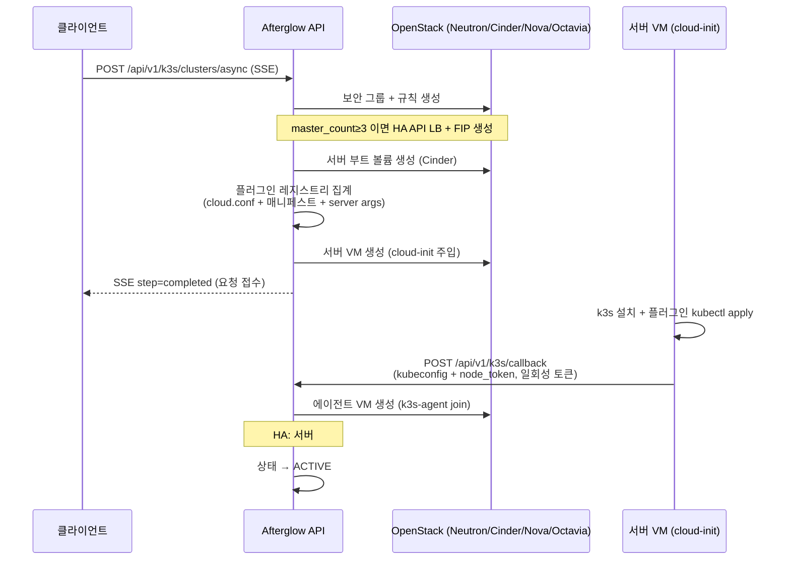

# k3s 클러스터 (k3s)

k3s 프로비저너는 **Magnum 없이** OpenStack Nova VM + cloud-init 만으로 k3s(경량 Kubernetes)를 직접 설치·운영하는 서브시스템입니다. 클러스터 생성/삭제/스케일, kubeconfig 다운로드, HA(embedded-etcd) 부트스트랩, 인증서 회전, 노드그룹, Stampede 오토스케일, Cloud Provider OpenStack 플러그인 배포를 담당합니다.

클러스터 내부 Kubernetes 리소스(Pod/Deployment/ConfigMap/Secret/Cloud Shell 등)를 조회·조작하는 프록시성 API는 별도 문서 [k3s 리소스 관리](k3s-resources.md)를 참고하세요.

> **활성화 조건:** `afterglow.conf [services] k3s = true`
> 비활성화 상태에서는 라우터가 마운트되지 않아 `404` 가 반환됩니다.

---

## 기본 정보

| 항목 | 값 |
|------|-----|
| 기본 경로 | `/api/v1/k3s/clusters` |
| 템플릿 경로 | `/api/v1/k3s/cluster-templates` |
| 콜백 경로 | `/api/v1/k3s/callback` (레거시 `/api/k3s/callback` dual-mount) |
| 인증 | 콜백을 제외한 모든 엔드포인트에 `Authorization: Bearer <access_token>` 헤더 필요 (`X-Project-Id`는 선택) |
| 소유권 | 모든 클러스터 접근은 `cluster.project_id == 토큰 project_id` 검증. 불일치 시 `404` |
| Tags | `k3s`, `k3s-health`, `k3s-callback`, `k3s-templates`, `k3s-nodegroups`, `k3s-certificates` 등 |

> 모든 경로는 `/api/v1` 단독 마운트입니다. 예외적으로 `POST /callback` 만 cloud-init baked VM 호환을 위해 레거시 `/api/k3s/callback` 를 함께 유지합니다(신규 레거시 추가 금지).

---

## 클러스터 상태 흐름

```
CREATING → PROVISIONING → ACTIVE → DELETING → DELETED (soft-delete)
                            ↓
                          ERROR
```

| 상태 | 설명 |
|------|------|
| `CREATING` | 보안그룹·볼륨·서버 VM 생성 중, 콜백 대기 전 |
| `PROVISIONING` | 서버 VM이 콜백 완료, 에이전트 VM(또는 HA 서버) 프로비저닝 중 |
| `ACTIVE` | 정상 운영 중. scale·shell·cert-rotate 가능 |
| `SCALING` | 에이전트 수 변경 백그라운드 진행 중 |
| `ERROR` | 서버 초기화/콜백 실패 (`status_reason` 참고) |
| `DELETING` | 삭제 진행 중 |
| `DELETED` | soft-delete 완료. `include_deleted=true` 로 이력 조회 가능 |

---

## 클러스터 생성 플로우

`POST /async` 는 리소스를 순차 생성하며 SSE 로 진행률을 스트리밍하고, 서버 VM 내부의 cloud-init 이 `/callback` 으로 결과를 회신하면 백그라운드에서 에이전트를 프로비저닝합니다.



### SSE 생성 단계 (`K3sProgressStep`)

각 이벤트는 `data: {JSON}` 형식이며 `K3sProgressMessage`(`step`, `progress` 0~100, `message`, `cluster_id?`, `error?`, `elapsed_seconds?`) 구조입니다.

| step | 설명 |
|------|------|
| `security_group` | 보안 그룹 및 규칙 생성 |
| `server_ha_bootstrap` | (HA 전용) API LoadBalancer + Floating IP 준비 |
| `server_volume` | 서버 부트 볼륨 생성 |
| `server_creating` | App Credential/KEK 발급, cloud-init 생성, 서버 VM 생성 |
| `waiting_callback` | 클러스터 레코드 저장, 서버 VM의 k3s 설치 콜백 대기 |
| `completed` | 생성 요청 접수 완료 (`cluster_id` 포함) |
| `failed` | 실패. `progress=0`, `error` 포함, 생성된 리소스 역순 롤백 |

실패 이벤트 예시:

```
data: {"step": "failed", "progress": 0, "message": "클러스터 생성 실패: ...", "error": "..."}
```

---

## Cloud Provider OpenStack 플러그인

k3s 클러스터는 플러그인 레지스트리(`backend/app/services/k3s_plugins/`)를 통해 OpenStack 서비스와 통합됩니다. 각 플러그인은 `afterglow.conf [k3s]` 섹션에서 독립적으로 활성화됩니다.

| 플러그인 | 설정 키 | 배포 리소스 | 용도 |
|---------|--------|-----------|------|
| **OCCM** | `occm_enabled` | DaemonSet + RBAC | 노드 초기화, Service LB (Octavia) |
| **Cinder CSI** | `cinder_csi_enabled` | StatefulSet + DaemonSet + CSIDriver | PVC → Cinder 블록 스토리지 |
| **Manila CSI** | `manila_csi_enabled` | StatefulSet + DaemonSet + NFS CSI | PVC → Manila NFS (ReadWriteMany) |
| **Octavia Ingress** | `octavia_ingress_enabled` | StatefulSet + IngressClass | Ingress → Octavia LB |
| **Keystone Auth** | `keystone_auth_enabled` | Deployment + Service (8443) | K8s 인증 → Keystone 토큰 |
| **Barbican KMS** | `barbican_kms_enabled` | DaemonSet (컨트롤 플레인) | K8s Secret at-rest 암호화 |

### 배포 메커니즘

클러스터 생성 시 레지스트리가 다음을 집계하여 cloud-init 에 주입합니다:

| 함수 | 결과물 |
|------|--------|
| `aggregate_cloud_conf()` | `/etc/kubernetes/cloud.conf` (OCCM + Cinder 공유 Secret) |
| `aggregate_manifests()` | `/opt/k3s/{plugin}-manifests.yaml` |
| `aggregate_server_args()` | k3s 설치 인자 (`--kube-apiserver-arg` 등) |

- **Octavia Ingress / Barbican KMS** 활성 시 클러스터별 Keystone App Credential 을 1회 발급하여, 노드 compromise 시 OpenStack admin 자격증명 노출을 방지합니다.
- **Barbican KMS** 활성 시 프로젝트별 KEK 를 Barbican 에서 조회/발급(per-project 공유)합니다.

콜백 스크립트가 플러그인을 순차 배포한 뒤 결과를 `plugin_status` 필드로 회신합니다:

```json
{ "plugin_status": { "occm": "deployed", "cinder_csi": "deployed", "manila_csi": "failed" } }
```

클러스터 삭제 시 OCCM/Ingress 가 생성한 orphan Octavia LB 를 `kube_service_{name}_` / `kube_ingress_{name}_` prefix 로 매칭하여 cascade 정리하며, VM 삭제 전 K8s 노드 오브젝트를 먼저 제거해 OCCM 무한 재시도를 방지합니다.

---

## 클러스터 CRUD

### `GET /api/v1/k3s/clusters`

현재 프로젝트의 클러스터 목록을 반환합니다.

| 쿼리 | 타입 | 기본 | 설명 |
|------|------|------|------|
| `include_deleted` | bool | `false` | soft-delete 된 클러스터 이력 포함 |

**응답 `200`** `K3sClusterInfo[]`

```json
[
  {
    "id": "cluster-uuid",
    "name": "my-cluster",
    "status": "ACTIVE",
    "server_vm_id": "nova-server-uuid",
    "agent_vm_ids": ["agent-vm-uuid-1"],
    "agent_count": 1,
    "api_address": "https://10.0.0.5:6443",
    "server_ip": "10.0.0.5",
    "network_id": "neutron-net-uuid",
    "k3s_version": "v1.31.4+k3s1",
    "occm_enabled": true,
    "plugins_enabled": {"occm": true, "cinder_csi": true},
    "master_count": 1,
    "stampede_enabled": false,
    "created_at": "2026-01-01T00:00:00"
  }
]
```

### `GET /api/v1/k3s/clusters/{cluster_id}`

단일 클러스터 상세를 반환합니다.

**응답 `200`** `K3sClusterInfo` · **오류** `404` 클러스터 없음

### `GET|HEAD /api/v1/k3s/clusters/{cluster_id}/kubeconfig`

kubeconfig YAML 을 다운로드하거나(`GET`) 존재 여부를 확인합니다(`HEAD`).

- **`GET` 호출은 매번 audit log 에 기록**됩니다(다운로드 시각 + source IP). 토큰 탈취 시 forensic 추적 목적.
- 아직 콜백을 받지 못한 클러스터는 kubeconfig 가 없으므로 `404`. `None` 결과는 캐시하지 않습니다.
- 파일 내 `server` 주소가 Floating IP 로 설정된 경우에만 외부에서 사용 가능합니다.

**응답 `200`** `application/yaml` (`Content-Disposition: attachment`) · **오류** `404` 미생성, `500` 복호화 실패

```bash
curl -H "Authorization: Bearer $TOKEN" -H "X-Project-Id: $PROJECT" \
     https://afterglow.example.com/api/v1/k3s/clusters/$CLUSTER_ID/kubeconfig \
     -o ~/.kube/afterglow-cluster.yaml
export KUBECONFIG=~/.kube/afterglow-cluster.yaml && kubectl get nodes
```

### `POST /api/v1/k3s/clusters/async`

SSE 스트림으로 클러스터를 비동기 생성합니다. **Rate limit: 5회/분.** OpenStack 스코프 연결(`get_os_conn`)에 의존합니다.

**요청 본문** `CreateK3sClusterRequest`

| 필드 | 타입 | 필수 | 설명 |
|------|------|------|------|
| `name` | string | — | 클러스터 이름. 영문/숫자로 시작, 영문·숫자·하이픈·언더스코어 (최대 63자). 미지정 시 `k3s-<hex8>` 자동 생성 |
| `agent_count` | int | — | 워커 노드 수. 기본 `1`, 범위 `0~10` |
| `agent_flavor_id` | string | — | 워커 플레이버. 미설정 시 관리자 `k3s.default_agent_flavor` 정책 |
| `network_id` | string | — | 생성 시 직접 연결할 외부 Provider 네트워크 ID. 미지정 시 관리자 외부 Provider 기본 네트워크 정책에 위임 |
| `key_name` | string | — | SSH 키페어 이름 |
| `os_type` | string | — | `ubuntu`(기본) 또는 `fcos`. `fcos` 는 `k3s_fcos_image_id` 설정 필요 |
| `allowed_cidrs` | string[] | — | SSH/API(22·6443) 접근 허용 CIDR. 미지정 시 `0.0.0.0/0`. **최대 20개**, 유효 CIDR 검증 |
| `template_id` | string | — | 클러스터 템플릿. 지정 시 기본값 병합(본문 명시값 우선) |
| `master_count` | int | — | `1`(단일) 또는 `3`(embedded-etcd HA). 그 외 값은 `422` |
| `stampede_enabled` | bool | — | Stampede 오토스케일 모드(개발 단계, 기본 `false`) |

Drover 생성 화면은 `is_external` 네트워크만 선택지로 보여줍니다. **관리자 외부 Provider 기본 네트워크 사용**을 선택하면 `network_id`를 요청에서 생략하고, 외부 Provider 네트워크를 직접 선택하면 해당 ID를 전송합니다. 초기 클러스터 노드는 이 Provider 네트워크에 직접 연결됩니다. 내부 네트워크는 생성 시 선택하지 않으며, 필요한 경우 생성 후 아래 노드 인터페이스 API로 별도 NIC를 추가합니다.

> 서버 이미지/플레이버, 에이전트 플레이버(`agent_count>0`), FCOS 이미지 미설정 시 `503` 을 반환합니다.

**응답 `200`** `text/event-stream` — 위 [SSE 생성 단계](#sse-생성-단계-k3sprogressstep) 참고.

### `PATCH /api/v1/k3s/clusters/{cluster_id}/scale`

에이전트(워커) 노드 수를 조정합니다. **Rate limit: 10회/분.** 현재 `ACTIVE` 상태에서만 허용됩니다.

**요청 본문** `ScaleK3sClusterRequest` — `{ "agent_count": 3 }` (범위 `0~10`)

상태를 `SCALING` 으로 바꾸고 즉시 ack 를 반환한 뒤, 실제 VM 증감은 백그라운드 태스크로 처리됩니다.

**응답 `200`** (즉시 ack)

```json
{ "message": "스케일링 시작: 1 → 3", "agent_count": 3 }
```

**오류** `404` 클러스터 없음 · `409` ACTIVE 상태 아님

### `DELETE /api/v1/k3s/clusters/{cluster_id}`

클러스터를 삭제합니다. **Rate limit: 5회/분.** API LB/FIP → App Credential → K8s 노드 → 에이전트 VM → 서버 VM → 보안 그룹 순으로 정리한 뒤 DB 레코드를 soft-delete 합니다.

**응답 `204`** No Content · **오류** `404` 클러스터 없음. 이미 삭제된 클러스터는 `204` 로 무시.

### `POST /api/v1/k3s/clusters/{cluster_id}/delete-async`

`DELETE` 와 동일한 정리 절차를 SSE 로 스트리밍합니다. **Rate limit: 5회/분.**

**응답 `200`** `text/event-stream` — 삭제 단계(`delete_init`, `delete_lb_cleanup`, `delete_app_credential`, `delete_k8s_nodes`, `delete_agent_vms`, `delete_server_vm`, `delete_security_group`, `delete_record`, `completed`) 를 순차 방출.

---

## 노드 네트워크 인터페이스

서버/에이전트 VM 에 추가 Neutron 포트를 attach/detach 합니다. `vm_id` 가 해당 클러스터 소속이 아니면 `403`.

내부 네트워크 NIC는 클러스터 생성 이후 노드별 추가 연결로 구성합니다. 생성 화면의 초기 Provider 네트워크 선택을 대체하지 않습니다.

| 메서드 | 경로 | 설명 |
|--------|------|------|
| `GET` | `/{cluster_id}/nodes/{vm_id}/interfaces` | 노드 인터페이스 목록 (`K3sInterfaceInfo[]`) |
| `POST` | `/{cluster_id}/nodes/{vm_id}/interfaces` | 인터페이스 attach (`201`, 본문 `{ "net_id": "..." }`) |
| `DELETE` | `/{cluster_id}/nodes/{vm_id}/interfaces/{port_id}` | 인터페이스 detach (`204`) |

---

## Stampede 오토스케일

클러스터 단위 오토스케일 모드를 제어합니다. 서버 전역 설정 `afterglow.conf [k3s] stampede_enabled` 가 꺼져 있으면 enable 시 `400`.

| 메서드 | 경로 | 설명 |
|--------|------|------|
| `POST` | `/{cluster_id}/stampede/enable` | Stampede 활성화 (`200`) |
| `POST` | `/{cluster_id}/stampede/disable` | Stampede 비활성화 (`200`) |
| `GET` | `/{cluster_id}/stampede` | 클러스터·노드그룹별 Stampede 상태 (in-flight, capacity, quota 등) |
| `GET` | `/{cluster_id}/stampede/events` | 스케일 이벤트 이력 (최신순, `limit` 1~200 기본 50) |

---

## 헬스 체크

워커 파드가 Redis 에 저장한 헬스 결과를 반환하거나, 즉시 프로빙을 트리거합니다.

### `GET /api/v1/k3s/clusters/{cluster_id}/health`

단일 클러스터의 최신 헬스 상태를 반환합니다(Redis 캐시).

**응답 `200`** `K3sClusterHealth` · **오류** `404` 클러스터 없음 또는 헬스 데이터 미수집

```json
{
  "cluster_id": "uuid",
  "cluster_name": "my-cluster",
  "status": "HEALTHY",
  "api_server_reachable": true,
  "healthz_ok": true,
  "nodes": [
    {"name": "my-cluster-server", "role": "server", "ready": true, "conditions": ["Ready"], "kubelet_version": "v1.31.4+k3s1"}
  ],
  "checked_at": "2026-01-01T00:10:00",
  "reachability": "direct"
}
```

**헬스 상태값:** `HEALTHY`(모든 노드 Ready) · `DEGRADED`(일부 불량) · `UNHEALTHY`(다수 불량) · `UNREACHABLE`(API 접근 불가) · `UNKNOWN`(데이터 없음)

### `POST /api/v1/k3s/clusters/{cluster_id}/health/check`

워커 주기를 기다리지 않고 즉시 헬스 체크를 트리거합니다. **Rate limit: 3회/분.**

**응답 `200`** `K3sClusterHealth` · **오류** `404` 클러스터 없음, `500` 체크 실패

---

## 클러스터 템플릿

기본 경로 `/api/v1/k3s/cluster-templates`. 생성 시 `template_id` 로 참조하여 폼 기본값을 채웁니다. 조회는 사용자용(public 또는 본인 생성), 변경은 **admin 전용**입니다.

| 메서드 | 경로 | 인가 | 설명 |
|--------|------|------|------|
| `GET` | `/api/v1/k3s/cluster-templates` | 사용자 | 템플릿 목록 (public + 본인 생성) |
| `GET` | `/api/v1/k3s/cluster-templates/{template_id}` | 사용자 | 단건 조회 (비공개+타인 소유는 `404`) |
| `POST` | `/api/v1/k3s/cluster-templates` | **admin** | 템플릿 생성 (`201`) |
| `PATCH` | `/api/v1/k3s/cluster-templates/{template_id}` | **admin** | 템플릿 수정 |
| `DELETE` | `/api/v1/k3s/cluster-templates/{template_id}` | **admin** | 템플릿 삭제 (soft-delete, `204`) |

`CreateK3sClusterTemplateRequest` 주요 필드: `name`(필수, 이름 규칙 동일), `k3s_version`, `default_node_count`(0~20), `default_agent_flavor_id`, `default_image_id`, `plugins_enabled`, `os_type`(`ubuntu`/`fcos`), `public_visible`.

---

## 노드그룹

기본 경로 `/api/v1/k3s/clusters/{cluster_id}/nodegroups`. 클러스터를 여러 워커 그룹으로 나눠 플레이버·라벨·테인트·오토스케일을 개별 관리합니다.

| 메서드 | 경로 | 설명 |
|--------|------|------|
| `GET` | `/{cluster_id}/nodegroups` | 노드그룹 목록 |
| `GET` | `/{cluster_id}/nodegroups/{nodegroup_id}` | 단건 조회 |
| `POST` | `/{cluster_id}/nodegroups` | 생성 (`201`). `role=agent` 이고 `node_count>0` 이면 VM 프로비저닝 시작 |
| `PATCH` | `/{cluster_id}/nodegroups/{nodegroup_id}` | 수정. `node_count` 변경 시 VM 증감 |
| `DELETE` | `/{cluster_id}/nodegroups/{nodegroup_id}` | 삭제 (soft-delete, `204`). 기본 그룹은 삭제 불가 |

**입력 검증 (명령주입 방어):**

- `role` 은 `agent` 만 허용 — 커스텀 `server` 노드그룹은 미지원 (`422`). `server` 그룹의 `node_count` 변경도 `422`.
- `labels` 키/값, `taints` 키/값/effect 는 K8s 명명 규칙 정규식으로 화이트리스트 검증(쉘 메타문자 차단). `effect` 는 `NoSchedule`/`PreferNoSchedule`/`NoExecute` 만 허용. 위반 시 `422`.
- `stampede_enabled=true` 는 `flavor_id` 필수, `min_size ≤ max_size`.

---

## 인증서

기본 경로 `/api/v1/k3s/clusters/{cluster_id}`. kubeconfig 접근 권한(= 클러스터 소유권)이 확인되어야 합니다.

### `GET /{cluster_id}/ca-certificate`

CA 인증서 PEM 을 다운로드합니다.

**응답 `200`** `application/x-pem-file` (attachment) · **오류** `404` 클러스터/kubeconfig 없음, `500` 추출 실패

### `GET /{cluster_id}/certificate-expiry`

CA·클라이언트·서버 TLS 인증서 만료 정보를 반환합니다(1시간 캐시).

**응답 `200`** `CertificateExpiryResponse` (`ca`, `client`, `server_via_tls[]` 각각 `not_after`/`not_before`/`subject`/`issuer`/`days_remaining`)

### `POST /{cluster_id}/rotate-certs`

control-plane 노드에 K8s Job 을 생성해 `systemctl restart k3s` 를 순차 실행, 만료 90일 이내 인증서를 갱신합니다(SSE 스트림).

- **HA(`master_count ≥ 3`) 클러스터에서만 지원.** 단일 마스터는 재시작 중 API 다운타임이 발생하므로 `422`.
- 클러스터가 `ACTIVE`/`ERROR` 상태가 아니면 `409`.
- Redis 분산 락으로 동시 회전을 방지 — 이미 진행 중이면 `409`.

**응답 `200`** `text/event-stream` (`rotate_discover`/`rotate_server`/`rotate_agent`/`rotate_verify` 단계)

---

## 콜백 (서버 VM → 서버)

### `POST /api/v1/k3s/callback`

서버 VM 의 cloud-init 이 kubeconfig + node_token 을 회신하는 엔드포인트입니다. **인증 헤더 불필요** — 대신 클러스터 생성 시 발급한 **일회성 콜백 토큰**으로 인증하고, source IP 를 audit 목적으로 로깅합니다. **Rate limit: 10회/분.**

> **레거시 dual-mount:** cloud-init 에 baked 된 기존 VM 호환을 위해 `POST /api/k3s/callback`(prefix 없는 레거시) 도 동일하게 동작합니다. 이 두 경로는 baked 계약이므로 제거하지 않습니다.

- 단일 마스터: 토큰 소비 후 에이전트 VM 프로비저닝을 백그라운드 스폰.
- HA 서버#1: 서버#2/#3 부트스트랩 스폰. 서버#2/#3(`server_index ≥ 2`): LB 멤버 추가 + 조인 카운터 증가, 전원 조인 완료 시 에이전트 프로비저닝.
- 유효하지 않거나 만료된 토큰은 `403 Forbidden`.

**요청 본문** `K3sCallbackRequest`: `token`(8~128자, 필수), `success`(필수), `kubeconfig`(≤64KB), `node_token`(≤512자, 메타문자 화이트리스트 검증), `server_ip`(IP 형식 검증), `error`, `plugin_status`, `secret_cloud_config_status`.

**응답 `200`** `{ "ok": true }`

---

## 스키마 요약

### `K3sClusterInfo`

| 필드 | 타입 | 설명 |
|------|------|------|
| `id` | string | 클러스터 UUID |
| `name` | string | 클러스터 이름 |
| `status` | string | `CREATING`/`PROVISIONING`/`ACTIVE`/`SCALING`/`ERROR`/`DELETING`/`DELETED` |
| `status_reason` | string? | 오류/상태 사유 |
| `server_vm_id` | string? | 마스터 노드 Nova VM UUID |
| `agent_vm_ids` | string[] | 워커 노드 VM UUID 목록 |
| `agent_count` | int | 현재 워커 노드 수 |
| `api_address` | string? | Kubernetes API 주소 (`https://IP:6443`) |
| `server_ip` | string? | 마스터 노드 IP |
| `network_id` | string? | 연결된 Neutron 네트워크 |
| `key_name` | string? | SSH 키페어 이름 |
| `k3s_version` | string? | 설치된 k3s 버전 |
| `occm_enabled` | bool | OCCM 활성 여부 |
| `plugins_enabled` | object | 플러그인 활성 맵 (`{"occm": true, ...}`) |
| `master_count` | int | 마스터 수 (1 또는 3) |
| `stampede_enabled` | bool | Stampede 오토스케일 활성 여부 |
| `api_lb_id` / `api_fip_id` / `api_fip_address` | string? | HA API LoadBalancer / Floating IP |
| `created_at` / `updated_at` / `deleted_at` | string? | ISO 8601 타임스탬프 |
| `health_status` | string? | 최근 헬스체크 결과 |

### `K3sClusterHealth`

| 필드 | 타입 | 설명 |
|------|------|------|
| `cluster_id` / `cluster_name` | string | 클러스터 식별 |
| `status` | string | `HEALTHY`/`DEGRADED`/`UNHEALTHY`/`UNREACHABLE`/`UNKNOWN` |
| `api_server_reachable` | bool | API 서버 도달 가능 |
| `healthz_ok` | bool | `/healthz` 정상 |
| `nodes` | `K3sNodeHealth[]` | 노드별 `name`/`role`/`ready`/`conditions`/`kubelet_version` |
| `checked_at` | string | 체크 시각 |
| `reachability` | string | `direct` / `unreachable` |
