# `backend/app/models` 클래스 다이어그램

**대상 경로:** `backend/app/models`

## 책임
`backend/app/models`의 책임은 <<class>>, <<enumeration>>, <<orm>>, <<pydantic>>으로 표현되는 운영 타입 계약을 정의하는 것이다.
이 문서는 187개 source type과 62개 정적 관계를 8개 Mermaid class diagram으로 나누어 보여준다.

## 포함 파일
- `backend/app/models/activity.py`
- `backend/app/models/auth.py`
- `backend/app/models/barbican.py`
- `backend/app/models/compute.py`
- `backend/app/models/containers.py`
- `backend/app/models/database.py`
- `backend/app/models/db.py`
- `backend/app/models/instance_health.py`
- `backend/app/models/k3s.py`
- `backend/app/models/k3s_health.py`
- `backend/app/models/orphans.py`
- `backend/app/models/progress.py`
- `backend/app/models/storage.py`
- `backend/app/models/union.py`
- `backend/app/models/worker_runtime.py`

## 다이어그램 1 — `backend/app/models/activity.py::ActivityLog` … `backend/app/models/compute.py::AttachVolumeRequest`

```mermaid
classDiagram
%% source-type: backend/app/models/activity.py::ActivityLog
class T_backend_app_models_activity_py_ActivityLog_5d9b7c1caed3["ActivityLog (backend/app/models/activity.py)"] {
  <<orm>>
  +id: Mapped~int~
  +created_at: Mapped~datetime~
  +project_id: Mapped~str~
  +user_id: Mapped~str~
  +username: Mapped~str~
  +resource_type: Mapped~str~
  +resource_id: Mapped~str | None~
  +resource_name: Mapped~str | None~
  +action: Mapped~str~
  +status: Mapped~str~
  +error_message: Mapped~str | None~
  +extra: Mapped~dict | None~
}
%% source-type: backend/app/models/auth.py::LoginRequest
class T_backend_app_models_auth_py_LoginRequest_13a4b67acd90["LoginRequest (backend/app/models/auth.py)"] {
  <<pydantic>>
  +username: str
  +password: str
  +project_name: str
  +domain_name: str
}
%% source-type: backend/app/models/auth.py::TokenResponse
class T_backend_app_models_auth_py_TokenResponse_2f6110f63d02["TokenResponse (backend/app/models/auth.py)"] {
  <<pydantic>>
  +token: str
  +refresh_token: str | None
  +project_id: str
  +project_name: str
  +user_id: str
  +username: str
  +expires_at: str
  +roles: list~str~
  +default_project_id: str
  +is_system_admin: bool
  +auth_method: str
}
%% source-type: backend/app/models/auth.py::UserInfo
class T_backend_app_models_auth_py_UserInfo_ced21f5b3c7f["UserInfo (backend/app/models/auth.py)"] {
  <<pydantic>>
  +user_id: str
  +username: str
  +project_id: str
  +project_name: str
  +roles: list~str~
  +is_system_admin: bool
  +auth_method: str
}
%% source-type: backend/app/models/auth.py::ProjectInfo
class T_backend_app_models_auth_py_ProjectInfo_77a798609c45["ProjectInfo (backend/app/models/auth.py)"] {
  <<pydantic>>
  +id: str
  +name: str
  +description: str
  +domain_id: str | None
  +domain_name: str | None
  +enabled: bool
  +last_accessed_at: str | None
}
%% source-type: backend/app/models/auth.py::GitLabCallbackRequest
class T_backend_app_models_auth_py_GitLabCallbackRequest_107ddc30f024["GitLabCallbackRequest (backend/app/models/auth.py)"] {
  <<pydantic>>
  +code: str
  +state: str
}
%% source-type: backend/app/models/barbican.py::SecretInfo
class T_backend_app_models_barbican_py_SecretInfo_0f996456f9af["SecretInfo (backend/app/models/barbican.py)"] {
  <<pydantic>>
  +id: str
  +name: str | None
  +secret_type: str
  +status: str | None
  +algorithm: str | None
  +bit_length: int | None
  +mode: str | None
  +created: str | None
  +expires: str | None
  +content_types: dict | None
  +system_managed: bool
}
%% source-type: backend/app/models/barbican.py::SecretCreateRequest
class T_backend_app_models_barbican_py_SecretCreateRequest_7c31092cdfd8["SecretCreateRequest (backend/app/models/barbican.py)"] {
  <<pydantic>>
  +name: str
  +secret_type: str
  +payload: str | None
  +payload_content_type: str
  +algorithm: str | None
  +bit_length: int | None
  +mode: str | None
  +expiration: str | None
}
%% source-type: backend/app/models/barbican.py::ContainerInfo
class T_backend_app_models_barbican_py_ContainerInfo_80c4b3fbca4b["ContainerInfo (backend/app/models/barbican.py)"] {
  <<pydantic>>
  +id: str
  +name: str | None
  +type: str
  +status: str | None
  +created: str | None
  +secret_refs: list~dict~
}
%% source-type: backend/app/models/barbican.py::ContainerCreateRequest
class T_backend_app_models_barbican_py_ContainerCreateRequest_94a191a1f913["ContainerCreateRequest (backend/app/models/barbican.py)"] {
  <<pydantic>>
  +name: str
  +container_type: str
  +secret_refs: list~dict~
}
%% source-type: backend/app/models/barbican.py::OrderInfo
class T_backend_app_models_barbican_py_OrderInfo_1c68edbda31b["OrderInfo (backend/app/models/barbican.py)"] {
  <<pydantic>>
  +id: str
  +type: str
  +status: str | None
  +created: str | None
  +secret_ref: str | None
  +container_ref: str | None
  +meta: dict
  +error_reason: str | None
}
%% source-type: backend/app/models/barbican.py::OrderCreateRequest
class T_backend_app_models_barbican_py_OrderCreateRequest_d4baaffc78bc["OrderCreateRequest (backend/app/models/barbican.py)"] {
  <<pydantic>>
  +order_type: str
  +meta: dict~str; Any~
}
%% source-type: backend/app/models/barbican.py::AclSetRequest
class T_backend_app_models_barbican_py_AclSetRequest_a88379932e9e["AclSetRequest (backend/app/models/barbican.py)"] {
  <<pydantic>>
  +users: list~str~
  +project_access: bool
}
%% source-type: backend/app/models/barbican.py::QuotaInfo
class T_backend_app_models_barbican_py_QuotaInfo_e9954cd7f9d4["QuotaInfo (backend/app/models/barbican.py)"] {
  <<pydantic>>
  +secrets: int
  +orders: int
  +containers: int
  +consumers: int
  +cas: int
}
%% source-type: backend/app/models/barbican.py::ProjectQuotaSetRequest
class T_backend_app_models_barbican_py_ProjectQuotaSetRequest_34ebeb06f197["ProjectQuotaSetRequest (backend/app/models/barbican.py)"] {
  <<pydantic>>
  +secrets: int | None
  +orders: int | None
  +containers: int | None
  +consumers: int | None
  +cas: int | None
}
%% source-type: backend/app/models/compute.py::IpAddress
class T_backend_app_models_compute_py_IpAddress_c6225a7780ba["IpAddress (backend/app/models/compute.py)"] {
  <<pydantic>>
  +addr: str
  +type: str
  +network_name: str
}
%% source-type: backend/app/models/compute.py::ImageInfo
class T_backend_app_models_compute_py_ImageInfo_f4ef21fcafe6["ImageInfo (backend/app/models/compute.py)"] {
  <<pydantic>>
  +id: str
  +name: str
  +status: str
  +size: int | None
  +min_disk: int
  +min_ram: int
  +disk_format: str | None
  +os_type: str | None
  +os_distro: str | None
  +created_at: str | None
  +owner: str | None
  +visibility: str | None
}
%% source-type: backend/app/models/compute.py::ImageDetail
class T_backend_app_models_compute_py_ImageDetail_ea5f855e9b72["ImageDetail (backend/app/models/compute.py)"] {
  <<class>>
  +checksum: str | None
  +container_format: str | None
  +virtual_size: int | None
  +updated_at: str | None
  +protected: bool
  +tags: list~str~
  +properties: dict
  +os_hash_algo: str | None
  +os_hash_value: str | None
  +direct_url: str | None
}
%% source-type: backend/app/models/compute.py::FlavorInfo
class T_backend_app_models_compute_py_FlavorInfo_19e7eb85709c["FlavorInfo (backend/app/models/compute.py)"] {
  <<pydantic>>
  +id: str
  +name: str
  +vcpus: int
  +ram: int
  +disk: int
  +is_public: bool
  +extra_specs: dict
  +is_gpu(): bool
  +gpu_count(): int
}
%% source-type: backend/app/models/compute.py::InstanceInfo
class T_backend_app_models_compute_py_InstanceInfo_489486f39f8f["InstanceInfo (backend/app/models/compute.py)"] {
  <<pydantic>>
  +id: str
  +name: str
  +status: str
  +image_id: str | None
  +image_name: str | None
  +flavor_id: str | None
  +flavor_name: str | None
  +ip_addresses: list~IpAddress~
  +created_at: str | None
  +union_upper_volume_id: str | None
  +user_id: str | None
  +project_id: str | None
}
%% source-type: backend/app/models/compute.py::CreateInstanceRequest
class T_backend_app_models_compute_py_CreateInstanceRequest_4fa280f73382["CreateInstanceRequest (backend/app/models/compute.py)"] {
  <<pydantic>>
  +name: str | None
  +image_id: str | None
  +flavor_id: str
  +strategy: str | None
  +network_id: str | None
  +key_name: str | None
  +admin_pass: str | None
  +availability_zone: str | None
  +userdata: str | None
  +boot_volume_size_gb: int | None
  +existing_upper_volume_id: str | None
  +boot_volume_id: str | None
  +validate_boot_source(): CreateInstanceRequest
  +validate_name(v: str | None): str | None
}
%% source-type: backend/app/models/compute.py::NewVolumeRequest
class T_backend_app_models_compute_py_NewVolumeRequest_0effbda4c806["NewVolumeRequest (backend/app/models/compute.py)"] {
  <<pydantic>>
  +name: str
  +size_gb: int
  +validate_name(v: str): str
  +validate_size(v: int): int
}
%% source-type: backend/app/models/compute.py::DataMountSpec
class T_backend_app_models_compute_py_DataMountSpec_68e21c89f900["DataMountSpec (backend/app/models/compute.py)"] {
  <<pydantic>>
  +file_storage_id: str
  +mount_point: str
  +read_only: bool
  +validate_mount_point(v: str): str
}
%% source-type: backend/app/models/compute.py::StorageAttachRequest
class T_backend_app_models_compute_py_StorageAttachRequest_46bbb36cc25b["StorageAttachRequest (backend/app/models/compute.py)"] {
  <<pydantic>>
  +file_storage_id: str
  +mount_point: str
  +read_only: bool
  +validate_mount_point(v: str): str
}
%% source-type: backend/app/models/compute.py::AttachVolumeRequest
class T_backend_app_models_compute_py_AttachVolumeRequest_7d5d46127ac5["AttachVolumeRequest (backend/app/models/compute.py)"] {
  <<pydantic>>
  +volume_id: str
}
T_backend_app_models_compute_py_ImageInfo_f4ef21fcafe6 <|-- T_backend_app_models_compute_py_ImageDetail_ea5f855e9b72 : inherits
T_backend_app_models_compute_py_InstanceInfo_489486f39f8f --> T_backend_app_models_compute_py_IpAddress_c6225a7780ba : associates
T_backend_app_models_compute_py_CreateInstanceRequest_4fa280f73382 --> T_backend_app_models_compute_py_DataMountSpec_68e21c89f900 : associates
T_backend_app_models_compute_py_CreateInstanceRequest_4fa280f73382 --> T_backend_app_models_compute_py_NewVolumeRequest_0effbda4c806 : associates
```

### 관계 설명
- `backend/app/models/compute.py::ImageInfo <|-- backend/app/models/compute.py::ImageDetail` — 근거: `backend/app/models/compute.py::ImageDetail.__bases__`; 관계: `inherits`.
- `backend/app/models/compute.py::InstanceInfo --> backend/app/models/compute.py::IpAddress` — 근거: `backend/app/models/compute.py::InstanceInfo.ip_addresses`; 관계: `associates`.
- `backend/app/models/compute.py::CreateInstanceRequest --> backend/app/models/compute.py::DataMountSpec` — 근거: `backend/app/models/compute.py::CreateInstanceRequest.data_mounts`; 관계: `associates`.
- `backend/app/models/compute.py::CreateInstanceRequest --> backend/app/models/compute.py::NewVolumeRequest` — 근거: `backend/app/models/compute.py::CreateInstanceRequest.new_volumes`; 관계: `associates`.

## 다이어그램 2 — `backend/app/models/compute.py::UpdateVolumeAttachmentRequest` … `backend/app/models/db.py::K3sNodegroup`

```mermaid
classDiagram
%% source-type: backend/app/models/compute.py::UpdateVolumeAttachmentRequest
class T_backend_app_models_compute_py_UpdateVolumeAttachmentRequest_5adf81cd9e07["UpdateVolumeAttachmentRequest (backend/app/models/compute.py)"] {
  <<pydantic>>
  +delete_on_termination: bool
}
%% source-type: backend/app/models/compute.py::AttachInterfaceRequest
class T_backend_app_models_compute_py_AttachInterfaceRequest_44873b1fcfe9["AttachInterfaceRequest (backend/app/models/compute.py)"] {
  <<pydantic>>
  +net_id: str
}
%% source-type: backend/app/models/compute.py::UpdateSecurityGroupsRequest
class T_backend_app_models_compute_py_UpdateSecurityGroupsRequest_1cf8f226f1c7["UpdateSecurityGroupsRequest (backend/app/models/compute.py)"] {
  <<pydantic>>
  +security_group_ids: list~str~
}
%% source-type: backend/app/models/compute.py::AdminPasswordRequest
class T_backend_app_models_compute_py_AdminPasswordRequest_56fdbfe90916["AdminPasswordRequest (backend/app/models/compute.py)"] {
  <<pydantic>>
  +new_password: str
}
%% source-type: backend/app/models/compute.py::AdminPasswordPrecheck
class T_backend_app_models_compute_py_AdminPasswordPrecheck_448131954d4d["AdminPasswordPrecheck (backend/app/models/compute.py)"] {
  <<pydantic>>
  +supported: bool
  +reason: str | None
  +os_admin_user: str | None
  +server_status: str
}
%% source-type: backend/app/models/containers.py::ClusterTemplateInfo
class T_backend_app_models_containers_py_ClusterTemplateInfo_333e2f33b021["ClusterTemplateInfo (backend/app/models/containers.py)"] {
  <<pydantic>>
  +id: str
  +name: str
  +coe: str
  +image_id: str | None
  +flavor_id: str | None
  +master_flavor_id: str | None
  +network_driver: str | None
  +public: bool
  +hidden: bool
  +created_at: str | None
}
%% source-type: backend/app/models/containers.py::ClusterInfo
class T_backend_app_models_containers_py_ClusterInfo_e49919e8c77e["ClusterInfo (backend/app/models/containers.py)"] {
  <<pydantic>>
  +id: str
  +name: str
  +status: str
  +status_reason: str | None
  +cluster_template_id: str | None
  +api_address: str | None
  +coe_version: str | None
  +keypair: str | None
  +create_timeout: int | None
  +created_at: str | None
  +updated_at: str | None
  +stack_id: str | None
}
%% source-type: backend/app/models/containers.py::CreateClusterRequest
class T_backend_app_models_containers_py_CreateClusterRequest_8a81cb6928f9["CreateClusterRequest (backend/app/models/containers.py)"] {
  <<pydantic>>
  +name: str
  +cluster_template_id: str
  +node_count: int
  +master_count: int
  +keypair: str | None
  +create_timeout: int | None
  +validate_name(v: str): str
}
%% source-type: backend/app/models/containers.py::ZunContainerInfo
class T_backend_app_models_containers_py_ZunContainerInfo_c549f3bc52de["ZunContainerInfo (backend/app/models/containers.py)"] {
  <<pydantic>>
  +uuid: str
  +name: str
  +status: str
  +status_reason: str | None
  +image: str | None
  +command: str | None
  +cpu: float | None
  +memory: str | None
  +created_at: str | None
  +addresses: dict | None
  +host: str | None
}
%% source-type: backend/app/models/containers.py::PortMapping
class T_backend_app_models_containers_py_PortMapping_fe94caeaa4c3["PortMapping (backend/app/models/containers.py)"] {
  <<pydantic>>
  +container_port: int
  +host_port: int | None
  +protocol: str
}
%% source-type: backend/app/models/containers.py::CreateZunContainerRequest
class T_backend_app_models_containers_py_CreateZunContainerRequest_a0c793c984d3["CreateZunContainerRequest (backend/app/models/containers.py)"] {
  <<pydantic>>
  +name: str
  +image: str
  +command: str | None
  +cpu: float | None
  +memory: str | None
  +environment: dict~str; str~ | None
  +ports: list~PortMapping~ | None
  +auto_remove: bool
  +validate_name(v: str): str
}
%% source-type: backend/app/models/containers.py::ContainerListResponse
class T_backend_app_models_containers_py_ContainerListResponse_dc05218cfdf1["ContainerListResponse (backend/app/models/containers.py)"] {
  <<pydantic>>
  +items: list~ZunContainerInfo~
  +service_available: bool
  +message: str
}
%% source-type: backend/app/models/containers.py::StackResourceInfo
class T_backend_app_models_containers_py_StackResourceInfo_12a39aaa3edf["StackResourceInfo (backend/app/models/containers.py)"] {
  <<pydantic>>
  +resource_name: str
  +resource_type: str
  +physical_resource_id: str
  +resource_status: str
  +resource_status_reason: str | None
  +created_at: str | None
}
%% source-type: backend/app/models/containers.py::StackEventInfo
class T_backend_app_models_containers_py_StackEventInfo_c7bee96e5a96["StackEventInfo (backend/app/models/containers.py)"] {
  <<pydantic>>
  +resource_name: str
  +resource_status: str
  +resource_status_reason: str | None
  +event_time: str
  +logical_resource_id: str | None
  +physical_resource_id: str | None
}
%% source-type: backend/app/models/database.py::DbUserSpec
class T_backend_app_models_database_py_DbUserSpec_6647f2e48ced["DbUserSpec (backend/app/models/database.py)"] {
  <<pydantic>>
  +name: str
  +password: str
  +host: str
  +databases: list~str~
}
%% source-type: backend/app/models/database.py::CreateDbInstanceRequest
class T_backend_app_models_database_py_CreateDbInstanceRequest_202a9c901266["CreateDbInstanceRequest (backend/app/models/database.py)"] {
  <<pydantic>>
  +name: str
  +flavor_id: str
  +volume_size: int
  +datastore_type: str
  +restore_backup_id: str | None
  +availability_zone: str | None
  +volume_type: str | None
  +locality: str | None
  +users: list~DbUserSpec~
  +configuration_id: str | None
  +replica_of: str | None
  +replica_count: int | None
}
%% source-type: backend/app/models/database.py::CreateDatabaseRequest
class T_backend_app_models_database_py_CreateDatabaseRequest_498208366049["CreateDatabaseRequest (backend/app/models/database.py)"] {
  <<pydantic>>
  +name: str
  +character_set: str | None
  +collate: str | None
}
%% source-type: backend/app/models/database.py::CreateUserRequest
class T_backend_app_models_database_py_CreateUserRequest_b973a4a9030e["CreateUserRequest (backend/app/models/database.py)"] {
  <<pydantic>>
  +name: str
  +password: str
  +host: str
  +databases: list~str~
}
%% source-type: backend/app/models/database.py::CreateBackupRequest
class T_backend_app_models_database_py_CreateBackupRequest_8d0813196459["CreateBackupRequest (backend/app/models/database.py)"] {
  <<pydantic>>
  +name: str
  +description: str
}
%% source-type: backend/app/models/database.py::RestoreFromBackupRequest
class T_backend_app_models_database_py_RestoreFromBackupRequest_2c37fa425c72["RestoreFromBackupRequest (backend/app/models/database.py)"] {
  <<pydantic>>
  +backup_id: str
  +name: str
  +flavor_id: str
  +volume_size: int
}
%% source-type: backend/app/models/database.py::DbAutoBackupConfigRequest
class T_backend_app_models_database_py_DbAutoBackupConfigRequest_f8fb2366e7f1["DbAutoBackupConfigRequest (backend/app/models/database.py)"] {
  <<pydantic>>
  +max_daily: int
  +max_weekly: int
  +max_monthly: int
}
%% source-type: backend/app/models/db.py::K3sCluster
class T_backend_app_models_db_py_K3sCluster_02250f0cf16d["K3sCluster (backend/app/models/db.py)"] {
  <<orm>>
  +id: Mapped~str~
  +project_id: Mapped~str~
  +name: Mapped~str~
  +status: Mapped~str~
  +server_vm_id: Mapped~str | None~
  +server_flavor_id: Mapped~str | None~
  +agent_flavor_id: Mapped~str | None~
  +network_id: Mapped~str | None~
  +security_group_id: Mapped~str | None~
  +api_lb_id: Mapped~str | None~
  +api_lb_pool_id: Mapped~str | None~
  +api_fip_id: Mapped~str | None~
}
%% source-type: backend/app/models/db.py::K3sAgentVM
class T_backend_app_models_db_py_K3sAgentVM_8f0a5c826a92["K3sAgentVM (backend/app/models/db.py)"] {
  <<orm>>
  +id: Mapped~int~
  +cluster_id: Mapped~str~
  +vm_id: Mapped~str~
  +name: Mapped~str | None~
  +status: Mapped~str~
  +created_at: Mapped~datetime~
  +cluster: Mapped~K3sCluster~
}
%% source-type: backend/app/models/db.py::GpuQuota
class T_backend_app_models_db_py_GpuQuota_9103a19c3e2a["GpuQuota (backend/app/models/db.py)"] {
  <<orm>>
  +id: Mapped~int~
  +project_id: Mapped~str~
  +gpu_type: Mapped~str~
  +limit: Mapped~int~
  +created_at: Mapped~datetime~
  +updated_at: Mapped~datetime~
}
%% reference-type: backend/app/models/db.py::K3sNodegroup
class T_backend_app_models_db_py_K3sNodegroup_960f16cb73e4["K3sNodegroup (backend/app/models/db.py)"] {
  <<reference>>
}
T_backend_app_models_containers_py_CreateZunContainerRequest_a0c793c984d3 --> T_backend_app_models_containers_py_PortMapping_fe94caeaa4c3 : associates
T_backend_app_models_containers_py_ContainerListResponse_dc05218cfdf1 --> T_backend_app_models_containers_py_ZunContainerInfo_c549f3bc52de : associates
T_backend_app_models_database_py_CreateDbInstanceRequest_202a9c901266 --> T_backend_app_models_database_py_DbUserSpec_6647f2e48ced : associates
T_backend_app_models_db_py_K3sCluster_02250f0cf16d --> T_backend_app_models_db_py_K3sNodegroup_960f16cb73e4 : associates
T_backend_app_models_db_py_K3sNodegroup_960f16cb73e4 --> T_backend_app_models_db_py_K3sCluster_02250f0cf16d : associates
T_backend_app_models_db_py_K3sAgentVM_8f0a5c826a92 --> T_backend_app_models_db_py_K3sCluster_02250f0cf16d : associates
T_backend_app_models_db_py_K3sCluster_02250f0cf16d --> T_backend_app_models_db_py_K3sAgentVM_8f0a5c826a92 : associates
```

### 관계 설명
- `backend/app/models/containers.py::CreateZunContainerRequest --> backend/app/models/containers.py::PortMapping` — 근거: `backend/app/models/containers.py::CreateZunContainerRequest.ports`; 관계: `associates`.
- `backend/app/models/containers.py::ContainerListResponse --> backend/app/models/containers.py::ZunContainerInfo` — 근거: `backend/app/models/containers.py::ContainerListResponse.items`; 관계: `associates`.
- `backend/app/models/database.py::CreateDbInstanceRequest --> backend/app/models/database.py::DbUserSpec` — 근거: `backend/app/models/database.py::CreateDbInstanceRequest.users`; 관계: `associates`.
- `backend/app/models/db.py::K3sCluster --> backend/app/models/db.py::K3sNodegroup` — 근거: `backend/app/models/db.py::K3sCluster.nodegroups`; 관계: `associates`.
- `backend/app/models/db.py::K3sNodegroup --> backend/app/models/db.py::K3sCluster` — 근거: `backend/app/models/db.py::K3sNodegroup.cluster`; 관계: `associates`.
- `backend/app/models/db.py::K3sAgentVM --> backend/app/models/db.py::K3sCluster` — 근거: `backend/app/models/db.py::K3sAgentVM.cluster`; 관계: `associates`.
- `backend/app/models/db.py::K3sCluster --> backend/app/models/db.py::K3sAgentVM` — 근거: `backend/app/models/db.py::K3sCluster.agent_vms`; 관계: `associates`.

## 다이어그램 3 — `backend/app/models/db.py::GpuDeviceCatalog` … `backend/app/models/k3s.py::K3sProgressStep`

```mermaid
classDiagram
%% source-type: backend/app/models/db.py::GpuDeviceCatalog
class T_backend_app_models_db_py_GpuDeviceCatalog_6db9f82cb571["GpuDeviceCatalog (backend/app/models/db.py)"] {
  <<orm>>
  +id: Mapped~int~
  +vendor_id: Mapped~str~
  +device_id: Mapped~str~
  +name: Mapped~str~
  +is_audio: Mapped~bool~
  +aliases: Mapped~list~
  +created_at: Mapped~datetime~
  +updated_at: Mapped~datetime~
}
%% source-type: backend/app/models/db.py::NotionTarget
class T_backend_app_models_db_py_NotionTarget_4bcbf3a8e76d["NotionTarget (backend/app/models/db.py)"] {
  <<orm>>
  +id: Mapped~int~
  +label: Mapped~str~
  +api_key_encrypted: Mapped~str~
  +database_id: Mapped~str~
  +users_database_id: Mapped~str | None~
  +hypervisors_database_id: Mapped~str | None~
  +gpu_spec_database_id: Mapped~str | None~
  +enabled: Mapped~bool~
  +interval_minutes: Mapped~int~
  +last_sync: Mapped~datetime | None~
  +hypervisors_last_sync: Mapped~datetime | None~
  +gpu_spec_last_sync: Mapped~datetime | None~
}
%% source-type: backend/app/models/db.py::ProjectDefaultNetwork
class T_backend_app_models_db_py_ProjectDefaultNetwork_f219f1a2735f["ProjectDefaultNetwork (backend/app/models/db.py)"] {
  <<orm>>
  +id: Mapped~int~
  +project_id: Mapped~str~
  +network_id: Mapped~str~
  +subnet_id: Mapped~str | None~
  +router_id: Mapped~str | None~
  +auto_created: Mapped~bool~
  +created_at: Mapped~datetime~
  +updated_at: Mapped~datetime~
}
%% source-type: backend/app/models/db.py::NotionConfig
class T_backend_app_models_db_py_NotionConfig_bc719a5a5ee0["NotionConfig (backend/app/models/db.py)"] {
  <<orm>>
  +id: Mapped~int~
  +api_key_encrypted: Mapped~str~
  +database_id: Mapped~str~
  +users_database_id: Mapped~str | None~
  +hypervisors_database_id: Mapped~str | None~
  +gpu_spec_database_id: Mapped~str | None~
  +enabled: Mapped~bool~
  +interval_minutes: Mapped~int~
  +last_sync: Mapped~datetime | None~
  +hypervisors_last_sync: Mapped~datetime | None~
  +gpu_spec_last_sync: Mapped~datetime | None~
  +created_at: Mapped~datetime~
}
%% source-type: backend/app/models/db.py::LibraryRecipe
class T_backend_app_models_db_py_LibraryRecipe_7f4f748a44bf["LibraryRecipe (backend/app/models/db.py)"] {
  <<orm>>
  +id: Mapped~int~
  +library_id: Mapped~str~
  +version: Mapped~int~
  +commands: Mapped~list | None~
  +apt_packages: Mapped~list | None~
  +pip_packages: Mapped~list | None~
  +base_image_id: Mapped~str | None~
  +share_size_gb: Mapped~int~
  +share_proto: Mapped~str~
  +cloud_init_template_version: Mapped~int~
  +created_at: Mapped~datetime~
  +updated_at: Mapped~datetime~
}
%% source-type: backend/app/models/db.py::LibraryBuild
class T_backend_app_models_db_py_LibraryBuild_0a73e50b2818["LibraryBuild (backend/app/models/db.py)"] {
  <<orm>>
  +id: Mapped~int~
  +library_id: Mapped~str~
  +file_storage_id: Mapped~str~
  +server_id: Mapped~str | None~
  +recipe_id: Mapped~int | None~
  +port_id: Mapped~str | None~
  +build_token: Mapped~str | None~
  +console_log_excerpt: Mapped~str | None~
  +cloud_init_status: Mapped~str | None~
  +status: Mapped~str~
  +error_message: Mapped~str | None~
  +completed_at: Mapped~datetime | None~
}
%% source-type: backend/app/models/db.py::LayerBuild
class T_backend_app_models_db_py_LayerBuild_c23df5d897ed["LayerBuild (backend/app/models/db.py)"] {
  <<orm>>
  +id: Mapped~int~
  +kind: Mapped~str~
  +python_version: Mapped~str | None~
  +profile_name: Mapped~str | None~
  +pip_packages: Mapped~list~str~ | None~
  +apt_packages: Mapped~list~str~ | None~
  +base_image_id: Mapped~str | None~
  +parent_artifact_id: Mapped~int | None~
  +share_id: Mapped~str~
  +server_id: Mapped~str | None~
  +port_id: Mapped~str | None~
  +status: Mapped~str~
}
%% source-type: backend/app/models/db.py::LayerConsume
class T_backend_app_models_db_py_LayerConsume_a5e358d0d3a4["LayerConsume (backend/app/models/db.py)"] {
  <<orm>>
  +id: Mapped~int~
  +profile_name: Mapped~str~
  +server_id: Mapped~str | None~
  +port_id: Mapped~str | None~
  +share_id: Mapped~str~
  +project_id: Mapped~str | None~
  +artifact_ids: Mapped~list~int~ | None~
  +server_name: Mapped~str | None~
  +status: Mapped~str~
  +error_message: Mapped~str | None~
  +created_at: Mapped~datetime~
  +completed_at: Mapped~datetime | None~
}
%% source-type: backend/app/models/db.py::LayerArtifact
class T_backend_app_models_db_py_LayerArtifact_64ffcaf89dba["LayerArtifact (backend/app/models/db.py)"] {
  <<orm>>
  +id: Mapped~int~
  +name: Mapped~str~
  +kind: Mapped~str~
  +python_version: Mapped~str | None~
  +pip_packages: Mapped~list~str~ | None~
  +apt_packages: Mapped~list~str~ | None~
  +base_image_id: Mapped~str | None~
  +base_image_name: Mapped~str | None~
  +base_image_checksum: Mapped~str | None~
  +share_id: Mapped~str~
  +build_id: Mapped~int | None~
  +parent_id: Mapped~int | None~
}
%% source-type: backend/app/models/db.py::LayerImportJob
class T_backend_app_models_db_py_LayerImportJob_47fe1c5be7d5["LayerImportJob (backend/app/models/db.py)"] {
  <<orm>>
  +id: Mapped~int~
  +status: Mapped~str~
  +progress_step: Mapped~str | None~
  +error_message: Mapped~str | None~
  +base_image_id: Mapped~str~
  +base_image_name: Mapped~str | None~
  +base_image_checksum: Mapped~str | None~
  +base_image_os_hash_algo: Mapped~str | None~
  +base_image_os_hash_value: Mapped~str | None~
  +base_image_min_disk: Mapped~int | None~
  +planned_layers: Mapped~list | None~
  +artifact_ids: Mapped~list | None~
}
%% source-type: backend/app/models/db.py::LayerProfile
class T_backend_app_models_db_py_LayerProfile_68a1af3d6a25["LayerProfile (backend/app/models/db.py)"] {
  <<orm>>
  +id: Mapped~int~
  +name: Mapped~str~
  +layers: Mapped~list~
  +is_published: Mapped~bool~
  +created_at: Mapped~datetime~
  +updated_at: Mapped~datetime~
}
%% source-type: backend/app/models/db.py::UnionLayer
class T_backend_app_models_db_py_UnionLayer_919aed90b8c2["UnionLayer (backend/app/models/db.py)"] {
  <<orm>>
  +id: Mapped~str~
  +name: Mapped~str~
  +parent_id: Mapped~str | None~
  +parent_ids: Mapped~list~str~ | None~
  +ubuntu_base: Mapped~str | None~
  +size_bytes: Mapped~int | None~
  +file_count: Mapped~int | None~
  +project_id: Mapped~str | None~
  +sealed_at: Mapped~datetime | None~
  +license_type: Mapped~str | None~
  +max_concurrent_mounts: Mapped~int | None~
  +parent: Mapped~UnionLayer | None~
}
%% source-type: backend/app/models/db.py::UnionTemplate
class T_backend_app_models_db_py_UnionTemplate_30e3b25fc8b3["UnionTemplate (backend/app/models/db.py)"] {
  <<orm>>
  +name: Mapped~str~
  +version: Mapped~int~
  +created_at: Mapped~datetime~
  +created_by: Mapped~str~
  +parent_version: Mapped~int | None~
  +ubuntu_base: Mapped~str~
  +leaf_layer_id: Mapped~str~
  +note: Mapped~str | None~
  +leaf_layer: Mapped~UnionLayer~
}
%% source-type: backend/app/models/db.py::UnionUserMount
class T_backend_app_models_db_py_UnionUserMount_80d146a808b5["UnionUserMount (backend/app/models/db.py)"] {
  <<orm>>
  +id: Mapped~int~
  +user_id: Mapped~str~
  +vm_hostname: Mapped~str~
  +leaf_layer_id: Mapped~str~
  +mounted_at: Mapped~datetime~
  +unmounted_at: Mapped~datetime | None~
}
%% source-type: backend/app/models/db.py::K3sNodegroup
class T_backend_app_models_db_py_K3sNodegroup_960f16cb73e4["K3sNodegroup (backend/app/models/db.py)"] {
  <<orm>>
  +id: Mapped~str~
  +cluster_id: Mapped~str~
  +name: Mapped~str~
  +role: Mapped~str~
  +flavor_id: Mapped~str | None~
  +image_id: Mapped~str | None~
  +labels: Mapped~dict | None~
  +taints: Mapped~list | None~
  +stampede_state: Mapped~dict | None~
  +deleted_at: Mapped~datetime | None~
  +cluster: Mapped~K3sCluster~
  +vms: Mapped~list~K3sNodegroupVM~~
}
%% source-type: backend/app/models/db.py::K3sNodegroupVM
class T_backend_app_models_db_py_K3sNodegroupVM_9b7f4381c6aa["K3sNodegroupVM (backend/app/models/db.py)"] {
  <<orm>>
  +id: Mapped~int~
  +nodegroup_id: Mapped~str~
  +cluster_id: Mapped~str~
  +vm_id: Mapped~str~
  +name: Mapped~str | None~
  +status: Mapped~str~
  +created_at: Mapped~datetime~
  +nodegroup: Mapped~K3sNodegroup~
}
%% source-type: backend/app/models/db.py::K3sClusterTemplate
class T_backend_app_models_db_py_K3sClusterTemplate_4bec3650dc09["K3sClusterTemplate (backend/app/models/db.py)"] {
  <<orm>>
  +id: Mapped~str~
  +name: Mapped~str~
  +description: Mapped~str | None~
  +k3s_version: Mapped~str | None~
  +default_node_count: Mapped~int~
  +default_agent_flavor_id: Mapped~str | None~
  +default_image_id: Mapped~str | None~
  +plugins_enabled: Mapped~dict | None~
  +os_type: Mapped~str~
  +public_visible: Mapped~bool~
  +created_by: Mapped~str | None~
  +deleted_at: Mapped~datetime | None~
}
%% source-type: backend/app/models/db.py::ProjectRole
class T_backend_app_models_db_py_ProjectRole_dbc1c170648a["ProjectRole (backend/app/models/db.py)"] {
  <<orm>>
  +id: Mapped~int~
  +project_id: Mapped~str~
  +user_id: Mapped~str~
  +role: Mapped~str~
  +granted_by: Mapped~str~
  +created_at: Mapped~datetime~
}
%% source-type: backend/app/models/db.py::ProjectInvitation
class T_backend_app_models_db_py_ProjectInvitation_a9bf77356f03["ProjectInvitation (backend/app/models/db.py)"] {
  <<orm>>
  +id: Mapped~int~
  +project_id: Mapped~str~
  +invited_email: Mapped~str~
  +invited_user_id: Mapped~str | None~
  +invited_by: Mapped~str~
  +invited_by_name: Mapped~str~
  +token_hash: Mapped~str~
  +status: Mapped~str~
  +keystone_role: Mapped~str~
  +expires_at: Mapped~datetime~
  +accepted_at: Mapped~datetime | None~
  +created_at: Mapped~datetime~
}
%% source-type: backend/app/models/db.py::LibraryCatalog
class T_backend_app_models_db_py_LibraryCatalog_e24b8d22a66b["LibraryCatalog (backend/app/models/db.py)"] {
  <<orm>>
  +library_id: Mapped~str~
  +name: Mapped~str~
  +version: Mapped~str~
  +packages: Mapped~list~
  +depends_on: Mapped~list~
  +share_proto: Mapped~str~
  +ubuntu_versions: Mapped~list~
  +visibility: Mapped~str~
  +license_type: Mapped~str | None~
  +max_concurrent_mounts: Mapped~int | None~
  +created_at: Mapped~datetime~
  +updated_at: Mapped~datetime~
}
%% source-type: backend/app/models/db.py::SiteBrandingAsset
class T_backend_app_models_db_py_SiteBrandingAsset_d33f6e70229b["SiteBrandingAsset (backend/app/models/db.py)"] {
  <<orm>>
  +id: Mapped~int~
  +slot: Mapped~str~
  +filename: Mapped~str~
  +content_type: Mapped~str~
  +size_bytes: Mapped~int~
  +sha256: Mapped~str~
  +content: Mapped~bytes~
  +created_at: Mapped~datetime~
  +updated_at: Mapped~datetime~
  +updated_by_user_id: Mapped~str | None~
}
%% source-type: backend/app/models/instance_health.py::ShareHealth
class T_backend_app_models_instance_health_py_ShareHealth_c9bdebd701f0["ShareHealth (backend/app/models/instance_health.py)"] {
  <<pydantic>>
  +name: str
  +proto: str
  +mounted: bool
  +status: str
}
%% source-type: backend/app/models/instance_health.py::InstanceHealthReport
class T_backend_app_models_instance_health_py_InstanceHealthReport_00ad90ed4336["InstanceHealthReport (backend/app/models/instance_health.py)"] {
  <<pydantic>>
  +overlay_mounted: bool
  +upper_used_bytes: int
  +upper_total_bytes: int
  +upper_usage_pct: float
  +shares: list~ShareHealth~
  +kernel: str
  +uptime_seconds: float
  +reported_at: str
}
%% source-type: backend/app/models/instance_health.py::InstanceHealth
class T_backend_app_models_instance_health_py_InstanceHealth_dbaebb054315["InstanceHealth (backend/app/models/instance_health.py)"] {
  <<pydantic>>
  +instance_id: str
  +status: str
  +warnings: list~str~
  +overlay_mounted: bool
  +upper_used_bytes: int
  +upper_total_bytes: int
  +upper_usage_pct: float
  +shares: list~ShareHealth~
  +kernel: str
  +uptime_seconds: float
  +reported_at: str | None
  +checked_at: str | None
}
%% source-type: backend/app/models/k3s.py::K3sProgressStep
class T_backend_app_models_k3s_py_K3sProgressStep_44345abe105d["K3sProgressStep (backend/app/models/k3s.py)"] {
  <<enumeration>>
}
T_backend_app_models_db_py_UnionLayer_919aed90b8c2 --> T_backend_app_models_db_py_UnionTemplate_30e3b25fc8b3 : associates
T_backend_app_models_db_py_UnionTemplate_30e3b25fc8b3 --> T_backend_app_models_db_py_UnionLayer_919aed90b8c2 : associates
T_backend_app_models_db_py_K3sNodegroup_960f16cb73e4 --> T_backend_app_models_db_py_K3sNodegroupVM_9b7f4381c6aa : associates
T_backend_app_models_db_py_K3sNodegroupVM_9b7f4381c6aa --> T_backend_app_models_db_py_K3sNodegroup_960f16cb73e4 : associates
T_backend_app_models_instance_health_py_InstanceHealthReport_00ad90ed4336 --> T_backend_app_models_instance_health_py_ShareHealth_c9bdebd701f0 : associates
T_backend_app_models_instance_health_py_InstanceHealth_dbaebb054315 --> T_backend_app_models_instance_health_py_ShareHealth_c9bdebd701f0 : associates
```

### 관계 설명
- `backend/app/models/db.py::UnionLayer --> backend/app/models/db.py::UnionTemplate` — 근거: `backend/app/models/db.py::UnionLayer.templates`; 관계: `associates`.
- `backend/app/models/db.py::UnionTemplate --> backend/app/models/db.py::UnionLayer` — 근거: `backend/app/models/db.py::UnionTemplate.leaf_layer`; 관계: `associates`.
- `backend/app/models/db.py::K3sNodegroup --> backend/app/models/db.py::K3sNodegroupVM` — 근거: `backend/app/models/db.py::K3sNodegroup.vms`; 관계: `associates`.
- `backend/app/models/db.py::K3sNodegroupVM --> backend/app/models/db.py::K3sNodegroup` — 근거: `backend/app/models/db.py::K3sNodegroupVM.nodegroup`; 관계: `associates`.
- `backend/app/models/instance_health.py::InstanceHealthReport --> backend/app/models/instance_health.py::ShareHealth` — 근거: `backend/app/models/instance_health.py::InstanceHealthReport.shares`; 관계: `associates`.
- `backend/app/models/instance_health.py::InstanceHealth --> backend/app/models/instance_health.py::ShareHealth` — 근거: `backend/app/models/instance_health.py::InstanceHealth.shares`; 관계: `associates`.

## 다이어그램 4 — `backend/app/models/k3s.py::K3sProgressMessage` … `backend/app/models/k3s.py::K3sProgressStep`

```mermaid
classDiagram
%% source-type: backend/app/models/k3s.py::K3sProgressMessage
class T_backend_app_models_k3s_py_K3sProgressMessage_0b5420abe09b["K3sProgressMessage (backend/app/models/k3s.py)"] {
  <<pydantic>>
  +step: K3sProgressStep
  +progress: int
  +message: str
  +cluster_id: str | None
  +error: str | None
  +elapsed_seconds: float | None
}
%% source-type: backend/app/models/k3s.py::CreateK3sClusterRequest
class T_backend_app_models_k3s_py_CreateK3sClusterRequest_1d0512a6a2c2["CreateK3sClusterRequest (backend/app/models/k3s.py)"] {
  <<pydantic>>
  +name: str
  +agent_count: int
  +agent_flavor_id: str | None
  +network_id: str | None
  +key_name: str | None
  +os_type: str
  +allowed_cidrs: list~str~ | None
  +template_id: str | None
  +master_count: int
  +stampede_enabled: bool
  +validate_master_count(v: int): int
  +validate_name(v: str): str
  +validate_os_type(v: str): str
  +validate_allowed_cidrs(v: list~str~ | None): list~str~ | None
}
%% source-type: backend/app/models/k3s.py::K3sClusterInfo
class T_backend_app_models_k3s_py_K3sClusterInfo_72dea4636e61["K3sClusterInfo (backend/app/models/k3s.py)"] {
  <<pydantic>>
  +id: str
  +name: str
  +status: str
  +status_reason: str | None
  +server_vm_id: str | None
  +api_address: str | None
  +server_ip: str | None
  +network_id: str | None
  +key_name: str | None
  +deleted_by_user_id: str | None
  +api_lb_id: str | None
  +api_fip_id: str | None
}
%% source-type: backend/app/models/k3s.py::K3sClusterInfoDeleted
class T_backend_app_models_k3s_py_K3sClusterInfoDeleted_9aa9b597502a["K3sClusterInfoDeleted (backend/app/models/k3s.py)"] {
  <<class>>
  +deleted_at: str | None
  +deleted_by_user_id: str | None
  +deleted_reason: str | None
}
%% source-type: backend/app/models/k3s.py::ScaleK3sClusterRequest
class T_backend_app_models_k3s_py_ScaleK3sClusterRequest_fa28ecfd49c2["ScaleK3sClusterRequest (backend/app/models/k3s.py)"] {
  <<pydantic>>
  +agent_count: int
}
%% source-type: backend/app/models/k3s.py::K3sCallbackRequest
class T_backend_app_models_k3s_py_K3sCallbackRequest_6c558e48df1e["K3sCallbackRequest (backend/app/models/k3s.py)"] {
  <<pydantic>>
  +token: str
  +success: bool
  +kubeconfig: str | None
  +node_token: str | None
  +server_ip: str | None
  +error: str | None
  +occm_status: str | None
  +plugin_status: dict~str; str | dict~ | None
  +secret_cloud_config_status: str | None
  +validate_node_token(v: str | None): str | None
  +validate_server_ip(v: str | None): str | None
}
%% source-type: backend/app/models/k3s.py::K3sAttachInterfaceRequest
class T_backend_app_models_k3s_py_K3sAttachInterfaceRequest_6c43643f8815["K3sAttachInterfaceRequest (backend/app/models/k3s.py)"] {
  <<pydantic>>
  +net_id: str
}
%% source-type: backend/app/models/k3s.py::K3sInterfaceInfo
class T_backend_app_models_k3s_py_K3sInterfaceInfo_cb40a78a414a["K3sInterfaceInfo (backend/app/models/k3s.py)"] {
  <<pydantic>>
  +port_id: str
  +net_id: str
  +fixed_ips: list~dict~
  +vm_id: str
  +node_role: str
}
%% source-type: backend/app/models/k3s.py::ConfigMapInfo
class T_backend_app_models_k3s_py_ConfigMapInfo_c6563fed1942["ConfigMapInfo (backend/app/models/k3s.py)"] {
  <<pydantic>>
  +name: str
  +namespace: str
  +data: dict~str; str~
  +binary_data: dict~str; str~ | None
  +labels: dict~str; str~
  +annotations: dict~str; str~
  +created_at: str
}
%% source-type: backend/app/models/k3s.py::ConfigMapCreateRequest
class T_backend_app_models_k3s_py_ConfigMapCreateRequest_15a23294e68d["ConfigMapCreateRequest (backend/app/models/k3s.py)"] {
  <<pydantic>>
  +name: str
  +data: dict~str; str~
  +labels: dict~str; str~ | None
  +annotations: dict~str; str~ | None
}
%% source-type: backend/app/models/k3s.py::ConfigMapWriteRequest
class T_backend_app_models_k3s_py_ConfigMapWriteRequest_290496c9d44c["ConfigMapWriteRequest (backend/app/models/k3s.py)"] {
  <<pydantic>>
  +data: dict~str; str~
  +labels: dict~str; str~ | None
  +annotations: dict~str; str~ | None
  +binary_data: dict~str; str~ | None
}
%% source-type: backend/app/models/k3s.py::SecretInfo
class T_backend_app_models_k3s_py_SecretInfo_093932d53fb3["SecretInfo (backend/app/models/k3s.py)"] {
  <<pydantic>>
  +name: str
  +namespace: str
  +type: str
  +data: dict~str; str~
  +labels: dict~str; str~
  +annotations: dict~str; str~
  +created_at: str
}
%% source-type: backend/app/models/k3s.py::SecretCreateRequest
class T_backend_app_models_k3s_py_SecretCreateRequest_82e6d89144d9["SecretCreateRequest (backend/app/models/k3s.py)"] {
  <<pydantic>>
  +name: str
  +type: str
  +data: dict~str; str~
  +labels: dict~str; str~ | None
  +annotations: dict~str; str~ | None
}
%% source-type: backend/app/models/k3s.py::SecretWriteRequest
class T_backend_app_models_k3s_py_SecretWriteRequest_3e8dbb1be36d["SecretWriteRequest (backend/app/models/k3s.py)"] {
  <<pydantic>>
  +type: str
  +data: dict~str; str~
  +labels: dict~str; str~ | None
  +annotations: dict~str; str~ | None
}
%% source-type: backend/app/models/k3s.py::K3sClusterTemplateInfo
class T_backend_app_models_k3s_py_K3sClusterTemplateInfo_9834b1885e18["K3sClusterTemplateInfo (backend/app/models/k3s.py)"] {
  <<pydantic>>
  +id: str
  +name: str
  +description: str | None
  +k3s_version: str | None
  +default_node_count: int
  +default_agent_flavor_id: str | None
  +default_image_id: str | None
  +plugins_enabled: dict~str; bool~
  +os_type: str
  +created_by: str | None
  +created_at: str | None
  +updated_at: str | None
}
%% source-type: backend/app/models/k3s.py::CreateK3sClusterTemplateRequest
class T_backend_app_models_k3s_py_CreateK3sClusterTemplateRequest_2207ba58e849["CreateK3sClusterTemplateRequest (backend/app/models/k3s.py)"] {
  <<pydantic>>
  +name: str
  +description: str | None
  +k3s_version: str | None
  +default_node_count: int
  +default_agent_flavor_id: str | None
  +default_image_id: str | None
  +plugins_enabled: dict~str; bool~ | None
  +os_type: str
  +public_visible: bool
  +validate_name(v: str): str
  +validate_os_type(v: str): str
}
%% source-type: backend/app/models/k3s.py::UpdateK3sClusterTemplateRequest
class T_backend_app_models_k3s_py_UpdateK3sClusterTemplateRequest_ae22f92ae577["UpdateK3sClusterTemplateRequest (backend/app/models/k3s.py)"] {
  <<pydantic>>
  +description: str | None
  +k3s_version: str | None
  +default_node_count: int | None
  +default_agent_flavor_id: str | None
  +default_image_id: str | None
  +plugins_enabled: dict~str; bool~ | None
  +os_type: str | None
  +public_visible: bool | None
  +validate_os_type(v: str | None): str | None
}
%% source-type: backend/app/models/k3s.py::K3sNodegroupVMInfo
class T_backend_app_models_k3s_py_K3sNodegroupVMInfo_f7438faa4aa8["K3sNodegroupVMInfo (backend/app/models/k3s.py)"] {
  <<pydantic>>
  +vm_id: str
  +name: str | None
  +status: str
}
%% source-type: backend/app/models/k3s.py::K3sNodegroupInfo
class T_backend_app_models_k3s_py_K3sNodegroupInfo_776bd084cfb7["K3sNodegroupInfo (backend/app/models/k3s.py)"] {
  <<pydantic>>
  +id: str
  +cluster_id: str
  +name: str
  +role: str
  +node_count: int
  +flavor_id: str | None
  +image_id: str | None
  +labels: dict~str; str~
  +taints: list~dict~
  +vms: list~K3sNodegroupVMInfo~
  +created_at: str | None
  +updated_at: str | None
}
%% source-type: backend/app/models/k3s.py::CreateK3sNodegroupRequest
class T_backend_app_models_k3s_py_CreateK3sNodegroupRequest_70dacd534730["CreateK3sNodegroupRequest (backend/app/models/k3s.py)"] {
  <<pydantic>>
  +name: str
  +role: str
  +node_count: int
  +flavor_id: str | None
  +image_id: str | None
  +labels: dict~str; str~ | None
  +taints: list~dict~ | None
  +stampede_enabled: bool
  +min_size: int
  +max_size: int
  +validate_name(v: str): str
  +validate_role(v: str): str
  +validate_labels(v: Any): Any
  +validate_taints(v: Any): Any
  +validate_scalable_agent_group(): CreateK3sNodegroupRequest
}
%% source-type: backend/app/models/k3s.py::UpdateK3sNodegroupRequest
class T_backend_app_models_k3s_py_UpdateK3sNodegroupRequest_381a60f851e0["UpdateK3sNodegroupRequest (backend/app/models/k3s.py)"] {
  <<pydantic>>
  +node_count: int | None
  +flavor_id: str | None
  +image_id: str | None
  +labels: dict~str; str~ | None
  +taints: list~dict~ | None
  +stampede_enabled: bool | None
  +min_size: int | None
  +max_size: int | None
  +validate_labels(v: Any): Any
  +validate_taints(v: Any): Any
  +validate_stampede_sizes(): UpdateK3sNodegroupRequest
}
%% source-type: backend/app/models/k3s.py::CertificateInfo
class T_backend_app_models_k3s_py_CertificateInfo_9851ed5a3095["CertificateInfo (backend/app/models/k3s.py)"] {
  <<pydantic>>
  +not_after: str
  +not_before: str
  +subject: str
  +issuer: str
  +days_remaining: int
}
%% source-type: backend/app/models/k3s.py::CertificateExpiryResponse
class T_backend_app_models_k3s_py_CertificateExpiryResponse_3f88271e73eb["CertificateExpiryResponse (backend/app/models/k3s.py)"] {
  <<pydantic>>
  +ca: CertificateInfo | None
  +client: CertificateInfo | None
  +server_via_tls: list~CertificateInfo~
}
%% reference-type: backend/app/models/k3s.py::K3sProgressStep
class T_backend_app_models_k3s_py_K3sProgressStep_44345abe105d["K3sProgressStep (backend/app/models/k3s.py)"] {
  <<reference>>
}
T_backend_app_models_k3s_py_K3sProgressMessage_0b5420abe09b --> T_backend_app_models_k3s_py_K3sProgressStep_44345abe105d : associates
T_backend_app_models_k3s_py_K3sClusterInfo_72dea4636e61 <|-- T_backend_app_models_k3s_py_K3sClusterInfoDeleted_9aa9b597502a : inherits
T_backend_app_models_k3s_py_K3sNodegroupInfo_776bd084cfb7 --> T_backend_app_models_k3s_py_K3sNodegroupVMInfo_f7438faa4aa8 : associates
T_backend_app_models_k3s_py_CertificateExpiryResponse_3f88271e73eb --> T_backend_app_models_k3s_py_CertificateInfo_9851ed5a3095 : associates
```

### 관계 설명
- `backend/app/models/k3s.py::K3sProgressMessage --> backend/app/models/k3s.py::K3sProgressStep` — 근거: `backend/app/models/k3s.py::K3sProgressMessage.step`; 관계: `associates`.
- `backend/app/models/k3s.py::K3sClusterInfo <|-- backend/app/models/k3s.py::K3sClusterInfoDeleted` — 근거: `backend/app/models/k3s.py::K3sClusterInfoDeleted.__bases__`; 관계: `inherits`.
- `backend/app/models/k3s.py::K3sNodegroupInfo --> backend/app/models/k3s.py::K3sNodegroupVMInfo` — 근거: `backend/app/models/k3s.py::K3sNodegroupInfo.vms`; 관계: `associates`.
- `backend/app/models/k3s.py::CertificateExpiryResponse --> backend/app/models/k3s.py::CertificateInfo` — 근거: `backend/app/models/k3s.py::CertificateExpiryResponse.ca`, `backend/app/models/k3s.py::CertificateExpiryResponse.client`, `backend/app/models/k3s.py::CertificateExpiryResponse.server_via_tls`; 관계: `associates`.

## 다이어그램 5 — `backend/app/models/k3s.py::ContainerStatus` … `backend/app/models/storage.py::VolumeInfo`

```mermaid
classDiagram
%% source-type: backend/app/models/k3s.py::ContainerStatus
class T_backend_app_models_k3s_py_ContainerStatus_00b12139e8e2["ContainerStatus (backend/app/models/k3s.py)"] {
  <<pydantic>>
  +name: str
  +image: str
  +ready: bool
  +restart_count: int
  +state: str
}
%% source-type: backend/app/models/k3s.py::PodInfo
class T_backend_app_models_k3s_py_PodInfo_f7bd90de6d42["PodInfo (backend/app/models/k3s.py)"] {
  <<pydantic>>
  +name: str
  +namespace: str
  +phase: str
  +ready: str
  +restarts: int
  +node: str | None
  +pod_ip: str | None
  +containers: list~ContainerStatus~
  +labels: dict~str; str~
  +created_at: str
}
%% source-type: backend/app/models/k3s.py::ServicePort
class T_backend_app_models_k3s_py_ServicePort_7c645909fe65["ServicePort (backend/app/models/k3s.py)"] {
  <<pydantic>>
  +name: str | None
  +port: int
  +target_port: int | str | None
  +node_port: int | None
  +protocol: str
}
%% source-type: backend/app/models/k3s.py::ServiceInfo
class T_backend_app_models_k3s_py_ServiceInfo_75d3e6edc06e["ServiceInfo (backend/app/models/k3s.py)"] {
  <<pydantic>>
  +name: str
  +namespace: str
  +type: str
  +cluster_ip: str | None
  +external_ips: list~str~
  +ports: list~ServicePort~
  +selector: dict~str; str~
  +created_at: str
}
%% source-type: backend/app/models/k3s.py::DeploymentInfo
class T_backend_app_models_k3s_py_DeploymentInfo_30772892a590["DeploymentInfo (backend/app/models/k3s.py)"] {
  <<pydantic>>
  +name: str
  +namespace: str
  +replicas: int
  +available: int
  +ready: int
  +updated: int
  +strategy: str
  +selector: dict~str; str~
  +images: list~str~
  +created_at: str
}
%% source-type: backend/app/models/k3s.py::ReplicaSetInfo
class T_backend_app_models_k3s_py_ReplicaSetInfo_511560f89399["ReplicaSetInfo (backend/app/models/k3s.py)"] {
  <<pydantic>>
  +name: str
  +namespace: str
  +replicas: int
  +ready: int
  +available: int
  +owner_kind: str | None
  +owner_name: str | None
  +selector: dict~str; str~
  +images: list~str~
  +created_at: str
}
%% source-type: backend/app/models/k3s.py::ScaleDeploymentRequest
class T_backend_app_models_k3s_py_ScaleDeploymentRequest_6f8ac1bf1161["ScaleDeploymentRequest (backend/app/models/k3s.py)"] {
  <<pydantic>>
  +replicas: int
}
%% source-type: backend/app/models/k3s.py::PodLogResponse
class T_backend_app_models_k3s_py_PodLogResponse_9337cf0d0660["PodLogResponse (backend/app/models/k3s.py)"] {
  <<pydantic>>
  +name: str
  +namespace: str
  +container: str | None
  +log: str
}
%% source-type: backend/app/models/k3s_health.py::K3sNodeHealth
class T_backend_app_models_k3s_health_py_K3sNodeHealth_0334e43f2813["K3sNodeHealth (backend/app/models/k3s_health.py)"] {
  <<pydantic>>
  +name: str
  +role: str
  +ready: bool
  +conditions: list~str~
  +kubelet_version: str | None
}
%% source-type: backend/app/models/k3s_health.py::K3sClusterHealth
class T_backend_app_models_k3s_health_py_K3sClusterHealth_5731b36b8438["K3sClusterHealth (backend/app/models/k3s_health.py)"] {
  <<pydantic>>
  +cluster_id: str
  +cluster_name: str
  +status: str
  +api_server_reachable: bool
  +healthz_ok: bool
  +nodes: list~K3sNodeHealth~
  +checked_at: str
  +error: str | None
  +reachability: str
}
%% source-type: backend/app/models/orphans.py::OrphanFipInfo
class T_backend_app_models_orphans_py_OrphanFipInfo_cb8094008daf["OrphanFipInfo (backend/app/models/orphans.py)"] {
  <<pydantic>>
  +id: str
  +address: str
  +project_id: str | None
  +created_at: str | None
  +age_days: int
}
%% source-type: backend/app/models/orphans.py::OrphanVolumeInfo
class T_backend_app_models_orphans_py_OrphanVolumeInfo_f0838c52303b["OrphanVolumeInfo (backend/app/models/orphans.py)"] {
  <<pydantic>>
  +id: str
  +name: str | None
  +size_gb: int
  +project_id: str | None
  +status: str
  +created_at: str | None
  +age_days: int
}
%% source-type: backend/app/models/orphans.py::OrphanShareInfo
class T_backend_app_models_orphans_py_OrphanShareInfo_7454da8b23ba["OrphanShareInfo (backend/app/models/orphans.py)"] {
  <<pydantic>>
  +id: str
  +name: str | None
  +size_gb: int
  +project_id: str | None
  +status: str
  +created_at: str | None
  +age_days: int
  +snapshot_count: int
}
%% source-type: backend/app/models/orphans.py::OrphanSecurityGroupInfo
class T_backend_app_models_orphans_py_OrphanSecurityGroupInfo_8e7d909e49f5["OrphanSecurityGroupInfo (backend/app/models/orphans.py)"] {
  <<pydantic>>
  +id: str
  +name: str
  +description: str | None
  +project_id: str | None
  +created_at: str | None
  +age_days: int
}
%% source-type: backend/app/models/orphans.py::OrphanScanResponse
class T_backend_app_models_orphans_py_OrphanScanResponse_9325342fc48c["OrphanScanResponse (backend/app/models/orphans.py)"] {
  <<pydantic>>
  +floating_ips: list~OrphanFipInfo~
  +volumes: list~OrphanVolumeInfo~
  +manila_shares: list~OrphanShareInfo~
  +security_groups: list~OrphanSecurityGroupInfo~
}
%% source-type: backend/app/models/orphans.py::OrphanCleanupRequest
class T_backend_app_models_orphans_py_OrphanCleanupRequest_8224e1b42688["OrphanCleanupRequest (backend/app/models/orphans.py)"] {
  <<pydantic>>
  +kind: Literal~'floating_ip'; 'volume'; 'manila_share'; 'security_group'~
  +ids: list~str~
}
%% source-type: backend/app/models/orphans.py::OrphanCleanupResponse
class T_backend_app_models_orphans_py_OrphanCleanupResponse_cbcc03d9ac8f["OrphanCleanupResponse (backend/app/models/orphans.py)"] {
  <<pydantic>>
  +deleted: list~str~
  +failed: list~dict~
}
%% source-type: backend/app/models/progress.py::ProgressStep
class T_backend_app_models_progress_py_ProgressStep_d9efc95d8611["ProgressStep (backend/app/models/progress.py)"] {
  <<enumeration>>
}
%% source-type: backend/app/models/progress.py::ProgressMessage
class T_backend_app_models_progress_py_ProgressMessage_db0226557227["ProgressMessage (backend/app/models/progress.py)"] {
  <<pydantic>>
  +step: ProgressStep
  +progress: int
  +message: str
  +instance_id: str | None
  +error: str | None
  +elapsed_seconds: float | None
}
%% source-type: backend/app/models/storage.py::ExportLocation
class T_backend_app_models_storage_py_ExportLocation_010f39290739["ExportLocation (backend/app/models/storage.py)"] {
  <<pydantic>>
  +path: str
  +preferred: bool
  +share_instance_id: str | None
}
%% source-type: backend/app/models/storage.py::FileStorageInfo
class T_backend_app_models_storage_py_FileStorageInfo_ddafbaf7e116["FileStorageInfo (backend/app/models/storage.py)"] {
  <<pydantic>>
  +id: str
  +name: str
  +status: str
  +project_id: str | None
  +created_at: str | None
  +nfs_export_location: str | None
  +library_name: str | None
  +library_version: str | None
  +built_at: str | None
  +progress: str | None
  +user_id: str | None
  +share_network_id: str | None
}
%% source-type: backend/app/models/storage.py::FileStorageDeleteDiagnostic
class T_backend_app_models_storage_py_FileStorageDeleteDiagnostic_efd001a2651e["FileStorageDeleteDiagnostic (backend/app/models/storage.py)"] {
  <<pydantic>>
  +file_storage_id: str
  +status: str | None
  +share_proto: str | None
  +share_type_name: str | None
  +share_network_id: str | None
  +share_instance_ids: list~str~
  +root_cause_code: Literal~'dhss_false_share_network_mismatch'; 'backend_missing_after_failed_create_or_delete'; 'normal_delete_possible'; 'unknown'~
  +confidence: Literal~'high'; 'medium'; 'low'~
  +summary: str
  +evidence: list~str~
  +recommended_action: str
  +force_delete_available: bool
}
%% source-type: backend/app/models/storage.py::FileStorageForceDeleteResult
class T_backend_app_models_storage_py_FileStorageForceDeleteResult_63b3ca5a5ec8["FileStorageForceDeleteResult (backend/app/models/storage.py)"] {
  <<pydantic>>
  +file_storage_id: str
  +status: Literal~'force_delete_submitted'; 'already_deleted'~
  +diagnostic: FileStorageDeleteDiagnostic | None
}
%% source-type: backend/app/models/storage.py::LibraryConfig
class T_backend_app_models_storage_py_LibraryConfig_e1e2969f2a78["LibraryConfig (backend/app/models/storage.py)"] {
  <<pydantic>>
  +id: str
  +name: str
  +version: str
  +packages: list~str~
  +depends_on: list~str~
  +file_storage_id: str | None
  +available_prebuilt: bool
  +share_proto: str
  +ubuntu_versions: list~str~
  +visibility: str
  +license_type: str | None
  +max_concurrent_mounts: int | None
}
%% source-type: backend/app/models/storage.py::VolumeInfo
class T_backend_app_models_storage_py_VolumeInfo_18acb1da25dd["VolumeInfo (backend/app/models/storage.py)"] {
  <<pydantic>>
  +id: str
  +name: str
  +status: str
  +size: int
  +volume_type: str | None
  +attachments: list~dict~
  +bootable: bool
  +volume_image_metadata: dict | None
}
T_backend_app_models_k3s_py_PodInfo_f7bd90de6d42 --> T_backend_app_models_k3s_py_ContainerStatus_00b12139e8e2 : associates
T_backend_app_models_k3s_py_ServiceInfo_75d3e6edc06e --> T_backend_app_models_k3s_py_ServicePort_7c645909fe65 : associates
T_backend_app_models_k3s_health_py_K3sClusterHealth_5731b36b8438 --> T_backend_app_models_k3s_health_py_K3sNodeHealth_0334e43f2813 : associates
T_backend_app_models_orphans_py_OrphanScanResponse_9325342fc48c --> T_backend_app_models_orphans_py_OrphanFipInfo_cb8094008daf : associates
T_backend_app_models_orphans_py_OrphanScanResponse_9325342fc48c --> T_backend_app_models_orphans_py_OrphanSecurityGroupInfo_8e7d909e49f5 : associates
T_backend_app_models_orphans_py_OrphanScanResponse_9325342fc48c --> T_backend_app_models_orphans_py_OrphanShareInfo_7454da8b23ba : associates
T_backend_app_models_orphans_py_OrphanScanResponse_9325342fc48c --> T_backend_app_models_orphans_py_OrphanVolumeInfo_f0838c52303b : associates
T_backend_app_models_progress_py_ProgressMessage_db0226557227 --> T_backend_app_models_progress_py_ProgressStep_d9efc95d8611 : associates
T_backend_app_models_storage_py_FileStorageInfo_ddafbaf7e116 --> T_backend_app_models_storage_py_ExportLocation_010f39290739 : associates
T_backend_app_models_storage_py_FileStorageForceDeleteResult_63b3ca5a5ec8 --> T_backend_app_models_storage_py_FileStorageDeleteDiagnostic_efd001a2651e : associates
```

### 관계 설명
- `backend/app/models/k3s.py::PodInfo --> backend/app/models/k3s.py::ContainerStatus` — 근거: `backend/app/models/k3s.py::PodInfo.containers`; 관계: `associates`.
- `backend/app/models/k3s.py::ServiceInfo --> backend/app/models/k3s.py::ServicePort` — 근거: `backend/app/models/k3s.py::ServiceInfo.ports`; 관계: `associates`.
- `backend/app/models/k3s_health.py::K3sClusterHealth --> backend/app/models/k3s_health.py::K3sNodeHealth` — 근거: `backend/app/models/k3s_health.py::K3sClusterHealth.nodes`; 관계: `associates`.
- `backend/app/models/orphans.py::OrphanScanResponse --> backend/app/models/orphans.py::OrphanFipInfo` — 근거: `backend/app/models/orphans.py::OrphanScanResponse.floating_ips`; 관계: `associates`.
- `backend/app/models/orphans.py::OrphanScanResponse --> backend/app/models/orphans.py::OrphanSecurityGroupInfo` — 근거: `backend/app/models/orphans.py::OrphanScanResponse.security_groups`; 관계: `associates`.
- `backend/app/models/orphans.py::OrphanScanResponse --> backend/app/models/orphans.py::OrphanShareInfo` — 근거: `backend/app/models/orphans.py::OrphanScanResponse.manila_shares`; 관계: `associates`.
- `backend/app/models/orphans.py::OrphanScanResponse --> backend/app/models/orphans.py::OrphanVolumeInfo` — 근거: `backend/app/models/orphans.py::OrphanScanResponse.volumes`; 관계: `associates`.
- `backend/app/models/progress.py::ProgressMessage --> backend/app/models/progress.py::ProgressStep` — 근거: `backend/app/models/progress.py::ProgressMessage.step`; 관계: `associates`.
- `backend/app/models/storage.py::FileStorageInfo --> backend/app/models/storage.py::ExportLocation` — 근거: `backend/app/models/storage.py::FileStorageInfo.export_location_details`; 관계: `associates`.
- `backend/app/models/storage.py::FileStorageForceDeleteResult --> backend/app/models/storage.py::FileStorageDeleteDiagnostic` — 근거: `backend/app/models/storage.py::FileStorageForceDeleteResult.diagnostic`; 관계: `associates`.

## 다이어그램 6 — `backend/app/models/storage.py::VolumeDeleteMessage` … `frontend/src/lib/types/volume.ts::VolumeDeleteRootCause`

```mermaid
classDiagram
%% source-type: backend/app/models/storage.py::VolumeDeleteMessage
class T_backend_app_models_storage_py_VolumeDeleteMessage_479276ff269c["VolumeDeleteMessage (backend/app/models/storage.py)"] {
  <<pydantic>>
  +id: str | None
  +event_id: str | None
  +request_id: str | None
  +message_level: str | None
  +resource_uuid: str | None
  +resource_type: str | None
  +user_message: str | None
  +created_at: str | None
}
%% source-type: backend/app/models/storage.py::VolumeDeleteDependency
class T_backend_app_models_storage_py_VolumeDeleteDependency_25f587ba33c8["VolumeDeleteDependency (backend/app/models/storage.py)"] {
  <<pydantic>>
  +id: str
  +status: str | None
  +name: str | None
  +kind: Literal~'snapshot'; 'backup'~
}
%% source-type: backend/app/models/storage.py::VolumeDeleteCheck
class T_backend_app_models_storage_py_VolumeDeleteCheck_769455ab5d9d["VolumeDeleteCheck (backend/app/models/storage.py)"] {
  <<pydantic>>
  +name: VolumeDeleteCheckName
  +state: VolumeDeleteCheckState
  +detail: str | None
}
%% source-type: backend/app/models/storage.py::VolumeDeleteBackendInspection
class T_backend_app_models_storage_py_VolumeDeleteBackendInspection_cb2209704bb6["VolumeDeleteBackendInspection (backend/app/models/storage.py)"] {
  <<pydantic>>
  +mode: Literal~'unavailable'; 'inspected'; 'unknown'~
  +classification: Literal~'not_inspected'; 'consistent'; 'name_mapping_missing'; 'absent'; 'stale_name_mapping_only'; 'inconsistent'; 'unknown'~
  +pool: str | None
  +image_name: str | None
  +image_id: str | None
  +size_bytes: int | None
  +order: int | None
  +parent_spec: str | None
}
%% source-type: backend/app/models/storage.py::VolumeDeleteDiagnostic
class T_backend_app_models_storage_py_VolumeDeleteDiagnostic_0021c5e4b194["VolumeDeleteDiagnostic (backend/app/models/storage.py)"] {
  <<pydantic>>
  +volume_id: str
  +status: str | None
  +project_id: str | None
  +name: str | None
  +size_gb: int | None
  +backend_host: str | None
  +updated_at: str | None
  +attachments: list~dict~
  +dependencies: list~VolumeDeleteDependency~
  +messages: list~VolumeDeleteMessage~
  +checks: list~VolumeDeleteCheck~
  +backend: VolumeDeleteBackendInspection
  +root_cause_code: VolumeDeleteRootCause
  +confidence: Literal~'high'; 'medium'; 'low'~
  +summary: str
  +evidence: list~str~
  +recommended_action: str
  +recovery_available: bool
}
%% source-type: backend/app/models/storage.py::VolumeDeleteRecoveryStep
class T_backend_app_models_storage_py_VolumeDeleteRecoveryStep_b5c9ad6554b6["VolumeDeleteRecoveryStep (backend/app/models/storage.py)"] {
  <<pydantic>>
  +action: VolumeDeleteRecoveryAction
  +status: VolumeDeleteRecoveryStepStatus
  +detail: str | None
}
%% source-type: backend/app/models/storage.py::VolumeDeleteRecoveryResult
class T_backend_app_models_storage_py_VolumeDeleteRecoveryResult_02269ecf190c["VolumeDeleteRecoveryResult (backend/app/models/storage.py)"] {
  <<pydantic>>
  +volume_id: str
  +status: VolumeDeleteRecoveryStatus
  +verified_deleted: bool
  +final_status: str | None
  +backend_verification: Literal~'verified'; 'unavailable'; 'residue'; 'unknown'~
  +quota_verification: Literal~'verified'; 'mismatch'; 'unavailable'~
  +diagnostic: VolumeDeleteDiagnostic
  +steps: list~VolumeDeleteRecoveryStep~
}
%% source-type: backend/app/models/storage.py::NetworkInfo
class T_backend_app_models_storage_py_NetworkInfo_66959182162a["NetworkInfo (backend/app/models/storage.py)"] {
  <<pydantic>>
  +id: str
  +name: str
  +status: str
  +subnets: list~str~
  +is_external: bool
  +is_shared: bool
}
%% source-type: backend/app/models/storage.py::SubnetDetail
class T_backend_app_models_storage_py_SubnetDetail_34f6d9108b78["SubnetDetail (backend/app/models/storage.py)"] {
  <<pydantic>>
  +id: str
  +name: str
  +cidr: str
  +gateway_ip: str | None
  +dhcp_enabled: bool
}
%% source-type: backend/app/models/storage.py::RouterInfo
class T_backend_app_models_storage_py_RouterInfo_b48034a5ea0b["RouterInfo (backend/app/models/storage.py)"] {
  <<pydantic>>
  +id: str
  +name: str
  +status: str
  +project_id: str | None
  +external_gateway_network_id: str | None
  +connected_subnet_ids: list~str~
}
%% source-type: backend/app/models/storage.py::RouterInterface
class T_backend_app_models_storage_py_RouterInterface_84e6c5756220["RouterInterface (backend/app/models/storage.py)"] {
  <<pydantic>>
  +id: str
  +subnet_id: str
  +subnet_name: str
  +network_id: str
  +ip_address: str
}
%% source-type: backend/app/models/storage.py::RouterDetail
class T_backend_app_models_storage_py_RouterDetail_4236e3b06448["RouterDetail (backend/app/models/storage.py)"] {
  <<pydantic>>
  +id: str
  +name: str
  +status: str
  +project_id: str | None
  +external_gateway_network_id: str | None
  +external_gateway_network_name: str | None
  +interfaces: list~RouterInterface~
}
%% source-type: backend/app/models/storage.py::CreateRouterRequest
class T_backend_app_models_storage_py_CreateRouterRequest_7ed2cf39d6a4["CreateRouterRequest (backend/app/models/storage.py)"] {
  <<pydantic>>
  +name: str
  +external_network_id: str | None
}
%% source-type: backend/app/models/storage.py::RouterInterfaceRequest
class T_backend_app_models_storage_py_RouterInterfaceRequest_07076aa2329c["RouterInterfaceRequest (backend/app/models/storage.py)"] {
  <<pydantic>>
  +subnet_id: str
  +auto_gateway: bool
}
%% source-type: backend/app/models/storage.py::RouterGatewayRequest
class T_backend_app_models_storage_py_RouterGatewayRequest_990fceb15f4f["RouterGatewayRequest (backend/app/models/storage.py)"] {
  <<pydantic>>
  +external_network_id: str
}
%% source-type: backend/app/models/storage.py::NetworkDetail
class T_backend_app_models_storage_py_NetworkDetail_70b62a33a05f["NetworkDetail (backend/app/models/storage.py)"] {
  <<pydantic>>
  +id: str
  +name: str
  +status: str
  +subnets: list~str~
  +is_external: bool
  +is_shared: bool
  +subnet_details: list~SubnetDetail~
  +routers: list~RouterInfo~
}
%% source-type: backend/app/models/storage.py::CreateVolumeRequest
class T_backend_app_models_storage_py_CreateVolumeRequest_c31b2bafb8ab["CreateVolumeRequest (backend/app/models/storage.py)"] {
  <<pydantic>>
  +name: str
  +size_gb: int
  +availability_zone: str | None
}
%% source-type: backend/app/models/storage.py::ExtendVolumeRequest
class T_backend_app_models_storage_py_ExtendVolumeRequest_965728ee8e21["ExtendVolumeRequest (backend/app/models/storage.py)"] {
  <<pydantic>>
  +new_size: int
}
%% source-type: backend/app/models/storage.py::CreateFileStorageRequest
class T_backend_app_models_storage_py_CreateFileStorageRequest_fbad862aef9b["CreateFileStorageRequest (backend/app/models/storage.py)"] {
  <<pydantic>>
  +name: str
  +size_gb: int
  +share_type: str
  +share_network_id: str | None
  +metadata: dict~str; Any~ | None
  +share_proto: Literal~'CEPHFS'; 'NFS'~
}
%% source-type: backend/app/models/storage.py::ShareNetworkInfo
class T_backend_app_models_storage_py_ShareNetworkInfo_ef38aed6781f["ShareNetworkInfo (backend/app/models/storage.py)"] {
  <<pydantic>>
  +id: str
  +name: str
  +description: str
  +neutron_net_id: str | None
  +neutron_subnet_id: str | None
  +network_type: str | None
  +status: str
  +created_at: str | None
  +security_service_ids: list~str~
}
%% source-type: backend/app/models/storage.py::CreateShareNetworkRequest
class T_backend_app_models_storage_py_CreateShareNetworkRequest_7e3ad6feaa5e["CreateShareNetworkRequest (backend/app/models/storage.py)"] {
  <<pydantic>>
  +name: str
  +description: str
  +neutron_net_id: str
  +neutron_subnet_id: str
}
%% source-type: backend/app/models/storage.py::ShareSnapshotInfo
class T_backend_app_models_storage_py_ShareSnapshotInfo_315a69146e34["ShareSnapshotInfo (backend/app/models/storage.py)"] {
  <<pydantic>>
  +id: str
  +name: str
  +status: str
  +share_id: str
  +size: int
  +description: str | None
  +created_at: str | None
}
%% reference-type: backend/app/models/storage.py::TopologyNetwork
class T_backend_app_models_storage_py_TopologyNetwork_c1b1e6f6203d["TopologyNetwork (backend/app/models/storage.py)"] {
  <<reference>>
}
%% external-type: frontend/src/lib/types/volume.ts::VolumeDeleteRecoveryAction
class T_frontend_src_lib_types_volume_ts_VolumeDeleteRecoveryAction_4f548a286cbe["VolumeDeleteRecoveryAction (../../../frontend/src/lib/types/volume.ts)"] {
  <<external>>
}
%% external-type: frontend/src/lib/types/volume.ts::VolumeDeleteRecoveryStatus
class T_frontend_src_lib_types_volume_ts_VolumeDeleteRecoveryStatus_f17c52dc308d["VolumeDeleteRecoveryStatus (../../../frontend/src/lib/types/volume.ts)"] {
  <<external>>
}
%% external-type: frontend/src/lib/types/volume.ts::VolumeDeleteRecoveryStepStatus
class T_frontend_src_lib_types_volume_ts_VolumeDeleteRecoveryStepStatus_809e7cce87d0["VolumeDeleteRecoveryStepStatus (../../../frontend/src/lib/types/volume.ts)"] {
  <<external>>
}
%% external-type: frontend/src/lib/types/volume.ts::VolumeDeleteCheckName
class T_frontend_src_lib_types_volume_ts_VolumeDeleteCheckName_5c01bc4d77ac["VolumeDeleteCheckName (../../../frontend/src/lib/types/volume.ts)"] {
  <<external>>
}
%% external-type: frontend/src/lib/types/volume.ts::VolumeDeleteCheckState
class T_frontend_src_lib_types_volume_ts_VolumeDeleteCheckState_5bb502eff55a["VolumeDeleteCheckState (../../../frontend/src/lib/types/volume.ts)"] {
  <<external>>
}
%% external-type: frontend/src/lib/types/volume.ts::VolumeDeleteRootCause
class T_frontend_src_lib_types_volume_ts_VolumeDeleteRootCause_c76f30218dcd["VolumeDeleteRootCause (../../../frontend/src/lib/types/volume.ts)"] {
  <<external>>
}
T_backend_app_models_storage_py_VolumeDeleteCheck_769455ab5d9d --> T_frontend_src_lib_types_volume_ts_VolumeDeleteCheckName_5c01bc4d77ac : associates
T_backend_app_models_storage_py_VolumeDeleteCheck_769455ab5d9d --> T_frontend_src_lib_types_volume_ts_VolumeDeleteCheckState_5bb502eff55a : associates
T_backend_app_models_storage_py_VolumeDeleteDiagnostic_0021c5e4b194 --> T_backend_app_models_storage_py_VolumeDeleteCheck_769455ab5d9d : associates
T_backend_app_models_storage_py_VolumeDeleteDiagnostic_0021c5e4b194 --> T_backend_app_models_storage_py_VolumeDeleteBackendInspection_cb2209704bb6 : associates
T_backend_app_models_storage_py_VolumeDeleteDiagnostic_0021c5e4b194 --> T_backend_app_models_storage_py_VolumeDeleteDependency_25f587ba33c8 : associates
T_backend_app_models_storage_py_VolumeDeleteDiagnostic_0021c5e4b194 --> T_backend_app_models_storage_py_VolumeDeleteMessage_479276ff269c : associates
T_backend_app_models_storage_py_VolumeDeleteDiagnostic_0021c5e4b194 --> T_frontend_src_lib_types_volume_ts_VolumeDeleteRootCause_c76f30218dcd : associates
T_backend_app_models_storage_py_VolumeDeleteRecoveryResult_02269ecf190c --> T_backend_app_models_storage_py_VolumeDeleteDiagnostic_0021c5e4b194 : associates
T_backend_app_models_storage_py_VolumeDeleteRecoveryStep_b5c9ad6554b6 --> T_frontend_src_lib_types_volume_ts_VolumeDeleteRecoveryAction_4f548a286cbe : associates
T_backend_app_models_storage_py_VolumeDeleteRecoveryStep_b5c9ad6554b6 --> T_frontend_src_lib_types_volume_ts_VolumeDeleteRecoveryStepStatus_809e7cce87d0 : associates
T_backend_app_models_storage_py_VolumeDeleteRecoveryResult_02269ecf190c --> T_backend_app_models_storage_py_VolumeDeleteRecoveryStep_b5c9ad6554b6 : associates
T_backend_app_models_storage_py_VolumeDeleteRecoveryResult_02269ecf190c --> T_frontend_src_lib_types_volume_ts_VolumeDeleteRecoveryStatus_f17c52dc308d : associates
T_backend_app_models_storage_py_TopologyNetwork_c1b1e6f6203d --> T_backend_app_models_storage_py_SubnetDetail_34f6d9108b78 : associates
T_backend_app_models_storage_py_RouterDetail_4236e3b06448 --> T_backend_app_models_storage_py_RouterInterface_84e6c5756220 : associates
T_backend_app_models_storage_py_NetworkDetail_70b62a33a05f --> T_backend_app_models_storage_py_RouterInfo_b48034a5ea0b : associates
T_backend_app_models_storage_py_NetworkDetail_70b62a33a05f --> T_backend_app_models_storage_py_SubnetDetail_34f6d9108b78 : associates
```

### 관계 설명
- `backend/app/models/storage.py::VolumeDeleteCheck --> frontend/src/lib/types/volume.ts::VolumeDeleteCheckName` — 근거: `backend/app/models/storage.py::VolumeDeleteCheck.name`; 관계: `associates`.
- `backend/app/models/storage.py::VolumeDeleteCheck --> frontend/src/lib/types/volume.ts::VolumeDeleteCheckState` — 근거: `backend/app/models/storage.py::VolumeDeleteCheck.state`; 관계: `associates`.
- `backend/app/models/storage.py::VolumeDeleteDiagnostic --> backend/app/models/storage.py::VolumeDeleteCheck` — 근거: `backend/app/models/storage.py::VolumeDeleteDiagnostic.checks`; 관계: `associates`.
- `backend/app/models/storage.py::VolumeDeleteDiagnostic --> backend/app/models/storage.py::VolumeDeleteBackendInspection` — 근거: `backend/app/models/storage.py::VolumeDeleteDiagnostic.backend`; 관계: `associates`.
- `backend/app/models/storage.py::VolumeDeleteDiagnostic --> backend/app/models/storage.py::VolumeDeleteDependency` — 근거: `backend/app/models/storage.py::VolumeDeleteDiagnostic.dependencies`; 관계: `associates`.
- `backend/app/models/storage.py::VolumeDeleteDiagnostic --> backend/app/models/storage.py::VolumeDeleteMessage` — 근거: `backend/app/models/storage.py::VolumeDeleteDiagnostic.messages`; 관계: `associates`.
- `backend/app/models/storage.py::VolumeDeleteDiagnostic --> frontend/src/lib/types/volume.ts::VolumeDeleteRootCause` — 근거: `backend/app/models/storage.py::VolumeDeleteDiagnostic.root_cause_code`; 관계: `associates`.
- `backend/app/models/storage.py::VolumeDeleteRecoveryResult --> backend/app/models/storage.py::VolumeDeleteDiagnostic` — 근거: `backend/app/models/storage.py::VolumeDeleteRecoveryResult.diagnostic`; 관계: `associates`.
- `backend/app/models/storage.py::VolumeDeleteRecoveryStep --> frontend/src/lib/types/volume.ts::VolumeDeleteRecoveryAction` — 근거: `backend/app/models/storage.py::VolumeDeleteRecoveryStep.action`; 관계: `associates`.
- `backend/app/models/storage.py::VolumeDeleteRecoveryStep --> frontend/src/lib/types/volume.ts::VolumeDeleteRecoveryStepStatus` — 근거: `backend/app/models/storage.py::VolumeDeleteRecoveryStep.status`; 관계: `associates`.
- `backend/app/models/storage.py::VolumeDeleteRecoveryResult --> backend/app/models/storage.py::VolumeDeleteRecoveryStep` — 근거: `backend/app/models/storage.py::VolumeDeleteRecoveryResult.steps`; 관계: `associates`.
- `backend/app/models/storage.py::VolumeDeleteRecoveryResult --> frontend/src/lib/types/volume.ts::VolumeDeleteRecoveryStatus` — 근거: `backend/app/models/storage.py::VolumeDeleteRecoveryResult.status`; 관계: `associates`.
- `backend/app/models/storage.py::TopologyNetwork --> backend/app/models/storage.py::SubnetDetail` — 근거: `backend/app/models/storage.py::TopologyNetwork.subnet_details`; 관계: `associates`.
- `backend/app/models/storage.py::RouterDetail --> backend/app/models/storage.py::RouterInterface` — 근거: `backend/app/models/storage.py::RouterDetail.interfaces`; 관계: `associates`.
- `backend/app/models/storage.py::NetworkDetail --> backend/app/models/storage.py::RouterInfo` — 근거: `backend/app/models/storage.py::NetworkDetail.routers`; 관계: `associates`.
- `backend/app/models/storage.py::NetworkDetail --> backend/app/models/storage.py::SubnetDetail` — 근거: `backend/app/models/storage.py::NetworkDetail.subnet_details`; 관계: `associates`.

## 다이어그램 7 — `backend/app/models/storage.py::CreateShareSnapshotRequest` … `backend/app/models/storage.py::BulkDeleteRequest`

```mermaid
classDiagram
%% source-type: backend/app/models/storage.py::CreateShareSnapshotRequest
class T_backend_app_models_storage_py_CreateShareSnapshotRequest_deb7def9b9d8["CreateShareSnapshotRequest (backend/app/models/storage.py)"] {
  <<pydantic>>
  +share_id: str
  +name: str
  +description: str | None
}
%% source-type: backend/app/models/storage.py::ShareSnapshotRevertRequest
class T_backend_app_models_storage_py_ShareSnapshotRevertRequest_8373cc5e7074["ShareSnapshotRevertRequest (backend/app/models/storage.py)"] {
  <<pydantic>>
  +share_id: str
}
%% source-type: backend/app/models/storage.py::SecurityServiceInfo
class T_backend_app_models_storage_py_SecurityServiceInfo_f6e1bf680268["SecurityServiceInfo (backend/app/models/storage.py)"] {
  <<pydantic>>
  +id: str
  +name: str
  +description: str
  +type: str
  +dns_ip: str | None
  +server: str | None
  +domain: str | None
  +status: str
  +created_at: str | None
}
%% source-type: backend/app/models/storage.py::CreateSecurityServiceRequest
class T_backend_app_models_storage_py_CreateSecurityServiceRequest_05e14dc2ce2d["CreateSecurityServiceRequest (backend/app/models/storage.py)"] {
  <<pydantic>>
  +type: Literal~'ldap'; 'kerberos'; 'active_directory'~
  +name: str
  +description: str
  +dns_ip: str
  +server: str
  +domain: str
  +user: str
  +password: str
}
%% source-type: backend/app/models/storage.py::CreateAccessRuleRequest
class T_backend_app_models_storage_py_CreateAccessRuleRequest_023beabfbf7e["CreateAccessRuleRequest (backend/app/models/storage.py)"] {
  <<pydantic>>
  +access_to: str
  +access_level: Literal~'ro'; 'rw'~
  +access_type: Literal~'cephx'; 'ip'~
  +root_squash: bool
  +sec_flavor: Literal~'sys'; 'krb5'; 'krb5i'; 'krb5p'~
}
%% source-type: backend/app/models/storage.py::UpdateSubnetRequest
class T_backend_app_models_storage_py_UpdateSubnetRequest_ac61cf962ff4["UpdateSubnetRequest (backend/app/models/storage.py)"] {
  <<pydantic>>
  +name: str | None
  +gateway_ip: str | None
  +enable_dhcp: bool | None
}
%% source-type: backend/app/models/storage.py::CreateNetworkRequest
class T_backend_app_models_storage_py_CreateNetworkRequest_b265ec020fbf["CreateNetworkRequest (backend/app/models/storage.py)"] {
  <<pydantic>>
  +name: str
}
%% source-type: backend/app/models/storage.py::CreateSubnetRequest
class T_backend_app_models_storage_py_CreateSubnetRequest_d5b9d083d113["CreateSubnetRequest (backend/app/models/storage.py)"] {
  <<pydantic>>
  +name: str
  +cidr: str
  +gateway_ip: str | None
  +enable_dhcp: bool
}
%% source-type: backend/app/models/storage.py::FloatingIpInfo
class T_backend_app_models_storage_py_FloatingIpInfo_8c72e13ea437["FloatingIpInfo (backend/app/models/storage.py)"] {
  <<pydantic>>
  +id: str
  +floating_ip_address: str
  +fixed_ip_address: str | None
  +status: str
  +port_id: str | None
  +floating_network_id: str
  +project_id: str | None
  +instance_id: str | None
  +instance_name: str | None
}
%% source-type: backend/app/models/storage.py::AssociateFipRequest
class T_backend_app_models_storage_py_AssociateFipRequest_926f43f74b87["AssociateFipRequest (backend/app/models/storage.py)"] {
  <<pydantic>>
  +instance_id: str
}
%% source-type: backend/app/models/storage.py::CreateFipRequest
class T_backend_app_models_storage_py_CreateFipRequest_3340657eeabd["CreateFipRequest (backend/app/models/storage.py)"] {
  <<pydantic>>
  +floating_network_id: str
}
%% source-type: backend/app/models/storage.py::TopologyInstance
class T_backend_app_models_storage_py_TopologyInstance_e3ee835316b0["TopologyInstance (backend/app/models/storage.py)"] {
  <<pydantic>>
  +id: str
  +name: str
  +status: str
  +project_id: str | None
  +network_names: list~str~
  +ip_addresses: list~dict~
}
%% source-type: backend/app/models/storage.py::TopologyRouter
class T_backend_app_models_storage_py_TopologyRouter_9f236b2e7f03["TopologyRouter (backend/app/models/storage.py)"] {
  <<pydantic>>
  +id: str
  +name: str
  +status: str
  +external_gateway_network_id: str | None
  +external_gateway_ips: list~str~
  +interface_ips: list~dict~
  +is_distributed: bool
  +is_ha: bool
  +connected_subnet_ids: list~str~
  +dvr_subnet_ids: list~str~
  +project_id: str | None
}
%% source-type: backend/app/models/storage.py::TopologyNetwork
class T_backend_app_models_storage_py_TopologyNetwork_c1b1e6f6203d["TopologyNetwork (backend/app/models/storage.py)"] {
  <<pydantic>>
  +id: str
  +name: str
  +status: str
  +is_external: bool
  +is_shared: bool
  +project_id: str | None
  +subnet_details: list~SubnetDetail~
}
%% source-type: backend/app/models/storage.py::TopologyLBMember
class T_backend_app_models_storage_py_TopologyLBMember_6b0edd613919["TopologyLBMember (backend/app/models/storage.py)"] {
  <<pydantic>>
  +id: str
  +address: str
  +protocol_port: int
  +status: str
  +subnet_id: str | None
  +pool_id: str
  +server_id: str | None
}
%% source-type: backend/app/models/storage.py::TopologyLBListener
class T_backend_app_models_storage_py_TopologyLBListener_360af94ab1f6["TopologyLBListener (backend/app/models/storage.py)"] {
  <<pydantic>>
  +id: str
  +name: str
  +protocol: str
  +protocol_port: int
  +default_pool_id: str | None
}
%% source-type: backend/app/models/storage.py::TopologyLoadBalancer
class T_backend_app_models_storage_py_TopologyLoadBalancer_cbef286e5b6b["TopologyLoadBalancer (backend/app/models/storage.py)"] {
  <<pydantic>>
  +id: str
  +name: str
  +vip_address: str | None
  +vip_port_id: str | None
  +vip_subnet_id: str | None
  +vip_network_id: str | None
  +provisioning_status: str
  +operating_status: str
  +project_id: str | None
  +listeners: list~TopologyLBListener~
  +members: list~TopologyLBMember~
}
%% source-type: backend/app/models/storage.py::TopologyData
class T_backend_app_models_storage_py_TopologyData_ad892e5dc1ba["TopologyData (backend/app/models/storage.py)"] {
  <<pydantic>>
  +networks: list~TopologyNetwork~
  +routers: list~TopologyRouter~
  +instances: list~TopologyInstance~
  +floating_ips: list~FloatingIpInfo~
  +load_balancers: list~TopologyLoadBalancer~
}
%% source-type: backend/app/models/storage.py::CreateContainerRequest
class T_backend_app_models_storage_py_CreateContainerRequest_5470f23adab3["CreateContainerRequest (backend/app/models/storage.py)"] {
  <<pydantic>>
  +name: str
}
%% source-type: backend/app/models/storage.py::ObjectInfo
class T_backend_app_models_storage_py_ObjectInfo_aba03843700b["ObjectInfo (backend/app/models/storage.py)"] {
  <<pydantic>>
  +name: str
  +bytes: int
  +content_type: str
  +last_modified: str
  +etag: str
}
%% source-type: backend/app/models/storage.py::CreateDirectoryRequest
class T_backend_app_models_storage_py_CreateDirectoryRequest_13d325ad10e7["CreateDirectoryRequest (backend/app/models/storage.py)"] {
  <<pydantic>>
  +path: str
}
%% source-type: backend/app/models/storage.py::CopyObjectRequest
class T_backend_app_models_storage_py_CopyObjectRequest_21e25211d859["CopyObjectRequest (backend/app/models/storage.py)"] {
  <<pydantic>>
  +source: str
  +destination: str
  +dest_container: str | None
}
%% source-type: backend/app/models/storage.py::MoveObjectRequest
class T_backend_app_models_storage_py_MoveObjectRequest_31689bc514c1["MoveObjectRequest (backend/app/models/storage.py)"] {
  <<pydantic>>
  +source: str
  +destination: str
  +dest_container: str | None
}
%% source-type: backend/app/models/storage.py::RenameObjectRequest
class T_backend_app_models_storage_py_RenameObjectRequest_9451ce4a2a48["RenameObjectRequest (backend/app/models/storage.py)"] {
  <<pydantic>>
  +source: str
  +new_name: str
}
%% source-type: backend/app/models/storage.py::BulkDeleteRequest
class T_backend_app_models_storage_py_BulkDeleteRequest_5f9ccd4cb27d["BulkDeleteRequest (backend/app/models/storage.py)"] {
  <<pydantic>>
  +objects: list~str~
  +recursive: bool
}
T_backend_app_models_storage_py_TopologyData_ad892e5dc1ba --> T_backend_app_models_storage_py_FloatingIpInfo_8c72e13ea437 : associates
T_backend_app_models_storage_py_TopologyLoadBalancer_cbef286e5b6b --> T_backend_app_models_storage_py_TopologyLBMember_6b0edd613919 : associates
T_backend_app_models_storage_py_TopologyLoadBalancer_cbef286e5b6b --> T_backend_app_models_storage_py_TopologyLBListener_360af94ab1f6 : associates
T_backend_app_models_storage_py_TopologyData_ad892e5dc1ba --> T_backend_app_models_storage_py_TopologyInstance_e3ee835316b0 : associates
T_backend_app_models_storage_py_TopologyData_ad892e5dc1ba --> T_backend_app_models_storage_py_TopologyLoadBalancer_cbef286e5b6b : associates
T_backend_app_models_storage_py_TopologyData_ad892e5dc1ba --> T_backend_app_models_storage_py_TopologyNetwork_c1b1e6f6203d : associates
T_backend_app_models_storage_py_TopologyData_ad892e5dc1ba --> T_backend_app_models_storage_py_TopologyRouter_9f236b2e7f03 : associates
```

### 관계 설명
- `backend/app/models/storage.py::TopologyData --> backend/app/models/storage.py::FloatingIpInfo` — 근거: `backend/app/models/storage.py::TopologyData.floating_ips`; 관계: `associates`.
- `backend/app/models/storage.py::TopologyLoadBalancer --> backend/app/models/storage.py::TopologyLBMember` — 근거: `backend/app/models/storage.py::TopologyLoadBalancer.members`; 관계: `associates`.
- `backend/app/models/storage.py::TopologyLoadBalancer --> backend/app/models/storage.py::TopologyLBListener` — 근거: `backend/app/models/storage.py::TopologyLoadBalancer.listeners`; 관계: `associates`.
- `backend/app/models/storage.py::TopologyData --> backend/app/models/storage.py::TopologyInstance` — 근거: `backend/app/models/storage.py::TopologyData.instances`; 관계: `associates`.
- `backend/app/models/storage.py::TopologyData --> backend/app/models/storage.py::TopologyLoadBalancer` — 근거: `backend/app/models/storage.py::TopologyData.load_balancers`; 관계: `associates`.
- `backend/app/models/storage.py::TopologyData --> backend/app/models/storage.py::TopologyNetwork` — 근거: `backend/app/models/storage.py::TopologyData.networks`; 관계: `associates`.
- `backend/app/models/storage.py::TopologyData --> backend/app/models/storage.py::TopologyRouter` — 근거: `backend/app/models/storage.py::TopologyData.routers`; 관계: `associates`.

## 다이어그램 8 — `backend/app/models/union.py::CreateLayerRequest` … `backend/app/services/worker_runtime.py::WorkerRuntimeAdapter`

```mermaid
classDiagram
%% source-type: backend/app/models/union.py::CreateLayerRequest
class T_backend_app_models_union_py_CreateLayerRequest_d62e3d37c24b["CreateLayerRequest (backend/app/models/union.py)"] {
  <<pydantic>>
  +name: str
  +version: str
  +parent_id: str | None
  +parent_ids: list~str~ | None
  +ubuntu_base: str | None
  +build_recipe: dict
  +installed_packages: dict
  +size_bytes: int | None
  +file_count: int | None
  +project_id: str | None
  +license_type: str | None
  +max_concurrent_mounts: int | None
  +validate_content_hash(v: str): str
  +validate_parent_id(v: str | None): str | None
  +validate_parent_ids(v: list~str~ | None): list~str~ | None
  +validate_parent_exclusivity(): CreateLayerRequest
}
%% source-type: backend/app/models/union.py::LayerInfo
class T_backend_app_models_union_py_LayerInfo_ef96a6e56753["LayerInfo (backend/app/models/union.py)"] {
  <<pydantic>>
  +id: str
  +name: str
  +version: str
  +sealed_at: datetime | None
  +parent_id: str | None
  +parent_ids: list~str~ | None
  +project_id: str | None
  +ubuntu_base: str | None
  +size_bytes: int | None
  +file_count: int | None
  +license_type: str | None
  +max_concurrent_mounts: int | None
}
%% source-type: backend/app/models/union.py::SealLayerResponse
class T_backend_app_models_union_py_SealLayerResponse_e76452bcd7a6["SealLayerResponse (backend/app/models/union.py)"] {
  <<pydantic>>
  +id: str
  +sealed: bool
  +sealed_at: datetime | None
}
%% source-type: backend/app/models/union.py::AncestorChain
class T_backend_app_models_union_py_AncestorChain_6b1ca514b06c["AncestorChain (backend/app/models/union.py)"] {
  <<pydantic>>
  +layers: list~LayerInfo~
}
%% source-type: backend/app/models/union.py::ForkLayerRequest
class T_backend_app_models_union_py_ForkLayerRequest_f289892a444c["ForkLayerRequest (backend/app/models/union.py)"] {
  <<pydantic>>
  +content_hash: str
  +version: str
  +name: str | None
  +validate_content_hash(v: str): str
}
%% source-type: backend/app/models/union.py::SnapshotLayerRequest
class T_backend_app_models_union_py_SnapshotLayerRequest_cbb6f47a4a06["SnapshotLayerRequest (backend/app/models/union.py)"] {
  <<pydantic>>
  +share_id: str
  +name: str | None
  +description: str | None
}
%% source-type: backend/app/models/union.py::RestoreLayerRequest
class T_backend_app_models_union_py_RestoreLayerRequest_23cf3464f345["RestoreLayerRequest (backend/app/models/union.py)"] {
  <<pydantic>>
  +share_id: str
  +snapshot_id: str
}
%% source-type: backend/app/models/union.py::CreateTemplateRequest
class T_backend_app_models_union_py_CreateTemplateRequest_6a54b90eb72d["CreateTemplateRequest (backend/app/models/union.py)"] {
  <<pydantic>>
  +name: str
  +version: int
  +ubuntu_base: str
  +leaf_layer_id: str
  +parent_version: int | None
  +note: str | None
  +validate_leaf_layer_id(v: str): str
}
%% source-type: backend/app/models/union.py::TemplateInfo
class T_backend_app_models_union_py_TemplateInfo_976b4377ee17["TemplateInfo (backend/app/models/union.py)"] {
  <<pydantic>>
  +name: str
  +version: int
  +created_at: datetime
  +created_by: str
  +parent_version: int | None
  +ubuntu_base: str
  +leaf_layer_id: str
  +note: str | None
  +resolved_stack: list~LayerInfo~ | None
}
%% source-type: backend/app/models/union.py::RecordMountRequest
class T_backend_app_models_union_py_RecordMountRequest_87f53474ec70["RecordMountRequest (backend/app/models/union.py)"] {
  <<pydantic>>
  +vm_hostname: str
  +leaf_layer_id: str
  +validate_leaf_layer_id(v: str): str
}
%% source-type: backend/app/models/union.py::MountInfo
class T_backend_app_models_union_py_MountInfo_a54eefe15daf["MountInfo (backend/app/models/union.py)"] {
  <<pydantic>>
  +id: int
  +user_id: str
  +vm_hostname: str
  +leaf_layer_id: str
  +mounted_at: datetime
  +unmounted_at: datetime | None
}
%% source-type: backend/app/models/union.py::StorageStats
class T_backend_app_models_union_py_StorageStats_cd6f647b5be3["StorageStats (backend/app/models/union.py)"] {
  <<pydantic>>
  +total_layers: int
  +sealed_layers: int
  +total_size_bytes: int
  +total_file_count: int
}
%% source-type: backend/app/models/union.py::BuilderAccessRequest
class T_backend_app_models_union_py_BuilderAccessRequest_0453258f2617["BuilderAccessRequest (backend/app/models/union.py)"] {
  <<pydantic>>
  +cephx_user: str
  +access_level: str
  +validate_user_not_empty(): BuilderAccessRequest
}
%% source-type: backend/app/models/union.py::BuilderAccessInfo
class T_backend_app_models_union_py_BuilderAccessInfo_c078559ef25f["BuilderAccessInfo (backend/app/models/union.py)"] {
  <<pydantic>>
  +access_id: str
  +cephx_user: str
  +access_level: str
  +share_id: str
}
%% source-type: backend/app/models/worker_runtime.py::WorkerRuntimeWorkerStatus
class T_backend_app_models_worker_runtime_py_WorkerRuntimeWorkerStatus_c503b1d4e991["WorkerRuntimeWorkerStatus (backend/app/models/worker_runtime.py)"] {
  <<pydantic>>
  +name: WorkerName
  +enabled: bool
  +module: str
  +desired_replicas: int
  +max_replicas: int
  +observed_replicas: int | None
  +mode: WorkerRuntimeMode
  +capable: bool
  +reason: str | None
}
%% source-type: backend/app/models/worker_runtime.py::WorkerRuntimeStatus
class T_backend_app_models_worker_runtime_py_WorkerRuntimeStatus_05e6188b86a6["WorkerRuntimeStatus (backend/app/models/worker_runtime.py)"] {
  <<pydantic>>
  +mode: WorkerRuntimeMode
  +capable: bool
  +reason: str | None
  +workers: list~WorkerRuntimeWorkerStatus~
}
%% source-type: backend/app/models/worker_runtime.py::WorkerDesiredItem
class T_backend_app_models_worker_runtime_py_WorkerDesiredItem_1f6225a856d1["WorkerDesiredItem (backend/app/models/worker_runtime.py)"] {
  <<pydantic>>
  +name: WorkerName
  +desired_replicas: int
}
%% source-type: backend/app/models/worker_runtime.py::WorkerDesiredPatch
class T_backend_app_models_worker_runtime_py_WorkerDesiredPatch_e59c66ff84aa["WorkerDesiredPatch (backend/app/models/worker_runtime.py)"] {
  <<pydantic>>
  +workers: list~WorkerDesiredItem~
  +validate_unique_workers(workers: list~WorkerDesiredItem~): list~WorkerDesiredItem~
  +validate_known_workers(): WorkerDesiredPatch
}
%% external-type: backend/app/services/worker_runtime.py::DockerWorkerRuntimeAdapter
class T_backend_app_services_worker_runtime_py_DockerWorkerRuntimeAdapter_d47ec626bda0["DockerWorkerRuntimeAdapter (../services/worker_runtime.py)"] {
  <<external>>
}
%% external-type: backend/app/services/worker_runtime.py::KubernetesWorkerRuntimeAdapter
class T_backend_app_services_worker_runtime_py_KubernetesWorkerRuntimeAdapter_874fb9f9cf8d["KubernetesWorkerRuntimeAdapter (../services/worker_runtime.py)"] {
  <<external>>
}
%% external-type: backend/app/services/worker_runtime.py::StaticWorkerRuntimeAdapter
class T_backend_app_services_worker_runtime_py_StaticWorkerRuntimeAdapter_96d81b3ab527["StaticWorkerRuntimeAdapter (../services/worker_runtime.py)"] {
  <<external>>
}
%% external-type: backend/app/services/worker_runtime.py::WorkerRuntimeAdapter
class T_backend_app_services_worker_runtime_py_WorkerRuntimeAdapter_d5b8099ade00["WorkerRuntimeAdapter (../services/worker_runtime.py)"] {
  <<external>>
}
T_backend_app_models_union_py_TemplateInfo_976b4377ee17 --> T_backend_app_models_union_py_LayerInfo_ef96a6e56753 : associates
T_backend_app_models_union_py_AncestorChain_6b1ca514b06c --> T_backend_app_models_union_py_LayerInfo_ef96a6e56753 : associates
T_backend_app_models_worker_runtime_py_WorkerRuntimeStatus_05e6188b86a6 --> T_backend_app_models_worker_runtime_py_WorkerRuntimeWorkerStatus_c503b1d4e991 : associates
T_backend_app_services_worker_runtime_py_DockerWorkerRuntimeAdapter_d47ec626bda0 --> T_backend_app_models_worker_runtime_py_WorkerRuntimeStatus_05e6188b86a6 : associates
T_backend_app_services_worker_runtime_py_KubernetesWorkerRuntimeAdapter_874fb9f9cf8d --> T_backend_app_models_worker_runtime_py_WorkerRuntimeStatus_05e6188b86a6 : associates
T_backend_app_services_worker_runtime_py_StaticWorkerRuntimeAdapter_96d81b3ab527 --> T_backend_app_models_worker_runtime_py_WorkerRuntimeStatus_05e6188b86a6 : associates
T_backend_app_services_worker_runtime_py_WorkerRuntimeAdapter_d5b8099ade00 --> T_backend_app_models_worker_runtime_py_WorkerRuntimeStatus_05e6188b86a6 : associates
T_backend_app_models_worker_runtime_py_WorkerDesiredPatch_e59c66ff84aa --> T_backend_app_models_worker_runtime_py_WorkerDesiredItem_1f6225a856d1 : associates
```

### 관계 설명
- `backend/app/models/union.py::TemplateInfo --> backend/app/models/union.py::LayerInfo` — 근거: `backend/app/models/union.py::TemplateInfo.resolved_stack`; 관계: `associates`.
- `backend/app/models/union.py::AncestorChain --> backend/app/models/union.py::LayerInfo` — 근거: `backend/app/models/union.py::AncestorChain.layers`; 관계: `associates`.
- `backend/app/models/worker_runtime.py::WorkerRuntimeStatus --> backend/app/models/worker_runtime.py::WorkerRuntimeWorkerStatus` — 근거: `backend/app/models/worker_runtime.py::WorkerRuntimeStatus.workers`; 관계: `associates`.
- `backend/app/services/worker_runtime.py::DockerWorkerRuntimeAdapter --> backend/app/models/worker_runtime.py::WorkerRuntimeStatus` — 근거: `backend/app/services/worker_runtime.py::DockerWorkerRuntimeAdapter.get_status`, `backend/app/services/worker_runtime.py::DockerWorkerRuntimeAdapter.reconcile`; 관계: `associates`.
- `backend/app/services/worker_runtime.py::KubernetesWorkerRuntimeAdapter --> backend/app/models/worker_runtime.py::WorkerRuntimeStatus` — 근거: `backend/app/services/worker_runtime.py::KubernetesWorkerRuntimeAdapter.get_status`, `backend/app/services/worker_runtime.py::KubernetesWorkerRuntimeAdapter.reconcile`; 관계: `associates`.
- `backend/app/services/worker_runtime.py::StaticWorkerRuntimeAdapter --> backend/app/models/worker_runtime.py::WorkerRuntimeStatus` — 근거: `backend/app/services/worker_runtime.py::StaticWorkerRuntimeAdapter.get_status`, `backend/app/services/worker_runtime.py::StaticWorkerRuntimeAdapter.reconcile`; 관계: `associates`.
- `backend/app/services/worker_runtime.py::WorkerRuntimeAdapter --> backend/app/models/worker_runtime.py::WorkerRuntimeStatus` — 근거: `backend/app/services/worker_runtime.py::WorkerRuntimeAdapter.get_status`, `backend/app/services/worker_runtime.py::WorkerRuntimeAdapter.reconcile`; 관계: `associates`.
- `backend/app/models/worker_runtime.py::WorkerDesiredPatch --> backend/app/models/worker_runtime.py::WorkerDesiredItem` — 근거: `backend/app/models/worker_runtime.py::WorkerDesiredPatch.validate_unique_workers`, `backend/app/models/worker_runtime.py::WorkerDesiredPatch.workers`; 관계: `associates`.
