# `backend/app/services` 클래스 다이어그램

**대상 경로:** `backend/app/services`

## 책임
`backend/app/services`의 책임은 <<abstract>>, <<class>>, <<dataclass>>, <<protocol>>으로 표현되는 운영 타입 계약을 정의하는 것이다.
이 문서는 34개 source type과 15개 정적 관계를 2개 Mermaid class diagram으로 나누어 보여준다.

## 포함 파일
- `backend/app/services/builder_vm.py`
- `backend/app/services/cache/base.py`
- `backend/app/services/cache/redis_backend.py`
- `backend/app/services/ceph_rbd.py`
- `backend/app/services/dockerfile_import.py`
- `backend/app/services/heat.py`
- `backend/app/services/k3s_cloudinit.py`
- `backend/app/services/k3s_errors.py`
- `backend/app/services/layer_build.py`
- `backend/app/services/manila.py`
- `backend/app/services/notion_sync.py`
- `backend/app/services/prom_query.py`
- `backend/app/services/s3.py`
- `backend/app/services/site_branding.py`
- `backend/app/services/swift.py`
- `backend/app/services/tofu_runner.py`
- `backend/app/services/worker_runtime.py`
- `backend/app/services/zun.py`

## 다이어그램 1 — `backend/app/services/builder_vm.py::EphemeralBuilderVM` … `backend/app/services/worker_runtime.py::WorkerRuntimeAdapter`

```mermaid
classDiagram
%% source-type: backend/app/services/builder_vm.py::EphemeralBuilderVM
class T_backend_app_services_builder_vm_py_EphemeralBuilderVM_b329d7ebe1b0["EphemeralBuilderVM (backend/app/services/builder_vm.py)"] {
  <<dataclass>>
  +server_id: str
  +host: str
  +username: str
  +key_path: str
  +internal_ip: str
  +fip_id: str
}
%% source-type: backend/app/services/cache/base.py::Cache
class T_backend_app_services_cache_base_py_Cache_8f58fc797e1d["Cache (backend/app/services/cache/base.py)"] {
  <<abstract>>
  +get(key: str): bytes | None
  +set(key: str, value: bytes, ttl: int): None
  +delete(*keys: str): int
  +incr(key: str, ttl: int | None): int
  +add_to_tag(tag: str, key: str): None
  +invalidate_tag(tag: str): int
  +ping(): bool
  +close(): None
}
%% source-type: backend/app/services/cache/redis_backend.py::RedisBackend
class T_backend_app_services_cache_redis_backend_py_RedisBackend_743a29294cc4["RedisBackend (backend/app/services/cache/redis_backend.py)"] {
  <<class>>
  #_client: Redis | None
  +__init__(client: Redis | None): void
  +get(key: str): bytes | None
  +set(key: str, value: bytes, ttl: int): None
  +delete(*keys: str): int
  +incr(key: str, ttl: int | None): int
  +add_to_tag(tag: str, key: str): None
  +invalidate_tag(tag: str): int
  +ping(): bool
}
%% source-type: backend/app/services/ceph_rbd.py::RbdCommandError
class T_backend_app_services_ceph_rbd_py_RbdCommandError_19270fbe0a7c["RbdCommandError (backend/app/services/ceph_rbd.py)"] {
  <<class>>
  +returncode: int | None
  +stderr: str
  +__init__(message: str, returncode: int | None, stderr: str): void
}
%% source-type: backend/app/services/ceph_rbd.py::RbdImageInfo
class T_backend_app_services_ceph_rbd_py_RbdImageInfo_4b50bfdfb64a["RbdImageInfo (backend/app/services/ceph_rbd.py)"] {
  <<dataclass>>
  +id: str
  +size: int
  +order: int
  +parent_pool: str | None
  +parent_image: str | None
  +parent_snapshot: str | None
  +parent_spec: str | None
}
%% source-type: backend/app/services/ceph_rbd.py::RbdClient
class T_backend_app_services_ceph_rbd_py_RbdClient_240c56433d77["RbdClient (backend/app/services/ceph_rbd.py)"] {
  <<class>>
  +conf_path: str
  +keyring_path: str
  +client_name: str
  +timeout_seconds: int
  +__init__(conf_path: str, keyring_path: str, client_name: str, timeout_seconds: int, runner: Runner | None): void
  +cluster_fsid(): CheckResult
  +stat_object(pool: str, oid: str): CheckResult
  +directory_lookup(pool: str, name: str): CheckResult
  +directory_lookup_by_id(pool: str, image_id: str): CheckResult
  +image_info_by_id(pool: str, image_id: str): tuple~CheckState; RbdImageInfo | None~
  +image_info_by_name(pool: str, name: str): tuple~CheckState; RbdImageInfo | None~
  +watchers(pool: str, image_id: str): CheckResult
  +snapshots_by_id(pool: str, image_id: str): CheckResult
  +children_of(parent_pool: str, parent_image: str, snap: str, image_name: str | None, image_id: str | None): CheckResult
  +trash_contains(pool: str, name: str, image_id: str | None): CheckResult
  +sampled_data_objects(pool: str, image_id: str, size_bytes: int, order: int): CheckResult
  +object_map_present(pool: str, image_id: str): CheckResult
  +name_mapping_payload(image_id: str): bytes
  +read_name_mapping(pool: str, name: str): tuple~CheckState; bytes | None~
  +restore_name_mapping(pool: str, name: str, image_id: str): None
  +cleanup_stale_name_mapping(pool: str, name: str, image_id: str): None
}
%% source-type: backend/app/services/dockerfile_import.py::GitHubRepo
class T_backend_app_services_dockerfile_import_py_GitHubRepo_40ede9d8d478["GitHubRepo (backend/app/services/dockerfile_import.py)"] {
  <<class>>
  +owner: str
  +repo: str
  +canonical_url: str
}
%% source-type: backend/app/services/dockerfile_import.py::DockerfilePlan
class T_backend_app_services_dockerfile_import_py_DockerfilePlan_00fdaff4a769["DockerfilePlan (backend/app/services/dockerfile_import.py)"] {
  <<class>>
  +github_url: str
  +repo_owner: str
  +repo_name: str
  +commit_sha: str
  +dockerfile_path: str
  +layer_prefix: str
  +profile_name: str
  +base_image_snapshot: dict
  +planned_layers: list~dict~
}
%% source-type: backend/app/services/dockerfile_import.py::DockerfileImportError
class T_backend_app_services_dockerfile_import_py_DockerfileImportError_d6b4458eda9a["DockerfileImportError (backend/app/services/dockerfile_import.py)"] {
  <<class>>
}
%% source-type: backend/app/services/heat.py::HeatServiceUnavailable
class T_backend_app_services_heat_py_HeatServiceUnavailable_669340371f62["HeatServiceUnavailable (backend/app/services/heat.py)"] {
  <<class>>
}
%% source-type: backend/app/services/heat.py::HeatStackError
class T_backend_app_services_heat_py_HeatStackError_289b4e48b8b4["HeatStackError (backend/app/services/heat.py)"] {
  <<class>>
}
%% source-type: backend/app/services/k3s_cloudinit.py::UserdataResult
class T_backend_app_services_k3s_cloudinit_py_UserdataResult_b30b7cf43a80["UserdataResult (backend/app/services/k3s_cloudinit.py)"] {
  <<class>>
  +data: str
  +config_drive: bool
}
%% source-type: backend/app/services/k3s_errors.py::K3sApiError
class T_backend_app_services_k3s_errors_py_K3sApiError_ed041b1312db["K3sApiError (backend/app/services/k3s_errors.py)"] {
  <<class>>
  +status_code: int
  +detail: str
  +__init__(status_code: int, detail: str): void
}
%% source-type: backend/app/services/layer_build.py::_LayerRecipe
class T_backend_app_services_layer_build_py_LayerRecipe_1e27b6a1dda9["_LayerRecipe (backend/app/services/layer_build.py)"] {
  <<dataclass>>
  +share_proto: str
  +commands: list~dict~
  +apt_packages: list~str~
  +cephx_id: str | None
  +cephx_key: str | None
  +base_image_id: str | None
}
%% source-type: backend/app/services/manila.py::ManilaClient
class T_backend_app_services_manila_py_ManilaClient_2c8570d1ad87["ManilaClient (backend/app/services/manila.py)"] {
  <<class>>
  +base: Any
  +headers: Any
  +project_id: str
  +__init__(endpoint: str, token: str, project_id: str): void
  +get(path: str, params: dict | None): dict
  +post(path: str, body: dict, log_errors: bool): dict
  +put(path: str, body: dict): dict
  +delete(path: str): None
}
%% source-type: backend/app/services/notion_sync.py::_NotionRateLimiter
class T_backend_app_services_notion_sync_py_NotionRateLimiter_1996b29ca8a4["_NotionRateLimiter (backend/app/services/notion_sync.py)"] {
  <<class>>
  #_rate: float
  #_max_tokens: float
  #_tokens: float
  #_last_refill: float
  #_lock: Lock | None
  +__init__(rate: float): void
  +acquire(): None
}
%% source-type: backend/app/services/prom_query.py::PromUnavailable
class T_backend_app_services_prom_query_py_PromUnavailable_289782e03601["PromUnavailable (backend/app/services/prom_query.py)"] {
  <<class>>
}
%% source-type: backend/app/services/prom_query.py::PromBadQuery
class T_backend_app_services_prom_query_py_PromBadQuery_c5f28b673777["PromBadQuery (backend/app/services/prom_query.py)"] {
  <<class>>
}
%% source-type: backend/app/services/s3.py::UploadCanceled
class T_backend_app_services_s3_py_UploadCanceled_3c97d96fc592["UploadCanceled (backend/app/services/s3.py)"] {
  <<class>>
}
%% source-type: backend/app/services/site_branding.py::BrandingValidationError
class T_backend_app_services_site_branding_py_BrandingValidationError_2743bb20dd6e["BrandingValidationError (backend/app/services/site_branding.py)"] {
  <<class>>
}
%% source-type: backend/app/services/site_branding.py::BrandingStorageUnavailable
class T_backend_app_services_site_branding_py_BrandingStorageUnavailable_184ce8c52aa2["BrandingStorageUnavailable (backend/app/services/site_branding.py)"] {
  <<class>>
}
%% source-type: backend/app/services/swift.py::_LimitedReader
class T_backend_app_services_swift_py_LimitedReader_e0da1e57aee4["_LimitedReader (backend/app/services/swift.py)"] {
  <<class>>
  #_source: Any
  #_remaining: int
  +__init__(source: Any, limit: int): void
  +read(size: int): bytes
}
%% source-type: backend/app/services/tofu_runner.py::TofuNotFound
class T_backend_app_services_tofu_runner_py_TofuNotFound_842ddacb275c["TofuNotFound (backend/app/services/tofu_runner.py)"] {
  <<class>>
}
%% source-type: backend/app/services/tofu_runner.py::TofuApplyError
class T_backend_app_services_tofu_runner_py_TofuApplyError_d605ff0e919e["TofuApplyError (backend/app/services/tofu_runner.py)"] {
  <<class>>
}
%% source-type: backend/app/services/tofu_runner.py::TofuDestroyError
class T_backend_app_services_tofu_runner_py_TofuDestroyError_932991249cbf["TofuDestroyError (backend/app/services/tofu_runner.py)"] {
  <<class>>
}
%% source-type: backend/app/services/worker_runtime.py::WorkerSpec
class T_backend_app_services_worker_runtime_py_WorkerSpec_51e63eda7fa0["WorkerSpec (backend/app/services/worker_runtime.py)"] {
  <<class>>
  +name: WorkerName
  +module: str
  +enabled: bool
  +desired_replicas: int
  +max_replicas: int
}
%% source-type: backend/app/services/worker_runtime.py::WorkerDesired
class T_backend_app_services_worker_runtime_py_WorkerDesired_85aee2cffb9f["WorkerDesired (backend/app/services/worker_runtime.py)"] {
  <<class>>
  +name: WorkerName
  +desired_replicas: int
}
%% reference-type: backend/app/services/worker_runtime.py::WorkerRuntimeAdapter
class T_backend_app_services_worker_runtime_py_WorkerRuntimeAdapter_d5b8099ade00["WorkerRuntimeAdapter (backend/app/services/worker_runtime.py)"] {
  <<reference>>
}
T_backend_app_services_ceph_rbd_py_RbdClient_240c56433d77 --> T_backend_app_services_ceph_rbd_py_RbdImageInfo_4b50bfdfb64a : associates
T_backend_app_services_cache_base_py_Cache_8f58fc797e1d <|.. T_backend_app_services_cache_redis_backend_py_RedisBackend_743a29294cc4 : realizes
T_backend_app_services_worker_runtime_py_WorkerRuntimeAdapter_d5b8099ade00 --> T_backend_app_services_worker_runtime_py_WorkerDesired_85aee2cffb9f : associates
```

### 관계 설명
- `backend/app/services/ceph_rbd.py::RbdClient --> backend/app/services/ceph_rbd.py::RbdImageInfo` — 근거: `backend/app/services/ceph_rbd.py::RbdClient.image_info_by_id`, `backend/app/services/ceph_rbd.py::RbdClient.image_info_by_name`; 관계: `associates`.
- `backend/app/services/cache/base.py::Cache <|.. backend/app/services/cache/redis_backend.py::RedisBackend` — 근거: `backend/app/services/cache/redis_backend.py::RedisBackend.__bases__`; 관계: `realizes`.
- `backend/app/services/worker_runtime.py::WorkerRuntimeAdapter --> backend/app/services/worker_runtime.py::WorkerDesired` — 근거: `backend/app/services/worker_runtime.py::WorkerRuntimeAdapter.reconcile`; 관계: `associates`.

## 다이어그램 2 — `backend/app/services/worker_runtime.py::DockerRuntimeConfig` … `backend/app/services/worker_runtime.py::WorkerSpec`

```mermaid
classDiagram
%% source-type: backend/app/services/worker_runtime.py::DockerRuntimeConfig
class T_backend_app_services_worker_runtime_py_DockerRuntimeConfig_b81127277a58["DockerRuntimeConfig (backend/app/services/worker_runtime.py)"] {
  <<class>>
  +socket_path: str
  +image: str
  +network: str
  +config_mount: str
  +config_host_path: str
  +gpu_config_mount: str
  +gpu_config_host_path: str
  +logs_mount: str
  +logs_host_path: str
  +env_allowlist: tuple~str; Ellipsis~
}
%% source-type: backend/app/services/worker_runtime.py::KubernetesRuntimeConfig
class T_backend_app_services_worker_runtime_py_KubernetesRuntimeConfig_f2355307ced8["KubernetesRuntimeConfig (backend/app/services/worker_runtime.py)"] {
  <<class>>
  +namespace: str
  +service_account_token_path: str
  +service_account_ca_path: str
  +manage_deployments: bool
}
%% source-type: backend/app/services/worker_runtime.py::WorkerRuntimeAdapter
class T_backend_app_services_worker_runtime_py_WorkerRuntimeAdapter_d5b8099ade00["WorkerRuntimeAdapter (backend/app/services/worker_runtime.py)"] {
  <<protocol>>
  +get_status(specs: Sequence~WorkerSpec~): WorkerRuntimeStatus
  +reconcile(desired: Sequence~WorkerDesired~, specs: Sequence~WorkerSpec~): WorkerRuntimeStatus
}
%% source-type: backend/app/services/worker_runtime.py::StaticWorkerRuntimeAdapter
class T_backend_app_services_worker_runtime_py_StaticWorkerRuntimeAdapter_96d81b3ab527["StaticWorkerRuntimeAdapter (backend/app/services/worker_runtime.py)"] {
  <<class>>
  +get_status(specs: Sequence~WorkerSpec~): WorkerRuntimeStatus
  +reconcile(desired: Sequence~WorkerDesired~, specs: Sequence~WorkerSpec~): WorkerRuntimeStatus
}
%% source-type: backend/app/services/worker_runtime.py::DockerWorkerRuntimeAdapter
class T_backend_app_services_worker_runtime_py_DockerWorkerRuntimeAdapter_d47ec626bda0["DockerWorkerRuntimeAdapter (backend/app/services/worker_runtime.py)"] {
  <<class>>
  +config: DockerRuntimeConfig
  #_client: AsyncClient | None
  +__init__(config: DockerRuntimeConfig, client: AsyncClient | None): void
  +get_status(specs: Sequence~WorkerSpec~): WorkerRuntimeStatus
  +reconcile(desired: Sequence~WorkerDesired~, specs: Sequence~WorkerSpec~): WorkerRuntimeStatus
}
%% source-type: backend/app/services/worker_runtime.py::KubernetesWorkerRuntimeAdapter
class T_backend_app_services_worker_runtime_py_KubernetesWorkerRuntimeAdapter_874fb9f9cf8d["KubernetesWorkerRuntimeAdapter (backend/app/services/worker_runtime.py)"] {
  <<class>>
  +config: KubernetesRuntimeConfig
  #_client: AsyncClient | None
  +__init__(config: KubernetesRuntimeConfig, client: AsyncClient | None): void
  +get_status(specs: Sequence~WorkerSpec~): WorkerRuntimeStatus
  +reconcile(desired: Sequence~WorkerDesired~, specs: Sequence~WorkerSpec~): WorkerRuntimeStatus
}
%% source-type: backend/app/services/zun.py::ZunServiceUnavailable
class T_backend_app_services_zun_py_ZunServiceUnavailable_bf1fa41f4a93["ZunServiceUnavailable (backend/app/services/zun.py)"] {
  <<class>>
}
%% reference-type: backend/app/services/worker_runtime.py::WorkerDesired
class T_backend_app_services_worker_runtime_py_WorkerDesired_85aee2cffb9f["WorkerDesired (backend/app/services/worker_runtime.py)"] {
  <<reference>>
}
%% reference-type: backend/app/services/worker_runtime.py::WorkerSpec
class T_backend_app_services_worker_runtime_py_WorkerSpec_51e63eda7fa0["WorkerSpec (backend/app/services/worker_runtime.py)"] {
  <<reference>>
}
T_backend_app_services_worker_runtime_py_DockerWorkerRuntimeAdapter_d47ec626bda0 --> T_backend_app_services_worker_runtime_py_DockerRuntimeConfig_b81127277a58 : associates
T_backend_app_services_worker_runtime_py_KubernetesWorkerRuntimeAdapter_874fb9f9cf8d --> T_backend_app_services_worker_runtime_py_KubernetesRuntimeConfig_f2355307ced8 : associates
T_backend_app_services_worker_runtime_py_WorkerRuntimeAdapter_d5b8099ade00 --> T_backend_app_services_worker_runtime_py_WorkerSpec_51e63eda7fa0 : associates
T_backend_app_services_worker_runtime_py_StaticWorkerRuntimeAdapter_96d81b3ab527 --> T_backend_app_services_worker_runtime_py_WorkerDesired_85aee2cffb9f : associates
T_backend_app_services_worker_runtime_py_StaticWorkerRuntimeAdapter_96d81b3ab527 --> T_backend_app_services_worker_runtime_py_WorkerSpec_51e63eda7fa0 : associates
T_backend_app_services_worker_runtime_py_WorkerRuntimeAdapter_d5b8099ade00 <|.. T_backend_app_services_worker_runtime_py_StaticWorkerRuntimeAdapter_96d81b3ab527 : structural
T_backend_app_services_worker_runtime_py_DockerWorkerRuntimeAdapter_d47ec626bda0 --> T_backend_app_services_worker_runtime_py_WorkerDesired_85aee2cffb9f : associates
T_backend_app_services_worker_runtime_py_DockerWorkerRuntimeAdapter_d47ec626bda0 --> T_backend_app_services_worker_runtime_py_WorkerSpec_51e63eda7fa0 : associates
T_backend_app_services_worker_runtime_py_WorkerRuntimeAdapter_d5b8099ade00 <|.. T_backend_app_services_worker_runtime_py_DockerWorkerRuntimeAdapter_d47ec626bda0 : structural
T_backend_app_services_worker_runtime_py_KubernetesWorkerRuntimeAdapter_874fb9f9cf8d --> T_backend_app_services_worker_runtime_py_WorkerDesired_85aee2cffb9f : associates
T_backend_app_services_worker_runtime_py_KubernetesWorkerRuntimeAdapter_874fb9f9cf8d --> T_backend_app_services_worker_runtime_py_WorkerSpec_51e63eda7fa0 : associates
T_backend_app_services_worker_runtime_py_WorkerRuntimeAdapter_d5b8099ade00 <|.. T_backend_app_services_worker_runtime_py_KubernetesWorkerRuntimeAdapter_874fb9f9cf8d : structural
```

### 관계 설명
- `backend/app/services/worker_runtime.py::DockerWorkerRuntimeAdapter --> backend/app/services/worker_runtime.py::DockerRuntimeConfig` — 근거: `backend/app/services/worker_runtime.py::DockerWorkerRuntimeAdapter.__init__`; 관계: `associates`.
- `backend/app/services/worker_runtime.py::KubernetesWorkerRuntimeAdapter --> backend/app/services/worker_runtime.py::KubernetesRuntimeConfig` — 근거: `backend/app/services/worker_runtime.py::KubernetesWorkerRuntimeAdapter.__init__`; 관계: `associates`.
- `backend/app/services/worker_runtime.py::WorkerRuntimeAdapter --> backend/app/services/worker_runtime.py::WorkerSpec` — 근거: `backend/app/services/worker_runtime.py::WorkerRuntimeAdapter.get_status`, `backend/app/services/worker_runtime.py::WorkerRuntimeAdapter.reconcile`; 관계: `associates`.
- `backend/app/services/worker_runtime.py::StaticWorkerRuntimeAdapter --> backend/app/services/worker_runtime.py::WorkerDesired` — 근거: `backend/app/services/worker_runtime.py::StaticWorkerRuntimeAdapter.reconcile`; 관계: `associates`.
- `backend/app/services/worker_runtime.py::StaticWorkerRuntimeAdapter --> backend/app/services/worker_runtime.py::WorkerSpec` — 근거: `backend/app/services/worker_runtime.py::StaticWorkerRuntimeAdapter.get_status`, `backend/app/services/worker_runtime.py::StaticWorkerRuntimeAdapter.reconcile`; 관계: `associates`.
- `backend/app/services/worker_runtime.py::WorkerRuntimeAdapter <|.. backend/app/services/worker_runtime.py::StaticWorkerRuntimeAdapter` — 근거: `backend/app/services/worker_runtime.py::get_adapter`; 관계: `structural`.
- `backend/app/services/worker_runtime.py::DockerWorkerRuntimeAdapter --> backend/app/services/worker_runtime.py::WorkerDesired` — 근거: `backend/app/services/worker_runtime.py::DockerWorkerRuntimeAdapter.reconcile`; 관계: `associates`.
- `backend/app/services/worker_runtime.py::DockerWorkerRuntimeAdapter --> backend/app/services/worker_runtime.py::WorkerSpec` — 근거: `backend/app/services/worker_runtime.py::DockerWorkerRuntimeAdapter._create_worker`, `backend/app/services/worker_runtime.py::DockerWorkerRuntimeAdapter.get_status`, `backend/app/services/worker_runtime.py::DockerWorkerRuntimeAdapter.reconcile`; 관계: `associates`.
- `backend/app/services/worker_runtime.py::WorkerRuntimeAdapter <|.. backend/app/services/worker_runtime.py::DockerWorkerRuntimeAdapter` — 근거: `backend/app/services/worker_runtime.py::get_adapter`; 관계: `structural`.
- `backend/app/services/worker_runtime.py::KubernetesWorkerRuntimeAdapter --> backend/app/services/worker_runtime.py::WorkerDesired` — 근거: `backend/app/services/worker_runtime.py::KubernetesWorkerRuntimeAdapter.reconcile`; 관계: `associates`.
- `backend/app/services/worker_runtime.py::KubernetesWorkerRuntimeAdapter --> backend/app/services/worker_runtime.py::WorkerSpec` — 근거: `backend/app/services/worker_runtime.py::KubernetesWorkerRuntimeAdapter.get_status`, `backend/app/services/worker_runtime.py::KubernetesWorkerRuntimeAdapter.reconcile`; 관계: `associates`.
- `backend/app/services/worker_runtime.py::WorkerRuntimeAdapter <|.. backend/app/services/worker_runtime.py::KubernetesWorkerRuntimeAdapter` — 근거: `backend/app/services/worker_runtime.py::get_adapter`; 관계: `structural`.
