# `frontend/src/lib/components/admin/services` 클래스 다이어그램

**대상 경로:** `frontend/src/lib/components/admin/services`

## 책임
`frontend/src/lib/components/admin/services`의 책임은 <<interface>>, <<type alias>>으로 표현되는 운영 타입 계약을 정의하는 것이다.
이 문서는 5개 source type과 1개 정적 관계를 1개 Mermaid class diagram으로 나누어 보여준다.

행 DTO(`Service`, `NetworkAgent`, `EndpointGroup`, `StoragePool`)는 [`frontend/src/lib/types`](../../../types/README.md)의 `adminServices.ts`가 소유하며 이 경로의 컴포넌트는 이를 import한다. `ServiceTabs.svelte`는 로컬 `TabKey`를 유지한다.

## 포함 파일
- `frontend/src/lib/components/admin/services/ServiceTabs.svelte`
- `frontend/src/lib/components/admin/services/serviceColumns.ts`
- `frontend/src/lib/components/admin/services/serviceList.ts`

## 다이어그램 1 — `frontend/src/lib/components/admin/services/ServiceTabs.svelte::TabKey` … `frontend/src/lib/components/admin/services/serviceList.ts::ServiceListState`

```mermaid
classDiagram
%% source-type: frontend/src/lib/components/admin/services/ServiceTabs.svelte::TabKey
class T_frontend_src_lib_components_admin_services_ServiceTabs_svelte_TabKey_7aca3c2680ba["TabKey (frontend/src/lib/components/admin/services/ServiceTabs.svelte)"] {
  <<type alias>>
  +value: 'compute' | 'network' | 'block_storage' | 'shared_file_system' | 'orchestration' | 'container' | 'container_infra' | 'endpoints' | 'storage_pools'
}
%% source-type: frontend/src/lib/components/admin/services/serviceColumns.ts::ServiceColumn
class T_frontend_src_lib_components_admin_services_serviceColumns_ts_ServiceColumn_a8f5026e1171["ServiceColumn (frontend/src/lib/components/admin/services/serviceColumns.ts)"] {
  <<type alias>>
  +value: object | object | object | object | object | object | object
}
%% source-type: frontend/src/lib/components/admin/services/serviceList.ts::ServiceListState
class T_frontend_src_lib_components_admin_services_serviceList_ts_ServiceListState_2f1c9e4d7a10["ServiceListState (frontend/src/lib/components/admin/services/serviceList.ts)"] {
  <<interface>>
  +search: string
  +filters: Record~string; string~
  +sortKey: string
  +sortDirection: 'asc' | 'desc'
}
%% source-type: frontend/src/lib/components/admin/services/serviceList.ts::ServiceListField
class T_frontend_src_lib_components_admin_services_serviceList_ts_ServiceListField_6b3d8c2e91f4["ServiceListField~T~ (frontend/src/lib/components/admin/services/serviceList.ts)"] {
  <<interface>>
  +key: string
  +label: string
  +value: (row: T) =~ ListValue
  +filter?: boolean
  +search?: boolean
  +sortValue?: (row: T) =~ ListValue
}
%% source-type: frontend/src/lib/components/admin/services/serviceList.ts::ServiceFilter
class T_frontend_src_lib_components_admin_services_serviceList_ts_ServiceFilter_c8a5e07b3d62["ServiceFilter (frontend/src/lib/components/admin/services/serviceList.ts)"] {
  <<interface>>
  +key: string
  +label: string
  +options: Array~object~
}
T_frontend_src_lib_components_admin_services_serviceList_ts_ServiceFilter_c8a5e07b3d62 ..> T_frontend_src_lib_components_admin_services_serviceList_ts_ServiceListField_6b3d8c2e91f4 : derived by buildServiceFilters
```

### 관계 설명
- `frontend/src/lib/components/admin/services/serviceList.ts::ServiceFilter ..> frontend/src/lib/components/admin/services/serviceList.ts::ServiceListField` — 근거: `frontend/src/lib/components/admin/services/serviceList.ts::buildServiceFilters`가 `filter: true` field마다 응답 원본 값으로 `ServiceFilter.options`를 만든다; 관계: `derived by`.
- `ServiceListState`는 `ServiceTabPanel.svelte`가 탭별로 소유하고 `ServiceTable`/`NetworkAgentTable`/`EndpointsTable`/`StoragePoolsList`에 `bind:view`로 전달한다. `filterAndSortRows`는 원본 배열을 변경하지 않는다.

### 타입 표기 정규화
| Mermaid 표기 | 소스 표기 |
|---|---|
| `Record~string; string~` | `Record<string, string>` |
| `(row: T) =~ ListValue` | `(row: T) => ListValue`; `ListValue`는 파일 내부 `string | number | null | undefined` |
| `Array~object~` | `{ value: string; label: string }[]` |
| `object | object | object | object | object | object | object` | `| { type: 'binary'; label: string } | { type: 'host'; label: string } | { type: 'zone'; label: string } | { type: 'status'; label: string } | { type: 'state'; label: string } | { type: 'disabledReason'; label: string } | { type: 'updated'; label: string }` |
