# `frontend/src/lib/types` 클래스 다이어그램

**대상 경로:** `frontend/src/lib/types`

## 책임
`frontend/src/lib/types`의 책임은 <<interface>>, <<type alias>>으로 표현되는 운영 타입 계약을 정의하는 것이다.
이 문서는 182개 source type과 64개 정적 관계를 8개 Mermaid class diagram으로 나누어 보여준다.

## 포함 파일
- `frontend/src/lib/types/adminGroup.ts`
- `frontend/src/lib/types/adminImage.ts`
- `frontend/src/lib/types/adminInstance.ts`
- `frontend/src/lib/types/adminOverview.ts`
- `frontend/src/lib/types/adminPort.ts`
- `frontend/src/lib/types/adminServices.ts`
- `frontend/src/lib/types/auth.ts`
- `frontend/src/lib/types/cluster.ts`
- `frontend/src/lib/types/common.ts`
- `frontend/src/lib/types/compute.ts`
- `frontend/src/lib/types/database.ts`
- `frontend/src/lib/types/fileStorage.ts`
- `frontend/src/lib/types/flavor.ts`
- `frontend/src/lib/types/gpu.ts`
- `frontend/src/lib/types/k3s.ts`
- `frontend/src/lib/types/keypair.ts`
- `frontend/src/lib/types/layer.ts`
- `frontend/src/lib/types/library.ts`
- `frontend/src/lib/types/loadbalancer.ts`
- `frontend/src/lib/types/networks.ts`
- `frontend/src/lib/types/objectStorage.ts`
- `frontend/src/lib/types/orphan.ts`
- `frontend/src/lib/types/project.ts`
- `frontend/src/lib/types/quotas.ts`
- `frontend/src/lib/types/router.ts`
- `frontend/src/lib/types/securityGroup.ts`
- `frontend/src/lib/types/securityService.ts`
- `frontend/src/lib/types/shareNetwork.ts`
- `frontend/src/lib/types/siteConfig.ts`
- `frontend/src/lib/types/templates.ts`
- `frontend/src/lib/types/topology.ts`
- `frontend/src/lib/types/userDashboard.ts`
- `frontend/src/lib/types/volume.ts`
- `frontend/src/lib/types/zunContainer.ts`

## 다이어그램 1 — `frontend/src/lib/types/adminGroup.ts::Group` … `frontend/src/lib/types/cluster.ts::Cluster`

```mermaid
classDiagram
%% source-type: frontend/src/lib/types/adminGroup.ts::Group
class T_frontend_src_lib_types_adminGroup_ts_Group_bb7db675b62d["Group (frontend/src/lib/types/adminGroup.ts)"] {
  <<interface>>
  +id: string
  +name: string
  +description: string
  +domain_id: string | null
}
%% source-type: frontend/src/lib/types/adminGroup.ts::GroupMember
class T_frontend_src_lib_types_adminGroup_ts_GroupMember_d6fa2a591058["GroupMember (frontend/src/lib/types/adminGroup.ts)"] {
  <<interface>>
  +id: string
  +name: string
  +email: string
  +enabled: boolean
}
%% source-type: frontend/src/lib/types/adminGroup.ts::User
class T_frontend_src_lib_types_adminGroup_ts_User_470e06d2a055["User (frontend/src/lib/types/adminGroup.ts)"] {
  <<interface>>
  +id: string
  +name: string
}
%% source-type: frontend/src/lib/types/adminImage.ts::AdminImage
class T_frontend_src_lib_types_adminImage_ts_AdminImage_37d7ab036d6a["AdminImage (frontend/src/lib/types/adminImage.ts)"] {
  <<interface>>
  +id: string
  +name: string
  +status: string
  +size: number
  +min_disk: number
  +min_ram: number
  +disk_format: string
  +os_distro: string | null
  +visibility: string
  +owner: string
  +created_at: string | null
  +protected: boolean
}
%% source-type: frontend/src/lib/types/adminImage.ts::PagedResponse
class T_frontend_src_lib_types_adminImage_ts_PagedResponse_18196b3d192a["PagedResponse (frontend/src/lib/types/adminImage.ts)"] {
  <<interface>>
  +items: Array~T~
  +next_marker: string | null
  +count: number
}
%% source-type: frontend/src/lib/types/adminInstance.ts::AdminInstance
class T_frontend_src_lib_types_adminInstance_ts_AdminInstance_294588738635["AdminInstance (frontend/src/lib/types/adminInstance.ts)"] {
  <<interface>>
  +id: string
  +name: string
  +status: string
  +project_id: string | null
  +user_id: string | null
  +flavor: string
  +host: string | null
  +created_at: string | null
  +fault: string | null | undefined
}
%% source-type: frontend/src/lib/types/adminInstance.ts::PagedResponse
class T_frontend_src_lib_types_adminInstance_ts_PagedResponse_7d785d0c01fc["PagedResponse (frontend/src/lib/types/adminInstance.ts)"] {
  <<interface>>
  +items: Array~T~
  +next_marker: string | null
  +count: number
}
%% source-type: frontend/src/lib/types/adminInstance.ts::RecoveryAnalysis
class T_frontend_src_lib_types_adminInstance_ts_RecoveryAnalysis_195861c45c4c["RecoveryAnalysis (frontend/src/lib/types/adminInstance.ts)"] {
  <<interface>>
  +server: object
  +last_error_migration: object | null
  +volumes: Array~object~
  +ports: Array~object~
  +checks: Array~RecoveryCheck~
  +scenario: string
  +scenario_description: string
  +steps: Array~RecoveryStep~
  +auto_executable: boolean
  +placement_note: string | null
}
%% source-type: frontend/src/lib/types/adminInstance.ts::RecoveryCheck
class T_frontend_src_lib_types_adminInstance_ts_RecoveryCheck_055bd8e05183["RecoveryCheck (frontend/src/lib/types/adminInstance.ts)"] {
  <<interface>>
  +key: string
  +label: string
  +passed: boolean
  +detail: string
}
%% source-type: frontend/src/lib/types/adminInstance.ts::RecoveryResult
class T_frontend_src_lib_types_adminInstance_ts_RecoveryResult_856b762e8d69["RecoveryResult (frontend/src/lib/types/adminInstance.ts)"] {
  <<interface>>
  +executed: boolean
  +scenario: string
  +steps: Array~RecoveryStep~
}
%% source-type: frontend/src/lib/types/adminInstance.ts::RecoveryStep
class T_frontend_src_lib_types_adminInstance_ts_RecoveryStep_c07874555b2c["RecoveryStep (frontend/src/lib/types/adminInstance.ts)"] {
  <<interface>>
  +action: string
  +description: string
  +params: Record~string; string~ | undefined
  +status: 'success' | 'failed' | 'skipped' | undefined
  +detail: string | undefined
}
%% source-type: frontend/src/lib/types/adminInstance.ts::TsPoint
class T_frontend_src_lib_types_adminInstance_ts_TsPoint_82cf7665ceb9["TsPoint (frontend/src/lib/types/adminInstance.ts)"] {
  <<interface>>
  +ts: number
  +total: number | undefined
  +active: number | undefined
  +shutoff: number | undefined
  +error: number | undefined
  +shelved: number | undefined
}
%% source-type: frontend/src/lib/types/adminOverview.ts::Overview
class T_frontend_src_lib_types_adminOverview_ts_Overview_8b676fbe1ac9["Overview (frontend/src/lib/types/adminOverview.ts)"] {
  <<interface>>
  +hypervisor_count: number
  +running_vms: number
  +gpu_instances: number
  +instance_stats: object | undefined
  +vcpus: object
  +ram_gb: object
  +disk_gb: object
  +containers_count: number
  +file_storage_count: number
  +database_instances_count: number
  +object_storage_containers_count: number
}
%% source-type: frontend/src/lib/types/adminOverview.ts::ProjectUsage
class T_frontend_src_lib_types_adminOverview_ts_ProjectUsage_c0832c1ff040["ProjectUsage (frontend/src/lib/types/adminOverview.ts)"] {
  <<interface>>
  +project_id: string
  +project_name: string
  +cpu: object
  +ram_mb: object
  +instances: object
  +disk_gb: object
  +gpu_instances: number
}
%% source-type: frontend/src/lib/types/adminOverview.ts::VersionInfo
class T_frontend_src_lib_types_adminOverview_ts_VersionInfo_8c0f864cc965["VersionInfo (frontend/src/lib/types/adminOverview.ts)"] {
  <<interface>>
  +platform: object
  +runtime: object
  +dependencies: Record~string; string | null~
  +git: object
  +config: object
}
%% source-type: frontend/src/lib/types/adminPort.ts::PagedResponse
class T_frontend_src_lib_types_adminPort_ts_PagedResponse_922ebc42729d["PagedResponse (frontend/src/lib/types/adminPort.ts)"] {
  <<interface>>
  +items: Array~T~
  +next_marker: string | null
  +count: number
}
%% source-type: frontend/src/lib/types/adminPort.ts::ProjectName
class T_frontend_src_lib_types_adminPort_ts_ProjectName_f5b55eeee49e["ProjectName (frontend/src/lib/types/adminPort.ts)"] {
  <<interface>>
  +id: string
  +name: string
}
%% source-type: frontend/src/lib/types/adminServices.ts::EndpointGroup
class T_frontend_src_lib_types_adminServices_ts_EndpointGroup_5da090848c48["EndpointGroup (frontend/src/lib/types/adminServices.ts)"] {
  <<interface>>
  +service_id: string
  +name: string
  +service: string
  +region: string
  +endpoints: Record~string; string~
}
%% source-type: frontend/src/lib/types/adminServices.ts::NetworkAgent
class T_frontend_src_lib_types_adminServices_ts_NetworkAgent_0b354bcc7b1b["NetworkAgent (frontend/src/lib/types/adminServices.ts)"] {
  <<interface>>
  +id: string
  +binary: string
  +host: string
  +agent_type: string
  +availability_zone: string | null
  +alive: boolean | null
  +admin_state_up: boolean
  +updated_at: string | null
}
%% source-type: frontend/src/lib/types/adminServices.ts::Service
class T_frontend_src_lib_types_adminServices_ts_Service_be9ad3cdf3f0["Service (frontend/src/lib/types/adminServices.ts)"] {
  <<interface>>
  +id: string
  +binary: string
  +host: string
  +status: string
  +state: string
  +zone: string
  +updated_at: string | null
  +disabled_reason: string | null
}
%% source-type: frontend/src/lib/types/adminServices.ts::StoragePool
class T_frontend_src_lib_types_adminServices_ts_StoragePool_d938ab32608d["StoragePool (frontend/src/lib/types/adminServices.ts)"] {
  <<interface>>
  +name: string
  +volume_backend_name: string
  +driver_version: string
  +storage_protocol: string
  +vendor_name: string
  +total_capacity_gb: number
  +free_capacity_gb: number
  +allocated_capacity_gb: number
}
%% source-type: frontend/src/lib/types/adminServices.ts::TabKey
class T_frontend_src_lib_types_adminServices_ts_TabKey_8b9db9d8d8d3["TabKey (frontend/src/lib/types/adminServices.ts)"] {
  <<type alias>>
  +value: 'compute' | 'network' | 'block_storage' | 'shared_file_system' | 'orchestration' | 'container' | 'container_infra' | 'endpoints' | 'storage_pools'
}
%% source-type: frontend/src/lib/types/auth.ts::LoginResponse
class T_frontend_src_lib_types_auth_ts_LoginResponse_1e3e7b33de48["LoginResponse (frontend/src/lib/types/auth.ts)"] {
  <<interface>>
  +token: string
  +user_id: string
  +username: string
  +project_id: string
  +project_name: string
  +expires_at: string | null
  +roles: Array~string~ | undefined
  +default_project_id: string | undefined
  +is_system_admin: boolean | undefined
  +refresh_token: string | undefined
}
%% source-type: frontend/src/lib/types/auth.ts::Project
class T_frontend_src_lib_types_auth_ts_Project_0e26bb4d30ad["Project (frontend/src/lib/types/auth.ts)"] {
  <<interface>>
  +id: string
  +name: string
  +description: string | undefined
}
%% source-type: frontend/src/lib/types/cluster.ts::Cluster
class T_frontend_src_lib_types_cluster_ts_Cluster_7521b9dcb0b9["Cluster (frontend/src/lib/types/cluster.ts)"] {
  <<interface>>
  +id: string
  +name: string
  +status: string
  +status_reason: string | null
  +cluster_template_id: string | null
  +master_count: number
  +node_count: number
  +api_address: string | null
  +coe_version: string | null
  +keypair: string | null
  +create_timeout: number | null
  +stack_id: string | null
}
T_frontend_src_lib_types_adminInstance_ts_RecoveryAnalysis_195861c45c4c --> T_frontend_src_lib_types_adminInstance_ts_RecoveryCheck_055bd8e05183 : associates
T_frontend_src_lib_types_adminInstance_ts_RecoveryAnalysis_195861c45c4c --> T_frontend_src_lib_types_adminInstance_ts_RecoveryStep_c07874555b2c : associates
T_frontend_src_lib_types_adminInstance_ts_RecoveryResult_856b762e8d69 --> T_frontend_src_lib_types_adminInstance_ts_RecoveryStep_c07874555b2c : associates
```

### 관계 설명
- `frontend/src/lib/types/adminInstance.ts::RecoveryAnalysis --> frontend/src/lib/types/adminInstance.ts::RecoveryCheck` — 근거: `frontend/src/lib/types/adminInstance.ts::RecoveryAnalysis.checks`; 관계: `associates`.
- `frontend/src/lib/types/adminInstance.ts::RecoveryAnalysis --> frontend/src/lib/types/adminInstance.ts::RecoveryStep` — 근거: `frontend/src/lib/types/adminInstance.ts::RecoveryAnalysis.steps`; 관계: `associates`.
- `frontend/src/lib/types/adminInstance.ts::RecoveryResult --> frontend/src/lib/types/adminInstance.ts::RecoveryStep` — 근거: `frontend/src/lib/types/adminInstance.ts::RecoveryResult.steps`; 관계: `associates`.

### 타입 표기 정규화
| Mermaid 표기 | 소스 표기 |
|---|---|
| `Array~T~` | `T[]` |
| `object` | `{ id: string; name: string; status: string; compute_host: string | null; fault: { message: string | null; code: number | null; created: string | null } | null }` |
| `object | null` | `{ migration_type: string; source_compute: string | null; dest_compute: string | null; created_at: string | null } | null` |
| `Array~object~` | `{ volume_id: string; device: string | null; status: string; bootable: boolean }[]` |
| `Array~object~` | `{ id: string; status: string; binding_vif_type: string | null }[]` |
| `Array~RecoveryCheck~` | `RecoveryCheck[]` |
| `Array~RecoveryStep~` | `RecoveryStep[]` |
| `Record~string; string~` | `Record<string, string>` |
| `object` | `{ total: number; active: number; shutoff: number; error: number; other: number }` |
| `object` | `{ total: number; allowed: number; used: number }` |
| `object` | `{ total: number; used: number }` |
| `object` | `{ used: number; quota: number }` |
| `object` | `{ backend_version: string }` |
| `object` | `{ python_version: string; uptime_seconds: number }` |
| `Record~string; string | null~` | `Record<string, string | null>` |
| `object` | `{ commit: string | null; tag: string | null; branch: string | null }` |
| `object` | `{ k3s_version: string }` |
| `'compute' | 'network' | 'block_storage' | 'shared_file_system' | 'orchestration' | 'container' | 'container_infra' | 'endpoints' | 'storage_pools'` | `| 'compute' | 'network' | 'block_storage' | 'shared_file_system' | 'orchestration' | 'container' | 'container_infra' | 'endpoints' | 'storage_pools'` |
| `Array~string~` | `string[]` |

## 다이어그램 2 — `frontend/src/lib/types/cluster.ts::ClusterTemplate` … `frontend/src/lib/types/fileStorage.ts::ShareSnapshot`

```mermaid
classDiagram
%% source-type: frontend/src/lib/types/cluster.ts::ClusterTemplate
class T_frontend_src_lib_types_cluster_ts_ClusterTemplate_2e8a97a868fc["ClusterTemplate (frontend/src/lib/types/cluster.ts)"] {
  <<interface>>
  +id: string
  +name: string
  +coe: string
}
%% source-type: frontend/src/lib/types/cluster.ts::CreateClusterForm
class T_frontend_src_lib_types_cluster_ts_CreateClusterForm_08f0b6d8a350["CreateClusterForm (frontend/src/lib/types/cluster.ts)"] {
  <<interface>>
  +name: string
  +cluster_template_id: string
  +node_count: number
  +master_count: number
  +keypair: string
}
%% source-type: frontend/src/lib/types/cluster.ts::StackEvent
class T_frontend_src_lib_types_cluster_ts_StackEvent_c3abca15e8ca["StackEvent (frontend/src/lib/types/cluster.ts)"] {
  <<interface>>
  +resource_name: string
  +resource_status: string
  +resource_status_reason: string | null
  +event_time: string
  +logical_resource_id: string | null
  +physical_resource_id: string | null
}
%% source-type: frontend/src/lib/types/cluster.ts::StackResource
class T_frontend_src_lib_types_cluster_ts_StackResource_e6092ee360a8["StackResource (frontend/src/lib/types/cluster.ts)"] {
  <<interface>>
  +resource_name: string
  +resource_type: string
  +physical_resource_id: string
  +resource_status: string
  +resource_status_reason: string | null
  +created_at: string | null
}
%% source-type: frontend/src/lib/types/common.ts::PagedResponse
class T_frontend_src_lib_types_common_ts_PagedResponse_bfcf9cb5abd6["PagedResponse (frontend/src/lib/types/common.ts)"] {
  <<interface>>
  +items: Array~T~
  +next_marker: string | null
  +count: number
}
%% source-type: frontend/src/lib/types/common.ts::SwiftContainer
class T_frontend_src_lib_types_common_ts_SwiftContainer_ec7c70312305["SwiftContainer (frontend/src/lib/types/common.ts)"] {
  <<interface>>
  +name: string
  +count: number
  +bytes: number
  +project_id: string | undefined
  +project_name: string | undefined
  +is_quarantine: boolean | undefined
  +is_trash: boolean | undefined
  +is_deleted: boolean | undefined
  +deleted_at: number | undefined
}
%% source-type: frontend/src/lib/types/common.ts::TsPoint
class T_frontend_src_lib_types_common_ts_TsPoint_4e92ce6229d0["TsPoint (frontend/src/lib/types/common.ts)"] {
  <<interface>>
  +ts: number
}
%% source-type: frontend/src/lib/types/common.ts::User
class T_frontend_src_lib_types_common_ts_User_9098f3635b28["User (frontend/src/lib/types/common.ts)"] {
  <<interface>>
  +id: string
  +name: string
  +email: string
  +enabled: boolean
  +domain_id: string | null
  +default_project_id: string | null
  +created_at: string | null
  +first_seen: string | null | undefined
  +last_seen: string | null | undefined
}
%% source-type: frontend/src/lib/types/compute.ts::DashboardSummary
class T_frontend_src_lib_types_compute_ts_DashboardSummary_0731e7bcac5d["DashboardSummary (frontend/src/lib/types/compute.ts)"] {
  <<interface>>
  +instances: object
  +gpu_used: number
}
%% source-type: frontend/src/lib/types/compute.ts::ImageInfo
class T_frontend_src_lib_types_compute_ts_ImageInfo_3d938dc6e091["ImageInfo (frontend/src/lib/types/compute.ts)"] {
  <<interface>>
  +id: string
  +name: string
  +status: string
  +visibility: string | undefined
  +size: number | undefined
  +min_disk: number | undefined
  +min_ram: number | undefined
  +disk_format: string | undefined
  +container_format: string | undefined
  +created_at: string | undefined
  +updated_at: string | undefined
  +owner: string | undefined
}
%% source-type: frontend/src/lib/types/compute.ts::Instance
class T_frontend_src_lib_types_compute_ts_Instance_98dae3c99b50["Instance (frontend/src/lib/types/compute.ts)"] {
  <<interface>>
  +id: string
  +name: string
  +status: string
  +image_name: string | null
  +flavor_name: string | null
  +ip_addresses: Array~IpAddress~
  +created_at: string | null
  +union_libraries: Array~string~
  +union_strategy: string | null
  +union_upper_volume_id: string | null | undefined
  +image_id: string | null | undefined
  +flavor_id: string | null | undefined
}
%% source-type: frontend/src/lib/types/compute.ts::IpAddress
class T_frontend_src_lib_types_compute_ts_IpAddress_1d6e105577ce["IpAddress (frontend/src/lib/types/compute.ts)"] {
  <<interface>>
  +addr: string
  +type: string
  +network_name: string
}
%% source-type: frontend/src/lib/types/database.ts::DbBackup
class T_frontend_src_lib_types_database_ts_DbBackup_534ca3c4c833["DbBackup (frontend/src/lib/types/database.ts)"] {
  <<interface>>
  +id: string
  +name: string
  +status: string
  +size: number
  +created_at: string
  +instance_id: string | undefined
  +datastore: object | undefined
  +description: string | undefined
}
%% source-type: frontend/src/lib/types/database.ts::DbDatabase
class T_frontend_src_lib_types_database_ts_DbDatabase_3716856d48d6["DbDatabase (frontend/src/lib/types/database.ts)"] {
  <<interface>>
  +name: string
  +character_set: string
  +collate: string
}
%% source-type: frontend/src/lib/types/database.ts::DbFlavor
class T_frontend_src_lib_types_database_ts_DbFlavor_3a80d7fe7e0d["DbFlavor (frontend/src/lib/types/database.ts)"] {
  <<interface>>
  +id: string | number
  +name: string
  +vcpus: number
  +ram: number
}
%% source-type: frontend/src/lib/types/database.ts::DbInstance
class T_frontend_src_lib_types_database_ts_DbInstance_969d709f8c42["DbInstance (frontend/src/lib/types/database.ts)"] {
  <<interface>>
  +id: string
  +name: string
  +status: string
  +datastore: object
  +flavor_id: string
  +flavor_ram: number | undefined
  +flavor_vcpus: number | undefined
  +size: number
  +created_at: string
  +hostname: string | undefined
  +ip: string | undefined
  +ips: Array~string~ | undefined
}
%% source-type: frontend/src/lib/types/database.ts::DbUser
class T_frontend_src_lib_types_database_ts_DbUser_2ee6699ee90c["DbUser (frontend/src/lib/types/database.ts)"] {
  <<interface>>
  +name: string
  +host: string | undefined
  +databases: Array~object~
}
%% source-type: frontend/src/lib/types/fileStorage.ts::AccessRule
class T_frontend_src_lib_types_fileStorage_ts_AccessRule_711741620c88["AccessRule (frontend/src/lib/types/fileStorage.ts)"] {
  <<interface>>
  +id: string
  +access_to: string
  +access_level: string
  +access_type: string | undefined
  +state: string
  +access_key: string | undefined
}
%% source-type: frontend/src/lib/types/fileStorage.ts::AdminFileStorage
class T_frontend_src_lib_types_fileStorage_ts_AdminFileStorage_3968271838e6["AdminFileStorage (frontend/src/lib/types/fileStorage.ts)"] {
  <<interface>>
  +id: string
  +name: string
  +status: string
  +size: number
  +share_proto: string
  +metadata: Record~string; string~
  +project_id: string | null
  +created_at: string | null
  +export_locations: Array~string~
}
%% source-type: frontend/src/lib/types/fileStorage.ts::ExportLocationDetail
class T_frontend_src_lib_types_fileStorage_ts_ExportLocationDetail_8f26dcaeee13["ExportLocationDetail (frontend/src/lib/types/fileStorage.ts)"] {
  <<interface>>
  +path: string
  +preferred: boolean
  +share_instance_id: string | null
}
%% source-type: frontend/src/lib/types/fileStorage.ts::FileStorage
class T_frontend_src_lib_types_fileStorage_ts_FileStorage_32d458e1ce8d["FileStorage (frontend/src/lib/types/fileStorage.ts)"] {
  <<interface>>
  +id: string
  +name: string
  +status: string
  +size: number
  +share_proto: string
  +export_locations: Array~string~
  +metadata: Record~string; string~
  +project_id: string | null
  +created_at: string | null
  +user_id: string | null
  +share_network_id: string | null
  +export_location_details: Array~ExportLocationDetail~
}
%% source-type: frontend/src/lib/types/fileStorage.ts::FileStorageDeleteDiagnostic
class T_frontend_src_lib_types_fileStorage_ts_FileStorageDeleteDiagnostic_a3cf0c3be013["FileStorageDeleteDiagnostic (frontend/src/lib/types/fileStorage.ts)"] {
  <<interface>>
  +file_storage_id: string
  +status: string | null
  +share_proto: string | null
  +share_type_name: string | null
  +share_network_id: string | null
  +share_instance_ids: Array~string~
  +root_cause_code: FileStorageDeleteRootCauseCode
  +confidence: 'high' | 'medium' | 'low'
  +summary: string
  +evidence: Array~string~
  +recommended_action: string
  +force_delete_available: boolean
}
%% source-type: frontend/src/lib/types/fileStorage.ts::FileStorageDeleteRootCauseCode
class T_frontend_src_lib_types_fileStorage_ts_FileStorageDeleteRootCauseCode_ecfde91a24db["FileStorageDeleteRootCauseCode (frontend/src/lib/types/fileStorage.ts)"] {
  <<type alias>>
  +value: 'dhss_false_share_network_mismatch' | 'backend_missing_after_failed_create_or_delete' | 'normal_delete_possible' | 'unknown'
}
%% source-type: frontend/src/lib/types/fileStorage.ts::FileStorageForceDeleteResult
class T_frontend_src_lib_types_fileStorage_ts_FileStorageForceDeleteResult_d9b75a2271f7["FileStorageForceDeleteResult (frontend/src/lib/types/fileStorage.ts)"] {
  <<interface>>
  +file_storage_id: string
  +status: 'force_delete_submitted' | 'already_deleted'
  +diagnostic: FileStorageDeleteDiagnostic | null
}
%% source-type: frontend/src/lib/types/fileStorage.ts::ShareSnapshot
class T_frontend_src_lib_types_fileStorage_ts_ShareSnapshot_c756476c7471["ShareSnapshot (frontend/src/lib/types/fileStorage.ts)"] {
  <<interface>>
  +id: string
  +name: string
  +status: string
  +share_id: string
  +size: number
  +description: string | null
  +created_at: string | null
}
T_frontend_src_lib_types_compute_ts_Instance_98dae3c99b50 --> T_frontend_src_lib_types_compute_ts_IpAddress_1d6e105577ce : associates
T_frontend_src_lib_types_fileStorage_ts_FileStorage_32d458e1ce8d --> T_frontend_src_lib_types_fileStorage_ts_ExportLocationDetail_8f26dcaeee13 : associates
T_frontend_src_lib_types_fileStorage_ts_FileStorageDeleteDiagnostic_a3cf0c3be013 --> T_frontend_src_lib_types_fileStorage_ts_FileStorageDeleteRootCauseCode_ecfde91a24db : associates
T_frontend_src_lib_types_fileStorage_ts_FileStorageForceDeleteResult_d9b75a2271f7 --> T_frontend_src_lib_types_fileStorage_ts_FileStorageDeleteDiagnostic_a3cf0c3be013 : associates
```

### 관계 설명
- `frontend/src/lib/types/compute.ts::Instance --> frontend/src/lib/types/compute.ts::IpAddress` — 근거: `frontend/src/lib/types/compute.ts::Instance.ip_addresses`; 관계: `associates`.
- `frontend/src/lib/types/fileStorage.ts::FileStorage --> frontend/src/lib/types/fileStorage.ts::ExportLocationDetail` — 근거: `frontend/src/lib/types/fileStorage.ts::FileStorage.export_location_details`; 관계: `associates`.
- `frontend/src/lib/types/fileStorage.ts::FileStorageDeleteDiagnostic --> frontend/src/lib/types/fileStorage.ts::FileStorageDeleteRootCauseCode` — 근거: `frontend/src/lib/types/fileStorage.ts::FileStorageDeleteDiagnostic.root_cause_code`; 관계: `associates`.
- `frontend/src/lib/types/fileStorage.ts::FileStorageForceDeleteResult --> frontend/src/lib/types/fileStorage.ts::FileStorageDeleteDiagnostic` — 근거: `frontend/src/lib/types/fileStorage.ts::FileStorageForceDeleteResult.diagnostic`; 관계: `associates`.

### 타입 표기 정규화
| Mermaid 표기 | 소스 표기 |
|---|---|
| `Array~T~` | `T[]` |
| `object` | `{ total: number; active: number; shutoff: number; error: number }` |
| `Array~string~` | `string[]` |
| `Array~IpAddress~` | `IpAddress[]` |
| `Record~string; string~` | `Record<string, string>` |
| `object | null` | `{ code?: number; message?: string; details?: string; created?: string } | null` |
| `object` | `{ type?: string; version?: string }` |
| `Record~string; Array~string~~` | `Record<string, string[]>` |
| `Array~object~` | `{ name: string }[]` |
| `Array~ExportLocationDetail~` | `ExportLocationDetail[]` |
| `'dhss_false_share_network_mismatch' | 'backend_missing_after_failed_create_or_delete' | 'normal_delete_possible' | 'unknown'` | `| 'dhss_false_share_network_mismatch' | 'backend_missing_after_failed_create_or_delete' | 'normal_delete_possible' | 'unknown'` |

## 다이어그램 3 — `frontend/src/lib/types/flavor.ts::Flavor` … `frontend/src/lib/types/k3s.ts::PodInfo`

```mermaid
classDiagram
%% source-type: frontend/src/lib/types/flavor.ts::Flavor
class T_frontend_src_lib_types_flavor_ts_Flavor_38c8bcccd03c["Flavor (frontend/src/lib/types/flavor.ts)"] {
  <<interface>>
  +id: string
  +name: string
  +vcpus: number
  +ram: number
  +disk: number
  +is_public: boolean
  +description: string | null
  +extra_specs: Record~string; string~
  +is_gpu: boolean
  +gpu_count: number
}
%% source-type: frontend/src/lib/types/flavor.ts::PagedResponse
class T_frontend_src_lib_types_flavor_ts_PagedResponse_767991d898da["PagedResponse (frontend/src/lib/types/flavor.ts)"] {
  <<interface>>
  +items: Array~T~
  +next_marker: string | null
  +count: number
}
%% source-type: frontend/src/lib/types/gpu.ts::AggregatedHost
class T_frontend_src_lib_types_gpu_ts_AggregatedHost_db9779becd26["AggregatedHost (frontend/src/lib/types/gpu.ts)"] {
  <<interface>>
  +name: string
  +gpus: Array~GpuDevice~
  +gpu_groups: Array~GpuGroup~
  +gpu_total: number
  +gpu_used: number
}
%% source-type: frontend/src/lib/types/gpu.ts::GpuCatalogDevice
class T_frontend_src_lib_types_gpu_ts_GpuCatalogDevice_e5812b9fba51["GpuCatalogDevice (frontend/src/lib/types/gpu.ts)"] {
  <<interface>>
  +vendor_id: string
  +device_id: string
  +vendor_name: string
  +name: string
  +is_audio: boolean
  +aliases: Array~string~
  +source: 'builtin' | 'config' | 'db'
}
%% source-type: frontend/src/lib/types/gpu.ts::GpuDevice
class T_frontend_src_lib_types_gpu_ts_GpuDevice_2c2458ca3413["GpuDevice (frontend/src/lib/types/gpu.ts)"] {
  <<interface>>
  +provider_name: string
  +provider_uuid: string
  +pci_address: string
  +resource_class: string
  +vendor_id: string
  +vendor_name: string
  +device_id: string
  +device_name: string
  +total: number
  +used: number
  +allocation_ratio: number
  +reserved: number
}
%% source-type: frontend/src/lib/types/gpu.ts::GpuGroup
class T_frontend_src_lib_types_gpu_ts_GpuGroup_5d6b68591b5e["GpuGroup (frontend/src/lib/types/gpu.ts)"] {
  <<interface>>
  +device_name: string
  +vendor_name: string
  +total: number
  +used: number
}
%% source-type: frontend/src/lib/types/gpu.ts::GpuHost
class T_frontend_src_lib_types_gpu_ts_GpuHost_66a7900a61b6["GpuHost (frontend/src/lib/types/gpu.ts)"] {
  <<interface>>
  +name: string
  +uuid: string
  +gpus: Array~GpuDevice~
  +gpu_total: number
  +gpu_used: number
}
%% source-type: frontend/src/lib/types/gpu.ts::GpuResponse
class T_frontend_src_lib_types_gpu_ts_GpuResponse_6263fd28473e["GpuResponse (frontend/src/lib/types/gpu.ts)"] {
  <<interface>>
  +hosts: Array~GpuHost~
  +aggregated_hosts: Array~AggregatedHost~
  +summary: object
  +gpu_types: Array~GpuType~
}
%% source-type: frontend/src/lib/types/gpu.ts::GpuType
class T_frontend_src_lib_types_gpu_ts_GpuType_f6b315d9e4a2["GpuType (frontend/src/lib/types/gpu.ts)"] {
  <<interface>>
  +device_name: string
  +vendor: string
  +total: number
  +used: number
}
%% source-type: frontend/src/lib/types/k3s.ts::CertificateExpiryResponse
class T_frontend_src_lib_types_k3s_ts_CertificateExpiryResponse_8fe542d2b0f7["CertificateExpiryResponse (frontend/src/lib/types/k3s.ts)"] {
  <<interface>>
  +ca: CertificateInfo | null
  +client: CertificateInfo | null
  +server_via_tls: Array~CertificateInfo~
}
%% source-type: frontend/src/lib/types/k3s.ts::CertificateInfo
class T_frontend_src_lib_types_k3s_ts_CertificateInfo_1ef0f6772230["CertificateInfo (frontend/src/lib/types/k3s.ts)"] {
  <<interface>>
  +not_after: string
  +not_before: string
  +subject: string
  +issuer: string
  +days_remaining: number
}
%% source-type: frontend/src/lib/types/k3s.ts::ConfigMapInfo
class T_frontend_src_lib_types_k3s_ts_ConfigMapInfo_1d52e42ecaa4["ConfigMapInfo (frontend/src/lib/types/k3s.ts)"] {
  <<interface>>
  +name: string
  +namespace: string
  +data: Record~string; string~
  +binary_data: Record~string; string~ | null
  +labels: Record~string; string~
  +annotations: Record~string; string~
  +created_at: string
}
%% source-type: frontend/src/lib/types/k3s.ts::ContainerStatus
class T_frontend_src_lib_types_k3s_ts_ContainerStatus_ea461af318ef["ContainerStatus (frontend/src/lib/types/k3s.ts)"] {
  <<interface>>
  +name: string
  +image: string
  +ready: boolean
  +restart_count: number
  +state: string
}
%% source-type: frontend/src/lib/types/k3s.ts::DeploymentInfo
class T_frontend_src_lib_types_k3s_ts_DeploymentInfo_bbee9cdf40d0["DeploymentInfo (frontend/src/lib/types/k3s.ts)"] {
  <<interface>>
  +name: string
  +namespace: string
  +replicas: number
  +available: number
  +ready: number
  +updated: number
  +strategy: string
  +selector: Record~string; string~
  +images: Array~string~
  +created_at: string
}
%% source-type: frontend/src/lib/types/k3s.ts::K3sCluster
class T_frontend_src_lib_types_k3s_ts_K3sCluster_3dbb28f00f71["K3sCluster (frontend/src/lib/types/k3s.ts)"] {
  <<interface>>
  +id: string
  +name: string
  +status: string
  +status_reason: string | null
  +server_vm_id: string | null
  +agent_vm_ids: Array~string~
  +agent_count: number
  +api_address: string | null
  +server_ip: string | null
  +network_id: string | null
  +key_name: string | null
  +deleted_by_user_id: string | null
}
%% source-type: frontend/src/lib/types/k3s.ts::K3sClusterHealth
class T_frontend_src_lib_types_k3s_ts_K3sClusterHealth_f8472ce60bbf["K3sClusterHealth (frontend/src/lib/types/k3s.ts)"] {
  <<interface>>
  +cluster_id: string
  +cluster_name: string
  +status: 'HEALTHY' | 'DEGRADED' | 'UNHEALTHY' | 'UNREACHABLE' | 'UNKNOWN'
  +api_server_reachable: boolean
  +healthz_ok: boolean
  +nodes: Array~K3sNodeHealth~
  +checked_at: string
  +error: string | null
  +reachability: 'direct' | 'unreachable'
}
%% source-type: frontend/src/lib/types/k3s.ts::K3sClusterTemplate
class T_frontend_src_lib_types_k3s_ts_K3sClusterTemplate_0bc50e4b6194["K3sClusterTemplate (frontend/src/lib/types/k3s.ts)"] {
  <<interface>>
  +id: string
  +name: string
  +description: string | null
  +k3s_version: string | null
  +default_node_count: number
  +default_agent_flavor_id: string | null
  +default_image_id: string | null
  +plugins_enabled: Record~string; boolean~
  +os_type: string
  +public_visible: boolean
  +created_by: string | null
  +created_at: string | null
}
%% source-type: frontend/src/lib/types/k3s.ts::K3sFlavor
class T_frontend_src_lib_types_k3s_ts_K3sFlavor_296c90457d59["K3sFlavor (frontend/src/lib/types/k3s.ts)"] {
  <<interface>>
  +id: string
  +name: string
  +vcpus: number
  +ram: number
  +disk: number
  +extra_specs: Record~string; string~ | undefined
  +gpu_count: number | undefined
}
%% source-type: frontend/src/lib/types/k3s.ts::K3sInterfaceInfo
class T_frontend_src_lib_types_k3s_ts_K3sInterfaceInfo_909d15bbcca2["K3sInterfaceInfo (frontend/src/lib/types/k3s.ts)"] {
  <<interface>>
  +port_id: string
  +net_id: string
  +fixed_ips: Array~object~
  +vm_id: string
  +node_role: 'server' | 'agent'
}
%% source-type: frontend/src/lib/types/k3s.ts::K3sKeypair
class T_frontend_src_lib_types_k3s_ts_K3sKeypair_33c7e1398b02["K3sKeypair (frontend/src/lib/types/k3s.ts)"] {
  <<interface>>
  +name: string
}
%% source-type: frontend/src/lib/types/k3s.ts::K3sNetwork
class T_frontend_src_lib_types_k3s_ts_K3sNetwork_916203f1c093["K3sNetwork (frontend/src/lib/types/k3s.ts)"] {
  <<interface>>
  +id: string
  +name: string
  +is_external: boolean
}
%% source-type: frontend/src/lib/types/k3s.ts::K3sNodegroup
class T_frontend_src_lib_types_k3s_ts_K3sNodegroup_7e78906ba5a0["K3sNodegroup (frontend/src/lib/types/k3s.ts)"] {
  <<interface>>
  +id: string
  +cluster_id: string
  +name: string
  +role: 'server' | 'agent'
  +node_count: number
  +flavor_id: string | null
  +image_id: string | null
  +labels: Record~string; string~
  +taints: Array~Record~string; unknown~~
  +is_default: boolean
  +stampede_enabled: boolean
  +vms: Array~K3sNodegroupVM~
}
%% source-type: frontend/src/lib/types/k3s.ts::K3sNodegroupVM
class T_frontend_src_lib_types_k3s_ts_K3sNodegroupVM_5d3e53b7d896["K3sNodegroupVM (frontend/src/lib/types/k3s.ts)"] {
  <<interface>>
  +vm_id: string
  +name: string | null
  +status: string
}
%% source-type: frontend/src/lib/types/k3s.ts::K3sNodeHealth
class T_frontend_src_lib_types_k3s_ts_K3sNodeHealth_6db8865d3643["K3sNodeHealth (frontend/src/lib/types/k3s.ts)"] {
  <<interface>>
  +name: string
  +role: 'server' | 'agent'
  +ready: boolean
  +conditions: Array~string~
  +kubelet_version: string | null
}
%% source-type: frontend/src/lib/types/k3s.ts::PodInfo
class T_frontend_src_lib_types_k3s_ts_PodInfo_9ad89b62ff13["PodInfo (frontend/src/lib/types/k3s.ts)"] {
  <<interface>>
  +name: string
  +namespace: string
  +phase: string
  +ready: string
  +restarts: number
  +node: string | null
  +pod_ip: string | null
  +containers: Array~ContainerStatus~
  +labels: Record~string; string~
  +created_at: string
}
T_frontend_src_lib_types_gpu_ts_AggregatedHost_db9779becd26 --> T_frontend_src_lib_types_gpu_ts_GpuDevice_2c2458ca3413 : associates
T_frontend_src_lib_types_gpu_ts_AggregatedHost_db9779becd26 --> T_frontend_src_lib_types_gpu_ts_GpuGroup_5d6b68591b5e : associates
T_frontend_src_lib_types_gpu_ts_GpuResponse_6263fd28473e --> T_frontend_src_lib_types_gpu_ts_AggregatedHost_db9779becd26 : associates
T_frontend_src_lib_types_gpu_ts_GpuHost_66a7900a61b6 --> T_frontend_src_lib_types_gpu_ts_GpuDevice_2c2458ca3413 : associates
T_frontend_src_lib_types_gpu_ts_GpuResponse_6263fd28473e --> T_frontend_src_lib_types_gpu_ts_GpuHost_66a7900a61b6 : associates
T_frontend_src_lib_types_gpu_ts_GpuResponse_6263fd28473e --> T_frontend_src_lib_types_gpu_ts_GpuType_f6b315d9e4a2 : associates
T_frontend_src_lib_types_k3s_ts_CertificateExpiryResponse_8fe542d2b0f7 --> T_frontend_src_lib_types_k3s_ts_CertificateInfo_1ef0f6772230 : associates
T_frontend_src_lib_types_k3s_ts_PodInfo_9ad89b62ff13 --> T_frontend_src_lib_types_k3s_ts_ContainerStatus_ea461af318ef : associates
T_frontend_src_lib_types_k3s_ts_K3sClusterHealth_f8472ce60bbf --> T_frontend_src_lib_types_k3s_ts_K3sNodeHealth_6db8865d3643 : associates
T_frontend_src_lib_types_k3s_ts_K3sNodegroup_7e78906ba5a0 --> T_frontend_src_lib_types_k3s_ts_K3sNodegroupVM_5d3e53b7d896 : associates
```

### 관계 설명
- `frontend/src/lib/types/gpu.ts::AggregatedHost --> frontend/src/lib/types/gpu.ts::GpuDevice` — 근거: `frontend/src/lib/types/gpu.ts::AggregatedHost.gpus`; 관계: `associates`.
- `frontend/src/lib/types/gpu.ts::AggregatedHost --> frontend/src/lib/types/gpu.ts::GpuGroup` — 근거: `frontend/src/lib/types/gpu.ts::AggregatedHost.gpu_groups`; 관계: `associates`.
- `frontend/src/lib/types/gpu.ts::GpuResponse --> frontend/src/lib/types/gpu.ts::AggregatedHost` — 근거: `frontend/src/lib/types/gpu.ts::GpuResponse.aggregated_hosts`; 관계: `associates`.
- `frontend/src/lib/types/gpu.ts::GpuHost --> frontend/src/lib/types/gpu.ts::GpuDevice` — 근거: `frontend/src/lib/types/gpu.ts::GpuHost.gpus`; 관계: `associates`.
- `frontend/src/lib/types/gpu.ts::GpuResponse --> frontend/src/lib/types/gpu.ts::GpuHost` — 근거: `frontend/src/lib/types/gpu.ts::GpuResponse.hosts`; 관계: `associates`.
- `frontend/src/lib/types/gpu.ts::GpuResponse --> frontend/src/lib/types/gpu.ts::GpuType` — 근거: `frontend/src/lib/types/gpu.ts::GpuResponse.gpu_types`; 관계: `associates`.
- `frontend/src/lib/types/k3s.ts::CertificateExpiryResponse --> frontend/src/lib/types/k3s.ts::CertificateInfo` — 근거: `frontend/src/lib/types/k3s.ts::CertificateExpiryResponse.ca`, `frontend/src/lib/types/k3s.ts::CertificateExpiryResponse.client`, `frontend/src/lib/types/k3s.ts::CertificateExpiryResponse.server_via_tls`; 관계: `associates`.
- `frontend/src/lib/types/k3s.ts::PodInfo --> frontend/src/lib/types/k3s.ts::ContainerStatus` — 근거: `frontend/src/lib/types/k3s.ts::PodInfo.containers`; 관계: `associates`.
- `frontend/src/lib/types/k3s.ts::K3sClusterHealth --> frontend/src/lib/types/k3s.ts::K3sNodeHealth` — 근거: `frontend/src/lib/types/k3s.ts::K3sClusterHealth.nodes`; 관계: `associates`.
- `frontend/src/lib/types/k3s.ts::K3sNodegroup --> frontend/src/lib/types/k3s.ts::K3sNodegroupVM` — 근거: `frontend/src/lib/types/k3s.ts::K3sNodegroup.vms`; 관계: `associates`.

### 타입 표기 정규화
| Mermaid 표기 | 소스 표기 |
|---|---|
| `Record~string; string~` | `Record<string, string>` |
| `Array~T~` | `T[]` |
| `Array~GpuDevice~` | `GpuDevice[]` |
| `Array~GpuGroup~` | `GpuGroup[]` |
| `Array~string~` | `string[]` |
| `Array~GpuHost~` | `GpuHost[]` |
| `Array~AggregatedHost~` | `AggregatedHost[]` |
| `object` | `{ total_hosts: number; total_gpus: number; used_gpus: number; available_gpus: number; }` |
| `Array~GpuType~` | `GpuType[]` |
| `Array~CertificateInfo~` | `CertificateInfo[]` |
| `Record~string; string~ | null` | `Record<string, string> | null` |
| `Array~K3sNodeHealth~` | `K3sNodeHealth[]` |
| `Record~string; boolean~` | `Record<string, boolean>` |
| `Array~object~` | `{ ip_address: string; subnet_id?: string }[]` |
| `Array~Record~string; unknown~~` | `Record<string, unknown>[]` |
| `Record~string; unknown~` | `Record<string, unknown>` |
| `Array~K3sNodegroupVM~` | `K3sNodegroupVM[]` |
| `Array~ContainerStatus~` | `ContainerStatus[]` |

## 다이어그램 4 — `frontend/src/lib/types/k3s.ts::PodLogResponse` … `frontend/src/lib/types/topology.ts::TopologyData`

```mermaid
classDiagram
%% source-type: frontend/src/lib/types/k3s.ts::PodLogResponse
class T_frontend_src_lib_types_k3s_ts_PodLogResponse_457a47d4de3a["PodLogResponse (frontend/src/lib/types/k3s.ts)"] {
  <<interface>>
  +name: string
  +namespace: string
  +container: string | null
  +log: string
}
%% source-type: frontend/src/lib/types/k3s.ts::ReplicaSetInfo
class T_frontend_src_lib_types_k3s_ts_ReplicaSetInfo_6caf4f217732["ReplicaSetInfo (frontend/src/lib/types/k3s.ts)"] {
  <<interface>>
  +name: string
  +namespace: string
  +replicas: number
  +ready: number
  +available: number
  +owner_kind: string | null
  +owner_name: string | null
  +selector: Record~string; string~
  +images: Array~string~
  +created_at: string
}
%% source-type: frontend/src/lib/types/k3s.ts::SecretInfo
class T_frontend_src_lib_types_k3s_ts_SecretInfo_dc15dc220bc3["SecretInfo (frontend/src/lib/types/k3s.ts)"] {
  <<interface>>
  +name: string
  +namespace: string
  +type: string
  +data: Record~string; string~
  +labels: Record~string; string~
  +annotations: Record~string; string~
  +created_at: string
}
%% source-type: frontend/src/lib/types/k3s.ts::ServiceInfo
class T_frontend_src_lib_types_k3s_ts_ServiceInfo_88365a7a6c7c["ServiceInfo (frontend/src/lib/types/k3s.ts)"] {
  <<interface>>
  +name: string
  +namespace: string
  +type: string
  +cluster_ip: string | null
  +external_ips: Array~string~
  +ports: Array~ServicePort~
  +selector: Record~string; string~
  +created_at: string
}
%% source-type: frontend/src/lib/types/k3s.ts::ServicePort
class T_frontend_src_lib_types_k3s_ts_ServicePort_295d6d84ff84["ServicePort (frontend/src/lib/types/k3s.ts)"] {
  <<interface>>
  +name: string | null
  +port: number
  +target_port: number | string | null
  +node_port: number | null
  +protocol: string
}
%% source-type: frontend/src/lib/types/k3s.ts::StampedeNodegroupStatus
class T_frontend_src_lib_types_k3s_ts_StampedeNodegroupStatus_e9c05bc89490["StampedeNodegroupStatus (frontend/src/lib/types/k3s.ts)"] {
  <<interface>>
  +id: string
  +name: string
  +role: string | undefined
  +flavor_id: string | null | undefined
  +stampede_enabled: boolean
  +min_size: number
  +max_size: number
  +node_count: number
  +in_flight: number | undefined
  +capacity: Record~string; object | unknown~ | undefined
  +pending_assignments: Array~object~ | undefined
  +blocked_reasons: Array~object~ | undefined
}
%% source-type: frontend/src/lib/types/k3s.ts::StampedeStatus
class T_frontend_src_lib_types_k3s_ts_StampedeStatus_06b13cfc6aa8["StampedeStatus (frontend/src/lib/types/k3s.ts)"] {
  <<interface>>
  +cluster_id: string
  +stampede_enabled: boolean
  +global_stampede_enabled: boolean
  +nodegroups: Array~StampedeNodegroupStatus~
}
%% source-type: frontend/src/lib/types/keypair.ts::Keypair
class T_frontend_src_lib_types_keypair_ts_Keypair_90ccc5f8dbc5["Keypair (frontend/src/lib/types/keypair.ts)"] {
  <<interface>>
  +name: string
  +fingerprint: string
  +type: string
  +public_key: string | undefined
  +private_key: string | undefined
}
%% source-type: frontend/src/lib/types/layer.ts::AncestorChain
class T_frontend_src_lib_types_layer_ts_AncestorChain_6b3000dfc3f3["AncestorChain (frontend/src/lib/types/layer.ts)"] {
  <<interface>>
  +layers: Array~LayerInfo~
}
%% source-type: frontend/src/lib/types/layer.ts::LayerInfo
class T_frontend_src_lib_types_layer_ts_LayerInfo_27f0109d870a["LayerInfo (frontend/src/lib/types/layer.ts)"] {
  <<interface>>
  +id: string
  +name: string
  +version: string
  +created_at: string
  +created_by: string
  +sealed: boolean
  +parent_id: string | null
  +ubuntu_base: string | null
  +build_recipe: Record~string; unknown~
  +installed_packages: Record~string; unknown~
  +content_hash: string
  +size_bytes: number | null
}
%% source-type: frontend/src/lib/types/library.ts::LibraryConfig
class T_frontend_src_lib_types_library_ts_LibraryConfig_37e32d63bd67["LibraryConfig (frontend/src/lib/types/library.ts)"] {
  <<interface>>
  +id: string
  +name: string
  +version: string
  +available_prebuilt: boolean
}
%% source-type: frontend/src/lib/types/loadbalancer.ts::LbStatusNode
class T_frontend_src_lib_types_loadbalancer_ts_LbStatusNode_41ce4c95b972["LbStatusNode (frontend/src/lib/types/loadbalancer.ts)"] {
  <<interface>>
  +id: string | undefined
  +name: string | undefined
  +provisioning_status: string | null | undefined
  +operating_status: string | null | undefined
  +listeners: Array~object~ | undefined
  +pools: Array~object~ | undefined
}
%% source-type: frontend/src/lib/types/loadbalancer.ts::Listener
class T_frontend_src_lib_types_loadbalancer_ts_Listener_69e7c2d2d17c["Listener (frontend/src/lib/types/loadbalancer.ts)"] {
  <<interface>>
  +id: string
  +name: string
  +protocol: string
  +protocol_port: number
  +status: string
  +default_pool_id: string | null
}
%% source-type: frontend/src/lib/types/loadbalancer.ts::LoadBalancer
class T_frontend_src_lib_types_loadbalancer_ts_LoadBalancer_3c5e609a5079["LoadBalancer (frontend/src/lib/types/loadbalancer.ts)"] {
  <<interface>>
  +id: string
  +name: string
  +status: string
  +operating_status: string
  +vip_address: string | null
  +vip_subnet_id: string | null
}
%% source-type: frontend/src/lib/types/loadbalancer.ts::LoadBalancerDetail
class T_frontend_src_lib_types_loadbalancer_ts_LoadBalancerDetail_e2a381c7feca["LoadBalancerDetail (frontend/src/lib/types/loadbalancer.ts)"] {
  <<interface>>
  +id: string
  +name: string
  +description: string | null | undefined
  +status: string
  +operating_status: string
  +vip_address: string | null
  +vip_subnet_id: string | null
}
%% source-type: frontend/src/lib/types/loadbalancer.ts::Member
class T_frontend_src_lib_types_loadbalancer_ts_Member_a11b14a2827d["Member (frontend/src/lib/types/loadbalancer.ts)"] {
  <<interface>>
  +id: string
  +address: string
  +protocol_port: number
  +weight: number
  +status: string
}
%% source-type: frontend/src/lib/types/loadbalancer.ts::Pool
class T_frontend_src_lib_types_loadbalancer_ts_Pool_d4953c40bd99["Pool (frontend/src/lib/types/loadbalancer.ts)"] {
  <<interface>>
  +id: string
  +name: string
  +protocol: string
  +lb_algorithm: string
  +status: string
}
%% source-type: frontend/src/lib/types/networks.ts::AdminNetwork
class T_frontend_src_lib_types_networks_ts_AdminNetwork_64f35d80f830["AdminNetwork (frontend/src/lib/types/networks.ts)"] {
  <<interface>>
  +id: string
  +name: string
  +status: string
  +subnets: Array~string~
  +is_external: boolean
  +is_shared: boolean
  +project_id: string | null | undefined
  +project_name: string | undefined
}
%% source-type: frontend/src/lib/types/networks.ts::AdminRouter
class T_frontend_src_lib_types_networks_ts_AdminRouter_9d3e14c58472["AdminRouter (frontend/src/lib/types/networks.ts)"] {
  <<interface>>
  +id: string
  +name: string
  +status: string
  +external_gateway_network_id: string | null
  +connected_subnet_ids: Array~string~
  +project_id: string | null
}
%% source-type: frontend/src/lib/types/networks.ts::FloatingIp
class T_frontend_src_lib_types_networks_ts_FloatingIp_32ad1b3f3ca5["FloatingIp (frontend/src/lib/types/networks.ts)"] {
  <<interface>>
  +id: string
  +floating_ip_address: string
  +status: string
  +fixed_ip_address: string | null
  +port_id: string | null
  +instance_id: string | null | undefined
  +instance_name: string | null | undefined
  +project_id: string | null | undefined
  +router_id: string | null | undefined
  +floating_network_id: string | null | undefined
}
%% source-type: frontend/src/lib/types/networks.ts::FloatingIpDetail
class T_frontend_src_lib_types_networks_ts_FloatingIpDetail_21186c810e4c["FloatingIpDetail (frontend/src/lib/types/networks.ts)"] {
  <<type alias>>
  +value: FloatingIp
}
%% source-type: frontend/src/lib/types/networks.ts::FloatingIpInfo
class T_frontend_src_lib_types_networks_ts_FloatingIpInfo_4774747a8dd3["FloatingIpInfo (frontend/src/lib/types/networks.ts)"] {
  <<type alias>>
  +value: FloatingIp
}
%% source-type: frontend/src/lib/types/networks.ts::Network
class T_frontend_src_lib_types_networks_ts_Network_a79c50c79139["Network (frontend/src/lib/types/networks.ts)"] {
  <<interface>>
  +id: string
  +name: string
  +status: string | undefined
  +subnets: Array~string~
  +is_external: boolean
  +is_shared: boolean
}
%% reference-type: frontend/src/lib/types/topology.ts::TopologyData
class T_frontend_src_lib_types_topology_ts_TopologyData_da4ee907f519["TopologyData (frontend/src/lib/types/topology.ts)"] {
  <<reference>>
}
T_frontend_src_lib_types_k3s_ts_ServiceInfo_88365a7a6c7c --> T_frontend_src_lib_types_k3s_ts_ServicePort_295d6d84ff84 : associates
T_frontend_src_lib_types_k3s_ts_StampedeStatus_06b13cfc6aa8 --> T_frontend_src_lib_types_k3s_ts_StampedeNodegroupStatus_e9c05bc89490 : associates
T_frontend_src_lib_types_layer_ts_AncestorChain_6b3000dfc3f3 --> T_frontend_src_lib_types_layer_ts_LayerInfo_27f0109d870a : associates
T_frontend_src_lib_types_networks_ts_FloatingIpDetail_21186c810e4c --> T_frontend_src_lib_types_networks_ts_FloatingIp_32ad1b3f3ca5 : associates
T_frontend_src_lib_types_networks_ts_FloatingIpInfo_4774747a8dd3 --> T_frontend_src_lib_types_networks_ts_FloatingIp_32ad1b3f3ca5 : associates
T_frontend_src_lib_types_topology_ts_TopologyData_da4ee907f519 --> T_frontend_src_lib_types_networks_ts_FloatingIpInfo_4774747a8dd3 : associates
```

### 관계 설명
- `frontend/src/lib/types/k3s.ts::ServiceInfo --> frontend/src/lib/types/k3s.ts::ServicePort` — 근거: `frontend/src/lib/types/k3s.ts::ServiceInfo.ports`; 관계: `associates`.
- `frontend/src/lib/types/k3s.ts::StampedeStatus --> frontend/src/lib/types/k3s.ts::StampedeNodegroupStatus` — 근거: `frontend/src/lib/types/k3s.ts::StampedeStatus.nodegroups`; 관계: `associates`.
- `frontend/src/lib/types/layer.ts::AncestorChain --> frontend/src/lib/types/layer.ts::LayerInfo` — 근거: `frontend/src/lib/types/layer.ts::AncestorChain.layers`; 관계: `associates`.
- `frontend/src/lib/types/networks.ts::FloatingIpDetail --> frontend/src/lib/types/networks.ts::FloatingIp` — 근거: `frontend/src/lib/types/networks.ts::FloatingIpDetail.value`; 관계: `associates`.
- `frontend/src/lib/types/networks.ts::FloatingIpInfo --> frontend/src/lib/types/networks.ts::FloatingIp` — 근거: `frontend/src/lib/types/networks.ts::FloatingIpInfo.value`; 관계: `associates`.
- `frontend/src/lib/types/topology.ts::TopologyData --> frontend/src/lib/types/networks.ts::FloatingIpInfo` — 근거: `frontend/src/lib/types/topology.ts::TopologyData.floating_ips`; 관계: `associates`.

### 타입 표기 정규화
| Mermaid 표기 | 소스 표기 |
|---|---|
| `Record~string; string~` | `Record<string, string>` |
| `Array~string~` | `string[]` |
| `Array~ServicePort~` | `ServicePort[]` |
| `Record~string; object | unknown~` | `Record<string, { cpu_m?: number; memory_bytes?: number; gpu?: number } | unknown>` |
| `Array~object~` | `{ namespace?: string; name?: string; resources?: Record<string, number> }[]` |
| `Array~object~` | `{ namespace?: string; name?: string; reason?: string; message?: string }[]` |
| `Record~string; unknown~` | `Record<string, unknown>` |
| `Array~StampedeNodegroupStatus~` | `StampedeNodegroupStatus[]` |
| `Array~LayerInfo~` | `LayerInfo[]` |
| `Array~object~` | `Array<{ id?: string; name?: string; provisioning_status?: string; pools?: Array<{ id?: string; name?: string; provisioning_status?: string; members?: Array<{ id?: string; name?: string; provisioning_status?: string; }>; }>; }>` |
| `Array~object~` | `Array<{ id?: string; name?: string; provisioning_status?: string; members?: Array<{ id?: string; name?: string; provisioning_status?: string; }>; }>` |

## 다이어그램 5 — `frontend/src/lib/types/networks.ts::NetworkDetail` … `frontend/src/routes/admin/orphans/+page.svelte::Kind`

```mermaid
classDiagram
%% source-type: frontend/src/lib/types/networks.ts::NetworkDetail
class T_frontend_src_lib_types_networks_ts_NetworkDetail_7fe4bc6f58c5["NetworkDetail (frontend/src/lib/types/networks.ts)"] {
  <<interface>>
  +id: string
  +name: string
  +status: string
  +subnets: Array~string~
  +is_external: boolean
  +is_shared: boolean
  +subnet_details: Array~SubnetDetail~
  +routers: Array~RouterInfo~
  +project_id: string | null | undefined
}
%% source-type: frontend/src/lib/types/networks.ts::NetworkInfo
class T_frontend_src_lib_types_networks_ts_NetworkInfo_0f0e89c0ed58["NetworkInfo (frontend/src/lib/types/networks.ts)"] {
  <<interface>>
  +id: string
  +name: string
  +is_external: boolean | undefined
  +is_shared: boolean | undefined
}
%% source-type: frontend/src/lib/types/networks.ts::NetworkRouterInfo
class T_frontend_src_lib_types_networks_ts_NetworkRouterInfo_c35a6dfa4e91["NetworkRouterInfo (frontend/src/lib/types/networks.ts)"] {
  <<type alias>>
  +value: RouterInfo
}
%% source-type: frontend/src/lib/types/networks.ts::PortInfo
class T_frontend_src_lib_types_networks_ts_PortInfo_1c4929bec243["PortInfo (frontend/src/lib/types/networks.ts)"] {
  <<interface>>
  +id: string
  +name: string | null
  +status: string
  +device_owner: string | null
  +fixed_ips: Array~object~
  +project_id: string | null
  +security_group_ids: Array~string~ | undefined
  +mac_address: string | undefined
  +network_id: string | undefined
}
%% source-type: frontend/src/lib/types/networks.ts::Router
class T_frontend_src_lib_types_networks_ts_Router_90a8cc41ee34["Router (frontend/src/lib/types/networks.ts)"] {
  <<interface>>
  +id: string
  +name: string
  +status: string
  +external_gateway_network_id: string | null
  +connected_subnet_ids: Array~string~
}
%% source-type: frontend/src/lib/types/networks.ts::RouterInfo
class T_frontend_src_lib_types_networks_ts_RouterInfo_e965e2ef0d05["RouterInfo (frontend/src/lib/types/networks.ts)"] {
  <<interface>>
  +id: string
  +name: string
  +status: string | undefined
  +external_gateway_network_id: string | null
  +connected_subnet_ids: Array~string~
}
%% source-type: frontend/src/lib/types/networks.ts::RouterListItem
class T_frontend_src_lib_types_networks_ts_RouterListItem_5d50d6ff32bf["RouterListItem (frontend/src/lib/types/networks.ts)"] {
  <<type alias>>
  +value: Router
}
%% source-type: frontend/src/lib/types/networks.ts::SubnetDetail
class T_frontend_src_lib_types_networks_ts_SubnetDetail_4446db5b4568["SubnetDetail (frontend/src/lib/types/networks.ts)"] {
  <<interface>>
  +id: string
  +name: string
  +cidr: string
  +gateway_ip: string | null
  +dhcp_enabled: boolean
}
%% source-type: frontend/src/lib/types/objectStorage.ts::AccountMeta
class T_frontend_src_lib_types_objectStorage_ts_AccountMeta_c5d3cb994b25["AccountMeta (frontend/src/lib/types/objectStorage.ts)"] {
  <<interface>>
  +container_count: number
  +object_count: number
  +bytes_used: number
}
%% source-type: frontend/src/lib/types/objectStorage.ts::SwiftContainer
class T_frontend_src_lib_types_objectStorage_ts_SwiftContainer_a7c8a1dd9f04["SwiftContainer (frontend/src/lib/types/objectStorage.ts)"] {
  <<interface>>
  +name: string
  +count: number
  +bytes: number
}
%% source-type: frontend/src/lib/types/orphan.ts::CleanupResult
class T_frontend_src_lib_types_orphan_ts_CleanupResult_b5c362538075["CleanupResult (frontend/src/lib/types/orphan.ts)"] {
  <<interface>>
  +deleted: Array~string~
  +failed: Array~object~
}
%% source-type: frontend/src/lib/types/orphan.ts::OrphanFipInfo
class T_frontend_src_lib_types_orphan_ts_OrphanFipInfo_2f80c244c6a9["OrphanFipInfo (frontend/src/lib/types/orphan.ts)"] {
  <<interface>>
  +id: string
  +address: string
  +project_id: string | null
  +created_at: string | null
  +age_days: number
}
%% source-type: frontend/src/lib/types/orphan.ts::OrphanKind
class T_frontend_src_lib_types_orphan_ts_OrphanKind_b80f1784800f["OrphanKind (frontend/src/lib/types/orphan.ts)"] {
  <<type alias>>
  +value: 'floating_ip' | 'volume' | 'manila_share' | 'security_group'
}
%% source-type: frontend/src/lib/types/orphan.ts::OrphanScanResponse
class T_frontend_src_lib_types_orphan_ts_OrphanScanResponse_a0b39f360787["OrphanScanResponse (frontend/src/lib/types/orphan.ts)"] {
  <<interface>>
  +floating_ips: Array~OrphanFipInfo~
  +volumes: Array~OrphanVolumeInfo~
  +manila_shares: Array~OrphanShareInfo~
  +security_groups: Array~OrphanSecurityGroupInfo~
}
%% source-type: frontend/src/lib/types/orphan.ts::OrphanSecurityGroupInfo
class T_frontend_src_lib_types_orphan_ts_OrphanSecurityGroupInfo_37615c8b79e2["OrphanSecurityGroupInfo (frontend/src/lib/types/orphan.ts)"] {
  <<interface>>
  +id: string
  +name: string
  +description: string | null
  +project_id: string | null
  +created_at: string | null
  +age_days: number
}
%% source-type: frontend/src/lib/types/orphan.ts::OrphanShareInfo
class T_frontend_src_lib_types_orphan_ts_OrphanShareInfo_e37117a2999c["OrphanShareInfo (frontend/src/lib/types/orphan.ts)"] {
  <<interface>>
  +id: string
  +name: string | null
  +size_gb: number
  +project_id: string | null
  +status: string
  +created_at: string | null
  +age_days: number
  +snapshot_count: number
}
%% source-type: frontend/src/lib/types/orphan.ts::OrphanVolumeInfo
class T_frontend_src_lib_types_orphan_ts_OrphanVolumeInfo_edc70e3703ba["OrphanVolumeInfo (frontend/src/lib/types/orphan.ts)"] {
  <<interface>>
  +id: string
  +name: string | null
  +size_gb: number
  +project_id: string | null
  +status: string
  +created_at: string | null
  +age_days: number
}
%% source-type: frontend/src/lib/types/project.ts::InvitationInfo
class T_frontend_src_lib_types_project_ts_InvitationInfo_fcde11d1ed1b["InvitationInfo (frontend/src/lib/types/project.ts)"] {
  <<interface>>
  +project_id: string
  +project_name: string
  +inviter_name: string
  +invited_email: string
  +status: string
  +expires_at: string
}
%% source-type: frontend/src/lib/types/project.ts::Project
class T_frontend_src_lib_types_project_ts_Project_6a361a1808ba["Project (frontend/src/lib/types/project.ts)"] {
  <<interface>>
  +id: string
  +name: string
  +description: string
  +enabled: boolean
  +domain_id: string | null
  +created_at: string | null
}
%% source-type: frontend/src/lib/types/project.ts::ProjectInvitation
class T_frontend_src_lib_types_project_ts_ProjectInvitation_602c355b85b6["ProjectInvitation (frontend/src/lib/types/project.ts)"] {
  <<interface>>
  +id: number
  +project_id: string
  +invited_email: string
  +invited_by_name: string
  +status: string
  +keystone_role: string
  +expires_at: string
  +accepted_at: string | null
  +created_at: string
}
%% source-type: frontend/src/lib/types/project.ts::ProjectManagerMember
class T_frontend_src_lib_types_project_ts_ProjectManagerMember_fcd950454bf8["ProjectManagerMember (frontend/src/lib/types/project.ts)"] {
  <<interface>>
  +user_id: string
  +username: string
  +email: string
  +is_manager: boolean
  +source: 'direct' | 'group' | undefined
  +group_name: string | undefined
}
%% source-type: frontend/src/lib/types/project.ts::ProjectMember
class T_frontend_src_lib_types_project_ts_ProjectMember_7a161dd57f13["ProjectMember (frontend/src/lib/types/project.ts)"] {
  <<interface>>
  +user_id: string
  +user_name: string
  +role_id: string
  +role_name: string
  +type: 'user' | 'group' | undefined
  +group_id: string | undefined
}
%% source-type: frontend/src/lib/types/quotas.ts::DashboardQuotas
class T_frontend_src_lib_types_quotas_ts_DashboardQuotas_895c0f818acd["DashboardQuotas (frontend/src/lib/types/quotas.ts)"] {
  <<interface>>
  +compute: object
  +storage: object
  +network: object
  +file_storage: object
}
%% reference-type: frontend/src/lib/types/quotas.ts::QuotaItem
class T_frontend_src_lib_types_quotas_ts_QuotaItem_771b83db6583["QuotaItem (frontend/src/lib/types/quotas.ts)"] {
  <<reference>>
}
%% external-type: frontend/src/routes/admin/orphans/+page.svelte::Kind
class T_frontend_src_routes_admin_orphans_page_svelte_Kind_bfecef09a4ce["Kind (../../routes/admin/orphans/+page.svelte)"] {
  <<external>>
}
T_frontend_src_lib_types_networks_ts_NetworkDetail_7fe4bc6f58c5 --> T_frontend_src_lib_types_networks_ts_RouterInfo_e965e2ef0d05 : associates
T_frontend_src_lib_types_networks_ts_NetworkDetail_7fe4bc6f58c5 --> T_frontend_src_lib_types_networks_ts_SubnetDetail_4446db5b4568 : associates
T_frontend_src_lib_types_networks_ts_NetworkRouterInfo_c35a6dfa4e91 --> T_frontend_src_lib_types_networks_ts_RouterInfo_e965e2ef0d05 : associates
T_frontend_src_lib_types_networks_ts_RouterListItem_5d50d6ff32bf --> T_frontend_src_lib_types_networks_ts_Router_90a8cc41ee34 : associates
T_frontend_src_lib_types_orphan_ts_OrphanScanResponse_a0b39f360787 --> T_frontend_src_lib_types_orphan_ts_OrphanFipInfo_2f80c244c6a9 : associates
T_frontend_src_routes_admin_orphans_page_svelte_Kind_bfecef09a4ce --> T_frontend_src_lib_types_orphan_ts_OrphanKind_b80f1784800f : associates
T_frontend_src_lib_types_orphan_ts_OrphanScanResponse_a0b39f360787 --> T_frontend_src_lib_types_orphan_ts_OrphanSecurityGroupInfo_37615c8b79e2 : associates
T_frontend_src_lib_types_orphan_ts_OrphanScanResponse_a0b39f360787 --> T_frontend_src_lib_types_orphan_ts_OrphanShareInfo_e37117a2999c : associates
T_frontend_src_lib_types_orphan_ts_OrphanScanResponse_a0b39f360787 --> T_frontend_src_lib_types_orphan_ts_OrphanVolumeInfo_edc70e3703ba : associates
T_frontend_src_lib_types_quotas_ts_DashboardQuotas_895c0f818acd --> T_frontend_src_lib_types_quotas_ts_QuotaItem_771b83db6583 : associates
```

### 관계 설명
- `frontend/src/lib/types/networks.ts::NetworkDetail --> frontend/src/lib/types/networks.ts::RouterInfo` — 근거: `frontend/src/lib/types/networks.ts::NetworkDetail.routers`; 관계: `associates`.
- `frontend/src/lib/types/networks.ts::NetworkDetail --> frontend/src/lib/types/networks.ts::SubnetDetail` — 근거: `frontend/src/lib/types/networks.ts::NetworkDetail.subnet_details`; 관계: `associates`.
- `frontend/src/lib/types/networks.ts::NetworkRouterInfo --> frontend/src/lib/types/networks.ts::RouterInfo` — 근거: `frontend/src/lib/types/networks.ts::NetworkRouterInfo.value`; 관계: `associates`.
- `frontend/src/lib/types/networks.ts::RouterListItem --> frontend/src/lib/types/networks.ts::Router` — 근거: `frontend/src/lib/types/networks.ts::RouterListItem.value`; 관계: `associates`.
- `frontend/src/lib/types/orphan.ts::OrphanScanResponse --> frontend/src/lib/types/orphan.ts::OrphanFipInfo` — 근거: `frontend/src/lib/types/orphan.ts::OrphanScanResponse.floating_ips`; 관계: `associates`.
- `frontend/src/routes/admin/orphans/+page.svelte::Kind --> frontend/src/lib/types/orphan.ts::OrphanKind` — 근거: `frontend/src/routes/admin/orphans/+page.svelte::Kind.value`; 관계: `associates`.
- `frontend/src/lib/types/orphan.ts::OrphanScanResponse --> frontend/src/lib/types/orphan.ts::OrphanSecurityGroupInfo` — 근거: `frontend/src/lib/types/orphan.ts::OrphanScanResponse.security_groups`; 관계: `associates`.
- `frontend/src/lib/types/orphan.ts::OrphanScanResponse --> frontend/src/lib/types/orphan.ts::OrphanShareInfo` — 근거: `frontend/src/lib/types/orphan.ts::OrphanScanResponse.manila_shares`; 관계: `associates`.
- `frontend/src/lib/types/orphan.ts::OrphanScanResponse --> frontend/src/lib/types/orphan.ts::OrphanVolumeInfo` — 근거: `frontend/src/lib/types/orphan.ts::OrphanScanResponse.volumes`; 관계: `associates`.
- `frontend/src/lib/types/quotas.ts::DashboardQuotas --> frontend/src/lib/types/quotas.ts::QuotaItem` — 근거: `frontend/src/lib/types/quotas.ts::DashboardQuotas.compute`, `frontend/src/lib/types/quotas.ts::DashboardQuotas.file_storage`, `frontend/src/lib/types/quotas.ts::DashboardQuotas.network`, `frontend/src/lib/types/quotas.ts::DashboardQuotas.storage`; 관계: `associates`.

### 타입 표기 정규화
| Mermaid 표기 | 소스 표기 |
|---|---|
| `Array~string~` | `string[]` |
| `Array~SubnetDetail~` | `SubnetDetail[]` |
| `Array~RouterInfo~` | `RouterInfo[]` |
| `Array~object~` | `{ ip_address: string }[]` |
| `Array~object~` | `{ id: string; error: string }[]` |
| `Array~OrphanFipInfo~` | `OrphanFipInfo[]` |
| `Array~OrphanVolumeInfo~` | `OrphanVolumeInfo[]` |
| `Array~OrphanShareInfo~` | `OrphanShareInfo[]` |
| `Array~OrphanSecurityGroupInfo~` | `OrphanSecurityGroupInfo[]` |
| `object` | `{ instances: QuotaItem; cores: QuotaItem; ram: QuotaItem; }` |
| `object` | `{ volumes: QuotaItem; gigabytes: QuotaItem; }` |
| `object` | `{ floatingip: QuotaItem; }` |
| `object` | `{ shares: QuotaItem; gigabytes: QuotaItem; }` |

## 다이어그램 6 — `frontend/src/lib/types/quotas.ts::GpuDefaultQuota` … `frontend/src/lib/types/topology.ts::TopologyNetwork`

```mermaid
classDiagram
%% source-type: frontend/src/lib/types/quotas.ts::GpuDefaultQuota
class T_frontend_src_lib_types_quotas_ts_GpuDefaultQuota_0d51df3c2453["GpuDefaultQuota (frontend/src/lib/types/quotas.ts)"] {
  <<interface>>
  +gpu_type: string
  +limit: number
}
%% source-type: frontend/src/lib/types/quotas.ts::GpuQuota
class T_frontend_src_lib_types_quotas_ts_GpuQuota_77285eef763d["GpuQuota (frontend/src/lib/types/quotas.ts)"] {
  <<interface>>
  +gpu_type: string
  +limit: number
  +in_use: number
  +available: number
}
%% source-type: frontend/src/lib/types/quotas.ts::ManilaFileQuota
class T_frontend_src_lib_types_quotas_ts_ManilaFileQuota_3d9736720324["ManilaFileQuota (frontend/src/lib/types/quotas.ts)"] {
  <<interface>>
  +shares: QuotaItem
  +gigabytes: QuotaItem
  +share_networks: QuotaItem
}
%% source-type: frontend/src/lib/types/quotas.ts::Project
class T_frontend_src_lib_types_quotas_ts_Project_f6249447012c["Project (frontend/src/lib/types/quotas.ts)"] {
  <<interface>>
  +id: string
  +name: string
}
%% source-type: frontend/src/lib/types/quotas.ts::QuotaItem
class T_frontend_src_lib_types_quotas_ts_QuotaItem_771b83db6583["QuotaItem (frontend/src/lib/types/quotas.ts)"] {
  <<interface>>
  +limit: number
  +in_use: number
}
%% source-type: frontend/src/lib/types/quotas.ts::QuotaLimit
class T_frontend_src_lib_types_quotas_ts_QuotaLimit_bfaca140e559["QuotaLimit (frontend/src/lib/types/quotas.ts)"] {
  <<interface>>
  +limit: number
  +in_use: number
}
%% source-type: frontend/src/lib/types/quotas.ts::Quotas
class T_frontend_src_lib_types_quotas_ts_Quotas_62d77b08b6a9["Quotas (frontend/src/lib/types/quotas.ts)"] {
  <<interface>>
  +compute: object | undefined
  +volume: object | undefined
}
%% source-type: frontend/src/lib/types/router.ts::RouterDetail
class T_frontend_src_lib_types_router_ts_RouterDetail_50ce706d4eb6["RouterDetail (frontend/src/lib/types/router.ts)"] {
  <<interface>>
  +id: string
  +name: string
  +status: string
  +project_id: string | null
  +external_gateway_network_id: string | null
  +external_gateway_network_name: string | null
  +interfaces: Array~RouterInterface~
}
%% source-type: frontend/src/lib/types/router.ts::RouterInterface
class T_frontend_src_lib_types_router_ts_RouterInterface_61ad5623cd24["RouterInterface (frontend/src/lib/types/router.ts)"] {
  <<interface>>
  +id: string
  +subnet_id: string
  +subnet_name: string
  +network_id: string
  +ip_address: string
}
%% source-type: frontend/src/lib/types/router.ts::RouterSubnet
class T_frontend_src_lib_types_router_ts_RouterSubnet_3db97d79f00d["RouterSubnet (frontend/src/lib/types/router.ts)"] {
  <<interface>>
  +id: string
  +name: string
  +cidr: string
  +network_id: string
}
%% source-type: frontend/src/lib/types/securityGroup.ts::SecurityGroup
class T_frontend_src_lib_types_securityGroup_ts_SecurityGroup_4d4426cb7b1b["SecurityGroup (frontend/src/lib/types/securityGroup.ts)"] {
  <<interface>>
  +id: string
  +name: string
  +description: string
  +rules: Array~SecurityGroupRule~
}
%% source-type: frontend/src/lib/types/securityGroup.ts::SecurityGroupRule
class T_frontend_src_lib_types_securityGroup_ts_SecurityGroupRule_37661d7abcca["SecurityGroupRule (frontend/src/lib/types/securityGroup.ts)"] {
  <<interface>>
  +id: string
  +direction: string
  +protocol: string | null
  +port_range_min: number | null
  +port_range_max: number | null
  +remote_ip_prefix: string | null
  +ethertype: string
}
%% source-type: frontend/src/lib/types/securityService.ts::SecurityService
class T_frontend_src_lib_types_securityService_ts_SecurityService_9449ed671bce["SecurityService (frontend/src/lib/types/securityService.ts)"] {
  <<interface>>
  +id: string
  +name: string
  +description: string
  +type: string
  +dns_ip: string | null
  +server: string | null
  +domain: string | null
  +status: string
  +created_at: string | null
}
%% source-type: frontend/src/lib/types/securityService.ts::ShareNetwork
class T_frontend_src_lib_types_securityService_ts_ShareNetwork_2c1c24912089["ShareNetwork (frontend/src/lib/types/securityService.ts)"] {
  <<interface>>
  +id: string
  +name: string
}
%% source-type: frontend/src/lib/types/shareNetwork.ts::ShareNetwork
class T_frontend_src_lib_types_shareNetwork_ts_ShareNetwork_968cf1d12f91["ShareNetwork (frontend/src/lib/types/shareNetwork.ts)"] {
  <<interface>>
  +id: string
  +name: string
  +description: string
  +neutron_net_id: string | null
  +neutron_subnet_id: string | null
  +status: string
  +created_at: string | null
}
%% source-type: frontend/src/lib/types/shareNetwork.ts::ShareNeutronNetwork
class T_frontend_src_lib_types_shareNetwork_ts_ShareNeutronNetwork_8aa94eb70f60["ShareNeutronNetwork (frontend/src/lib/types/shareNetwork.ts)"] {
  <<interface>>
  +id: string
  +name: string
  +status: string
  +subnets: Array~string~
}
%% source-type: frontend/src/lib/types/shareNetwork.ts::ShareSubnet
class T_frontend_src_lib_types_shareNetwork_ts_ShareSubnet_0c94b7991291["ShareSubnet (frontend/src/lib/types/shareNetwork.ts)"] {
  <<interface>>
  +id: string
  +name: string
  +cidr: string
}
%% source-type: frontend/src/lib/types/siteConfig.ts::PublicSiteConfig
class T_frontend_src_lib_types_siteConfig_ts_PublicSiteConfig_46b7a58fa52a["PublicSiteConfig (frontend/src/lib/types/siteConfig.ts)"] {
  <<interface>>
  +site_name: string
  +site_description: string
  +logo_path: string
  +logo_dark_path: string
  +logo_light_path: string
  +favicon_path: string
  +refresh_interval_ms: number
  +services: object
  +runtime: object
}
%% source-type: frontend/src/lib/types/templates.ts::LayerInfo
class T_frontend_src_lib_types_templates_ts_LayerInfo_4a9e6558636f["LayerInfo (frontend/src/lib/types/templates.ts)"] {
  <<interface>>
  +id: string
  +name: string
  +version: string
  +sealed: boolean
}
%% source-type: frontend/src/lib/types/templates.ts::TemplateInfo
class T_frontend_src_lib_types_templates_ts_TemplateInfo_b8638814a984["TemplateInfo (frontend/src/lib/types/templates.ts)"] {
  <<interface>>
  +name: string
  +version: number
  +created_at: string
  +created_by: string
  +parent_version: number | null
  +ubuntu_base: string
  +leaf_layer_id: string
  +note: string | null
  +resolved_stack: Array~LayerInfo~ | null
}
%% source-type: frontend/src/lib/types/topology.ts::SubnetDetail
class T_frontend_src_lib_types_topology_ts_SubnetDetail_b654128a155d["SubnetDetail (frontend/src/lib/types/topology.ts)"] {
  <<interface>>
  +id: string
  +name: string
  +cidr: string
  +gateway_ip: string | null
  +dhcp_enabled: boolean
}
%% reference-type: frontend/src/lib/types/topology.ts::TopologyNetwork
class T_frontend_src_lib_types_topology_ts_TopologyNetwork_5745c72d337f["TopologyNetwork (frontend/src/lib/types/topology.ts)"] {
  <<reference>>
}
T_frontend_src_lib_types_quotas_ts_ManilaFileQuota_3d9736720324 --> T_frontend_src_lib_types_quotas_ts_QuotaItem_771b83db6583 : associates
T_frontend_src_lib_types_quotas_ts_Quotas_62d77b08b6a9 --> T_frontend_src_lib_types_quotas_ts_QuotaLimit_bfaca140e559 : associates
T_frontend_src_lib_types_router_ts_RouterDetail_50ce706d4eb6 --> T_frontend_src_lib_types_router_ts_RouterInterface_61ad5623cd24 : associates
T_frontend_src_lib_types_securityGroup_ts_SecurityGroup_4d4426cb7b1b --> T_frontend_src_lib_types_securityGroup_ts_SecurityGroupRule_37661d7abcca : associates
T_frontend_src_lib_types_templates_ts_TemplateInfo_b8638814a984 --> T_frontend_src_lib_types_templates_ts_LayerInfo_4a9e6558636f : associates
T_frontend_src_lib_types_topology_ts_TopologyNetwork_5745c72d337f --> T_frontend_src_lib_types_topology_ts_SubnetDetail_b654128a155d : associates
```

### 관계 설명
- `frontend/src/lib/types/quotas.ts::ManilaFileQuota --> frontend/src/lib/types/quotas.ts::QuotaItem` — 근거: `frontend/src/lib/types/quotas.ts::ManilaFileQuota.gigabytes`, `frontend/src/lib/types/quotas.ts::ManilaFileQuota.share_networks`, `frontend/src/lib/types/quotas.ts::ManilaFileQuota.shares`; 관계: `associates`.
- `frontend/src/lib/types/quotas.ts::Quotas --> frontend/src/lib/types/quotas.ts::QuotaLimit` — 근거: `frontend/src/lib/types/quotas.ts::Quotas.compute`, `frontend/src/lib/types/quotas.ts::Quotas.volume`; 관계: `associates`.
- `frontend/src/lib/types/router.ts::RouterDetail --> frontend/src/lib/types/router.ts::RouterInterface` — 근거: `frontend/src/lib/types/router.ts::RouterDetail.interfaces`; 관계: `associates`.
- `frontend/src/lib/types/securityGroup.ts::SecurityGroup --> frontend/src/lib/types/securityGroup.ts::SecurityGroupRule` — 근거: `frontend/src/lib/types/securityGroup.ts::SecurityGroup.rules`; 관계: `associates`.
- `frontend/src/lib/types/templates.ts::TemplateInfo --> frontend/src/lib/types/templates.ts::LayerInfo` — 근거: `frontend/src/lib/types/templates.ts::TemplateInfo.resolved_stack`; 관계: `associates`.
- `frontend/src/lib/types/topology.ts::TopologyNetwork --> frontend/src/lib/types/topology.ts::SubnetDetail` — 근거: `frontend/src/lib/types/topology.ts::TopologyNetwork.subnet_details`; 관계: `associates`.

### 타입 표기 정규화
| Mermaid 표기 | 소스 표기 |
|---|---|
| `object` | `{ instances?: QuotaLimit; cores?: QuotaLimit; ram?: QuotaLimit }` |
| `object` | `{ volumes?: QuotaLimit; gigabytes?: QuotaLimit }` |
| `Array~RouterInterface~` | `RouterInterface[]` |
| `Array~SecurityGroupRule~` | `SecurityGroupRule[]` |
| `Array~string~` | `string[]` |
| `object` | `{ magnum: boolean; manila: boolean; zun: boolean; k3s: boolean; trove: boolean; swift: boolean; barbican: boolean; }` |
| `object` | `{ api_base: string; s3_base: string; grafana_base: string; }` |
| `Array~LayerInfo~ | null` | `LayerInfo[] | null` |

## 다이어그램 7 — `frontend/src/lib/types/topology.ts::TopologyData` … `frontend/src/lib/types/volume.ts::VolumeDeleteDiagnostic`

```mermaid
classDiagram
%% source-type: frontend/src/lib/types/topology.ts::TopologyData
class T_frontend_src_lib_types_topology_ts_TopologyData_da4ee907f519["TopologyData (frontend/src/lib/types/topology.ts)"] {
  <<interface>>
  +networks: Array~TopologyNetwork~
  +routers: Array~TopologyRouter~
  +instances: Array~TopologyInstance~
  +floating_ips: Array~FloatingIpInfo~
  +load_balancers: Array~TopologyLoadBalancer~ | undefined
}
%% source-type: frontend/src/lib/types/topology.ts::TopologyInstance
class T_frontend_src_lib_types_topology_ts_TopologyInstance_feaeb785c8da["TopologyInstance (frontend/src/lib/types/topology.ts)"] {
  <<interface>>
  +id: string
  +name: string
  +status: string
  +project_id: string | null | undefined
  +network_names: Array~string~
  +ip_addresses: Array~object~
}
%% source-type: frontend/src/lib/types/topology.ts::TopologyLBListener
class T_frontend_src_lib_types_topology_ts_TopologyLBListener_193913bccd7b["TopologyLBListener (frontend/src/lib/types/topology.ts)"] {
  <<interface>>
  +id: string
  +name: string
  +protocol: string
  +protocol_port: number
  +default_pool_id: string | null
}
%% source-type: frontend/src/lib/types/topology.ts::TopologyLBMember
class T_frontend_src_lib_types_topology_ts_TopologyLBMember_b3ea831d9ef2["TopologyLBMember (frontend/src/lib/types/topology.ts)"] {
  <<interface>>
  +id: string
  +address: string
  +protocol_port: number
  +status: string
  +subnet_id: string | null
  +pool_id: string
  +server_id: string | null
}
%% source-type: frontend/src/lib/types/topology.ts::TopologyLoadBalancer
class T_frontend_src_lib_types_topology_ts_TopologyLoadBalancer_81c5608360d0["TopologyLoadBalancer (frontend/src/lib/types/topology.ts)"] {
  <<interface>>
  +id: string
  +name: string
  +vip_address: string | null
  +vip_port_id: string | null
  +vip_subnet_id: string | null
  +vip_network_id: string | null
  +provisioning_status: string
  +operating_status: string
  +project_id: string | null
  +listeners: Array~TopologyLBListener~
  +members: Array~TopologyLBMember~
}
%% source-type: frontend/src/lib/types/topology.ts::TopologyNetwork
class T_frontend_src_lib_types_topology_ts_TopologyNetwork_5745c72d337f["TopologyNetwork (frontend/src/lib/types/topology.ts)"] {
  <<interface>>
  +id: string
  +name: string
  +status: string
  +is_external: boolean
  +is_shared: boolean
  +project_id: string | null
  +subnet_details: Array~SubnetDetail~
}
%% source-type: frontend/src/lib/types/topology.ts::TopologyRouter
class T_frontend_src_lib_types_topology_ts_TopologyRouter_2b302d20593a["TopologyRouter (frontend/src/lib/types/topology.ts)"] {
  <<interface>>
  +id: string
  +name: string
  +status: string
  +external_gateway_network_id: string | null
  +external_gateway_ips: Array~string~
  +interface_ips: Array~object~
  +is_distributed: boolean
  +is_ha: boolean
  +connected_subnet_ids: Array~string~
  +dvr_subnet_ids: Array~string~
  +project_id: string | null
}
%% source-type: frontend/src/lib/types/topology.ts::TopologyTraffic
class T_frontend_src_lib_types_topology_ts_TopologyTraffic_cc276f7b167d["TopologyTraffic (frontend/src/lib/types/topology.ts)"] {
  <<interface>>
  +ts: number
  +instances: Record~string; TrafficRate~
  +networks: Record~string; TrafficRate~
  +routers: Record~string; TrafficRate~
  +load_balancers: Record~string; TrafficRate~
  +interfaces: Record~string; TopologyTrafficInterface~ | undefined
  +_meta: object | undefined
}
%% source-type: frontend/src/lib/types/topology.ts::TopologyTrafficInterface
class T_frontend_src_lib_types_topology_ts_TopologyTrafficInterface_40990dbe9c64["TopologyTrafficInterface (frontend/src/lib/types/topology.ts)"] {
  <<interface>>
  +instance_id: string
  +network_id: string
  +mac_address: string
  +rx_bps: number
  +tx_bps: number
}
%% source-type: frontend/src/lib/types/topology.ts::TrafficRate
class T_frontend_src_lib_types_topology_ts_TrafficRate_0cff7ee18a6d["TrafficRate (frontend/src/lib/types/topology.ts)"] {
  <<interface>>
  +rx_bps: number
  +tx_bps: number
}
%% source-type: frontend/src/lib/types/userDashboard.ts::InstanceItem
class T_frontend_src_lib_types_userDashboard_ts_InstanceItem_a0d817f498af["InstanceItem (frontend/src/lib/types/userDashboard.ts)"] {
  <<interface>>
  +id: string
  +name: string
  +status: string
  +flavor_name: string
  +created_at: string
}
%% source-type: frontend/src/lib/types/userDashboard.ts::ProjectData
class T_frontend_src_lib_types_userDashboard_ts_ProjectData_7c5be7628586["ProjectData (frontend/src/lib/types/userDashboard.ts)"] {
  <<interface>>
  +project_id: string
  +project_name: string
  +instances: Array~InstanceItem~
  +volumes: Array~VolumeItem~
  +instance_count: number
  +volume_count: number
  +storage_gb: number
  +vcpus: number
  +ram_mb: number
  +network_count: number
  +fip_count: number
  +error: boolean | undefined
}
%% source-type: frontend/src/lib/types/userDashboard.ts::UserDashboardSummary
class T_frontend_src_lib_types_userDashboard_ts_UserDashboardSummary_356411919e69["UserDashboardSummary (frontend/src/lib/types/userDashboard.ts)"] {
  <<interface>>
  +current_project_id: string
  +projects: Array~ProjectData~
  +totals: object
}
%% source-type: frontend/src/lib/types/userDashboard.ts::VolumeItem
class T_frontend_src_lib_types_userDashboard_ts_VolumeItem_800132eddeb5["VolumeItem (frontend/src/lib/types/userDashboard.ts)"] {
  <<interface>>
  +id: string
  +name: string
  +status: string
  +size: number
  +volume_type: string
  +created_at: string
}
%% source-type: frontend/src/lib/types/volume.ts::AdminVolume
class T_frontend_src_lib_types_volume_ts_AdminVolume_033f00f3b22d["AdminVolume (frontend/src/lib/types/volume.ts)"] {
  <<interface>>
  +id: string
  +name: string
  +status: string
  +size: number
  +project_id: string | null
  +created_at: string | null
  +bootable: boolean | undefined
  +project_name: string | undefined
}
%% source-type: frontend/src/lib/types/volume.ts::AdminVolumeDetail
class T_frontend_src_lib_types_volume_ts_AdminVolumeDetail_cc16e272423b["AdminVolumeDetail (frontend/src/lib/types/volume.ts)"] {
  <<interface>>
  +id: string
  +name: string
  +status: string
  +size: number
  +volume_type: string
  +project_id: string | null
  +attachments: Array~object~
  +created_at: string | null
  +description: string
  +bootable: boolean | null
  +encrypted: boolean | null
  +multiattach: boolean | null
}
%% source-type: frontend/src/lib/types/volume.ts::AdminVolumeStatusCount
class T_frontend_src_lib_types_volume_ts_AdminVolumeStatusCount_5f96c3d174dd["AdminVolumeStatusCount (frontend/src/lib/types/volume.ts)"] {
  <<interface>>
  +status: string
  +count: number
}
%% source-type: frontend/src/lib/types/volume.ts::AdminVolumeStatusSummary
class T_frontend_src_lib_types_volume_ts_AdminVolumeStatusSummary_2cc91b3a0779["AdminVolumeStatusSummary (frontend/src/lib/types/volume.ts)"] {
  <<interface>>
  +total: number
  +statuses: Array~AdminVolumeStatusCount~
}
%% source-type: frontend/src/lib/types/volume.ts::Snapshot
class T_frontend_src_lib_types_volume_ts_Snapshot_d0aca52e59ab["Snapshot (frontend/src/lib/types/volume.ts)"] {
  <<interface>>
  +id: string
  +name: string
  +status: string
  +volume_id: string
  +size: number
  +description: string
  +created_at: string | null
}
%% source-type: frontend/src/lib/types/volume.ts::Volume
class T_frontend_src_lib_types_volume_ts_Volume_a42488aeecbb["Volume (frontend/src/lib/types/volume.ts)"] {
  <<interface>>
  +id: string
  +name: string
  +status: string
  +size: number
  +volume_type: string | null
  +attachments: Array~Record~string; unknown~~
  +bootable: boolean | undefined
  +volume_image_metadata: Record~string; string~ | null | undefined
}
%% source-type: frontend/src/lib/types/volume.ts::VolumeBackup
class T_frontend_src_lib_types_volume_ts_VolumeBackup_c54abe4339ab["VolumeBackup (frontend/src/lib/types/volume.ts)"] {
  <<interface>>
  +id: string
  +name: string
  +description: string | null
  +volume_id: string
  +status: string
  +size: number
  +created_at: string | null
  +is_incremental: boolean
  +has_dependent_backups: boolean
}
%% source-type: frontend/src/lib/types/volume.ts::VolumeDeleteDependency
class T_frontend_src_lib_types_volume_ts_VolumeDeleteDependency_5759c08299d6["VolumeDeleteDependency (frontend/src/lib/types/volume.ts)"] {
  <<interface>>
  +id: string
  +status: string | null
  +name: string | null
  +kind: 'snapshot' | 'backup'
}
%% reference-type: frontend/src/lib/types/volume.ts::VolumeDeleteDiagnostic
class T_frontend_src_lib_types_volume_ts_VolumeDeleteDiagnostic_418dc4421b31["VolumeDeleteDiagnostic (frontend/src/lib/types/volume.ts)"] {
  <<reference>>
}
T_frontend_src_lib_types_topology_ts_TopologyData_da4ee907f519 --> T_frontend_src_lib_types_topology_ts_TopologyInstance_feaeb785c8da : associates
T_frontend_src_lib_types_topology_ts_TopologyData_da4ee907f519 --> T_frontend_src_lib_types_topology_ts_TopologyLoadBalancer_81c5608360d0 : associates
T_frontend_src_lib_types_topology_ts_TopologyData_da4ee907f519 --> T_frontend_src_lib_types_topology_ts_TopologyNetwork_5745c72d337f : associates
T_frontend_src_lib_types_topology_ts_TopologyData_da4ee907f519 --> T_frontend_src_lib_types_topology_ts_TopologyRouter_2b302d20593a : associates
T_frontend_src_lib_types_topology_ts_TopologyLoadBalancer_81c5608360d0 --> T_frontend_src_lib_types_topology_ts_TopologyLBListener_193913bccd7b : associates
T_frontend_src_lib_types_topology_ts_TopologyLoadBalancer_81c5608360d0 --> T_frontend_src_lib_types_topology_ts_TopologyLBMember_b3ea831d9ef2 : associates
T_frontend_src_lib_types_topology_ts_TopologyTraffic_cc276f7b167d --> T_frontend_src_lib_types_topology_ts_TopologyTrafficInterface_40990dbe9c64 : associates
T_frontend_src_lib_types_topology_ts_TopologyTraffic_cc276f7b167d --> T_frontend_src_lib_types_topology_ts_TrafficRate_0cff7ee18a6d : associates
T_frontend_src_lib_types_userDashboard_ts_ProjectData_7c5be7628586 --> T_frontend_src_lib_types_userDashboard_ts_InstanceItem_a0d817f498af : associates
T_frontend_src_lib_types_userDashboard_ts_ProjectData_7c5be7628586 --> T_frontend_src_lib_types_userDashboard_ts_VolumeItem_800132eddeb5 : associates
T_frontend_src_lib_types_userDashboard_ts_UserDashboardSummary_356411919e69 --> T_frontend_src_lib_types_userDashboard_ts_ProjectData_7c5be7628586 : associates
T_frontend_src_lib_types_volume_ts_AdminVolumeStatusSummary_2cc91b3a0779 --> T_frontend_src_lib_types_volume_ts_AdminVolumeStatusCount_5f96c3d174dd : associates
T_frontend_src_lib_types_volume_ts_VolumeDeleteDiagnostic_418dc4421b31 --> T_frontend_src_lib_types_volume_ts_VolumeDeleteDependency_5759c08299d6 : associates
```

### 관계 설명
- `frontend/src/lib/types/topology.ts::TopologyData --> frontend/src/lib/types/topology.ts::TopologyInstance` — 근거: `frontend/src/lib/types/topology.ts::TopologyData.instances`; 관계: `associates`.
- `frontend/src/lib/types/topology.ts::TopologyData --> frontend/src/lib/types/topology.ts::TopologyLoadBalancer` — 근거: `frontend/src/lib/types/topology.ts::TopologyData.load_balancers`; 관계: `associates`.
- `frontend/src/lib/types/topology.ts::TopologyData --> frontend/src/lib/types/topology.ts::TopologyNetwork` — 근거: `frontend/src/lib/types/topology.ts::TopologyData.networks`; 관계: `associates`.
- `frontend/src/lib/types/topology.ts::TopologyData --> frontend/src/lib/types/topology.ts::TopologyRouter` — 근거: `frontend/src/lib/types/topology.ts::TopologyData.routers`; 관계: `associates`.
- `frontend/src/lib/types/topology.ts::TopologyLoadBalancer --> frontend/src/lib/types/topology.ts::TopologyLBListener` — 근거: `frontend/src/lib/types/topology.ts::TopologyLoadBalancer.listeners`; 관계: `associates`.
- `frontend/src/lib/types/topology.ts::TopologyLoadBalancer --> frontend/src/lib/types/topology.ts::TopologyLBMember` — 근거: `frontend/src/lib/types/topology.ts::TopologyLoadBalancer.members`; 관계: `associates`.
- `frontend/src/lib/types/topology.ts::TopologyTraffic --> frontend/src/lib/types/topology.ts::TopologyTrafficInterface` — 근거: `frontend/src/lib/types/topology.ts::TopologyTraffic.interfaces`; 관계: `associates`.
- `frontend/src/lib/types/topology.ts::TopologyTraffic --> frontend/src/lib/types/topology.ts::TrafficRate` — 근거: `frontend/src/lib/types/topology.ts::TopologyTraffic.instances`, `frontend/src/lib/types/topology.ts::TopologyTraffic.load_balancers`, `frontend/src/lib/types/topology.ts::TopologyTraffic.networks`, `frontend/src/lib/types/topology.ts::TopologyTraffic.routers`; 관계: `associates`.
- `frontend/src/lib/types/userDashboard.ts::ProjectData --> frontend/src/lib/types/userDashboard.ts::InstanceItem` — 근거: `frontend/src/lib/types/userDashboard.ts::ProjectData.instances`; 관계: `associates`.
- `frontend/src/lib/types/userDashboard.ts::ProjectData --> frontend/src/lib/types/userDashboard.ts::VolumeItem` — 근거: `frontend/src/lib/types/userDashboard.ts::ProjectData.volumes`; 관계: `associates`.
- `frontend/src/lib/types/userDashboard.ts::UserDashboardSummary --> frontend/src/lib/types/userDashboard.ts::ProjectData` — 근거: `frontend/src/lib/types/userDashboard.ts::UserDashboardSummary.projects`; 관계: `associates`.
- `frontend/src/lib/types/volume.ts::AdminVolumeStatusSummary --> frontend/src/lib/types/volume.ts::AdminVolumeStatusCount` — 근거: `frontend/src/lib/types/volume.ts::AdminVolumeStatusSummary.statuses`; 관계: `associates`.
- `frontend/src/lib/types/volume.ts::VolumeDeleteDiagnostic --> frontend/src/lib/types/volume.ts::VolumeDeleteDependency` — 근거: `frontend/src/lib/types/volume.ts::VolumeDeleteDiagnostic.dependencies`; 관계: `associates`.

### 타입 표기 정규화
| Mermaid 표기 | 소스 표기 |
|---|---|
| `Array~TopologyNetwork~` | `TopologyNetwork[]` |
| `Array~TopologyRouter~` | `TopologyRouter[]` |
| `Array~TopologyInstance~` | `TopologyInstance[]` |
| `Array~FloatingIpInfo~` | `FloatingIpInfo[]` |
| `Array~TopologyLoadBalancer~` | `TopologyLoadBalancer[]` |
| `Array~string~` | `string[]` |
| `Array~object~` | `{ addr: string; type: string; network_name: string }[]` |
| `Array~TopologyLBListener~` | `TopologyLBListener[]` |
| `Array~TopologyLBMember~` | `TopologyLBMember[]` |
| `Array~SubnetDetail~` | `SubnetDetail[]` |
| `Array~object~` | `{ ip_address: string; subnet_id: string }[]` |
| `Record~string; TrafficRate~` | `Record<string, TrafficRate>` |
| `Record~string; TopologyTrafficInterface~` | `Record<string, TopologyTrafficInterface>` |
| `object` | `{ router_traffic?: string }` |
| `Array~InstanceItem~` | `InstanceItem[]` |
| `Array~VolumeItem~` | `VolumeItem[]` |
| `Array~ProjectData~` | `ProjectData[]` |
| `object` | `{ instances: number; volumes: number; storage_gb: number; vcpus: number; ram_mb: number; networks: number; floating_ips: number; }` |
| `Array~object~` | `{ server_id: string; device: string; id: string }[]` |
| `Record~string; string~` | `Record<string, string>` |
| `Array~AdminVolumeStatusCount~` | `AdminVolumeStatusCount[]` |
| `Array~Record~string; unknown~~` | `Record<string, unknown>[]` |
| `Record~string; string~ | null` | `Record<string, string> | null` |

## 다이어그램 8 — `frontend/src/lib/types/volume.ts::VolumeDeleteCheckState` … `frontend/src/lib/types/zunContainer.ts::ZunContainerDetail`

```mermaid
classDiagram
%% source-type: frontend/src/lib/types/volume.ts::VolumeDeleteCheckState
class T_frontend_src_lib_types_volume_ts_VolumeDeleteCheckState_5bb502eff55a["VolumeDeleteCheckState (frontend/src/lib/types/volume.ts)"] {
  <<type alias>>
  +value: 'present' | 'absent' | 'unknown'
}
%% source-type: frontend/src/lib/types/volume.ts::VolumeDeleteCheckName
class T_frontend_src_lib_types_volume_ts_VolumeDeleteCheckName_5c01bc4d77ac["VolumeDeleteCheckName (frontend/src/lib/types/volume.ts)"] {
  <<type alias>>
  +value: 'auth_preflight' | 'volume_attachments' | 'cinder_attachments' | 'nova_attachments' | 'snapshots' | 'backups' | 'clone_volumes' | 'group_or_migration' | 'backend_fsid' | 'rbd_name_mapping' | 'rbd_directory_entry' | 'rbd_image_by_name' | 'rbd_image_by_id' | 'rbd_header' | 'rbd_object_map' | 'rbd_watchers' | 'rbd_snapshots' | 'rbd_parent_child_link' | 'rbd_trash' | 'rbd_data_objects'
}
%% source-type: frontend/src/lib/types/volume.ts::VolumeDeleteCheck
class T_frontend_src_lib_types_volume_ts_VolumeDeleteCheck_96bea557573d["VolumeDeleteCheck (frontend/src/lib/types/volume.ts)"] {
  <<interface>>
  +name: VolumeDeleteCheckName
  +state: VolumeDeleteCheckState
  +detail: string | null
}
%% source-type: frontend/src/lib/types/volume.ts::VolumeDeleteBackendInspection
class T_frontend_src_lib_types_volume_ts_VolumeDeleteBackendInspection_c097b3298b5f["VolumeDeleteBackendInspection (frontend/src/lib/types/volume.ts)"] {
  <<interface>>
  +mode: 'unavailable' | 'inspected' | 'unknown'
  +classification: 'not_inspected' | 'consistent' | 'name_mapping_missing' | 'absent' | 'stale_name_mapping_only' | 'inconsistent' | 'unknown'
  +pool: string | null
  +image_name: string | null
  +image_id: string | null
  +size_bytes: number | null
  +order: number | null
  +parent_spec: string | null
}
%% source-type: frontend/src/lib/types/volume.ts::VolumeDeleteDiagnostic
class T_frontend_src_lib_types_volume_ts_VolumeDeleteDiagnostic_418dc4421b31["VolumeDeleteDiagnostic (frontend/src/lib/types/volume.ts)"] {
  <<interface>>
  +volume_id: string
  +status: string | null
  +project_id: string | null
  +name: string | null
  +size_gb: number | null
  +backend_host: string | null
  +updated_at: string | null
  +attachments: Array~Record~string; unknown~~
  +dependencies: Array~VolumeDeleteDependency~
  +messages: Array~VolumeDeleteMessage~
  +checks: Array~VolumeDeleteCheck~
  +backend: VolumeDeleteBackendInspection
  +root_cause_code: VolumeDeleteRootCause
  +confidence: 'high' | 'medium' | 'low'
  +summary: string
  +evidence: Array~string~
  +recommended_action: string
  +recovery_available: boolean
}
%% source-type: frontend/src/lib/types/volume.ts::VolumeDeleteMessage
class T_frontend_src_lib_types_volume_ts_VolumeDeleteMessage_4202f8442418["VolumeDeleteMessage (frontend/src/lib/types/volume.ts)"] {
  <<interface>>
  +id: string | null
  +event_id: string | null
  +request_id: string | null
  +message_level: string | null
  +resource_uuid: string | null
  +resource_type: string | null
  +user_message: string | null
  +created_at: string | null
}
%% source-type: frontend/src/lib/types/volume.ts::VolumeDeleteRecoveryAction
class T_frontend_src_lib_types_volume_ts_VolumeDeleteRecoveryAction_4f548a286cbe["VolumeDeleteRecoveryAction (frontend/src/lib/types/volume.ts)"] {
  <<type alias>>
  +value: 'diagnose' | 'restore_name_mapping' | 'verify_name_mapping' | 'recheck_state' | 'force_delete' | 'reset_attach_status' | 'verify_after_force_delete' | 'backend_verify' | 'cleanup_stale_name_mapping' | 'quota_verify'
}
%% source-type: frontend/src/lib/types/volume.ts::VolumeDeleteRecoveryResult
class T_frontend_src_lib_types_volume_ts_VolumeDeleteRecoveryResult_fa1d7f68ec68["VolumeDeleteRecoveryResult (frontend/src/lib/types/volume.ts)"] {
  <<interface>>
  +volume_id: string
  +status: VolumeDeleteRecoveryStatus
  +verified_deleted: boolean
  +final_status: string | null
  +backend_verification: 'verified' | 'unavailable' | 'residue' | 'unknown'
  +quota_verification: 'verified' | 'mismatch' | 'unavailable'
  +diagnostic: VolumeDeleteDiagnostic
  +steps: Array~VolumeDeleteRecoveryStep~
}
%% source-type: frontend/src/lib/types/volume.ts::VolumeDeleteRecoveryStatus
class T_frontend_src_lib_types_volume_ts_VolumeDeleteRecoveryStatus_f17c52dc308d["VolumeDeleteRecoveryStatus (frontend/src/lib/types/volume.ts)"] {
  <<type alias>>
  +value: 'deleted' | 'already_deleted' | 'delete_submitted' | 'backend_residue' | 'backend_unverified' | 'blocked' | 'failed'
}
%% source-type: frontend/src/lib/types/volume.ts::VolumeDeleteRecoveryStep
class T_frontend_src_lib_types_volume_ts_VolumeDeleteRecoveryStep_6c630dea7e10["VolumeDeleteRecoveryStep (frontend/src/lib/types/volume.ts)"] {
  <<interface>>
  +action: VolumeDeleteRecoveryAction
  +status: VolumeDeleteRecoveryStepStatus
  +detail: string | null
}
%% source-type: frontend/src/lib/types/volume.ts::VolumeDeleteRecoveryStepStatus
class T_frontend_src_lib_types_volume_ts_VolumeDeleteRecoveryStepStatus_809e7cce87d0["VolumeDeleteRecoveryStepStatus (frontend/src/lib/types/volume.ts)"] {
  <<type alias>>
  +value: 'success' | 'skipped' | 'failed'
}
%% source-type: frontend/src/lib/types/volume.ts::VolumeDeleteRootCause
class T_frontend_src_lib_types_volume_ts_VolumeDeleteRootCause_c76f30218dcd["VolumeDeleteRootCause (frontend/src/lib/types/volume.ts)"] {
  <<type alias>>
  +value: 'already_deleted' | 'api_absent_backend_present' | 'attached_volume_delete_blocked' | 'dependent_resource_present' | 'authentication_scope_failed' | 'authorization_denied' | 'dependency_unknown' | 'deleting_in_progress' | 'backend_lookup_unknown' | 'backend_inconsistent' | 'backend_present_consistent' | 'backend_absent_record_only' | 'rbd_name_mapping_missing' | 'recoverable_backend_unverified' | 'normal_delete_possible' | 'not_recoverable_status'
}
%% source-type: frontend/src/lib/types/volume.ts::VolumeSnapshot
class T_frontend_src_lib_types_volume_ts_VolumeSnapshot_2b343f4701d0["VolumeSnapshot (frontend/src/lib/types/volume.ts)"] {
  <<interface>>
  +id: string
  +name: string
  +status: string
  +volume_id: string
  +size: number
  +description: string
  +created_at: string | null
  +project_id: string | undefined
}
%% source-type: frontend/src/lib/types/zunContainer.ts::ContainerListResponse
class T_frontend_src_lib_types_zunContainer_ts_ContainerListResponse_48d15acac198["ContainerListResponse (frontend/src/lib/types/zunContainer.ts)"] {
  <<interface>>
  +items: Array~ZunContainer~
  +service_available: boolean
  +message: string
}
%% source-type: frontend/src/lib/types/zunContainer.ts::EnvVar
class T_frontend_src_lib_types_zunContainer_ts_EnvVar_a79b877b02b5["EnvVar (frontend/src/lib/types/zunContainer.ts)"] {
  <<interface>>
  +key: string
  +value: string
}
%% source-type: frontend/src/lib/types/zunContainer.ts::PortMapping
class T_frontend_src_lib_types_zunContainer_ts_PortMapping_3b34db1e1d91["PortMapping (frontend/src/lib/types/zunContainer.ts)"] {
  <<interface>>
  +container_port: number
  +host_port: number
  +protocol: string
}
%% source-type: frontend/src/lib/types/zunContainer.ts::ZunContainer
class T_frontend_src_lib_types_zunContainer_ts_ZunContainer_63b6e745e5a9["ZunContainer (frontend/src/lib/types/zunContainer.ts)"] {
  <<interface>>
  +uuid: string
  +name: string
  +status: string
  +status_reason: string | null
  +image: string | null
  +command: string | null
  +cpu: number | null
  +memory: string | null
  +created_at: string | null
}
%% source-type: frontend/src/lib/types/zunContainer.ts::ZunContainerDetail
class T_frontend_src_lib_types_zunContainer_ts_ZunContainerDetail_6efa30794c49["ZunContainerDetail (frontend/src/lib/types/zunContainer.ts)"] {
  <<interface>>
  +uuid: string
  +name: string
  +status: string
  +status_reason: string | null
  +image: string | null
  +command: string | null
  +cpu: number | null
  +memory: string | null
  +created_at: string | null
  +addresses: Record~string; Array~object~~ | null
}
T_frontend_src_lib_types_volume_ts_VolumeDeleteCheck_96bea557573d --> T_frontend_src_lib_types_volume_ts_VolumeDeleteCheckName_5c01bc4d77ac : associates
T_frontend_src_lib_types_volume_ts_VolumeDeleteCheck_96bea557573d --> T_frontend_src_lib_types_volume_ts_VolumeDeleteCheckState_5bb502eff55a : associates
T_frontend_src_lib_types_volume_ts_VolumeDeleteDiagnostic_418dc4421b31 --> T_frontend_src_lib_types_volume_ts_VolumeDeleteCheck_96bea557573d : associates
T_frontend_src_lib_types_volume_ts_VolumeDeleteDiagnostic_418dc4421b31 --> T_frontend_src_lib_types_volume_ts_VolumeDeleteBackendInspection_c097b3298b5f : associates
T_frontend_src_lib_types_volume_ts_VolumeDeleteDiagnostic_418dc4421b31 --> T_frontend_src_lib_types_volume_ts_VolumeDeleteMessage_4202f8442418 : associates
T_frontend_src_lib_types_volume_ts_VolumeDeleteDiagnostic_418dc4421b31 --> T_frontend_src_lib_types_volume_ts_VolumeDeleteRootCause_c76f30218dcd : associates
T_frontend_src_lib_types_volume_ts_VolumeDeleteRecoveryResult_fa1d7f68ec68 --> T_frontend_src_lib_types_volume_ts_VolumeDeleteDiagnostic_418dc4421b31 : associates
T_frontend_src_lib_types_volume_ts_VolumeDeleteRecoveryStep_6c630dea7e10 --> T_frontend_src_lib_types_volume_ts_VolumeDeleteRecoveryAction_4f548a286cbe : associates
T_frontend_src_lib_types_volume_ts_VolumeDeleteRecoveryResult_fa1d7f68ec68 --> T_frontend_src_lib_types_volume_ts_VolumeDeleteRecoveryStatus_f17c52dc308d : associates
T_frontend_src_lib_types_volume_ts_VolumeDeleteRecoveryResult_fa1d7f68ec68 --> T_frontend_src_lib_types_volume_ts_VolumeDeleteRecoveryStep_6c630dea7e10 : associates
T_frontend_src_lib_types_volume_ts_VolumeDeleteRecoveryStep_6c630dea7e10 --> T_frontend_src_lib_types_volume_ts_VolumeDeleteRecoveryStepStatus_809e7cce87d0 : associates
T_frontend_src_lib_types_zunContainer_ts_ContainerListResponse_48d15acac198 --> T_frontend_src_lib_types_zunContainer_ts_ZunContainer_63b6e745e5a9 : associates
```

### 관계 설명
- `frontend/src/lib/types/volume.ts::VolumeDeleteCheck --> frontend/src/lib/types/volume.ts::VolumeDeleteCheckName` — 근거: `frontend/src/lib/types/volume.ts::VolumeDeleteCheck.name`; 관계: `associates`.
- `frontend/src/lib/types/volume.ts::VolumeDeleteCheck --> frontend/src/lib/types/volume.ts::VolumeDeleteCheckState` — 근거: `frontend/src/lib/types/volume.ts::VolumeDeleteCheck.state`; 관계: `associates`.
- `frontend/src/lib/types/volume.ts::VolumeDeleteDiagnostic --> frontend/src/lib/types/volume.ts::VolumeDeleteCheck` — 근거: `frontend/src/lib/types/volume.ts::VolumeDeleteDiagnostic.checks`; 관계: `associates`.
- `frontend/src/lib/types/volume.ts::VolumeDeleteDiagnostic --> frontend/src/lib/types/volume.ts::VolumeDeleteBackendInspection` — 근거: `frontend/src/lib/types/volume.ts::VolumeDeleteDiagnostic.backend`; 관계: `associates`.
- `frontend/src/lib/types/volume.ts::VolumeDeleteDiagnostic --> frontend/src/lib/types/volume.ts::VolumeDeleteMessage` — 근거: `frontend/src/lib/types/volume.ts::VolumeDeleteDiagnostic.messages`; 관계: `associates`.
- `frontend/src/lib/types/volume.ts::VolumeDeleteDiagnostic --> frontend/src/lib/types/volume.ts::VolumeDeleteRootCause` — 근거: `frontend/src/lib/types/volume.ts::VolumeDeleteDiagnostic.root_cause_code`; 관계: `associates`.
- `frontend/src/lib/types/volume.ts::VolumeDeleteRecoveryResult --> frontend/src/lib/types/volume.ts::VolumeDeleteDiagnostic` — 근거: `frontend/src/lib/types/volume.ts::VolumeDeleteRecoveryResult.diagnostic`; 관계: `associates`.
- `frontend/src/lib/types/volume.ts::VolumeDeleteRecoveryStep --> frontend/src/lib/types/volume.ts::VolumeDeleteRecoveryAction` — 근거: `frontend/src/lib/types/volume.ts::VolumeDeleteRecoveryStep.action`; 관계: `associates`.
- `frontend/src/lib/types/volume.ts::VolumeDeleteRecoveryResult --> frontend/src/lib/types/volume.ts::VolumeDeleteRecoveryStatus` — 근거: `frontend/src/lib/types/volume.ts::VolumeDeleteRecoveryResult.status`; 관계: `associates`.
- `frontend/src/lib/types/volume.ts::VolumeDeleteRecoveryResult --> frontend/src/lib/types/volume.ts::VolumeDeleteRecoveryStep` — 근거: `frontend/src/lib/types/volume.ts::VolumeDeleteRecoveryResult.steps`; 관계: `associates`.
- `frontend/src/lib/types/volume.ts::VolumeDeleteRecoveryStep --> frontend/src/lib/types/volume.ts::VolumeDeleteRecoveryStepStatus` — 근거: `frontend/src/lib/types/volume.ts::VolumeDeleteRecoveryStep.status`; 관계: `associates`.
- `frontend/src/lib/types/zunContainer.ts::ContainerListResponse --> frontend/src/lib/types/zunContainer.ts::ZunContainer` — 근거: `frontend/src/lib/types/zunContainer.ts::ContainerListResponse.items`; 관계: `associates`.

### 타입 표기 정규화
| Mermaid 표기 | 소스 표기 |
|---|---|
| `Array~Record~string; unknown~~` | `Record<string, unknown>[]` |
| `Array~VolumeDeleteDependency~` | `VolumeDeleteDependency[]` |
| `Array~VolumeDeleteMessage~` | `VolumeDeleteMessage[]` |
| `Array~string~` | `string[]` |
| `'present' | 'absent' | 'unknown'` | `| 'present' | 'absent' | 'unknown'` |
| `'auth_preflight' | 'volume_attachments' | 'cinder_attachments' | 'nova_attachments' | 'snapshots' | 'backups' | 'clone_volumes' | 'group_or_migration' | 'backend_fsid' | 'rbd_name_mapping' | 'rbd_directory_entry' | 'rbd_image_by_name' | 'rbd_image_by_id' | 'rbd_header' | 'rbd_object_map' | 'rbd_watchers' | 'rbd_snapshots' | 'rbd_parent_child_link' | 'rbd_trash' | 'rbd_data_objects'` | `VolumeDeleteCheckName` |
| `'unavailable' | 'inspected' | 'unknown'` | `VolumeDeleteBackendInspection.mode` |
| `'not_inspected' | 'consistent' | 'name_mapping_missing' | 'absent' | 'stale_name_mapping_only' | 'inconsistent' | 'unknown'` | `VolumeDeleteBackendInspection.classification` |
| `Array~VolumeDeleteCheck~` | `VolumeDeleteCheck[]` |
| `'diagnose' | 'restore_name_mapping' | 'verify_name_mapping' | 'recheck_state' | 'force_delete' | 'reset_attach_status' | 'verify_after_force_delete' | 'backend_verify' | 'cleanup_stale_name_mapping' | 'quota_verify'` | `VolumeDeleteRecoveryAction` |
| `Array~VolumeDeleteRecoveryStep~` | `VolumeDeleteRecoveryStep[]` |
| `'deleted' | 'already_deleted' | 'delete_submitted' | 'backend_residue' | 'backend_unverified' | 'blocked' | 'failed'` | `VolumeDeleteRecoveryStatus` |
| `'already_deleted' | 'api_absent_backend_present' | 'attached_volume_delete_blocked' | 'dependent_resource_present' | 'authentication_scope_failed' | 'authorization_denied' | 'dependency_unknown' | 'deleting_in_progress' | 'backend_lookup_unknown' | 'backend_inconsistent' | 'backend_present_consistent' | 'backend_absent_record_only' | 'rbd_name_mapping_missing' | 'recoverable_backend_unverified' | 'normal_delete_possible' | 'not_recoverable_status'` | `VolumeDeleteRootCause` |
| `Array~ZunContainer~` | `ZunContainer[]` |
| `Record~string; Array~object~~ | null` | `Record<string, { addr: string }[]> | null` |
