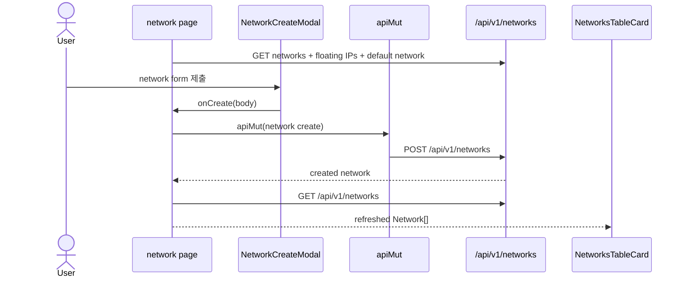
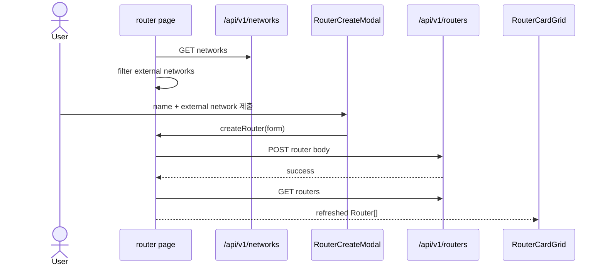
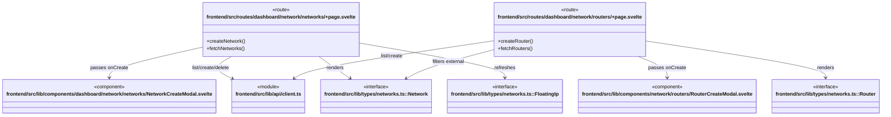

# Network와 router workflow

Network와 router 목록 페이지는 route-local state를 소유한다. 생성 성공 뒤 목록을 재조회하고, detail은 URL history와 slide panel로 연다.

## Network 생성 sequence

## Router 생성 sequence

## 소유권 판정과 서브넷 연결

`NetworkInfo`와 `NetworkDetail`의 `project_id`가 현재 rescope 프로젝트와 같고 외부 네트워크가 아닌 경우에만 네트워크 목록의 선택·기본 설정·삭제와 상세 패널의 서브넷/라우터 mutation을 렌더한다. 타 프로젝트 공유 네트워크는 조회 전용이다. 새 서브넷 폼은 현재 프로젝트 소유 라우터만 선택지로 내고, 생성 성공 뒤 선택값이 있으면 `POST /api/v1/routers/{router_id}/interfaces`에 새 subnet ID와 `auto_gateway`를 보낸다. 라우터 상세의 internal network/subnet selector도 같은 소유 네트워크만 사용한다. 브라우저 조건을 통과하지 않는 직접 API 호출은 backend write owner check가 404로 거부한다.

## 시나리오 클래스

## 근거

- `networks/+page.svelte::createNetwork`은 `/api/v1/networks` POST 후 `fetchNetworks()`를 호출한다.
- `routers/+page.svelte::createRouter`는 `/api/v1/routers` POST 후 목록을 다시 읽고, external network 목록은 `/api/v1/networks`에서 필터한다.
