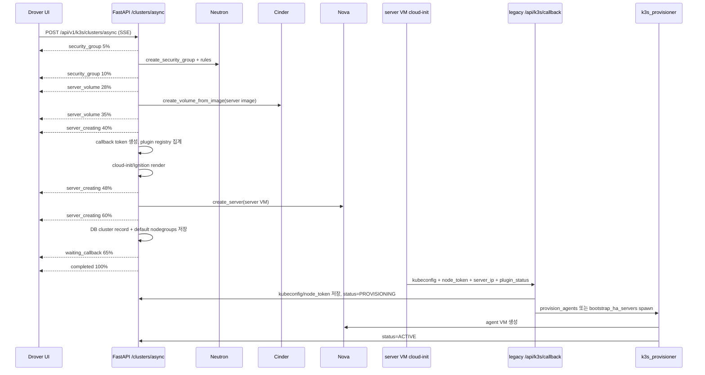

# Drover 동작 명세

**Language:** 한국어 · [English](en/drover-workflow.md)

Drover는 Afterglow의 k3s 클러스터 프로비저닝 기능이다. OpenStack Magnum을 사용하지 않고 Nova VM, Cinder 부트 볼륨, Neutron 보안 그룹, cloud-init 또는 Ignition, 그리고 VM 내부 콜백으로 k3s 클러스터를 만든다.

이 문서는 두 가지를 분리해서 설명한다.

1. 원래 계획했던 Drover 동작
2. 현재 사용자가 **Drover 클러스터 생성**을 누르면 실제 코드가 수행하는 워크플로우

근거가 되는 주요 구현 파일은 다음이다.

| 영역 | 파일 |
|---|---|
| 사용자 생성 모달 | `frontend/src/lib/components/dashboard/drover/K3sCreateClusterModal.svelte` |
| Drover 페이지와 자동 새로고침 | `frontend/src/routes/dashboard/drover/+page.svelte` |
| 프론트 생성 컨트롤러 | `frontend/src/lib/stores/k3sClusterListController.svelte.ts` |
| SSE 클라이언트 | `frontend/src/lib/api/k3sSseStream.ts` |
| 백엔드 생성 API | `backend/app/api/k3s/clusters.py` |
| VM 콜백 API | `backend/app/api/k3s/callback.py` |
| 서버/에이전트 cloud-init | `backend/app/services/k3s_cloudinit.py`, `backend/app/templates/k3s_server.yaml.j2`, `backend/app/templates/k3s_agent.yaml.j2` |
| 에이전트/HA 서버 프로비저닝 | `backend/app/services/k3s_provisioner.py` |
| 클러스터 DB 저장 | `backend/app/services/k3s_db.py` |
| 기본 노드그룹 저장 | `backend/app/services/k3s_nodegroup.py` |

---

## 1. 원래 계획했던 동작

초기 문서의 계획은 단순했다. Afterglow 대시보드에서 클러스터 정보를 입력하면 백엔드가 서버 VM을 만들고, cloud-init으로 k3s server를 설치하고, 워커 VM을 만들어 k3s agent로 join시키는 구조였다.

```text
Afterglow dashboard
  -> Nova: master-node VM 생성
    -> cloud-init: k3s server 설치
  -> Nova: worker-node VM 생성
    -> cloud-init: k3s agent join
  -> kubeconfig 다운로드
```

기존 `docs/k3s.md`와 `docs/en/k3s.md`는 이 목표를 다음처럼 설명한다.

- Magnum 없이 OpenStack core service만 사용한다.
- Ubuntu 22.04 / 24.04 기반으로 시작한다.
- 생성 화면에서 클러스터 이름, 마스터 플레이버, 워커 수, 워커 플레이버, 네트워크, 보안 그룹을 선택한다.
- 생성 진행률을 실시간으로 보여준다.
- 서버 VM의 cloud-init이 kubeconfig와 join token을 만들고, 워커 노드는 그 token으로 자동 join한다.

기존 문서의 과거 계획은 당시 [`docs/architecture.md`](architecture.md)에 있던 통합형 “8장” 설명에도 나타났다. 현재 책임 경계와 공개 API mount는 [루트 `ARCHITECTURE.md`](https://github.com/openstack-afterglow/openstack-afterglow/blob/main/ARCHITECTURE.md)와 아래의 현재 source를 기준으로 읽는다.

```text
클라이언트 -> POST /api/v1/k3s/clusters/async (SSE)
  -> 보안그룹 생성
  -> 부트 볼륨 생성 (Cinder)
  -> 플러그인 레지스트리 집계 (cloud.conf + 매니페스트 + 서버 인자)
  -> 서버 VM 생성 (cloud-init: k3s 설치 + kubectl apply)
  -> 서버 VM이 /api/k3s/callback으로 kubeconfig + node_token 전송
  -> 에이전트 VM 생성 (cloud-init: k3s-agent join)
  -> 클러스터 ACTIVE
```

이후 OpenSpec 작업으로 계획이 확장됐다.

| 작업 | 원래 의도 | 현재 반영 상태 |
|---|---|---|
| `2026-05-18-44-drover-cluster-template-crud` | 사용자가 매번 세부 값을 고르지 않도록 운영자가 ClusterTemplate을 만들고 사용자가 선택한다. | 생성 모달이 템플릿 목록을 읽고 선택 시 agent 수, agent flavor, OS type 기본값을 적용한다. |
| `2026-05-18-45-pr-nodegroup` | 클러스터를 기본 server/agent 노드그룹과 사용자 정의 agent 노드그룹으로 관리한다. | 클러스터 생성 시 `default-server`, `default-agent` 노드그룹이 DB에 생성되고 에이전트 VM이 default-agent에 기록된다. |
| `2026-05-18-46-pr-k3s-ha-embedded` | `master_count=3` 요청이면 embedded etcd HA, API LB, FIP, 추가 서버 join을 수행한다. | 백엔드는 구현되어 있으나 현재 프론트 생성 요청 본문에 `master_count`가 실리지 않는다. UI 토글은 표시되지만 실제 생성 요청은 기본값 `1`로 처리된다. |
| `2026-06-01-64-stampede-drover-k3s` | 사용자가 pod만 배포하면 reconcile loop가 노드그룹 단위로 VM을 자동 확장/축소한다. | 생성 모달이 `stampede_enabled`를 보낼 수 있고, worker의 Stampede loop가 별도로 동작한다. 노드그룹 min/max 설정은 별도 UI/기능 경로다. |
| `2026-05-11-32-k3s-asyncio-loop-db` | 생성 중 SQLAlchemy event loop 충돌을 제거하고 App Credential 생성 체인을 async로 통일한다. | 백엔드 생성 API가 App Credential/KEK 작업을 async 경로로 호출한다. |

핵심 차이는 이것이다. 원래 계획 문서는 "서버와 워커를 생성하고 ACTIVE까지 진행"을 하나의 사용자 흐름처럼 설명했지만, 현재 구현은 **SSE 요청 완료**와 **실제 클러스터 ACTIVE 전환**이 분리되어 있다. 프론트는 백엔드가 서버 VM을 생성하고 DB 레코드를 저장하면 `completed` 이벤트를 받는다. 그 뒤 서버 VM이 스스로 콜백을 보내고, 백엔드가 백그라운드 태스크로 에이전트 VM을 만든 뒤 DB 상태를 `ACTIVE`로 바꾼다.

---

## 2. 현재 사용자 생성 워크플로우

### 2.1 사용자가 화면에서 보는 흐름

사용자는 `/dashboard/drover` 페이지에서 **Drover 클러스터 생성** 모달을 연다.

모달이 열리면 프론트는 병렬로 의존 데이터를 읽는다.

| 데이터 | API |
|---|---|
| flavor 목록 | `GET /api/v1/flavors` |
| network 목록 | `GET /api/v1/networks` |
| keypair 목록 | `GET /api/v1/keypairs` |
| cluster template 목록 | `GET /api/v1/k3s/cluster-templates` |

모달 입력값은 다음이다.

| 입력 | 현재 UI 동작 |
|---|---|
| 템플릿 | 선택 시 agent 수, agent flavor, OS type 기본값을 폼에 복사한다. |
| 클러스터 이름 | 비워두면 백엔드가 `k3s-<8 hex>` 형식으로 자동 생성한다. |
| OS 타입 | `ubuntu` 또는 `fcos`를 선택한다. FCOS는 `k3s.fcos_image_id` 설정이 필요하다. |
| 마스터 수 | UI는 `1` 또는 `3 (HA)` 토글을 보여준다. 현재 생성 컨트롤러가 요청 body에 `master_count`를 넣지 않아 실제 요청은 백엔드 기본값 `1`이 된다. |
| 에이전트 수 | 0부터 10까지 입력한다. |
| 에이전트 플레이버 | 선택하지 않으면 서버 설정의 `k3s_default_agent_flavor_id`를 쓴다. |
| 네트워크 | Tenant/Provider 목록 중 선택한다. 선택하지 않으면 백엔드가 default network를 보장하거나 설정값으로 fallback한다. |
| 키페어 | 선택하면 서버 VM에는 Nova keypair로 전달되고, 에이전트 VM에는 public key가 cloud-init에 직접 주입된다. |
| Stampede 모드 | 선택 시 `stampede_enabled: true`가 생성 요청에 포함된다. |

생성 버튼을 누르면 프론트는 `streamK3sProgress()`로 SSE 요청을 시작한다.

```http
POST /api/v1/k3s/clusters/async
Accept: text/event-stream
Authorization: Bearer <token>
X-Project-Id: <project_id>
Content-Type: application/json
```

현재 생성 컨트롤러가 보내는 body는 다음 필드만 포함한다.

```json
{
  "name": "cluster-name",
  "agent_count": 1,
  "os_type": "ubuntu",
  "agent_flavor_id": "optional-flavor-id",
  "network_id": "optional-network-id",
  "key_name": "optional-keypair-name",
  "template_id": "optional-template-id",
  "stampede_enabled": true
}
```

`master_count`는 모달 상태에는 있지만 이 body에 포함되지 않는다. 따라서 현재 사용자 UI에서 HA 토글을 눌러도 백엔드는 `CreateK3sClusterRequest.master_count` 기본값 `1`로 처리한다.

### 2.2 프론트 진행률 단계

프론트가 알고 있는 생성 단계는 `frontend/src/lib/components/k3sSteps.ts`에 정의되어 있다.

| step id | 화면 라벨 | 백엔드 의미 |
|---|---|---|
| `security_group` | 보안 그룹 | Neutron 보안 그룹과 ingress rule 생성 |
| `server_volume` | 서버 볼륨 | Cinder 부트 볼륨 생성 |
| `server_creating` | 서버 VM | 서버 cloud-init 생성, 플러그인 준비, Nova 서버 생성 |
| `waiting_callback` | k3s 초기화 | 서버 VM 내부에서 k3s 설치와 콜백을 기다림 |
| `completed` | 완료 | 백엔드가 생성 요청을 접수하고 서버 VM/DB 레코드 생성을 끝냄 |

백엔드 모델에는 HA 전용 단계 `server_ha_bootstrap`, `server_ha_join`도 있다. 하지만 현재 프론트의 생성 단계 목록에는 없다. 백엔드가 해당 이벤트를 보내면 toast는 raw step id를 fallback 라벨로 사용할 수 있다.

---

## 3. 현재 백엔드 생성 워크플로우

### 3.1 API 진입점과 라우팅

`backend/app/main.py`는 k3s가 활성화되어 있을 때 다음 라우터를 등록한다.

```text
/api/v1/k3s/clusters           -> clusters router
/api/v1/k3s/callback           -> callback router
/api/k3s/callback              -> legacy callback router, baked cloud-init 호환용
/api/v1/k3s/cluster-templates  -> template router
/api/v1/k3s/clusters/...       -> health, pods, services, workloads, nodegroups, certificates 등
```

신규 사용자/프론트엔드 호출은 `/api/v1` 경로를 사용한다. 예외는 VM self-callback이다. 현재 Ubuntu cloud-init 템플릿(`k3s_server.yaml.j2`)과 FCOS callback 템플릿(`k3s_server_fcos_callback.sh.j2`)은 모두 `${CALLBACK_URL}/api/k3s/callback` legacy 경로로 POST한다. 백엔드는 현재 `/api/v1/k3s/callback`과 `/api/k3s/callback`을 둘 다 받는다.

### 3.2 요청 검증

`CreateK3sClusterRequest`의 주요 제약은 다음이다.

| 필드 | 제약 |
|---|---|
| `name` | 비어 있으면 `k3s-<uuid8>` 자동 생성. 값이 있으면 영문/숫자로 시작하고 영문, 숫자, 하이픈, 언더스코어만 허용한다. 최대 63자. |
| `agent_count` | 0 이상 10 이하. |
| `os_type` | `ubuntu` 또는 `fcos`. |
| `allowed_cidrs` | 최대 20개. `ipaddress.ip_network(..., strict=False)`로 검증하고 정규화한다. |
| `master_count` | `1` 또는 `3`만 허용한다. |
| `stampede_enabled` | boolean. 기본값 `false`. |

백엔드는 설정값도 검증한다.

- `os_type=fcos`이면 `k3s_fcos_image_id`가 있어야 한다.
- Ubuntu이면 `k3s_server_image_id`를 쓴다.
- 모든 경우 `k3s_server_flavor_id`가 있어야 한다.
- `agent_count > 0`이면 요청의 `agent_flavor_id` 또는 설정의 `k3s_default_agent_flavor_id`가 필요하다.

### 3.3 네트워크 결정

요청에 `network_id`가 있으면 그대로 사용한다. 없으면 다음 순서로 결정한다.

1. `default_network_enabled`가 켜져 있으면 `ensure_default_network()`로 프로젝트 default network를 만들거나 찾는다.
2. 실패하면 `settings.default_network_id`로 fallback한다.
3. `default_network_enabled`가 꺼져 있으면 바로 `settings.default_network_id`를 사용한다.

### 3.4 템플릿 병합

요청에 `template_id`가 있으면 백엔드는 `k3s_template.get_template()`으로 템플릿을 읽는다. 템플릿이 없으면 400을 반환한다.

현재 병합 규칙은 "요청 body가 명시한 값 우선"이다.

- `agent_count`가 기본값 `1`이면 템플릿의 `default_node_count`로 교체할 수 있다.
- `agent_flavor_id`가 비어 있으면 템플릿의 `default_agent_flavor_id`를 적용한다.
- 요청 OS가 기본 `ubuntu`이고 템플릿 OS가 다른 값이면 템플릿 OS를 적용한다.
- 템플릿 원본은 `template_snapshot`으로 클러스터 DB 레코드에 저장된다.

### 3.5 SSE 생성 단계

백엔드 `create_k3s_cluster_async()`는 `StreamingResponse`로 SSE를 보낸다. 첫 chunk는 프록시 버퍼링을 피하기 위한 padding이다.

이후 실제 생성은 다음 순서다.



주의할 점은 `completed 100%`의 의미다. 이것은 "k3s 클러스터가 ACTIVE"라는 뜻이 아니다. 현재 코드에서 `completed`는 서버 VM 생성과 DB 레코드 저장이 끝났다는 뜻이다. 실제 `ACTIVE` 전환은 서버 VM이 콜백을 보낸 뒤 `provision_agents()`가 완료해야 발생한다.

### 3.6 보안 그룹 생성

백엔드는 클러스터마다 `k3s-{name}-{cluster_id[:8]}` 보안 그룹을 만든다.

규칙은 다음이다.

| 대상 | 포트/프로토콜 | source |
|---|---|---|
| SSH | TCP 22 | `allowed_cidrs` 또는 `0.0.0.0/0` |
| Kubernetes API | TCP 6443 | `allowed_cidrs` 또는 `0.0.0.0/0` |
| kubelet | TCP 10250 | 같은 security group |
| VXLAN | UDP 8472 | 같은 security group |
| WireGuard | UDP 51820 | 같은 security group |
| HTTP | TCP 80 | `0.0.0.0/0` |
| HTTPS | TCP 443 | `0.0.0.0/0` |
| NodePort | TCP 30000-32767 | `0.0.0.0/0` |

원래 사용자 문서는 "네트워크 / 보안 그룹 선택"이라고 설명했지만 현재 UI와 API는 사용자가 보안 그룹을 고르지 않는다. 백엔드가 클러스터 전용 보안 그룹을 생성한다.

### 3.7 서버 VM 생성

백엔드는 서버 VM 생성 전에 다음을 준비한다.

1. Cinder 부트 볼륨을 서버 이미지에서 만든다.
2. Redis에 30분 TTL의 일회성 callback token을 만든다.
3. 선택한 keypair의 public key를 조회한다.
4. 활성 k3s plugin을 집계한다.
5. 필요한 경우 project App Credential을 만든다.
6. Barbican KMS가 활성화되어 있으면 project KEK를 조회하거나 만든다.
7. cloud-init 또는 Ignition을 생성한다.

서버 VM은 Nova metadata를 가진다.

```text
k3s_horse_generator_role = k3s_server
k3s_horse_generator_cluster_id = <cluster_id>
k3s_horse_generator_cluster_name = <cluster_name>
```

서버 boot volume은 `delete_boot_volume_on_termination=True`로 연결된다.

### 3.8 cloud-init과 콜백

Ubuntu 서버는 gzip+base64 cloud-init을 받는다. FCOS 서버는 base64 Ignition JSON을 config drive로 받는다.

Ubuntu server cloud-init은 다음을 한다.

1. `/etc/kubernetes/cloud.conf`와 plugin manifest를 쓴다.
2. secondary NIC가 default route를 훔치지 않도록 `afterglow-nic-up` udev/netplan handler를 설치한다.
3. 필요하면 Barbican KMS sidecar를 k3s보다 먼저 띄우고 KMS socket을 기다린다.
4. `curl -sfL https://get.k3s.io | sh -s - server ...`로 k3s server를 설치한다.
5. `--node-ip`를 서버의 primary IP로 고정한다.
6. 외부 cloud provider가 필요하면 `--disable-cloud-controller`와 `--kubelet-arg=cloud-provider=external`을 넣는다.
7. HA 초기 서버면 `--cluster-init`을 넣는다.
8. HA join 서버면 `--server <LB-or-server-ip>`와 `--token <node-token>`을 넣는다.
9. `/opt/k3s/callback.sh`를 백그라운드로 실행한다.

callback script는 최대 10분 동안 kubeconfig를 기다리고, kube-apiserver `/livez`를 admin kubeconfig로 확인하고, k3s restart loop를 검사한다. 그 뒤 cloud-config Secret을 만들고 plugin manifest를 순서대로 `kubectl apply`한다. 각 plugin 결과는 `plugin_status`로 모은다.

성공 시 VM은 다음 payload를 보낸다.

```json
{
  "token": "callback-token",
  "success": true,
  "kubeconfig": "...",
  "node_token": "...",
  "server_ip": "10.0.0.10",
  "plugin_status": {
    "occm": { "status": "deployed", "error": "" }
  },
  "secret_cloud_config_status": "ok"
}
```

실패 시에는 `success:false`와 `error`를 보낸다. 콜백은 `/api/v1/k3s/callback`과 legacy `/api/k3s/callback` 모두 받을 수 있다.

현재 렌더링되는 Ubuntu와 FCOS 서버 userdata는 성공/실패 callback 모두 `${CALLBACK_URL}/api/k3s/callback`으로 전송한다. `/api/v1/k3s/callback`은 백엔드에서 같은 라우터로 등록되어 있지만, VM이 실제로 사용하는 경로는 legacy dual-mount 경로다.

### 3.9 콜백 처리

`backend/app/api/k3s/callback.py`는 인증 헤더를 요구하지 않는다. 대신 Redis의 일회성 callback token을 `GET+DELETE`로 소비한다. 토큰이 없거나 만료되면 403을 반환한다.

성공 콜백이면 백엔드는 다음을 수행한다.

1. kubeconfig를 암호화해 저장한다.
2. node_token을 암호화해 저장한다.
3. `server_ip`, `api_address`, `plugin_status`, `secret_cloud_config_status`를 DB에 기록한다.
4. 상태를 `PROVISIONING`으로 바꾼다.
5. 단일 마스터면 `provision_agents()`를 백그라운드 task로 실행한다.
6. HA 마스터면 `bootstrap_ha_servers()`를 백그라운드 task로 실행한다.

콜백 request model은 `node_token`과 `server_ip`를 검증한다. `node_token`은 agent cloud-init의 shell 변수로 들어가므로 영숫자와 `:_+/=.-`만 허용한다. `server_ip`는 실제 IP 주소여야 한다.

### 3.10 에이전트 VM 생성

`provision_agents(project_id, cluster_id, server_ip, node_token)`은 callback 뒤에 실행된다.

동작 순서:

1. 클러스터 레코드를 다시 읽는다.
2. `agent_count == 0`이면 바로 `ACTIVE`로 바꾼다.
3. agent flavor, network, SSH public key, OS type, image id를 결정한다.
4. project-scoped admin OpenStack connection을 만든다.
5. agent 수만큼 반복한다.
6. 각 agent에 대해 Cinder boot volume을 만든다.
7. `generate_agent_userdata()`로 join cloud-init 또는 Ignition을 만든다.
8. Nova server를 만든다.
9. VM id를 `k3s_agent_vms`와 default-agent nodegroup에 기록한다.
10. 실패한 agent 수가 있어도 생성된 agent를 기록하고 클러스터 상태를 `ACTIVE`로 바꾼다. 실패 수는 `status_reason`에 남긴다.

Agent cloud-init은 서버 API `https://<server_ip>:6443/healthz`를 최대 30분 기다린 뒤 k3s agent를 설치한다.

```text
K3S_URL=https://<server_ip>:6443
K3S_TOKEN=<node_token>
INSTALL_K3S_EXEC="agent --node-ip <NODE_IP> ..."
```

### 3.11 HA 경로

백엔드는 `master_count >= 3`일 때 HA 경로를 가진다.

1. 클러스터 생성 API가 서버 VM보다 먼저 Octavia LB, TCP 6443 listener, pool을 만든다.
2. 설정에 floating network가 있으면 LB VIP port에 FIP를 연결한다.
3. server#1 cloud-init에는 `--cluster-init`과 LB FIP TLS SAN이 들어간다.
4. server#1 콜백 후 `bootstrap_ha_servers()`가 server#2, server#3을 만든다.
5. 각 추가 서버는 HA 전용 callback token을 받고 `--server <LB FIP 또는 server#1 IP>:6443 --token <node-token>`으로 join한다.
6. 추가 서버 콜백은 LB pool member를 추가하고 Redis join counter를 증가시킨다.
7. 모든 추가 서버가 join하면 `provision_agents()`를 실행한다.

현재 UI에는 HA 토글이 있지만 생성 controller가 `master_count`를 요청 body에 넣지 않는다. 그래서 현재 사용자가 UI에서 3을 선택해도 이 HA 경로는 호출되지 않는다. API를 직접 호출해 `master_count:3`을 보내면 백엔드 경로는 동작하도록 구현되어 있다.

### 3.12 Stampede 경로

Stampede는 클러스터 생성 자체가 아니라 생성 이후 노드그룹 autoscale 경로다.

- 생성 모달에서 Stampede를 켜면 `stampede_enabled:true`가 클러스터 레코드에 저장된다.
- worker process의 `_stampede_loop()`가 `k3s_stampede_interval` 주기로 `k3s_stampede.run_all()`을 호출한다.
- OpenSpec의 원래 목표는 pending pod resource와 기존 부하를 보고 nodegroup VM을 scale up/down하는 것이다.
- 현재 생성 모달 안내처럼, 노드그룹별 min/max 설정이 별도로 필요하다.

---

## 4. 상태 전이

현재 생성 상태는 다음처럼 나뉜다.

```text
SSE 요청 시작
  -> security_group
  -> server_volume
  -> server_creating
  -> waiting_callback
  -> completed      # 서버 VM + DB 레코드 생성 완료, 아직 ACTIVE 아님

서버 VM 내부
  -> k3s 설치
  -> plugin apply
  -> callback

백엔드 콜백 후
  -> PROVISIONING
  -> agent VM 생성
  -> ACTIVE 또는 ERROR
```

| 상태/이벤트 | 의미 | 사용자가 볼 수 있는 결과 |
|---|---|---|
| `CREATING` | DB 레코드 생성 직후 서버 VM 콜백 대기 | 목록에 생성 중 클러스터로 보인다. |
| `PROVISIONING` | 서버 콜백 성공, agent 생성 중 | kubeconfig는 저장됐지만 agent가 아직 준비 중일 수 있다. |
| `ACTIVE` | agent 생성 루프 종료 | kubeconfig 다운로드와 클러스터 사용 가능 상태다. |
| `ERROR` | 생성 실패, 콜백 실패, callback data 누락, agent flavor 미설정 등 | status_reason에 원인이 저장된다. |
| `DELETED` | soft-delete 처리됨 | 삭제 이력 토글에서 볼 수 있다. |

---

## 5. 실패와 롤백

생성 API 내부에서 실패하면 `_rollback()`이 역순 정리를 시도한다.

| 리소스 | 정리 방식 |
|---|---|
| Nova server | `nova.delete_server()` |
| Cinder boot volume | 3초 대기 후 `cinder.delete_volume()` |
| Floating IP | `conn.network.delete_ip(..., ignore_missing=True)` |
| Octavia LB | `octavia.delete_load_balancer(..., cascade=True)` |
| Neutron security group | `neutron.delete_security_group()` |
| App Credential | `keystone.delete_app_credential()` |

콜백 이후 백그라운드 agent 생성에서 일부 agent가 실패하면 전체 클러스터를 `ERROR`로 바꾸지 않는다. 생성된 agent VM을 기록하고 상태는 `ACTIVE`로 바꾸되, `status_reason`에 실패 수를 남긴다.

서버 VM이 콜백을 보내지 않으면 stale cluster checker가 `CREATING` 또는 `PROVISIONING` 상태를 `ERROR`로 바꿀 수 있다. 현재 DB 서비스의 timeout 메시지는 "콜백 타임아웃: 서버 VM이 k3s 설치 후 응답하지 않았습니다."다.

---

## 6. 현재 구현과 계획의 차이

| 항목 | 계획/문서 | 현재 구현 |
|---|---|---|
| 생성 완료의 의미 | 사용자가 생성 진행률을 보고 클러스터가 준비되는 흐름 | SSE `completed`는 서버 VM과 DB 레코드 생성 완료다. 실제 `ACTIVE`는 VM 콜백과 agent 생성 이후다. |
| 마스터 플레이버 선택 | 문서에는 마스터 플레이버 입력이 있다. | 현재 사용자 생성 모달에는 마스터 플레이버 입력이 없다. `k3s_server_flavor_id` 설정값을 쓴다. |
| 보안 그룹 선택 | 문서에는 네트워크/보안 그룹 선택이 있다. | 보안 그룹은 백엔드가 클러스터별로 자동 생성한다. 사용자는 `allowed_cidrs`도 UI에서 직접 지정하지 않는다. |
| HA master_count | 계획에는 UI 토글과 백엔드 HA 경로가 있다. | UI 토글은 있지만 생성 controller가 `master_count`를 요청 body에 포함하지 않는다. 실제 사용자 생성은 단일 마스터로 처리된다. |
| HA 진행률 표시 | 백엔드 모델에는 HA 단계가 있다. | 프론트 `K3S_CREATE_STEPS`에는 HA 단계 라벨이 없다. |
| Template | 표준 프리셋 선택/override 계획. | 템플릿 목록을 읽고 일부 기본값을 폼에 적용한다. 백엔드도 템플릿 snapshot을 저장한다. |
| Nodegroup | default-server/default-agent와 사용자 정의 agent nodegroup. | 신규 클러스터에 default nodegroup이 생성된다. 에이전트 VM은 default-agent에 기록된다. |
| Stampede | pod 기준 자동 scale up/down. | 생성 시 플래그 저장 가능. 실제 autoscale은 worker loop와 nodegroup 설정에 의존한다. |
| CoreOS | 원래 docs에서는 예정 기능. | 현재 UI와 백엔드에 `fcos` 분기가 있다. 단 `k3s_fcos_image_id` 설정이 없으면 503이다. |

---

## 7. 운영자가 알아야 할 설정

| 설정 | 역할 |
|---|---|
| `k3s_server_image_id` | Ubuntu server/agent 부트 이미지. |
| `k3s_fcos_image_id` | FCOS 선택 시 사용하는 이미지. 없으면 FCOS 생성은 503. |
| `k3s_server_flavor_id` | 서버 VM flavor. 사용자가 UI에서 고르지 않는다. |
| `k3s_default_agent_flavor_id` | agent flavor 기본값. |
| `k3s_boot_volume_size_gb` | 서버/agent boot volume 크기. |
| `k3s_callback_base_url` | VM 내부 callback script가 호출할 Afterglow API base URL. |
| `default_network_enabled`, `default_network_id`, `default_network_external_id`, `default_network_cidr` | network 미선택 시 default network 보장/fallback. |
| `k3s_api_lb_floating_network_id` | HA API LB FIP network. 없으면 HA LB는 FIP 없이 생성될 수 있다. |
| `k3s_stampede_enabled`, `k3s_stampede_interval`, 기타 stampede 설정 | worker autoscale loop 제어. |

---

## 8. 빠른 진단 포인트

| 증상 | 확인할 위치 |
|---|---|
| 생성 모달이 목록을 못 불러옴 | `/api/v1/flavors`, `/api/v1/networks`, `/api/v1/keypairs`, `/api/v1/k3s/cluster-templates` 응답 |
| 생성 요청이 바로 503 | `k3s_server_image_id`, `k3s_server_flavor_id`, `k3s_default_agent_flavor_id`, `k3s_fcos_image_id` 설정 |
| SSE는 completed인데 클러스터가 ACTIVE가 아님 | 서버 VM cloud-init 로그, `/var/log/k3s-callback.log`, callback token TTL, VM에서 `${CALLBACK_URL}/api/k3s/callback` legacy dual-mount 경로 접근 가능 여부 |
| kubeconfig 다운로드 404 | 서버 콜백 전이거나 kubeconfig 저장 실패 |
| agent가 join하지 않음 | agent VM `/var/log/k3s-agent.log`, server IP 6443 접근성, node_token 저장 여부 |
| plugin이 실패함 | callback의 `plugin_status`, 서버 VM `/var/log/k3s-callback-<plugin>.stderr` |
| HA 토글을 눌렀는데 단일 마스터로 생성됨 | 현재 프론트 controller가 `master_count`를 body에 넣지 않는 구현 차이 |
| Stampede가 scale하지 않음 | cluster `stampede_enabled`, nodegroup `stampede_enabled/min_size/max_size`, worker process `_stampede_loop()` 실행 여부 |

---

## 9. 한 줄 요약

Drover의 현재 생성 흐름은 "프론트가 SSE 생성 요청을 보내고, 백엔드가 OpenStack 리소스와 서버 VM을 만든 뒤, 서버 VM의 self-callback이 kubeconfig와 node token을 돌려주면 백엔드가 agent VM을 백그라운드로 만들고 최종 ACTIVE로 전환하는 2단계 프로비저닝"이다. 기존 계획의 핵심인 Magnum-free k3s provisioning은 구현되어 있지만, 현재 UI 생성 경로에는 HA `master_count` 전달 누락과 마스터 플레이버/보안 그룹 직접 선택 부재 같은 계획 대비 차이가 남아 있다.
