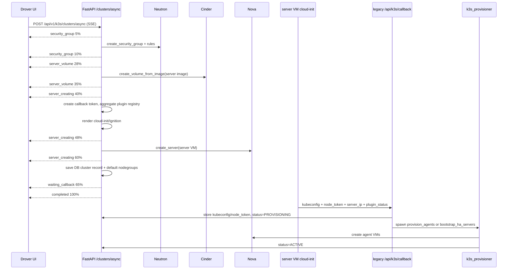

# Drover Behavior Specification

**Language:** [한국어](../drover-workflow.md) · English

Drover is Afterglow's k3s cluster provisioning feature. It does not use OpenStack Magnum. It creates Kubernetes clusters through Nova VMs, Cinder boot volumes, Neutron security groups, cloud-init or Ignition, and a callback sent from inside the server VM.

This document separates two views.

1. The originally planned Drover behavior
2. The workflow that runs today when a user clicks **Create Drover cluster**

The main source files are:

| Area | File |
|---|---|
| User create modal | `frontend/src/lib/components/dashboard/drover/K3sCreateClusterModal.svelte` |
| Drover page and auto-refresh | `frontend/src/routes/dashboard/drover/+page.svelte` |
| Frontend create controller | `frontend/src/lib/stores/k3sClusterListController.svelte.ts` |
| SSE client | `frontend/src/lib/api/k3sSseStream.ts` |
| Backend create API | `backend/app/api/k3s/clusters.py` |
| VM callback API | `backend/app/api/k3s/callback.py` |
| Server and agent cloud-init | `backend/app/services/k3s_cloudinit.py`, `backend/app/templates/k3s_server.yaml.j2`, `backend/app/templates/k3s_agent.yaml.j2` |
| Agent and HA server provisioning | `backend/app/services/k3s_provisioner.py` |
| Cluster DB persistence | `backend/app/services/k3s_db.py` |
| Default nodegroup persistence | `backend/app/services/k3s_nodegroup.py` |

---

## 1. Originally planned behavior

The initial plan was simple. A user enters cluster settings in the Afterglow dashboard. The backend creates a server VM, installs k3s server through cloud-init, creates worker VMs, and joins them as k3s agents.

```text
Afterglow dashboard
  -> Nova: create master-node VM
    -> cloud-init: install k3s server
  -> Nova: create worker-node VMs
    -> cloud-init: join as k3s agents
  -> kubeconfig download
```

The existing `docs/k3s.md` and `docs/en/k3s.md` describe that goal as follows.

- Use only OpenStack core services. Do not require Magnum.
- Start with Ubuntu 22.04 / 24.04.
- Let the user select cluster name, master flavor, worker count, worker flavor, network, and security group.
- Show provisioning progress in real time.
- The server VM cloud-init creates kubeconfig and a join token. Worker nodes join automatically with that token.

The old plan also appeared as the integrated “Section 8” description in [`docs/en/architecture.md`](architecture.md). Read current ownership boundaries and public API mounts from the [root `ARCHITECTURE.md`](https://github.com/openstack-afterglow/openstack-afterglow/blob/main/ARCHITECTURE.md) and the current source listed below.

```text
client -> POST /api/v1/k3s/clusters/async (SSE)
  -> create security group
  -> create boot volume (Cinder)
  -> aggregate plugin registry (cloud.conf + manifests + server args)
  -> create server VM (cloud-init: install k3s + kubectl apply)
  -> server VM sends kubeconfig + node_token to /api/k3s/callback
  -> create agent VMs (cloud-init: k3s-agent join)
  -> cluster ACTIVE
```

Later OpenSpec work expanded the plan.

| Work item | Planned intent | Current status |
|---|---|---|
| `2026-05-18-44-drover-cluster-template-crud` | Let operators define ClusterTemplate presets so users do not repeatedly choose every k3s version, node count, flavor, and plugin setting. | The create modal loads templates. Selecting one copies agent count, agent flavor, and OS type defaults into the form. |
| `2026-05-18-45-pr-nodegroup` | Manage clusters through default server/agent nodegroups and custom agent nodegroups. | New clusters get `default-server` and `default-agent` DB nodegroups. Agent VMs are recorded under `default-agent`. |
| `2026-05-18-46-pr-k3s-ha-embedded` | If `master_count=3`, create an embedded etcd HA cluster with an API LB, FIP, and additional server joins. | The backend path exists, but the current frontend create request body does not include `master_count`. The UI toggle is visible, but actual user-created clusters use backend default `1`. |
| `2026-06-01-64-stampede-drover-k3s` | Let users deploy pods and have a reconcile loop automatically scale nodegroup VMs up or down. | The create modal can send `stampede_enabled`. The worker Stampede loop runs separately. Nodegroup min/max settings are handled by separate UI/API paths. |
| `2026-05-11-32-k3s-asyncio-loop-db` | Remove SQLAlchemy event-loop collisions during cluster creation and make the App Credential chain async. | The backend create API calls App Credential and KEK work through async paths. |

The key difference is this: the original docs describe "create until the cluster is ready" as one user-visible flow. The current implementation separates **SSE request completion** from **actual ACTIVE cluster readiness**. The frontend receives `completed` after the backend has created the server VM and saved the DB record. The server VM later sends its callback. Then the backend starts a background task that creates agent VMs and finally marks the cluster `ACTIVE`.

---

## 2. Current user creation workflow

### 2.1 What the user sees

The user opens the **Create Drover cluster** modal on `/dashboard/drover`.

When the modal opens, the frontend loads dependencies in parallel.

| Data | API |
|---|---|
| Flavor list | `GET /api/v1/flavors` |
| Network list | `GET /api/v1/networks` |
| Keypair list | `GET /api/v1/keypairs` |
| Cluster template list | `GET /api/v1/k3s/cluster-templates` |

The modal fields are:

| Input | Current UI behavior |
|---|---|
| Template | Selecting a template copies agent count, agent flavor, and OS type defaults into the form. |
| Cluster name | If empty, the backend generates `k3s-<8 hex>`. |
| OS type | `ubuntu` or `fcos`. FCOS requires the server-side `k3s.fcos_image_id` setting. |
| Master count | The UI shows `1` or `3 (HA)`. The current create controller does not put `master_count` into the request body, so the backend receives its default value `1`. |
| Agent count | 0 to 10. |
| Agent flavor | If empty, the backend uses `k3s_default_agent_flavor_id`. |
| Network | The user selects from Tenant or Provider networks. If empty, the backend ensures or falls back to a default network. |
| Keypair | If selected, the server VM receives it as a Nova keypair. Agent VMs receive the public key directly through cloud-init because they are created through the admin project-scoped connection. |
| Stampede mode | If selected, the create request includes `stampede_enabled: true`. |

Clicking Create starts an SSE request through `streamK3sProgress()`.

```http
POST /api/v1/k3s/clusters/async
Accept: text/event-stream
Authorization: Bearer <token>
X-Project-Id: <project_id>
Content-Type: application/json
```

The current frontend controller sends only these body fields.

```json
{
  "name": "cluster-name",
  "agent_count": 1,
  "os_type": "ubuntu",
  "agent_flavor_id": "optional-flavor-id",
  "network_id": "optional-network-id",
  "key_name": "optional-keypair-name",
  "template_id": "optional-template-id",
  "stampede_enabled": true
}
```

`master_count` exists in modal state but is not included in this body. Therefore, even if the user selects the HA toggle, the backend handles the request with `CreateK3sClusterRequest.master_count` defaulting to `1`.

### 2.2 Frontend progress phases

The frontend's create phases are defined in `frontend/src/lib/components/k3sSteps.ts`.

| step id | UI label | Backend meaning |
|---|---|---|
| `security_group` | Security group | Create Neutron security group and ingress rules. |
| `server_volume` | Server volume | Create Cinder boot volume. |
| `server_creating` | Server VM | Build server cloud-init, prepare plugins, create Nova server. |
| `waiting_callback` | k3s initialization | Server VM is installing k3s and will callback when ready. |
| `completed` | Complete | Backend accepted the create request and finished server VM/DB record creation. |

The backend model also contains HA-specific phases: `server_ha_bootstrap` and `server_ha_join`. They are not present in the current frontend `K3S_CREATE_STEPS` list. If the backend sends one of them, the toast path can fall back to the raw step id.

---

## 3. Current backend creation workflow

### 3.1 API entry points and routing

`backend/app/main.py` registers these k3s routers when k3s service is enabled.

```text
/api/v1/k3s/clusters           -> clusters router
/api/v1/k3s/callback           -> callback router
/api/k3s/callback              -> legacy callback router for baked cloud-init compatibility
/api/v1/k3s/cluster-templates  -> template router
/api/v1/k3s/clusters/...       -> health, pods, services, workloads, nodegroups, certificates, etc.
```

New user/frontend calls use `/api/v1`. VM self-callback is the exception. The current Ubuntu cloud-init template (`k3s_server.yaml.j2`) and FCOS callback template (`k3s_server_fcos_callback.sh.j2`) both post to the legacy `${CALLBACK_URL}/api/k3s/callback` path. The backend currently accepts both `/api/v1/k3s/callback` and `/api/k3s/callback`.

### 3.2 Request validation

`CreateK3sClusterRequest` enforces these constraints.

| Field | Constraint |
|---|---|
| `name` | Empty value generates `k3s-<uuid8>`. Non-empty value must start with an alphanumeric character and contain only alphanumerics, hyphen, or underscore. Max length is 63. |
| `agent_count` | Integer from 0 to 10. |
| `os_type` | `ubuntu` or `fcos`. |
| `allowed_cidrs` | Max 20 entries. Each entry is validated and normalized with `ipaddress.ip_network(..., strict=False)`. |
| `master_count` | Only `1` or `3`. |
| `stampede_enabled` | Boolean. Defaults to `false`. |

The backend also validates configuration.

- `os_type=fcos` requires `k3s_fcos_image_id`.
- Ubuntu uses `k3s_server_image_id`.
- All requests require `k3s_server_flavor_id`.
- If `agent_count > 0`, the request `agent_flavor_id` or setting `k3s_default_agent_flavor_id` is required.

### 3.3 Network selection

If the request includes `network_id`, the backend uses it. Otherwise it resolves the network in this order.

1. If `default_network_enabled` is enabled, call `ensure_default_network()` to create or find the project default network.
2. If that fails, fall back to `settings.default_network_id`.
3. If `default_network_enabled` is disabled, use `settings.default_network_id` immediately.

### 3.4 Template merge

If the request includes `template_id`, the backend calls `k3s_template.get_template()`. Missing templates return 400.

Current merge rule: explicit request fields win.

- If `agent_count` is still the default `1`, the template `default_node_count` can replace it.
- If `agent_flavor_id` is empty, the template `default_agent_flavor_id` is applied.
- If request OS is default `ubuntu` and the template OS is different, the template OS is applied.
- The original template is stored on the cluster as `template_snapshot`.

### 3.5 SSE creation phases

`create_k3s_cluster_async()` returns a `StreamingResponse` with SSE events. The first chunk is padding to avoid proxy buffering.

The actual create sequence is:



The meaning of `completed 100%` is important. It does not mean the k3s cluster is `ACTIVE`. It means the backend finished creating the server VM and DB record. Actual `ACTIVE` status requires the server VM callback and successful completion of `provision_agents()`.

### 3.6 Security group creation

The backend creates a dedicated security group named `k3s-{name}-{cluster_id[:8]}`.

| Target | Port/protocol | Source |
|---|---|---|
| SSH | TCP 22 | `allowed_cidrs` or `0.0.0.0/0` |
| Kubernetes API | TCP 6443 | `allowed_cidrs` or `0.0.0.0/0` |
| kubelet | TCP 10250 | Same security group |
| VXLAN | UDP 8472 | Same security group |
| WireGuard | UDP 51820 | Same security group |
| HTTP | TCP 80 | `0.0.0.0/0` |
| HTTPS | TCP 443 | `0.0.0.0/0` |
| NodePort | TCP 30000-32767 | `0.0.0.0/0` |

The original user docs say the user selects a network and security group. The current UI and API do not let the user select a security group. The backend creates a cluster-specific group.

### 3.7 Server VM creation

Before creating the server VM, the backend prepares:

1. Cinder boot volume from the configured server image.
2. A Redis one-time callback token with 30-minute TTL.
3. The selected keypair public key.
4. Active k3s plugins through the plugin registry.
5. A project App Credential if required by Octavia Ingress or Barbican KMS.
6. A project KEK for Barbican KMS if enabled.
7. cloud-init or Ignition userdata.

The server VM receives Nova metadata.

```text
k3s_horse_generator_role = k3s_server
k3s_horse_generator_cluster_id = <cluster_id>
k3s_horse_generator_cluster_name = <cluster_name>
```

The server boot volume is attached with `delete_boot_volume_on_termination=True`.

### 3.8 cloud-init and callback

Ubuntu servers receive gzip+base64 cloud-init. FCOS servers receive base64 Ignition JSON through config drive.

Ubuntu server cloud-init does the following.

1. Writes `/etc/kubernetes/cloud.conf` and plugin manifests.
2. Installs the `afterglow-nic-up` udev/netplan handler so secondary NICs do not steal the default route.
3. If needed, starts Barbican KMS before k3s and waits for the KMS socket.
4. Installs k3s server with `curl -sfL https://get.k3s.io | sh -s - server ...`.
5. Pins `--node-ip` to the server primary IP.
6. If an external cloud provider is needed, adds `--disable-cloud-controller` and `--kubelet-arg=cloud-provider=external`.
7. If this is the initial HA server, adds `--cluster-init`.
8. If this is an HA join server, adds `--server <LB-or-server-ip>` and `--token <node-token>`.
9. Runs `/opt/k3s/callback.sh` in the background.

The callback script waits up to 10 minutes for kubeconfig, checks kube-apiserver `/livez` with the admin kubeconfig, and detects k3s restart loops. It then creates the cloud-config Secret and applies plugin manifests in sequence. Plugin results are collected in `plugin_status`.

On success, the VM sends this payload.

```json
{
  "token": "callback-token",
  "success": true,
  "kubeconfig": "...",
  "node_token": "...",
  "server_ip": "10.0.0.10",
  "plugin_status": {
    "occm": { "status": "deployed", "error": "" }
  },
  "secret_cloud_config_status": "ok"
}
```

On failure, it sends `success:false` and `error`. Both `/api/v1/k3s/callback` and legacy `/api/k3s/callback` can receive the callback.

The currently rendered Ubuntu and FCOS server userdata sends both success and failure callbacks to `${CALLBACK_URL}/api/k3s/callback`. `/api/v1/k3s/callback` is registered to the same backend router, but the path actually used by VMs today is the legacy dual-mounted path.

### 3.9 Callback handling

`backend/app/api/k3s/callback.py` does not require user auth headers. It relies on Redis one-time callback tokens consumed through atomic `GET+DELETE`. Missing or expired tokens return 403.

On a successful server callback, the backend:

1. Encrypts and stores kubeconfig.
2. Encrypts and stores node token.
3. Stores `server_ip`, `api_address`, `plugin_status`, and `secret_cloud_config_status`.
4. Sets cluster status to `PROVISIONING`.
5. For a single-master cluster, spawns `provision_agents()` as a background task.
6. For an HA cluster, spawns `bootstrap_ha_servers()` as a background task.

The callback request model validates `node_token` and `server_ip`. `node_token` later enters agent cloud-init shell variables, so only alphanumerics and `:_+/=.-` are allowed. `server_ip` must parse as an IP address.

### 3.10 Agent VM creation

`provision_agents(project_id, cluster_id, server_ip, node_token)` runs after callback.

Flow:

1. Reload cluster record.
2. If `agent_count == 0`, mark the cluster `ACTIVE` immediately.
3. Resolve agent flavor, network, SSH public key, OS type, and image id.
4. Build a project-scoped admin OpenStack connection.
5. Loop for the requested agent count.
6. Create one Cinder boot volume per agent.
7. Render agent cloud-init or Ignition with `generate_agent_userdata()`.
8. Create a Nova server.
9. Record the VM id in `k3s_agent_vms` and the default-agent nodegroup.
10. If some agents fail, still record successful agents and set cluster status to `ACTIVE`; the failure count is written to `status_reason`.

Agent cloud-init waits up to 30 minutes for `https://<server_ip>:6443/healthz`, then installs k3s agent.

```text
K3S_URL=https://<server_ip>:6443
K3S_TOKEN=<node_token>
INSTALL_K3S_EXEC="agent --node-ip <NODE_IP> ..."
```

### 3.11 HA path

The backend has an HA path for `master_count >= 3`.

1. Before the server VM is created, the create API creates an Octavia LB, TCP 6443 listener, and pool.
2. If a floating network is configured, it attaches an FIP to the LB VIP port.
3. server#1 cloud-init receives `--cluster-init` and the LB FIP as a TLS SAN.
4. After server#1 callback, `bootstrap_ha_servers()` creates server#2 and server#3.
5. Each additional server receives an HA callback token and joins with `--server <LB FIP or server#1 IP>:6443 --token <node-token>`.
6. Additional server callbacks add each server as an LB pool member and increment a Redis join counter.
7. When all additional servers have joined, the backend runs `provision_agents()`.

The current UI shows the HA toggle, but the create controller does not include `master_count` in the request body. So the normal user-created path does not invoke HA today. Direct API calls with `master_count:3` can reach the implemented backend path.

### 3.12 Stampede path

Stampede is not the cluster creation path itself. It is a post-create nodegroup autoscaling path.

- If enabled in the create modal, `stampede_enabled:true` is stored on the cluster record.
- The worker process `_stampede_loop()` calls `k3s_stampede.run_all()` every `k3s_stampede_interval` seconds.
- The original OpenSpec goal is to scale nodegroup VMs up/down based on pending pod resources and existing load.
- As the current modal says, nodegroup-level min/max settings are still required.

---

## 4. State transitions

Current creation state is split into frontend SSE progress and backend cluster readiness.

```text
SSE request starts
  -> security_group
  -> server_volume
  -> server_creating
  -> waiting_callback
  -> completed      # server VM + DB record created, not ACTIVE yet

Inside server VM
  -> install k3s
  -> apply plugins
  -> callback

After backend callback
  -> PROVISIONING
  -> create agent VMs
  -> ACTIVE or ERROR
```

| State/event | Meaning | User-visible result |
|---|---|---|
| `CREATING` | DB record exists and backend is waiting for server VM callback. | The cluster appears as creating. |
| `PROVISIONING` | Server callback succeeded and agent creation is running. | Kubeconfig has been stored, but agents may not be ready yet. |
| `ACTIVE` | Agent creation loop finished. | Kubeconfig download and normal cluster use should be available. |
| `ERROR` | Create failure, callback failure, missing callback data, missing agent flavor, etc. | `status_reason` stores the cause. |
| `DELETED` | Soft-deleted. | Visible when deleted clusters are included. |

---

## 5. Failure and rollback

If the create API fails before completion, `_rollback()` tries to clean resources in reverse order.

| Resource | Cleanup path |
|---|---|
| Nova server | `nova.delete_server()` |
| Cinder boot volume | Wait 3 seconds, then `cinder.delete_volume()` |
| Floating IP | `conn.network.delete_ip(..., ignore_missing=True)` |
| Octavia LB | `octavia.delete_load_balancer(..., cascade=True)` |
| Neutron security group | `neutron.delete_security_group()` |
| App Credential | `keystone.delete_app_credential()` |

If the post-callback background agent creation partially fails, the cluster is not marked `ERROR`. Successful agent VMs are recorded, the cluster becomes `ACTIVE`, and the failure count is written to `status_reason`.

If the server VM never calls back, the stale cluster checker can mark `CREATING` or `PROVISIONING` clusters as `ERROR`. The current DB service message is: "callback timeout: server VM did not respond after installing k3s" in Korean.

---

## 6. Current implementation vs plan

| Item | Plan/docs | Current implementation |
|---|---|---|
| Meaning of create completion | User sees progress until the cluster is ready. | SSE `completed` means server VM and DB record creation finished. Actual `ACTIVE` happens after callback and agent creation. |
| Master flavor selection | Docs mention a master flavor input. | Current user modal has no master flavor field. It uses the server-side `k3s_server_flavor_id` setting. |
| Security group selection | Docs mention network/security group selection. | The backend creates a dedicated security group. The user does not select it. |
| HA `master_count` | Plan includes UI toggle and backend HA path. | UI toggle exists, but frontend create body omits `master_count`. Normal user creates single-master clusters. |
| HA progress display | Backend model contains HA phases. | Frontend `K3S_CREATE_STEPS` does not include HA labels. |
| Template | Plan calls for standard preset selection and override. | Template list is loaded and applies selected defaults. Backend stores `template_snapshot`. |
| Nodegroup | Plan calls for default-server/default-agent and custom agent nodegroups. | New clusters get default nodegroups. Agent VMs are recorded under default-agent. |
| Stampede | Plan calls for pod-driven automatic scale up/down. | Creation can store the flag. Actual autoscaling depends on the worker loop and nodegroup settings. |
| CoreOS | Original docs describe CoreOS as planned. | UI and backend now include `fcos`. Without `k3s_fcos_image_id`, FCOS create returns 503. |

---

## 7. Operator settings to know

| Setting | Role |
|---|---|
| `k3s_server_image_id` | Ubuntu server/agent boot image. |
| `k3s_fcos_image_id` | FCOS boot image. Missing value makes FCOS create return 503. |
| `k3s_server_flavor_id` | Server VM flavor. The user does not choose this in the current modal. |
| `k3s_default_agent_flavor_id` | Default agent flavor. |
| `k3s_boot_volume_size_gb` | Server/agent boot volume size. |
| `k3s_callback_base_url` | Afterglow API base URL called by VM callback scripts. |
| `default_network_enabled`, `default_network_id`, `default_network_external_id`, `default_network_cidr` | Default network ensure/fallback behavior when no network is selected. |
| `k3s_api_lb_floating_network_id` | HA API LB floating network. If absent, HA LB may be created without FIP. |
| `k3s_stampede_enabled`, `k3s_stampede_interval`, other Stampede settings | Control the worker autoscaling loop. |

---

## 8. Quick diagnostics

| Symptom | Check |
|---|---|
| Modal cannot load lists | Responses from `/api/v1/flavors`, `/api/v1/networks`, `/api/v1/keypairs`, `/api/v1/k3s/cluster-templates` |
| Create request returns 503 immediately | `k3s_server_image_id`, `k3s_server_flavor_id`, `k3s_default_agent_flavor_id`, `k3s_fcos_image_id` settings |
| SSE says completed but cluster is not ACTIVE | Server VM cloud-init logs, `/var/log/k3s-callback.log`, callback token TTL, reachability from the VM to the legacy dual-mounted `${CALLBACK_URL}/api/k3s/callback` path |
| kubeconfig download returns 404 | Server callback has not happened yet or kubeconfig storage failed. |
| Agent does not join | Agent VM `/var/log/k3s-agent.log`, server IP port 6443 reachability, node token persistence |
| Plugin fails | Callback `plugin_status`, server VM `/var/log/k3s-callback-<plugin>.stderr` |
| HA toggle still creates one master | Current frontend controller does not send `master_count` in the request body. |
| Stampede does not scale | Cluster `stampede_enabled`, nodegroup `stampede_enabled/min_size/max_size`, worker `_stampede_loop()` execution |

---

## 9. One-line summary

Drover today is a two-stage provisioning flow: the frontend starts an SSE create request, the backend creates OpenStack resources and the server VM, the server VM self-callback returns kubeconfig and node token, then the backend creates agent VMs in the background and marks the cluster `ACTIVE`. The original Magnum-free k3s provisioning goal is implemented, but current UI creation still differs from the plan in HA `master_count` delivery, master flavor selection, and direct security group selection.
